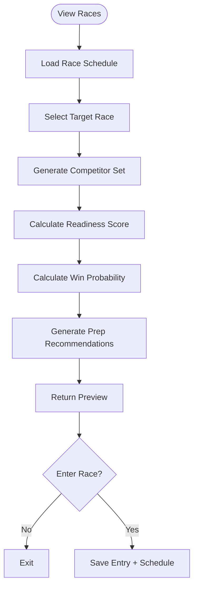
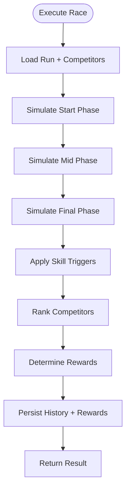
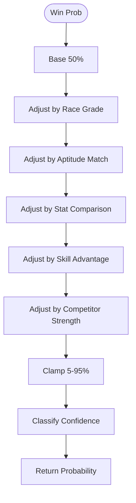
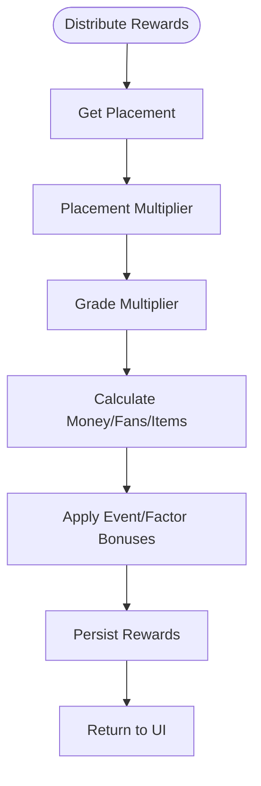
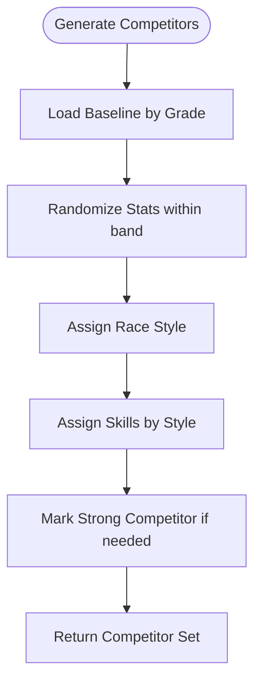
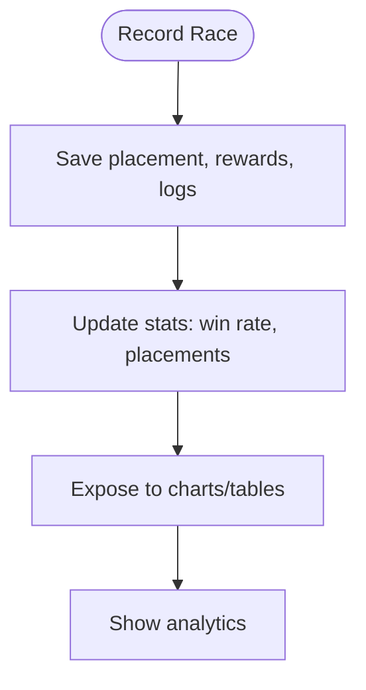
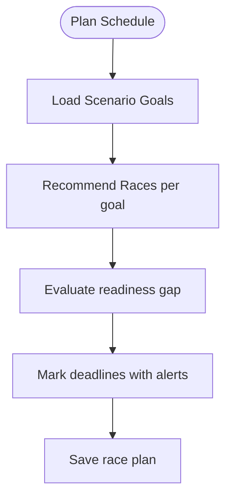

# FLOW-003: Race Strategy System Flow

## Umamusume Pretty Derby Career Planner

**Document Version**: 1.0
**Date**: January 14, 2026
**Related Documents**: [PRD-003], [SPEC-003]

---

## 1. Race Preparation Flow

---

## 2. Race Execution Simulation Flow

---

## 3. Win Probability Calculation Flow

---

## 4. Race Reward Distribution Flow

---

## 5. Competitor Generation Flow

---

## 6. Race History & Analytics Flow

---

## 7. Race Schedule Planning Flow

