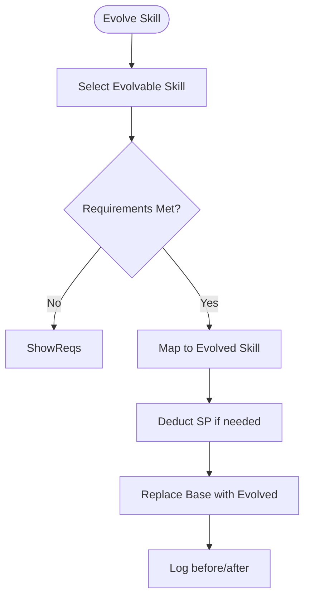
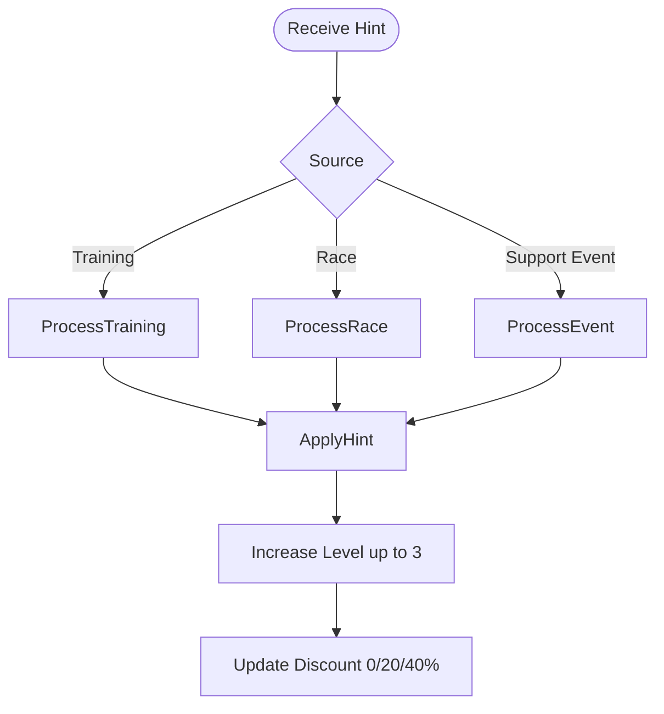
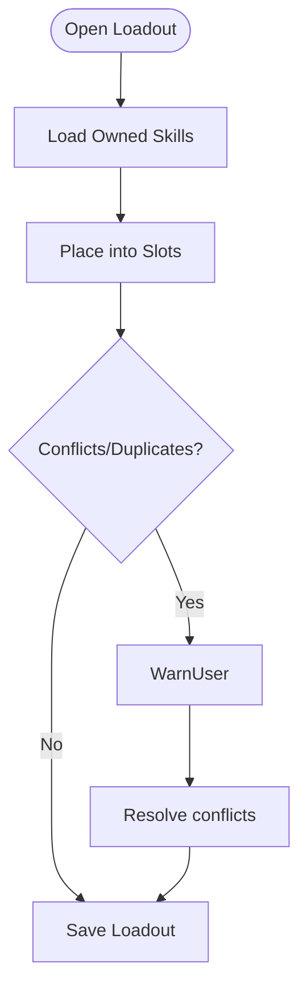
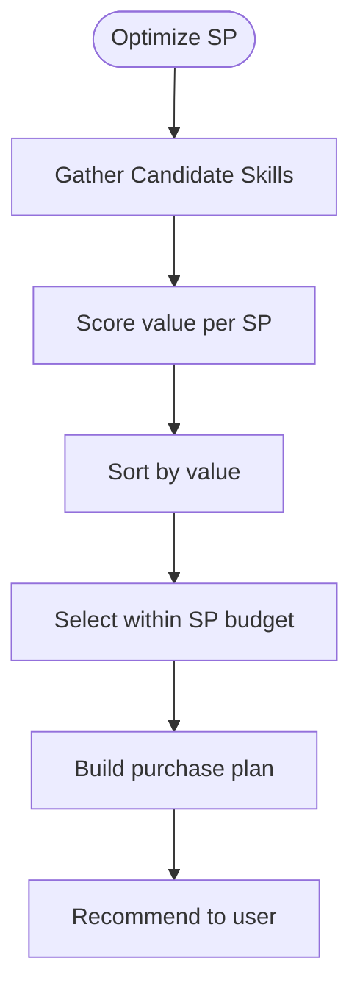
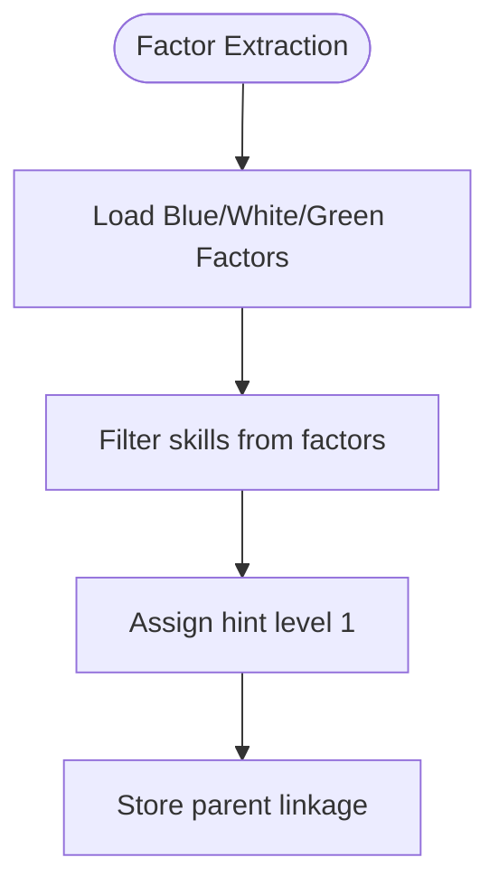
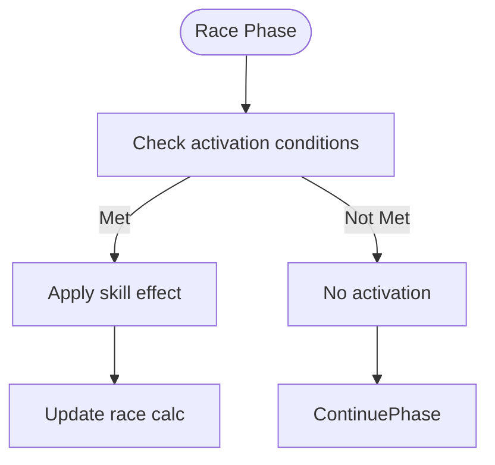

# FLOW-004: Skill Management System Flow

## Umamusume Pretty Derby Career Planner

**Document Version**: 1.0
**Date**: January 14, 2026
**Related Documents**: [PRD-004], [SPEC-004]

---

## 1. Skill Acquisition Flow

```mermaid
flowchart TD
    Start([Open Skill Shop]) --> LoadAvailable[Load Available Skills]
    LoadAvailable --> SelectSkill[Select Skill]
    SelectSkill --> CheckSP{Enough SP?}
    CheckSP -->|No| Block[Show SP Needed]
    CheckSP -->|Yes| CheckPrereq{Prerequisites Met?}
    CheckPrereq -->|No| ShowReqs[Show unmet requirements]
    CheckPrereq -->|Yes| ApplyDiscount[Apply Hint Discount]
    ApplyDiscount --> DeductSP[Deduct SP]
    DeductSP --> AddSkill[Add Skill to Owned]
    AddSkill --> UpdateLoadout[Update Loadout (optional)]
```

---

## 2. Skill Evolution Chain Flow



---

## 3. Skill Hint Management Flow



---

## 4. Skill Loadout Management Flow



---

## 5. SP Budget Optimization Flow



---

## 6. Skill Inheritance from Factors Flow



---

## 7. Skill Effect Activation Flow


