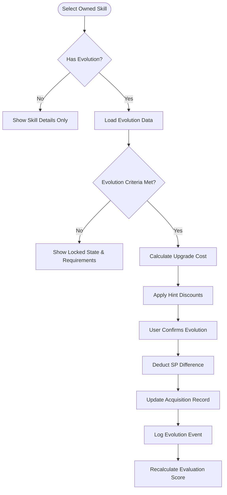
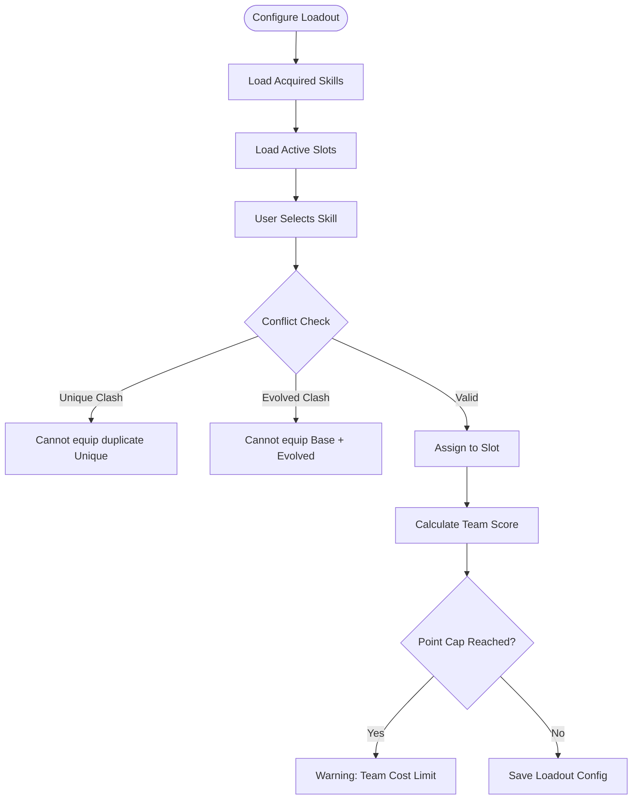

# FLOW-004: Skill Management System Flow

## Umamusume Pretty Derby Career Planner

**Document Version**: 2.3.0
**Date**: February 22, 2026
**Project**: UmamusumeCareerPlanner
**Author**: Development Team
**Status**: Current - Updated with verified codebase references (SkillRecommendationAgent, SkillHintService, OcrExtractedSkill)

---

## 1. Skill Acquisition & Purchase Flow

This flow details how `SkillService` manages the purchase of skills, including validation of SP costs, prerequisites, and applying hint discounts.

```mermaid
flowchart TD
    Start([Open Skill Shop]) --> FetchContext[Fetch Character Context]
    FetchContext --> LoadCatalog[Load Skill Catalog]
    LoadCatalog --> FilterSkills[Filter: Owned/Available]
    
    FilterSkills --> SelectSkill[Select Target Skill]
    SelectSkill --> ValidateReqs{Check Prerequisites}
    
    ValidateReqs -->|Not Met| ShowError[Display Missing Requirements]
    
    ValidateReqs -->|Met| CalcCost[Calculate SP Cost]
    CalcCost --> CheckHints[Check Hint Level (0-5)]
    
    CheckHints -->|Level 0| NoDiscount[Cost: 100%]
    CheckHints -->|Level 1| Discount10[Cost: 90% (-10%)]
    CheckHints -->|Level 2| Discount20[Cost: 80% (-20%)]
    CheckHints -->|Level 3| Discount30[Cost: 70% (-30%)]
    CheckHints -->|Level 4| Discount35[Cost: 65% (-35%)]
    CheckHints -->|Level 5| Discount40[Cost: 60% (-40% max)]
    
    NoDiscount --> CompareSP
    Discount10 --> CompareSP
    Discount20 --> CompareSP
    Discount30 --> CompareSP
    Discount35 --> CompareSP
    Discount40 --> CompareSP
    
    CompareSP{Enough SP?}
    CompareSP -->|No| ShowBalance[Show Insufficient SP Alert]
    
    CompareSP -->|Yes| ConfirmPurchase[User Confirms Purchase]
    ConfirmPurchase --> DeductSP[Deduct SP from Character]
    DeductSP --> AddRecord[Create SkillAcquisition Record]
    
    AddRecord --> UpdateUI[Update Shop UI]
    UpdateUI --> TriggerAI[Trigger AI Re-evaluation]
```

---

## 2. Skill Evolution Chain Flow

The process for upgrading Normal skills to their Rare (Gold) counterparts via `SkillEvolutionService`.



---

## 3. Skill Hint Management Flow

How the system tracks and applies hints gained during training and events to reduce SP costs.

```mermaid
flowchart TD
    Start([Hint Triggered]) --> IdentifySource{Source Type}
    
    IdentifySource -->|Training| TrainingHandler
    IdentifySource -->|Race| RaceHandler
    IdentifySource -->|Event| EventHandler
    IdentifySource -->|Fast Learner| FastLearnerHandler
    IdentifySource -->|Skill Spark| SkillSparkHandler
    IdentifySource -->|Hint Book| HintBookHandler
    
    TrainingHandler --> ExtractSkill[Extract Skill ID]
    RaceHandler --> ExtractSkill
    EventHandler --> ExtractSkill
    FastLearnerHandler --> ApplyFastLearner[Apply +10% Bonus Discount]
    SkillSparkHandler --> ExtractSkill
    HintBookHandler --> ExtractSkill
    
    ExtractSkill --> CheckCurrent[Check Current Hint Level]
    
    CheckCurrent -->|Level Max (5)| ConvertStats[Convert to Stat Bonus]
    CheckCurrent -->|Level < 5| IncrementLevel[Increment Hint Level]
    
    IncrementLevel --> UpdateTable[Update ucp_skill_hints]
    UpdateTable --> CalcDiscount[Recalculate Discount %]
    
    ConvertStats --> ApplyStats[Apply +Stat Bonus]
    ApplyFastLearner --> CalcDiscount
    
    CalcDiscount --> NotifyUser[Toast Notification: Hint Lv Up]
    ApplyStats --> NotifyUser
```

### 3.1 Hint Sources (Game-Accurate)

| Source | Description | Effect |
|--------|-------------|--------|
| **Training** | Support card with "Hint Lv Up" present | +1 Hint Level (random skill from card) |
| **Race** | Certain race rewards | +1 Hint Level |
| **Event** | Support card events | +1 Hint Level |
| **Fast Learner** | Character condition | +10% additional discount (stacks with hint level) |
| **Skill Sparks** | Scenario mechanic | +1 Hint Level |
| **Hint Books** | Consumable items | +1 Hint Level (specific skill) |

### 3.2 Hint Discount Calculation

```
Final Discount = Base Hint Discount + Fast Learner Bonus (if active)
Maximum Discount = 40% (Hint Level 5) + 10% (Fast Learner) = 50%
```

---

## 4. Skill Loadout & Configuration Flow

Managing active skills for race preparation or team composition.



---

## 5. SP Budget Optimization Flow

The logic used by the **Skill Recommendation Agent** (`SkillRecommendationAgent` via Neuron AI v2.11) to recommend optimal skill purchases.

```mermaid
flowchart TD
    Start([Request AI Advice]) --> GetBudget[Get Current & Projected SP]
    GetBudget --> GetRaceTargets[Get Target Race Criteria]
    
    GetRaceTargets --> FilterCatalog[Filter Catalog by Aptitude/Distance]
    FilterCatalog --> ApplyHints[Apply Current Hint Discounts]
    
    ApplyHints --> ScoreSkills[Score Skills (Value/Cost Ratio)]
    ScoreSkills --> KnapsackAlgo[Run Knapsack Optimization]
    
    KnapsackAlgo --> GenerateBuilds[Generate Candidate Builds]
    GenerateBuilds --> RankBuilds[Rank by Win Probability Impact]
    
    RankBuilds --> PresentOption[Present Recommended Build]
    PresentOption --> UserAction{User Action}
    
    UserAction -->|Auto-Buy| ExecuteBatch[Execute Batch Purchase]
    UserAction -->|Edit| ManualEdit[Open Manual Selection]
```

---

## 6. Skill Inheritance from Factors Flow

How skills are inherited from parent characters during the initial setup or succession events.

```mermaid
flowchart TD
    Start([Inheritance Phase]) --> LoadParents[Load Parent Factors]
    LoadParents --> FilterWhite[Filter White Factors (Skills)]
    
    FilterWhite --> RollSuccess{Roll Inheritance RNG}
    
    RollSuccess -->|Success| GrantHint[Grant Hint Level 1-5]
    RollSuccess -->|Failure| NoInheritance
    
    GrantHint --> CheckUnique{Is Unique Skill?}
    CheckUnique -->|Yes| ConvertToWeak[Convert to 'Weak' Version]
    CheckUnique -->|No| KeepStandard[Keep Standard Version]
    
    ConvertToWeak --> StoreHint[Store in ucp_skill_hints]
    KeepStandard --> StoreHint
```

---

## 7. Skill Activation Simulation Flow

Logic used during race simulation to determine if and when skills trigger.

```mermaid
flowchart TD
    Start([Race Simulation Step]) --> CheckCooldowns[Check Skill Cooldowns]
    
    CheckCooldowns --> IterateSkills[Iterate Equipped Skills]
    
    IterateSkills --> CheckConditions{Conditions Met?}
    
    CheckConditions -->|Position| CheckPos[Position Check (e.g., < 50%)]
    CheckConditions -->|Phase| CheckPhase[Phase Check (e.g., Last Spurt)]
    CheckConditions -->|Distance| CheckDist[Distance Check (e.g., Remaining 200m)]
    
    CheckPos --> CheckRNG{Activation Roll}
    CheckPhase --> CheckRNG
    CheckDist --> CheckRNG
    
    CheckRNG -->|Pass| Activate[Activate Skill]
    CheckRNG -->|Fail| Skip
    
    Activate --> ApplyEffect[Apply Speed/Accel/Stamina Effect]
    ApplyEffect --> SetCooldown[Set Cooldown / Mark Used]
    
    SetCooldown --> LogActivation[Log for Replay/Analysis]
```

---

## Document Control

| Version | Date       | Author           | Changes |
|---------|------------|------------------|---------|
| 2.3.0   | 2026-02-22 | Development Team | Updated service references: SkillRecommendationAgent (actual Neuron agent name), SkillHintService, SkillAnalysisService; added Neuron AI v2.11 and OcrExtractedSkill references |
| 2.2.0   | 2026-01-28 | Development Team | Updated with verified game mechanics from Global English Server: Hint levels now 0-5 (max), discount percentages corrected (10%/20%/30%/35%/40%), added additional hint sources (Fast Learner condition +10%, Skill Sparks, Hint Books), inheritance hint levels updated |
| 2.1.0   | 2026-01-24 | Development Team | Updated to align with v2.0.0 codebase, added SP Budget Optimization via Neuron AI, and detailed Inheritance logic |
| 1.0.0   | 2026-01-14 | Development Team | Initial flow definitions |

---

## Related Documents

- [PRD-004: Skill Management](../prds/PRD-004_Skill_Management.md)
- [SPEC-004: Skill Management Technical](../specs/SPEC-004_Skill_Management_Technical.md)
- [009_DBD: Database Documentation](../009_DBD_Database_Documentation.md)
