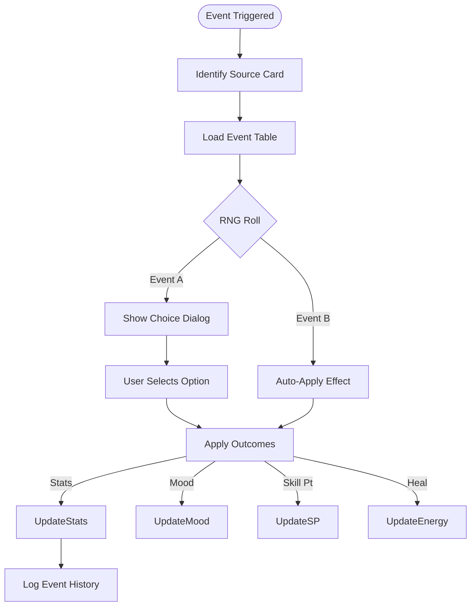
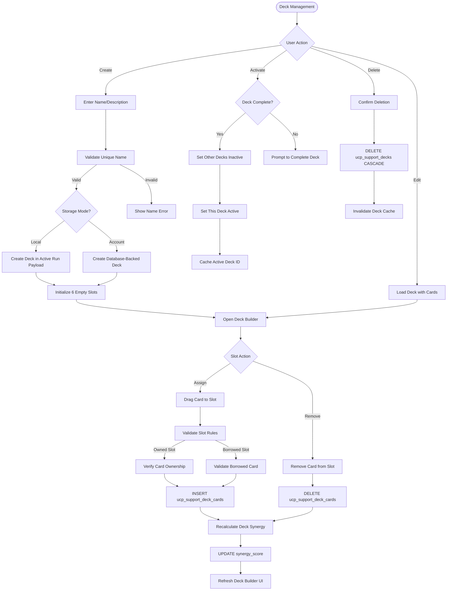

# FLOW-005: Support Card Management System Flow

## Umamusume Pretty Derby Career Planner

**Document Version**: 2.3.0
**Date**: March 10, 2026
**Project**: UmamusumeCareerPlanner
**Author**: Development Team
**Status**: Current - Updated with verified game mechanics from Global English Server

---

## 1. Support Card Collection Management Flow

This flow details how the support-card inventory and deck-management services manage the user's
collection, including synchronization with external game data sources.

Support card flows should distinguish between account-backed collection persistence and local run
deck composition, since Local mode may reuse reference card data without requiring persistent
inventory records.

```mermaid
flowchart TD
    Start([Open Collection]) --> Mode{Storage Mode?}
    Mode -->|Account| FetchData[Fetch Owned Cards]
    Mode -->|Local| ReferenceOnly[Load Reference Card Data for Deck Building]

    FetchData --> CheckSync{Data Stale?}

    CheckSync -->|Yes| TriggerSync[Trigger External API Sync]
    TriggerSync --> FetchExternal[Fetch from umapyoi.net]
    FetchExternal --> UpdateDB[Update Authorized Card Collection Records]
    UpdateDB --> ReloadData[Reload Data]

    CheckSync -->|No| DisplayCards[Display Grid View]
    ReloadData --> DisplayCards
    ReferenceOnly --> DisplayCards

    DisplayCards --> UserAction{User Action}

    UserAction -->|Filter| ApplyFilters[Filter by Type/Rarity/Tier]
    UserAction -->|Limit Break| UpdateLB[Update LB Level (0-4)]
    UserAction -->|Level Up| UpdateLevel[Update Card Level]

    UpdateLB --> SaveCard[Persist Changes]
    UpdateLevel --> SaveCard

    SaveCard --> RecalcStats[Recalculate Current Stats]
    RecalcStats --> UpdateUI[Refresh View]
```

---

## 2. Deck Building & Optimization Flow

The process for creating valid support decks via `SupportDeckService`, enforcing game rules (5 owned + 1 borrowed).

> **Note**: Borrowed cards use their base (0 LB) stats regardless of your own copy's limit-break level. Limit-breaking your borrowed card slot has no effect on the borrowed card's bonuses.

```mermaid
flowchart TD
    Start([Build Deck]) --> InitBuilder[Initialize Deck Builder]

    InitBuilder --> SelectCards[Select 5 Owned Cards]
    SelectCards --> SelectFriend[Select 1 Borrowed Card]

    SelectFriend --> Validate{Validate Deck}

    Validate -->|Invalid| ShowErrors[Show Type/Rarity Conflicts]
    Validate -->|Valid| CalcSynergy[Calculate Synergy Score]

    CalcSynergy --> AnalyzeDeck[Analyze Stat Distribution]
    AnalyzeDeck --> CheckMeta[Check Meta Tier Average]

    CheckMeta --> DisplayMetrics[Display Deck Metrics]

    DisplayMetrics --> UserConfirm{Save Deck?}

    UserConfirm -->|Yes| SaveDeck[Persist Deck Configuration]
    UserConfirm -->|No| Modify[Modify Selection]

    SaveDeck --> StorageMode{Storage Mode?}
    StorageMode -->|Local| SaveLocalDeck[Store Deck Composition in Local Run Payload]
    StorageMode -->|Account| SaveAccountDeck[Persist Deck Metadata and Card Assignments to Database]

    SaveLocalDeck --> LinkCharacter[Associate Deck with Active Run Context (Optional)]
    SaveAccountDeck --> LinkCharacter
```

---

## 3. Bond Progression & Training Flow (Game-Accurate)

How support card bonds are tracked and utilized during the training loop.

```mermaid
flowchart TD
    Start([Training Session]) --> LoadDeck[Load Active Deck]

    LoadDeck --> Identify[Identify Participants]
    Identify --> CheckCharming{Charming Condition?}

    CheckCharming -->|Yes| AddBondCharming[Add Bond Points (+9)]
    CheckCharming -->|No| AddBondBase[Add Bond Points (+7)]

    AddBondCharming --> CheckMilestone{Check Milestones}
    AddBondBase --> CheckMilestone

    CheckMilestone -->|20%| StatBonus[Apply Small Stat Bonus]
    CheckMilestone -->|40%| HintUnlock[Unlock Skill Hint]
    CheckMilestone -->|60%| EventTrigger[Trigger Support Event]
    CheckMilestone -->|80%| FriendshipUnlock[Unlock Friendship Training]

    FriendshipUnlock --> NotifyUser[Notify: Friendship Available]

    StatBonus --> UpdateState
    HintUnlock --> UpdateState
    EventTrigger --> UpdateState
    NotifyUser --> UpdateState

    UpdateState --> Persist[Persist Bond Levels]
```

### 3.1 Bond Gain Values (Game-Accurate)

| Condition | Bond Gain per Training |
| --- | --- |
| Normal | +7 |
| Charming | +9 |

> **Note**: Charming is a temporary character condition granted by specific support card events. It is not always active.

### 3.2 Friendship Training Mechanics

| Threshold | Effect |
| --- | --- |
| **80%** (Friendship Threshold) | Unlocks Friendship Training bonus |

### 3.3 Friendship Training Bonus by Card Rarity

| Card Rarity | Friendship Bonus |
| --- | --- |
| R | +10% |
| SR | +15% |
| SSR (0 LB) | +20% |
| SSR (1 LB) | +25% |
| SSR (2 LB) | +30% |
| SSR (3+ LB) | +35% (max) |

> **Note**: Friendship bonus values are community-approximated from observed in-game training outcomes. Exact values may vary slightly by individual card.

---

## 4. Meta Tier Synchronization Flow

The integration flow for keeping support card meta rankings up to date via `ExternalAPIService`.


---

## 5. Deck Recommendation Flow

Logic for generating optimal deck configurations based on training goals.

```mermaid
flowchart TD
    Start([Request Advice]) --> LoadContext[Load Character Goals]

    LoadContext --> AnalyzeStats[Analyze Target Stats]
    AnalyzeStats --> DetermineSplit[Determine Type Split (e.g. 3 Spd / 2 Int)]

    DetermineSplit --> FetchCandidates[Fetch Top Candidates from Inventory]

    FetchCandidates --> RankCards[Rank by Meta Tier & LB Level]
    RankCards --> SuggestComposition[Suggest 6-Card Deck]

    SuggestComposition --> CalcScore[Calculate Projected Score]

    CalcScore --> PresentUI[Present Recommendation]

    PresentUI --> UserAction{Accept?}
    UserAction -->|Yes| ApplyDeck[Apply to Builder]
    UserAction -->|No| Reroll[Adjust Criteria]
```

---

## 6. Card Comparison & Analysis Flow

A tool for comparing specific support cards to aid in selection.

```mermaid
flowchart TD
    Start([Select for Compare]) --> ChooseCards[Select 2-3 Cards]

    ChooseCards --> FetchStats[Fetch Max Stats (Lvl 50)]
    FetchStats --> FetchEffects[Fetch Unique Bonuses]
    FetchEffects --> FetchSkills[Fetch Trainable Skills]

    FetchSkills --> RenderComparison[Render Comparison Table]

    RenderComparison --> HighlightDiff[Highlight Key Differences]

    HighlightDiff --> CalculateValue[Calculate Relative Value Score]
    CalculateValue --> DisplayWinner[Indicate Recommended Pick]
```

---

## 7. Support Card Event Management Flow

Handling of random support card events during training turns.



---

## 8. Support Deck Persistence Flow (NEW)

This flow documents the new deck persistence features added in January 2026, including deck
creation, activation, and external sync.

In Local mode, the selected deck can be stored in the active run payload without creating durable
collection records. In Account mode, deck metadata and assignments are persisted to database-backed
deck tables for the authenticated owner.



### 8.1 Data Model (NEW Tables)

| Table | Purpose |
| --- | --- |
| `ucp_support_decks` | Deck metadata (name, description, is_active, synergy_score) |
| `ucp_support_deck_cards` | Card-to-deck relationships (slot_position, limit_break_level, is_borrowed) |
| `ucp_support_card_definitions` | Master card templates for borrowed cards |

### 8.2 External Sync Fields (NEW)

Support cards now track external data sources:

- `external_source`: Data provider identifier (e.g., 'gamewith', 'gamerch')
- `external_id`: ID in external system
- `last_synced_at`: Timestamp of last synchronization

---

## Document Control

| Version | Date | Author | Changes |
| --- | --- | --- | --- |
| 2.3.0 | 2026-03-10 | Development Team | Added borrowed-card limit-break note; clarified Charming as temporary condition; added approximation disclaimer to SSR friendship bonus table. |
| 2.2.2 | 2026-03-08 | Development Team | Added StorageMode-aware deck persistence guidance so Local run composition and Account-mode collection records are documented separately. |
| 2.2.1 | 2026-01-28 | Development Team | Updated with verified game mechanics from Global English Server: Bond gain corrected (+7 base, +9 with Charming condition), friendship threshold confirmed at 80%, friendship bonus table by card rarity (10-35%), skill hint mechanics alignment |
| 2.2.0 | 2026-01-27 | Development Team | Added §8 Support Deck Persistence Flow with new tables and external sync |
| 2.1.0 | 2026-01-24 | Development Team | Updated to align with v2.0.0 codebase, External API sync, and Service layer architecture |
| 1.0.0 | 2026-01-14 | Development Team | Initial flow definitions |

---

## Related Documents

- [PRD-005: Support Card Management](../02-prds/PRD-005_Support_Card_Management.md)
- [SPEC-005: Support Card Management Technical](../02-specs/SPEC-005_Support_Card_Management_Technical.md)
- [SEQ-016: Support Deck Configuration](../01-sequences/SEQ-016_Support_Deck_Configuration.md)
- [009_DBD: Database Documentation](../00-core-docs/009_DBD_Database_Documentation.md)
