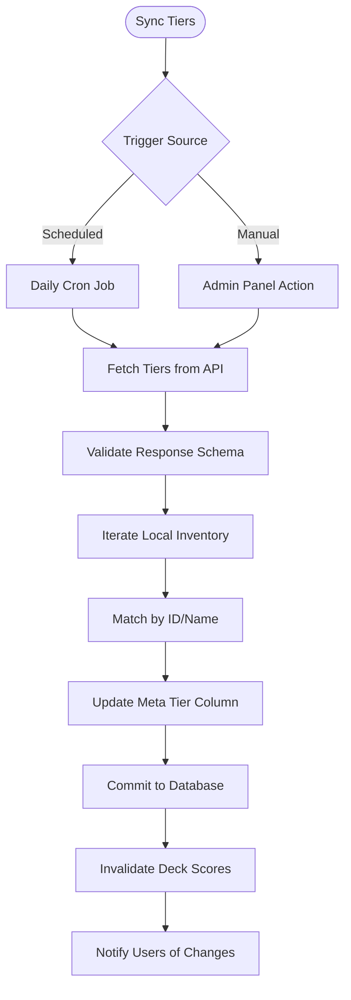

# FLOW-005: Support Card Management System Flow

## Umamusume Pretty Derby Career Planner

**Document Version**: 2.1.0
**Date**: January 24, 2026
**Project**: UmamusumeCareerPlanner
**Author**: Development Team
**Status**: Current - Aligned with codebase v2.0.0

---

## 1. Support Card Collection Management Flow

This flow details how `SupportCardService` manages the user's inventory, including synchronization with external game data sources.

```mermaid
flowchart TD
    Start([Open Collection]) --> FetchData[Fetch Owned Cards]
    
    FetchData --> CheckSync{Data Stale?}
    
    CheckSync -->|Yes| TriggerSync[Trigger External API Sync]
    TriggerSync --> FetchExternal[Fetch from umapyoi.net]
    FetchExternal --> UpdateDB[Update ucp_support_cards]
    UpdateDB --> ReloadData[Reload Data]
    
    CheckSync -->|No| DisplayCards[Display Grid View]
    ReloadData --> DisplayCards
    
    DisplayCards --> UserAction{User Action}
    
    UserAction -->|Filter| ApplyFilters[Filter by Type/Rarity/Tier]
    UserAction -->|Limit Break| UpdateLB[Update LB Level (0-4)]
    UserAction -->|Level Up| UpdateLevel[Update Card Level]
    
    UpdateLB --> SaveCard[Persist Changes]
    UpdateLevel --> SaveCard
    
    SaveCard --> RecalcStats[Recalculate Current Stats]
    RecalcStats --> UpdateUI[Refresh View]
```

---

## 2. Deck Building & Optimization Flow

The process for creating valid support decks via `SupportDeckService`, enforcing game rules (5 owned + 1 borrowed).

```mermaid
flowchart TD
    Start([Build Deck]) --> InitBuilder[Initialize Deck Builder]
    
    InitBuilder --> SelectCards[Select 5 Owned Cards]
    SelectCards --> SelectFriend[Select 1 Borrowed Card]
    
    SelectFriend --> Validate{Validate Deck}
    
    Validate -->|Invalid| ShowErrors[Show Type/Rarity Conflicts]
    Validate -->|Valid| CalcSynergy[Calculate Synergy Score]
    
    CalcSynergy --> AnalyzeDeck[Analyze Stat Distribution]
    AnalyzeDeck --> CheckMeta[Check Meta Tier Average]
    
    CheckMeta --> DisplayMetrics[Display Deck Metrics]
    
    DisplayMetrics --> UserConfirm{Save Deck?}
    
    UserConfirm -->|Yes| SaveDeck[Save to ucp_support_decks]
    UserConfirm -->|No| Modify[Modify Selection]
    
    SaveDeck --> LinkCharacter[Link to Active Character (Optional)]
```

---

## 3. Bond Progression & Training Flow

How support card bonds are tracked and utilized during the training loop.

```mermaid
flowchart TD
    Start([Training Session]) --> LoadDeck[Load Active Deck]
    
    LoadDeck --> Identify[Identify Participants]
    Identify --> AddBond[Add Bond Points (+3 Base)]
    
    AddBond --> CheckMilestone{Check Milestones}
    
    CheckMilestone -->|20%| StatBonus[Apply Small Stat Bonus]
    CheckMilestone -->|40%| HintUnlock[Unlock Skill Hint]
    CheckMilestone -->|60%| EventTrigger[Trigger Support Event]
    CheckMilestone -->|80%| FriendshipUnlock[Unlock Friendship Training]
    
    FriendshipUnlock --> NotifyUser[Notify: Friendship Available]
    
    StatBonus --> UpdateState
    HintUnlock --> UpdateState
    EventTrigger --> UpdateState
    NotifyUser --> UpdateState
    
    UpdateState --> Persist[Persist Bond Levels]
```

---

## 4. Meta Tier Synchronization Flow

The integration flow for keeping support card meta rankings up to date via `ExternalAPIService`.



---

## 5. Deck Recommendation Flow

Logic for generating optimal deck configurations based on training goals.

```mermaid
flowchart TD
    Start([Request Advice]) --> LoadContext[Load Character Goals]
    
    LoadContext --> AnalyzeStats[Analyze Target Stats]
    AnalyzeStats --> DetermineSplit[Determine Type Split (e.g. 3 Spd / 2 Int)]
    
    DetermineSplit --> FetchCandidates[Fetch Top Candidates from Inventory]
    
    FetchCandidates --> RankCards[Rank by Meta Tier & LB Level]
    RankCards --> SuggestComposition[Suggest 6-Card Deck]
    
    SuggestComposition --> CalcScore[Calculate Projected Score]
    
    CalcScore --> PresentUI[Present Recommendation]
    
    PresentUI --> UserAction{Accept?}
    UserAction -->|Yes| ApplyDeck[Apply to Builder]
    UserAction -->|No| Reroll[Adjust Criteria]
```

---

## 6. Card Comparison & Analysis Flow

A tool for comparing specific support cards to aid in selection.

```mermaid
flowchart TD
    Start([Select for Compare]) --> ChooseCards[Select 2-3 Cards]
    
    ChooseCards --> FetchStats[Fetch Max Stats (Lvl 50)]
    FetchStats --> FetchEffects[Fetch Unique Bonuses]
    FetchEffects --> FetchSkills[Fetch Trainable Skills]
    
    FetchSkills --> RenderComparison[Render Comparison Table]
    
    RenderComparison --> HighlightDiff[Highlight Key Differences]
    
    HighlightDiff --> CalculateValue[Calculate Relative Value Score]
    CalculateValue --> DisplayWinner[Indicate Recommended Pick]
```

---

## 7. Support Card Event Management Flow

Handling of random support card events during training turns.


---

## Document Control

| Version | Date | Author | Changes |
|---------|------|--------|---------|
| 2.1.0 | 2026-01-24 | Development Team | Updated to align with v2.0.0 codebase, External API sync, and Service layer architecture |
| 1.0.0 | 2026-01-14 | Development Team | Initial flow definitions |

---

## Related Documents

- [PRD-005: Support Card Management](../prds/PRD-005_Support_Card_Management.md)
- [SPEC-005: Support Card Management Technical](../specs/SPEC-005_Support_Card_Management_Technical.md)
- [009_DBD: Database Documentation](../009_DBD_Database_Documentation.md)
