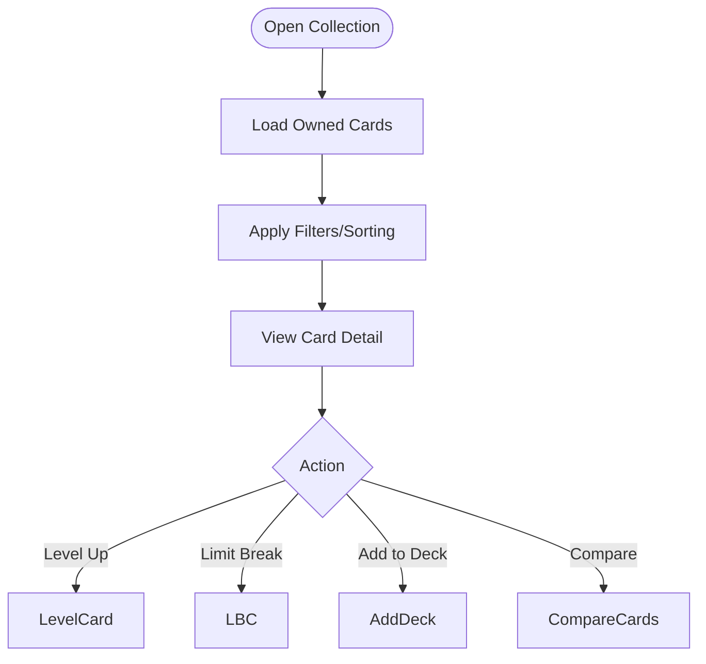
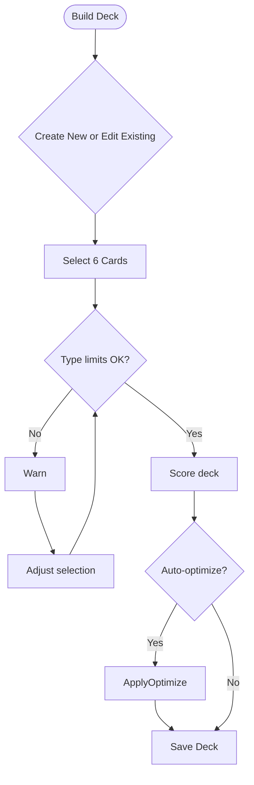
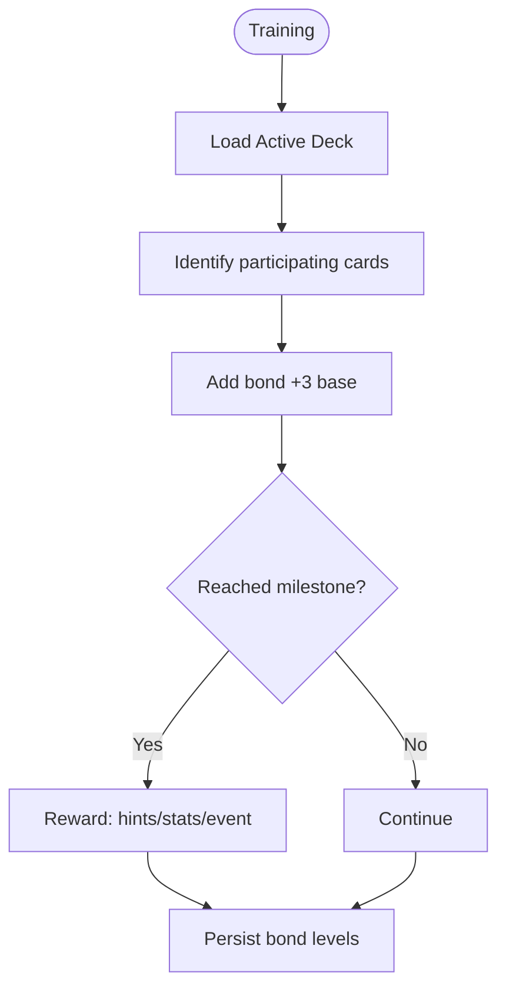
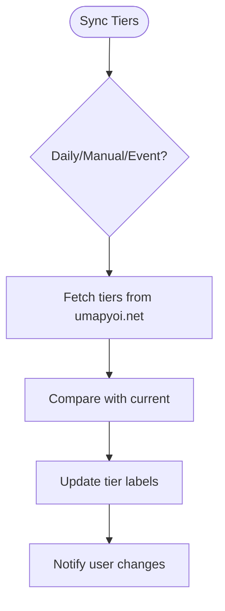
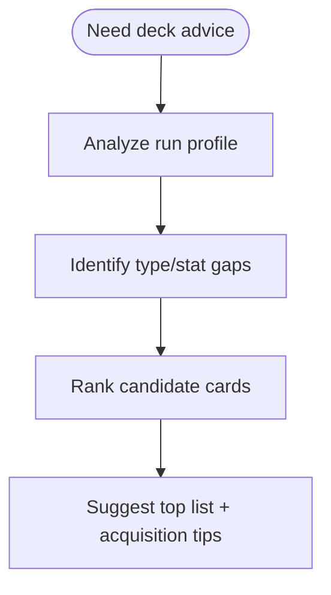
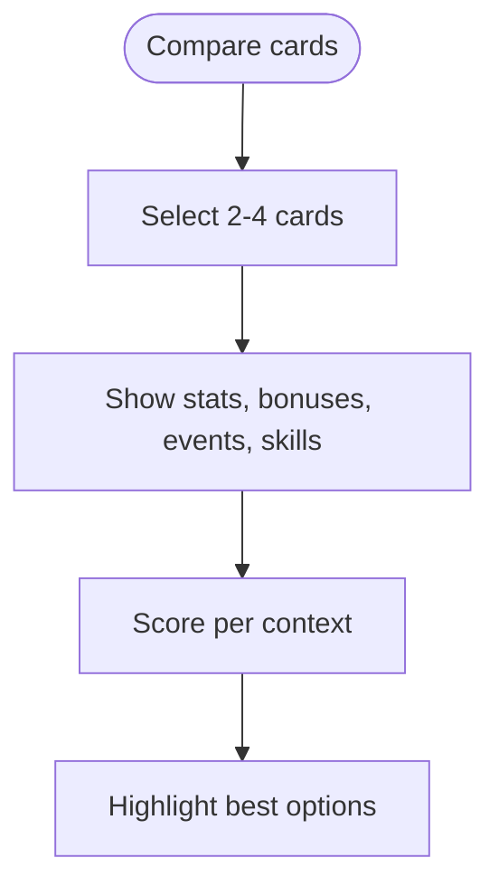
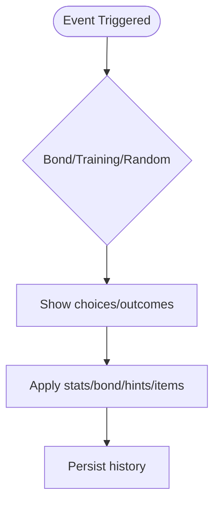

# FLOW-005: Support Card Management System Flow

## Umamusume Pretty Derby Career Planner

**Document Version**: 1.0
**Date**: January 14, 2026
**Related Documents**: [PRD-005], [SPEC-005]

---

## 1. Support Card Collection Management Flow

---

## 2. Deck Building & Optimization Flow

---

## 3. Bond Progression & Training Flow

---

## 4. Meta Tier Synchronization Flow

---

## 5. Support Card Recommendation Flow

---

## 6. Card Comparison & Analysis Flow

---

## 7. Support Card Event Management Flow

