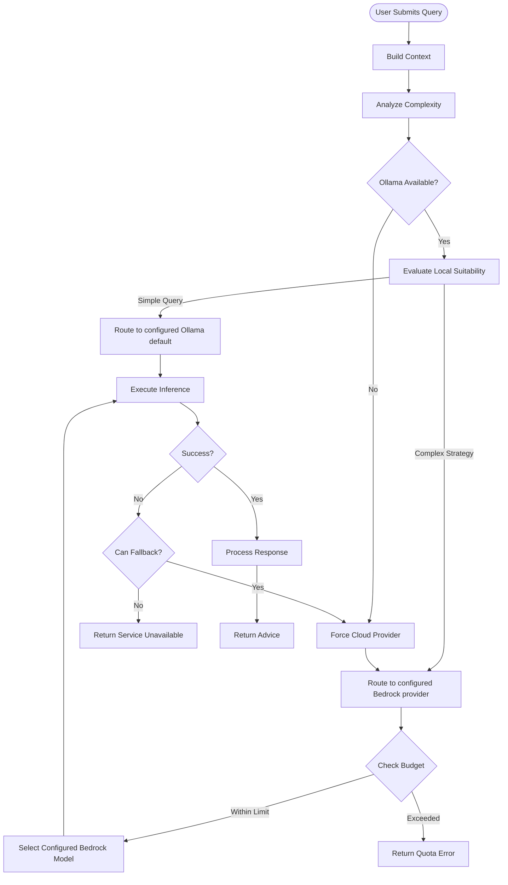
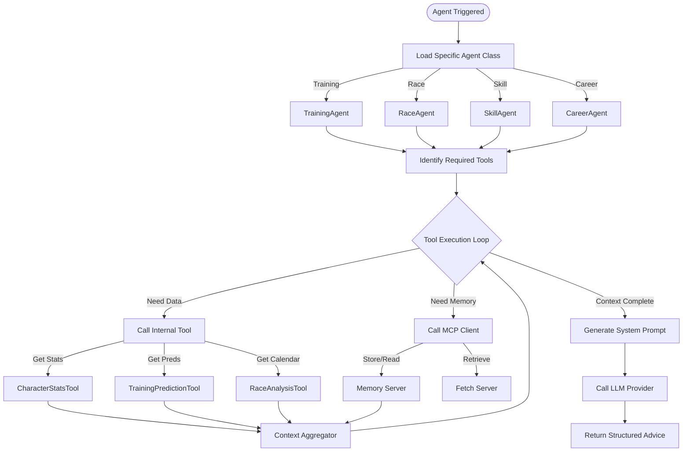
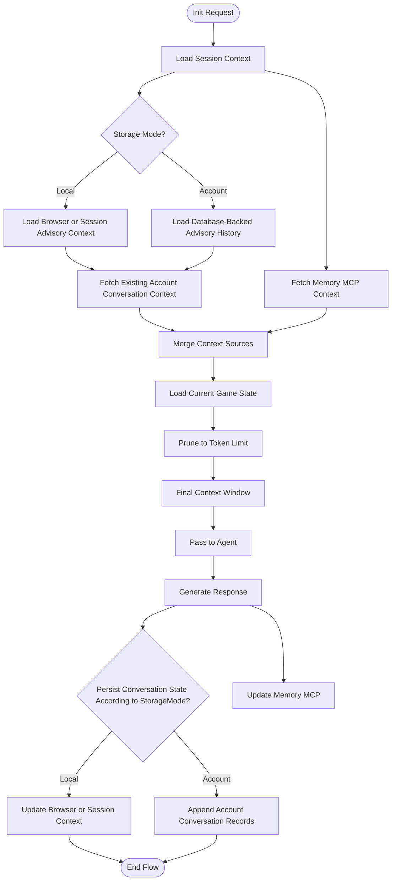
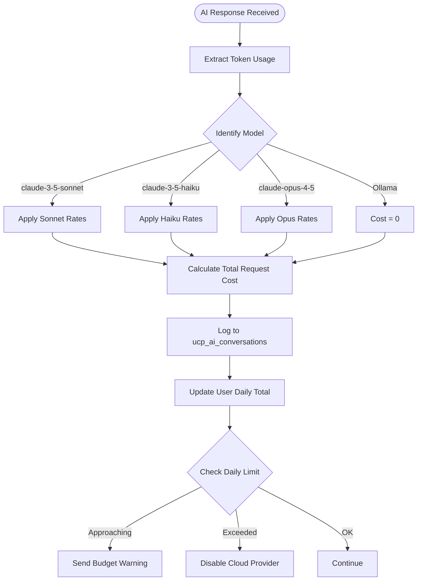

# FLOW-006: AI Advisory System Flow

## Umamusume Pretty Derby Career Planner

**Document Version**: 2.3.0
**Date**: March 10, 2026
**Project**: UmamusumeCareerPlanner
**Author**: Development Team
**Status**: Current - Updated with verified game mechanics from Global English Server

---

## 1. AI Query Routing & Hybrid Processing Flow

This flow illustrates the decision-making process within `HybridAIService` and the advisory
controller pipeline to select the appropriate AI provider (local Ollama vs. AWS Bedrock) based on
query complexity, availability, and cost constraints.



---

## 2. Neuron Agent Execution Flow

This flow details how specific **Neuron AI Agents** (Training, Race, Skill, Career) orchestrate tool
usage to generate grounded recommendations.



---

## 3. Context Management Flow

Context persistence differs by storage mode. Account mode may persist advisory conversations to
database-backed conversation records. Local mode should restrict persistence to browser or session
context and ephemeral memory integrations unless the user explicitly migrates to an account-backed
flow.



---

## 4. Recommendation Generation Flow

How the system generates domain-specific advice based on the user's current situation.


---

## 5. Cost Tracking & Budget Management Flow

Tracks token usage for cloud providers (AWS Bedrock) to prevent overage.



---

## 6. MCP Server Integration Flow

Details the interaction between the Laravel backend and external Model Context Protocol servers.


---

## 7. Conversational Interface Flow

The user interaction loop within the Alpine-powered `aiChatInterface` client and the
`AIChatController` request pipeline.

```mermaid
flowchart TD
    Start([User Types Message]) --> Submit[Submit Query]

    Submit --> OptimisticUI[Show User Message (Optimistic)]
    OptimisticUI --> ShowTyping[Show 'Thinking...' Indicator]

    ShowTyping --> SendRequest[Send to AI Controller]

    SendRequest --> ProcessBackend[Process Backend (See Flow 1)]

    ProcessBackend --> ReceiveResp[Receive AI Response]

    ReceiveResp --> Stream{Stream Enabled?}

    Stream -->|Yes| StreamChunks[Stream Markdown Chunks]
    Stream -->|No| RenderFull[Render Full Response]

    StreamChunks --> UpdateUI[Update Chat Window]
    RenderFull --> UpdateUI

    UpdateUI --> RenderActions[Render Follow-up Actions]
    RenderActions --> SaveHistory[Persist State]
```

---

## 8. Game Mechanics Reference for AI Agents

This section documents the verified game mechanics that AI agents must use when generating recommendations.

### 8.1 Skill Hint Discounts

| Hint Level | Discount |
| --- | --- |
| 0 | 0% |
| 1 | 10% |
| 2 | 20% |
| 3 | 30% |
| 4 | 35% |
| 5 (max) | 40% |

**Additional**: Fast Learner condition adds +10% (stacks, max 50% total)

### 8.2 Aptitude Grade Modifiers

| Grade | Surface (Power) | Distance (Speed) | Style (Wit) |
| --- | --- | --- | --- |
| S | +5% | +5% | +10% |
| A | 0% | 0% | 0% |
| B | -10% | -10% | -15% |
| C | -20% | -20% | -25% |
| D | -30% | -40% | -40% |
| E | -50% | -60% | -60% |
| F | -70% | -80% | -80% |
| G | -90% | -90% | -90% |

### 8.3 Track Conditions

| Condition | Power (Turf) | Power (Dirt) | Speed | Stamina Drain |
| --- | --- | --- | --- | --- |
| Firm | None | None | None | Normal |
| Good | approx. −2% | approx. −2% | None | Normal |
| Soft | approx. −2% | approx. −5% | None | +2%/sec |
| Heavy | approx. −2% | approx. −5% | approx. −2% | +2%/sec |

> **Note**: Percentage values are community-approximated from observed in-game stat deltas. Ollama-based local providers have no billing cost (Cost = 0 in the diagram above).

### 8.4 Training Formula

```
Stat Gain = (Base + StatBonus) × (1 + GrowthRate) × (1 + MoodModifier) × (1 + TrainingEffect) × (1 +
0.05 × NumSupportCards) × FriendshipMultiplier
```

> MoodModifier values (game-accurate): Great +0.04, Good +0.02, Normal 0, Bad −0.02, Awful −0.04.

### 8.5 Stat Caps

- **Base Cap**: 1200
- **Per-Training Cap**: +100 (normal), +50 (above 1200)
- **Overflow**: Stats above 1200 gain at half rate

---

## Document Control

| Version | Date | Author | Changes |
| --- | --- | --- | --- |
| 2.3.0 | 2026-03-10 | Development Team | Updated cost-tracking diagram to use config-aligned model IDs (claude-3-5-sonnet, claude-3-5-haiku, claude-opus-4-5); converted track condition table to percentage approximations; simplified training formula; added Ollama free-cost note. |
| 2.2.1 | 2026-03-08 | Development Team | Added StorageMode-aware advisory context persistence, corrected the current Alpine chat UI naming, and updated provider labels to current configured defaults. |
| 2.2.0 | 2026-01-28 | Development Team | Updated with verified game mechanics from Global English Server: AI recommendations now use correct hint discount rates (10%/20%/30%/35%/40%), aptitude calculations use S as max grade, training formula integration, track condition modifiers (Firm/Good/Soft/Heavy) |
| 2.1.0 | 2026-01-24 | Development Team | Updated to align with v2.0.0 architecture: Hybrid AI, Neuron Agents, and MCP integration |
| 1.0.0 | 2026-01-14 | Development Team | Initial flow definitions |

---

## Related Documents

- [PRD-006: AI Advisory](../02-prds/PRD-006_AI_Advisory.md)
- [SPEC-006: AI Advisory Technical](../02-specs/SPEC-006_AI_Advisory_Technical.md)
- [008_SIS: Software Integration Specs](../00-core-docs/008_SIS_Software_Integration_Specifications.md)
