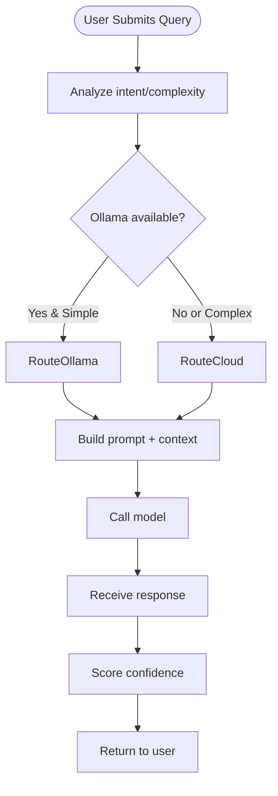
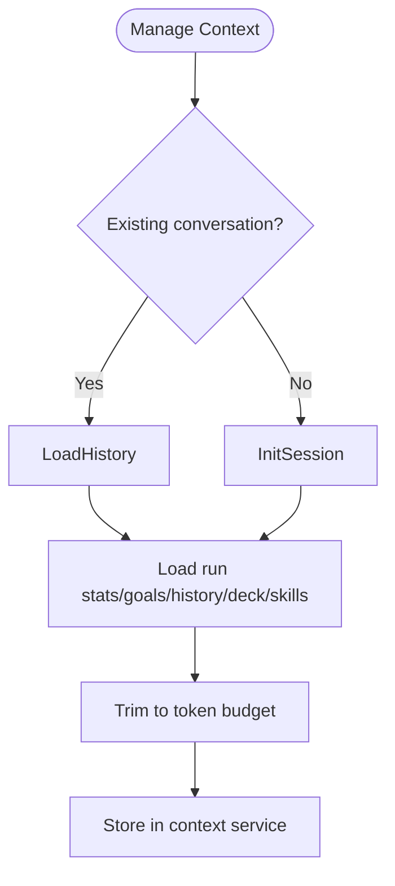
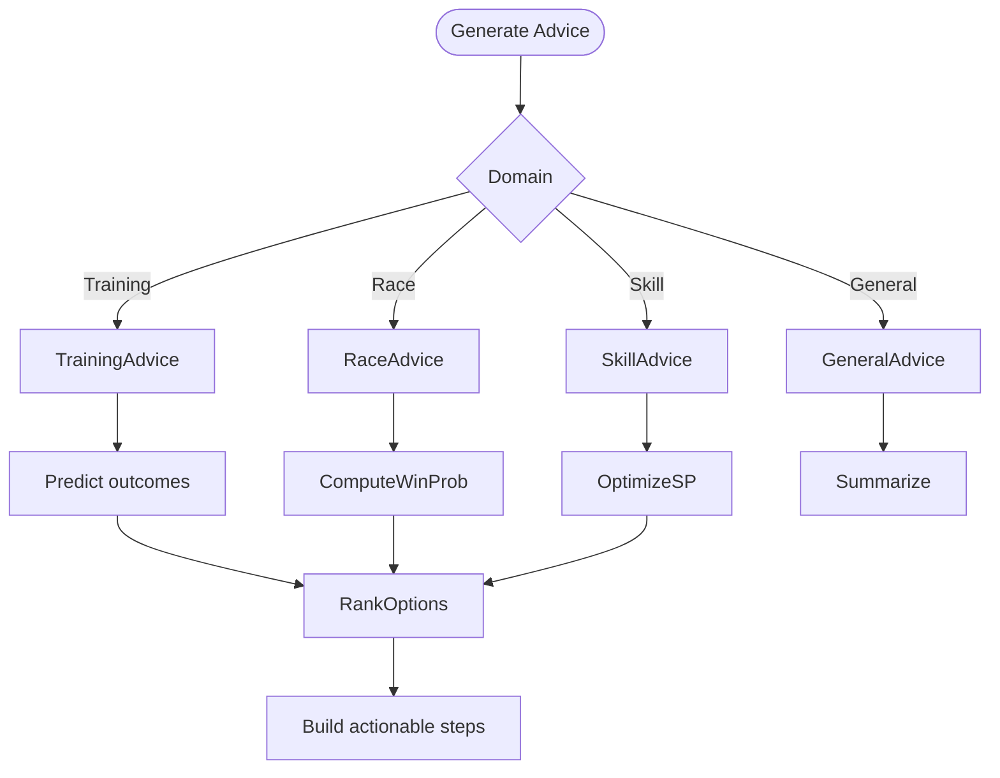
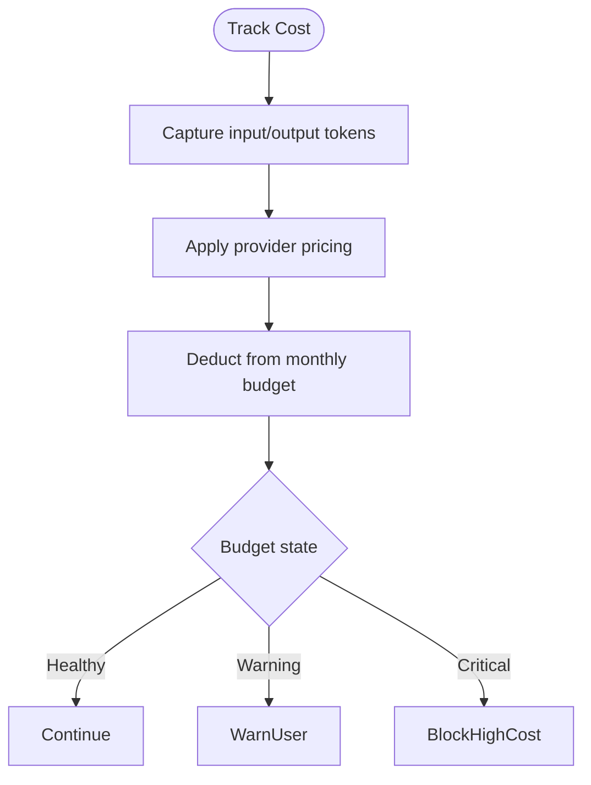
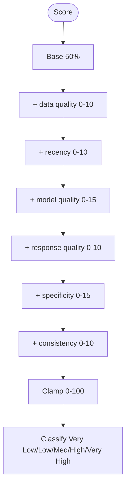
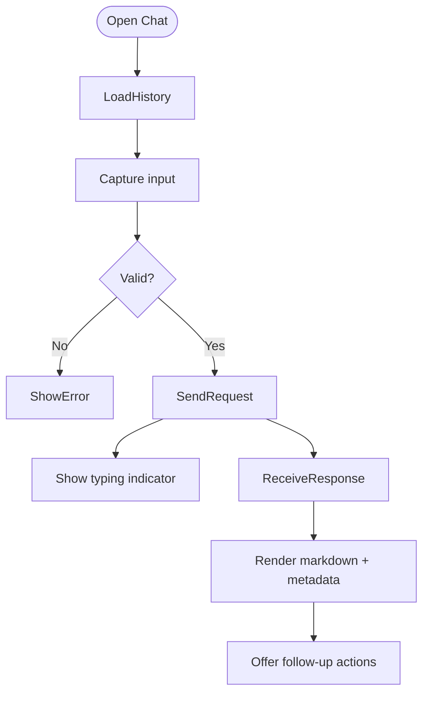
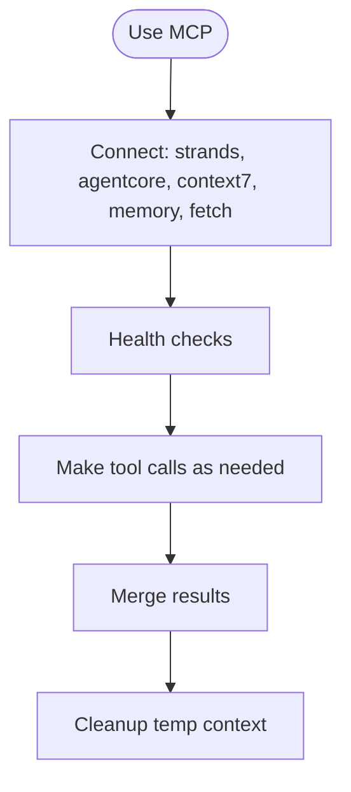

# FLOW-006: AI Advisory System Flow

## Umamusume Pretty Derby Career Planner

**Document Version**: 1.0
**Date**: January 14, 2026
**Related Documents**: [PRD-006], [SPEC-006]

---

## 1. AI Query Routing & Processing Flow

---

## 2. Context Management Flow

---

## 3. Recommendation Generation Flow

---

## 4. Cost Tracking & Budget Management Flow

---

## 5. Confidence Scoring Flow

---

## 6. Conversational Interface Flow

---

## 7. MCP Server Integration Flow

