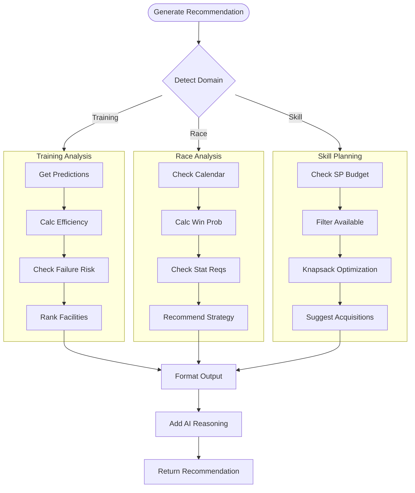
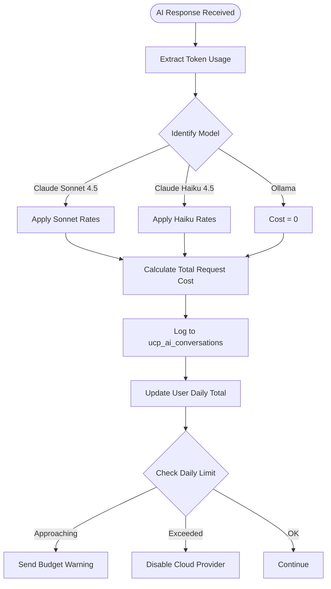
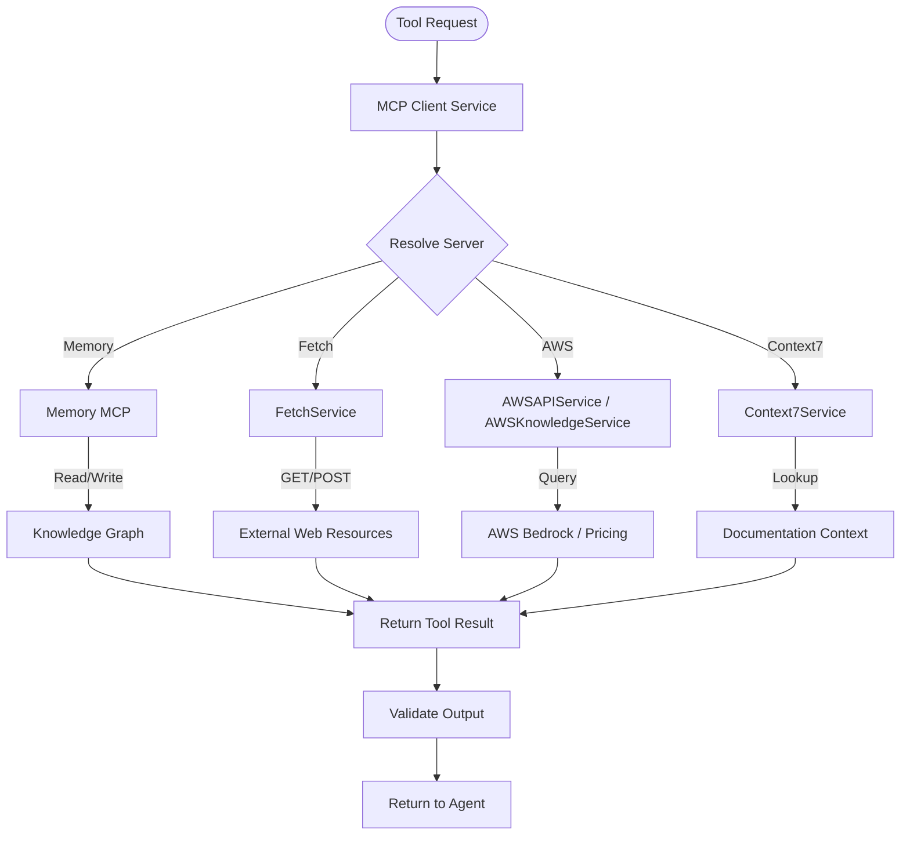

# FLOW-006: AI Advisory System Flow

## Umamusume Pretty Derby Career Planner

**Document Version**: 2.3.0
**Date**: February 22, 2026
**Project**: UmamusumeCareerPlanner
**Author**: Development Team
**Status**: Current - Updated with verified codebase references (HybridAIService, Neuron AI v2.11, 42 MCP tools, AgentOrchestrationService)

---

## 1. AI Query Routing & Hybrid Processing Flow

This flow illustrates the decision-making process within `AdviceService` and `HybridAIService` to select the appropriate AI provider (Local Ollama vs. Cloud AWS Bedrock) based on query complexity, availability, and cost constraints.

```mermaid
flowchart TD
    Start([User Submits Query]) --> BuildContext[Build Context]
    BuildContext --> AnalyzeComplexity[Analyze Complexity]
    
    AnalyzeComplexity --> CheckLocal{Ollama Available?}
    
    CheckLocal -->|Yes| EvaluateLocal[Evaluate Local Suitability]
    CheckLocal -->|No| ForceCloud[Force Cloud Provider]
    
    EvaluateLocal -->|Simple Query| RouteLocal[Route to Ollama (llama3.2)]
    EvaluateLocal -->|Complex Strategy| RouteCloud[Route to AWS Bedrock]
    
    ForceCloud --> RouteCloud
    
    RouteCloud --> CheckBudget{Check Budget}
    CheckBudget -->|Within Limit| SelectModel[Select Claude Sonnet 4.5]
    CheckBudget -->|Exceeded| ErrorQuota[Return Quota Error]
    
    RouteLocal --> ExecuteRequest[Execute Inference]
    SelectModel --> ExecuteRequest
    
    ExecuteRequest --> Success{Success?}
    
    Success -->|Yes| ProcessResponse[Process Response]
    Success -->|No| CheckFallback{Can Fallback?}
    
    CheckFallback -->|Yes| ForceCloud
    CheckFallback -->|No| ReturnError[Return Service Unavailable]
    
    ProcessResponse --> ReturnUser[Return Advice]
```

---

## 2. Neuron Agent Execution Flow

This flow details how specific **Neuron AI Agents** (Training, Race, Skill, Career) orchestrate tool usage to generate grounded recommendations. The application uses Neuron AI v2.11 with `neuron-laravel` v0.3.4, providing 5 Neuron services:

- `CareerPlanningService` → `CareerPlanningAgent`
- `TrainingAdvisorService` → `TrainingAdvisorAgent`
- `RaceStrategyService` → `RaceStrategyAgent`
- `SkillRecommendationService` → `SkillRecommendationAgent`
- `NeuronAIService` (core orchestration)


---

## 3. Context Management Flow

Manages conversation history and game state context using the database and MCP server integration via `MCPClientService`.


---

## 4. Recommendation Generation Flow

How the system generates domain-specific advice based on the user's current situation.



---

## 5. Cost Tracking & Budget Management Flow

Tracks token usage for cloud providers (AWS Bedrock) to prevent overage.



---

## 6. MCP Agent Orchestration & Tool Integration Flow

Details the interaction between the Laravel backend and MCP infrastructure. The system includes `AgentOrchestrationService` coordinating 42 MCP tools, with `MCPMonitoringService` providing health monitoring.



---

## 7. Conversational Interface Flow

The user interaction loop within the Livewire `AdvisoryPanel` component.

```mermaid
flowchart TD
    Start([User Types Message]) --> Submit[Submit Query]
    
    Submit --> OptimisticUI[Show User Message (Optimistic)]
    OptimisticUI --> ShowTyping[Show 'Thinking...' Indicator]
    
    ShowTyping --> SendRequest[Send to AI Controller]
    
    SendRequest --> ProcessBackend[Process Backend (See Flow 1)]
    
    ProcessBackend --> ReceiveResp[Receive AI Response]
    
    ReceiveResp --> Stream{Stream Enabled?}
    
    Stream -->|Yes| StreamChunks[Stream Markdown Chunks]
    Stream -->|No| RenderFull[Render Full Response]
    
    StreamChunks --> UpdateUI[Update Chat Window]
    RenderFull --> UpdateUI
    
    UpdateUI --> RenderActions[Render Follow-up Actions]
    RenderActions --> SaveHistory[Persist State]
```

---

## 8. AI Infrastructure Summary

### 8.1 AI Service Layer (app/Services/AI/)

| Service | Purpose |
|---------|--------|
| `AdviceService` | Domain-specific advisory logic |
| `HybridAIService` | Provider routing (Ollama ↔ Bedrock) |
| `OllamaService` | Local Ollama inference (llama3.2) |
| `BedrockService` | AWS Bedrock inference (Claude Sonnet 4.5) |
| `CostTrackingService` | Token usage and budget management |
| `ConversationHistoryService` | Conversation state persistence |
| `AIDashboardService` | AI metrics and dashboard data |
| `AgentFeedbackService` | Agent feedback collection |
| `VectorStoreService` | Embedding storage and retrieval |

### 8.2 MCP Infrastructure (app/Services/MCP/)

| Component | Purpose |
|-----------|--------|
| `AgentOrchestrationService` | Multi-agent coordination (42 tools) |
| `MCPClientService` | MCP protocol client |
| `MCPMonitoringService` | Health monitoring and dashboards |
| `AgentMemoryService` | Agent memory persistence |
| `AgentRoutingService` | Query-to-agent routing |
| `Tools/` | FetchService, AWSAPIService, AWSKnowledgeService, Context7Service, ToolChainingService |

### 8.3 Game Mechanics Reference for AI Agents

This section documents the verified game mechanics that AI agents must use when generating recommendations.

#### 8.3.1 Skill Hint Discounts

| Hint Level | Discount |
|------------|----------|
| 0          | 0%       |
| 1          | 10%      |
| 2          | 20%      |
| 3          | 30%      |
| 4          | 35%      |
| 5 (max)    | 40%      |

**Additional**: Fast Learner condition adds +10% (stacks, max 50% total)

#### 8.3.2 Aptitude Grade Modifiers

| Grade | Surface (Power) | Distance (Speed) | Style (Wit) |
|-------|-----------------|------------------|-------------|
| S     | +5%             | +5%              | +10%        |
| A     | 0%              | 0%               | 0%          |
| B     | -10%            | -10%             | -15%        |
| C     | -20%            | -20%             | -25%        |
| D     | -30%            | -40%             | -40%        |
| E     | -50%            | -60%             | -60%        |
| F     | -70%            | -80%             | -80%        |
| G     | -90%            | -90%             | -90%        |

#### 8.3.3 Track Conditions

| Condition | Power (Turf) | Power (Dirt) | Speed | Stamina Drain |
|-----------|--------------|--------------|-------|---------------|
| Firm      | 0            | 0            | 0     | Normal        |
| Good      | -50          | -50          | 0     | Normal        |
| Soft      | -50          | -100         | 0     | +2%/sec       |
| Heavy     | -50          | -100         | -50   | +2%/sec       |

#### 8.3.4 Training Formula

```
Stat Gain = (Base + StatBonus) × (1 + GrowthRate) × (1 + MoodMultiplier × (1 + MoodEffect)) × (1 + TrainingEffect) × (1 + 0.05 × NumSupportCards) × FriendshipMultiplier
```

#### 8.3.5 Stat Caps

- **Base Cap**: 1200
- **Per-Training Cap**: +100 (normal), +50 (above 1200)
- **Overflow**: Stats above 1200 gain at half rate

---

## Document Control

| Version | Date       | Author           | Changes |
|---------|------------|------------------|---------|
| 2.3.0   | 2026-02-22 | Development Team | Updated service references: AdviceService, HybridAIService, AdvisoryPanel (Livewire); Claude 3.5→Sonnet 4.5, Claude 3→Haiku 4.5; added Neuron AI v2.11 agent/service mapping; expanded MCP section with 42 tools and AgentOrchestrationService; added AI infrastructure summary (§8.1-8.2) |
| 2.2.0   | 2026-01-28 | Development Team | Updated with verified game mechanics from Global English Server: AI recommendations now use correct hint discount rates (10%/20%/30%/35%/40%), aptitude calculations use S as max grade, training formula integration, track condition modifiers (Firm/Good/Soft/Heavy) |
| 2.1.0   | 2026-01-24 | Development Team | Updated to align with v2.0.0 architecture: Hybrid AI, Neuron Agents, and MCP integration |
| 1.0.0   | 2026-01-14 | Development Team | Initial flow definitions |

---

## Related Documents

- [PRD-006: AI Advisory](../prds/PRD-006_AI_Advisory.md)
- [SPEC-006: AI Advisory Technical](../specs/SPEC-006_AI_Advisory_Technical.md)
- [008_SIS: Software Integration Specs](../008_SIS_Software_Integration_Specifications.md)
