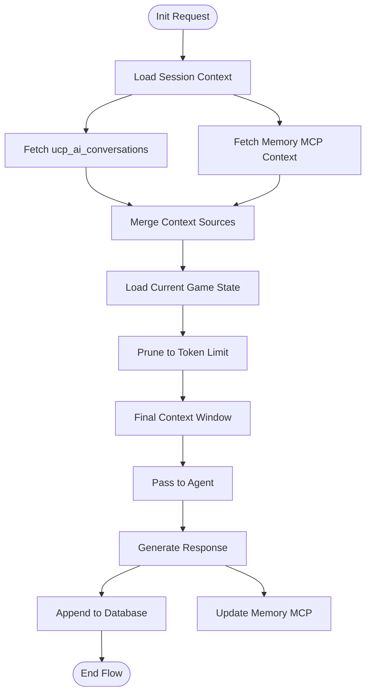
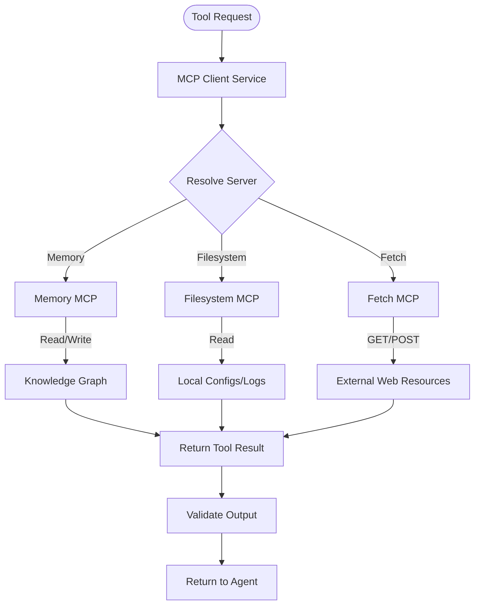

# FLOW-006: AI Advisory System Flow

## Umamusume Pretty Derby Career Planner

**Document Version**: 2.1.0
**Date**: January 24, 2026
**Project**: UmamusumeCareerPlanner
**Author**: Development Team
**Status**: Current - Aligned with codebase v2.0.0

---

## 1. AI Query Routing & Hybrid Processing Flow

This flow illustrates the decision-making process within `AIAdvisoryService` and `AIRouterService` to select the appropriate AI provider (Local Ollama vs. Cloud AWS Bedrock) based on query complexity, availability, and cost constraints.

```mermaid
flowchart TD
    Start([User Submits Query]) --> BuildContext[Build Context]
    BuildContext --> AnalyzeComplexity[Analyze Complexity]
    
    AnalyzeComplexity --> CheckLocal{Ollama Available?}
    
    CheckLocal -->|Yes| EvaluateLocal[Evaluate Local Suitability]
    CheckLocal -->|No| ForceCloud[Force Cloud Provider]
    
    EvaluateLocal -->|Simple Query| RouteLocal[Route to Ollama (llama3.2)]
    EvaluateLocal -->|Complex Strategy| RouteCloud[Route to AWS Bedrock]
    
    ForceCloud --> RouteCloud
    
    RouteCloud --> CheckBudget{Check Budget}
    CheckBudget -->|Within Limit| SelectModel[Select Claude 3.5 Sonnet]
    CheckBudget -->|Exceeded| ErrorQuota[Return Quota Error]
    
    RouteLocal --> ExecuteRequest[Execute Inference]
    SelectModel --> ExecuteRequest
    
    ExecuteRequest --> Success{Success?}
    
    Success -->|Yes| ProcessResponse[Process Response]
    Success -->|No| CheckFallback{Can Fallback?}
    
    CheckFallback -->|Yes| ForceCloud
    CheckFallback -->|No| ReturnError[Return Service Unavailable]
    
    ProcessResponse --> ReturnUser[Return Advice]
```

---

## 2. Neuron Agent Execution Flow

This flow details how specific **Neuron AI Agents** (Training, Race, Skill, Career) orchestrate tool usage to generate grounded recommendations.


---

## 3. Context Management Flow

Manages conversation history and game state context using the database and Memory MCP server.



---

## 4. Recommendation Generation Flow

How the system generates domain-specific advice based on the user's current situation.


---

## 5. Cost Tracking & Budget Management Flow

Tracks token usage for cloud providers (AWS Bedrock) to prevent overage.


---

## 6. MCP Server Integration Flow

Details the interaction between the Laravel backend and external Model Context Protocol servers.



---

## 7. Conversational Interface Flow

The user interaction loop within the Livewire `AdvisorChat` component.

```mermaid
flowchart TD
    Start([User Types Message]) --> Submit[Submit Query]
    
    Submit --> OptimisticUI[Show User Message (Optimistic)]
    OptimisticUI --> ShowTyping[Show 'Thinking...' Indicator]
    
    ShowTyping --> SendRequest[Send to AI Controller]
    
    SendRequest --> ProcessBackend[Process Backend (See Flow 1)]
    
    ProcessBackend --> ReceiveResp[Receive AI Response]
    
    ReceiveResp --> Stream{Stream Enabled?}
    
    Stream -->|Yes| StreamChunks[Stream Markdown Chunks]
    Stream -->|No| RenderFull[Render Full Response]
    
    StreamChunks --> UpdateUI[Update Chat Window]
    RenderFull --> UpdateUI
    
    UpdateUI --> RenderActions[Render Follow-up Actions]
    RenderActions --> SaveHistory[Persist State]
```

---

## Document Control

| Version | Date | Author | Changes |
|---------|------|--------|---------|
| 2.1.0 | 2026-01-24 | Development Team | Updated to align with v2.0.0 architecture: Hybrid AI, Neuron Agents, and MCP integration |
| 1.0.0 | 2026-01-14 | Development Team | Initial flow definitions |

---

## Related Documents

- [PRD-006: AI Advisory](../prds/PRD-006_AI_Advisory.md)
- [SPEC-006: AI Advisory Technical](../specs/SPEC-006_AI_Advisory_Technical.md)
- [008_SIS: Software Integration Specs](../008_SIS_Software_Integration_Specifications.md)
