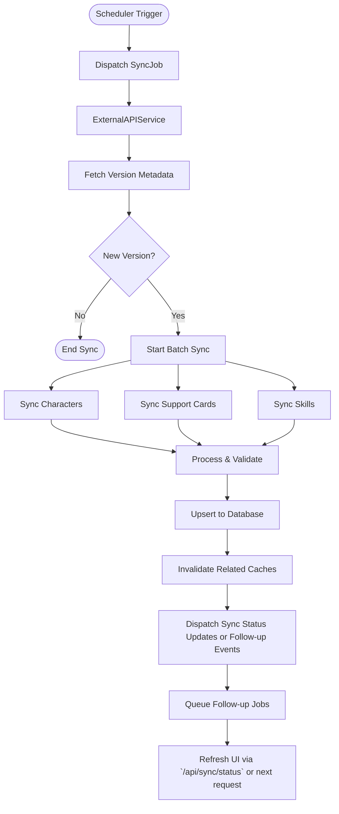

# FLOW-007: External Integration System Flow

## Umamusume Pretty Derby Career Planner

**Document Version**: 2.4.2
**Date**: April 7, 2026
**Project**: UmamusumeCareerPlanner
**Author**: Development Team
**Status**: Current - Updated with verified game mechanics from Global English Server

---

## 1. External API Data Retrieval Flow

This flow illustrates how `ExternalAPIService` handles data requests using a Circuit Breaker pattern
to ensure resilience when communicating with `umapyoi.net` and optional secondary/community sources.

```mermaid
flowchart TD
    Start([Request Data]) --> CheckCache{Check Cache}

    CheckCache -->|Hit| ReturnCache[Return Cached Response]
    CheckCache -->|Miss| CheckCircuit{Circuit Breaker State}

    CheckCircuit -->|Open| TryFallback[Try Secondary Source or Cached Data]
    CheckCircuit -->|Closed| CallPrimary[Call umapyoi.net]
    CheckCircuit -->|Half-Open| ProbeCall[Probe Primary API]

    ProbeCall --> CallPrimary

    CallPrimary --> Response{Response Code}

    Response -->|200 OK| ValidateData[Validate Schema]
    Response -->|429/5xx| RecordFailure[Record Failure]

    RecordFailure --> CheckThreshold{Failure > Threshold?}
    CheckThreshold -->|Yes| TripCircuit[Open Circuit]
    CheckThreshold -->|No| TryFallback

    TripCircuit --> TryFallback

    TryFallback --> FallbackResponse{Fallback Success?}

    FallbackResponse -->|Yes| ValidateData
    FallbackResponse -->|No| ReturnStale{Stale Cache Available?}

    ReturnStale -->|Yes| ReturnCacheWarning[Return Stale + Warning]
    ReturnStale -->|No| ReturnError[Throw ServiceUnavailable]

    ValidateData --> StoreCache[Store in Redis (24h TTL)]
    StoreCache --> StoreDB[Sync to Database]
    StoreDB --> ReturnData[Return Fresh Data]
```

---

## 2. OCR Screenshot Analysis Flow

The workflow for processing user-uploaded screenshots via `TesseractService` and the OCR upload
workflow, converting image data into structured game statistics.

OCR-confirmed data should branch by `StorageMode`: Local mode writes extracted values into the
active UUID-oriented run payload, while Account mode writes them to authorized character or career
records in the database.

The current review step is served through `OCRUploadController::showResults()` and a dedicated
results page where the extracted form fields can be corrected before import.

```mermaid
flowchart TD
    Start([User Uploads Image]) --> ValidateFile[Validate MIME/Size]

    ValidateFile -->|Invalid| ReturnError[Return Validation Error]
    ValidateFile -->|Valid| Preprocess[Image Preprocessing (GD)]

    Preprocess --> Resize[Resize/Normalize]
    Resize --> Grayscale[Grayscale Conversion]
    Grayscale --> Threshold[Adaptive Thresholding]

    Threshold --> OCR[Tesseract Engine]
    OCR --> ExtractText[Raw Text Extraction]

    ExtractText --> Parse[OCRParserService]
    Parse --> PatternMatch[Regex Pattern Matching]

    PatternMatch --> ValidateContent[OCRValidationService]
    ValidateContent --> ScoreConf[Calculate Confidence Score]

    ScoreConf --> CheckConf{Confidence > 80%?}

    CheckConf -->|Yes| AutoMap[Auto-Map to Fields]
    CheckConf -->|No| FlagReview[Flag for Manual Review]

    AutoMap --> ReturnPreview[Return JSON Preview]
    FlagReview --> ReturnPreview

    ReturnPreview --> ShowResults[Serve OCRUploadController::showResults Review Page]
    ShowResults --> UserConfirm{User Confirms?}

    UserConfirm -->|Yes| Persist[Persist OCR-Extracted Character Data]
    UserConfirm -->|Edit| UpdateData[Update Values]
    UpdateData --> Persist
    UserConfirm -->|Cancel| Discard[Discard Data]

    Persist --> StorageMode{Storage Mode?}
    StorageMode -->|Local| SaveLocalOCR[Apply Extracted Data to Local Run Payload by UUID]
    StorageMode -->|Account| SaveAccountOCR[Apply Extracted Data to Authorized Database Character or Career]
    SaveLocalOCR --> ReturnSuccess[Return Success Response]
    SaveAccountOCR --> SaveOk{Saved?}
    SaveOk -->|No| ReturnPersistError[Return Persistence Error]
    SaveOk -->|Yes| ReturnSuccess
```

---

## 3. Data Synchronization Flow

External reference-data synchronization process managed by Laravel Scheduler and queued jobs to keep
canonical datasets and caches current for both Local and Account modes.

Reference-data synchronization updates shared canonical data and caches. It does not implicitly
migrate Local mode run data into Account mode persistence.



> **Sync Status Endpoint**: `GET /api/sync/status` returns a JSON payload containing the current sync state, last-synced timestamp, and any pending error counts. Clients should poll this endpoint or check it on the next page load to reflect the latest data.

---

## 4. Rate Limiting & Throttling Flow

Middleware-based flow to protect external resources and internal processing capacity.


---

## 5. Cache Management Flow

Logic for managing the lifecycle of cached external data in Redis.

```mermaid
flowchart TD
    Start([Access Data]) --> GenKey[Generate Cache Key]

    GenKey --> CheckRedis{Exists in Redis?}

    CheckRedis -->|Yes| CheckTTL{TTL Expired?}

    CheckTTL -->|No| ReturnData[Return Data]
    CheckTTL -->|Yes| Refresh[Trigger Background Refresh]
    Refresh --> ReturnData

    CheckRedis -->|No| FetchSource[Fetch from Source]

    FetchSource --> Store[Store in Redis]
    Store --> SetTTL[Set TTL (24h)]
    SetTTL --> ReturnData

    subgraph InvalidationStrategy
        UpdateEvent[Data Update Event] --> FindKeys[Find Related Keys]
        FindKeys --> DeleteKeys[Delete/Tag Invalidation]
    end
```

> **Cache Tags Note**: When cache tags are used (e.g., `Cache::tags(['characters'])->flush()`), all tagged keys can be invalidated in a single call. This is the preferred strategy for grouped reference data (skill catalog, character lists) rather than deleting by individual key.

---

## 6. Circuit Breaker State Flow

State transition logic for the resilience mechanism in `ExternalAPIService`.

```mermaid
stateDiagram-v2
    [*] --> Closed

    state Closed {
        [*] --> Monitoring
        Monitoring --> Failure: Request Failed
        Failure --> Monitoring: Count < Threshold
        Failure --> Open: Count >= Threshold
    }

    state Open {
        [*] --> Rejecting
        Rejecting --> HalfOpen: Timeout Expired
        Rejecting --> Rejecting: Request Blocked
    }

    state HalfOpen {
        [*] --> Probing
        Probing --> Closed: Success
        Probing --> Open: Failure
    }
```

---

## Document Control

| Version | Date | Author | Changes |
| --- | --- | --- | --- |
| 2.4.2 | 2026-04-07 | Development Team | Synchronized suite-wide documentation metadata and preserved verified flow mechanics and references. |
| 2.3.0 | 2026-03-10 | Development Team | Added explicit ShowResults node in OCR diagram to surface the review page step; added cache tags note to Cache Management section; added JSON response note for sync status endpoint. |
| 2.2.3 | 2026-03-08 | Development Team | Clarified the polling-friendly sync refresh path to reference the current `/api/sync/status` endpoint. |
| 2.2.2 | 2026-03-08 | Development Team | Clarified that OCR review currently occurs on the dedicated results page rendered by `OCRUploadController::showResults()`. |
| 2.2.1 | 2026-03-08 | Development Team | Added StorageMode-aware OCR persistence and clarified that external sync refreshes shared reference data without migrating Local mode user-owned run state. |
| 2.2.0 | 2026-01-28 | Development Team | Updated with verified game mechanics from Global English Server: OCR parsing updated for correct stat ranges (1200 base cap with overflow), aptitude grades (G-S scale, no SS), track conditions (Firm/Good/Soft/Heavy) |
| 2.1.0 | 2026-01-24 | Development Team | Updated to align with v2.0.0 codebase, Circuit Breaker implementation, and OCR pipeline details |
| 1.0.0 | 2026-01-14 | Development Team | Initial flow definitions |

---

## Related Documents

- [PRD-007: External Integration](../02-prds/PRD-007_External_Integration.md)
- [SPEC-007: External Integration Technical](../02-specs/SPEC-007_External_Integration_Technical.md)
- [008_SIS: Software Integration Specs](../00-core-docs/008_SIS_Software_Integration_Specifications.md)
