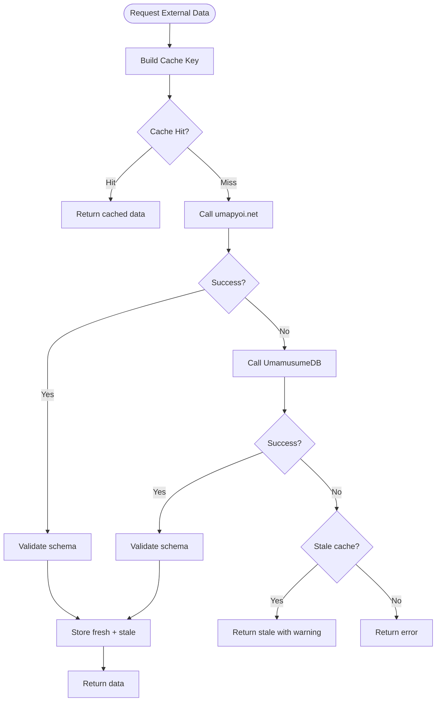
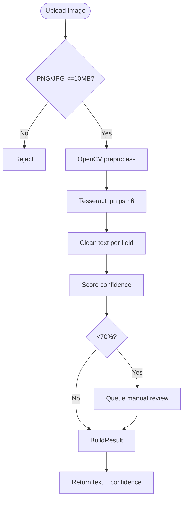
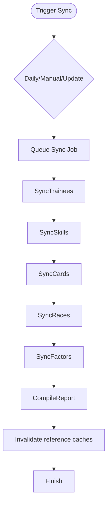
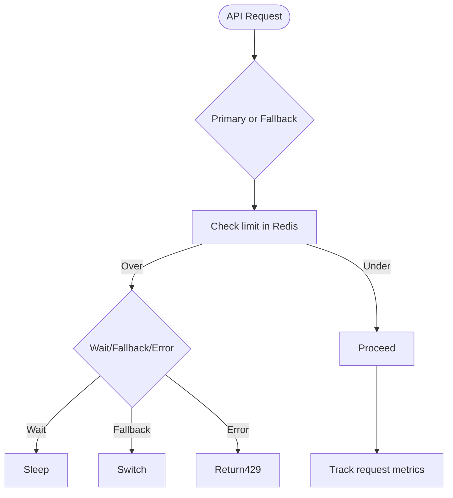
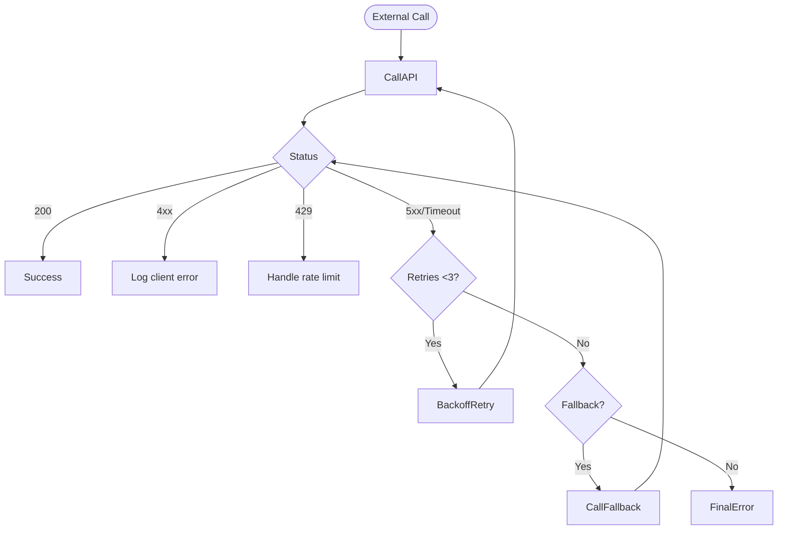
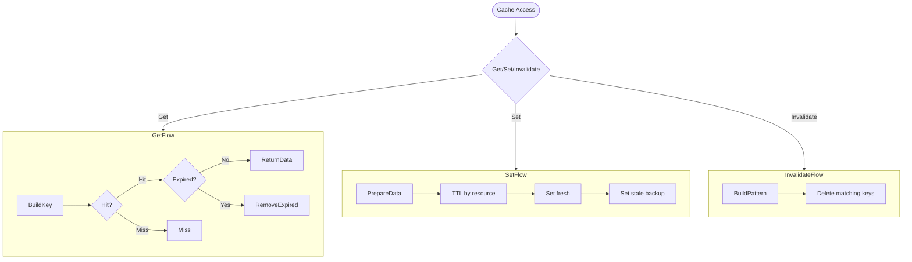
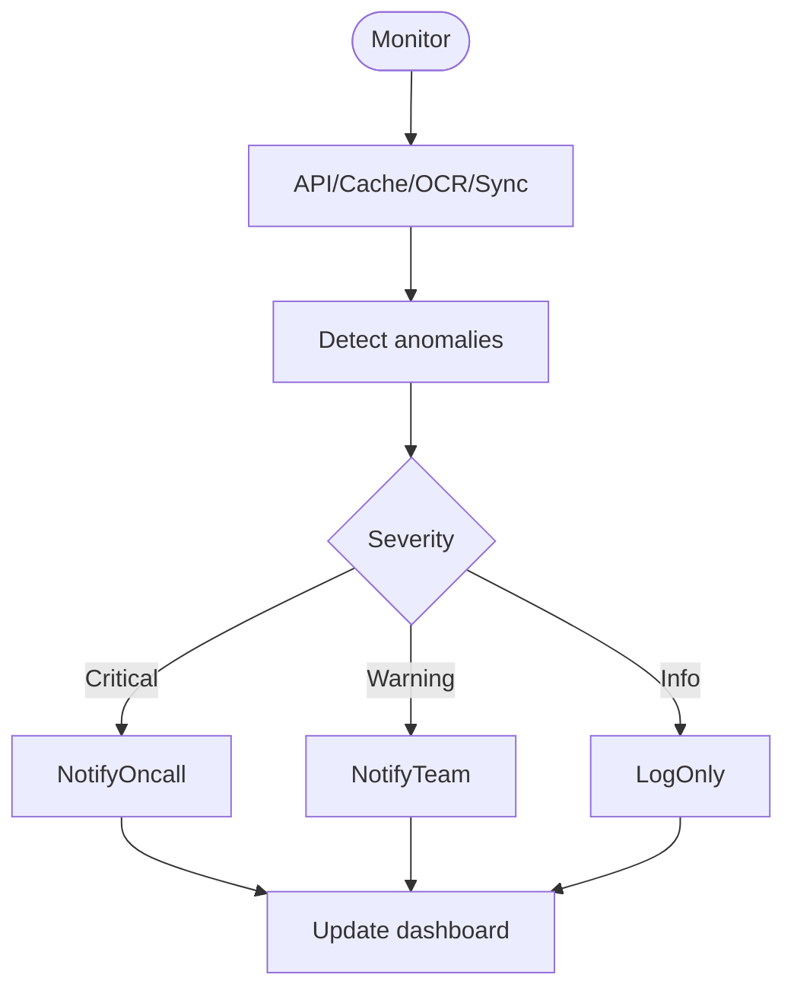

# FLOW-007: External Integration System Flow

## Umamusume Pretty Derby Career Planner

**Document Version**: 1.0
**Date**: January 14, 2026
**Related Documents**: [PRD-007], [SPEC-007]

---

## 1. API Integration & Fallback Flow

---

## 2. OCR Screenshot Analysis Flow

---

## 3. Data Synchronization Flow

---

## 4. Rate Limiting & Throttling Flow

---

## 5. Error Handling & Retry Logic Flow

---

## 6. Cache Management Flow

---

## 7. Monitoring & Alerting Flow

---

**Phase 3A Restored**: All 7 flow diagrams recreated.
