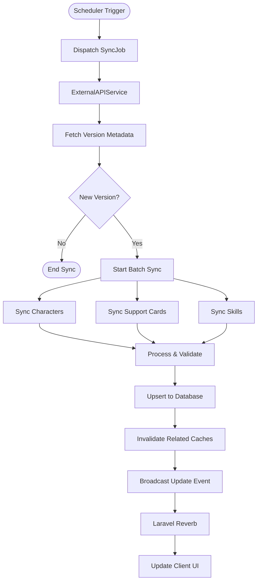
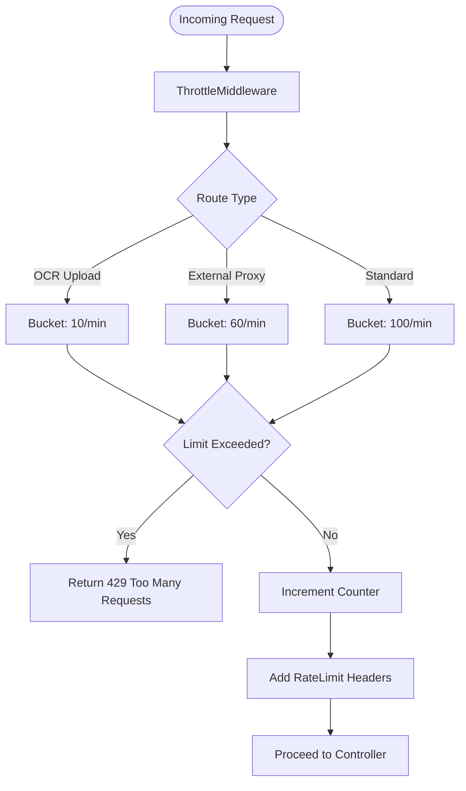

# FLOW-007: External Integration System Flow

## Umamusume Pretty Derby Career Planner

**Document Version**: 2.1.0
**Date**: January 24, 2026
**Project**: UmamusumeCareerPlanner
**Author**: Development Team
**Status**: Current - Aligned with codebase v2.0.0

---

## 1. External API Data Retrieval Flow

This flow illustrates how `ExternalAPIService` handles data requests using a Circuit Breaker pattern to ensure resilience when communicating with `umapyoi.net` and `umamusumedb.com`.

```mermaid
flowchart TD
    Start([Request Data]) --> CheckCache{Check Cache}
    
    CheckCache -->|Hit| ReturnCache[Return Cached Response]
    CheckCache -->|Miss| CheckCircuit{Circuit Breaker State}
    
    CheckCircuit -->|Open| TryFallback[Try Fallback API]
    CheckCircuit -->|Closed| CallPrimary[Call umapyoi.net]
    CheckCircuit -->|Half-Open| ProbeCall[Probe Primary API]
    
    ProbeCall --> CallPrimary
    
    CallPrimary --> Response{Response Code}
    
    Response -->|200 OK| ValidateData[Validate Schema]
    Response -->|429/5xx| RecordFailure[Record Failure]
    
    RecordFailure --> CheckThreshold{Failure > Threshold?}
    CheckThreshold -->|Yes| TripCircuit[Open Circuit]
    CheckThreshold -->|No| TryFallback
    
    TripCircuit --> TryFallback
    
    TryFallback --> FallbackResponse{Fallback Success?}
    
    FallbackResponse -->|Yes| ValidateData
    FallbackResponse -->|No| ReturnStale{Stale Cache Available?}
    
    ReturnStale -->|Yes| ReturnCacheWarning[Return Stale + Warning]
    ReturnStale -->|No| ReturnError[Throw ServiceUnavailable]
    
    ValidateData --> StoreCache[Store in Redis (24h TTL)]
    StoreCache --> StoreDB[Sync to Database]
    StoreDB --> ReturnData[Return Fresh Data]
```

---

## 2. OCR Screenshot Analysis Flow

The workflow for processing user-uploaded screenshots via `OCRService`, converting image data into structured game statistics.

```mermaid
flowchart TD
    Start([User Uploads Image]) --> ValidateFile[Validate MIME/Size]
    
    ValidateFile -->|Invalid| ReturnError[Return Validation Error]
    ValidateFile -->|Valid| Preprocess[Image Preprocessing (GD)]
    
    Preprocess --> Resize[Resize/Normalize]
    Resize --> Grayscale[Grayscale Conversion]
    Grayscale --> Threshold[Adaptive Thresholding]
    
    Threshold --> OCR[Tesseract Engine]
    OCR --> ExtractText[Raw Text Extraction]
    
    ExtractText --> Parse[OCRParserService]
    Parse --> PatternMatch[Regex Pattern Matching]
    
    PatternMatch --> ValidateContent[OCRValidationService]
    ValidateContent --> ScoreConf[Calculate Confidence Score]
    
    ScoreConf --> CheckConf{Confidence > 80%?}
    
    CheckConf -->|Yes| AutoMap[Auto-Map to Fields]
    CheckConf -->|No| FlagReview[Flag for Manual Review]
    
    AutoMap --> ReturnPreview[Return JSON Preview]
    FlagReview --> ReturnPreview
    
    ReturnPreview --> UserConfirm{User Confirms?}
    
    UserConfirm -->|Yes| Persist[Save to Character]
    UserConfirm -->|Edit| UpdateData[Update Values]
    UpdateData --> Persist
    UserConfirm -->|Cancel| Discard[Discard Data]
```

---

## 3. Data Synchronization Flow

Background synchronization process managed by Laravel Scheduler and Event system to keep local databases in sync with external sources.



---

## 4. Rate Limiting & Throttling Flow

Middleware-based flow to protect external resources and internal processing capacity.



---

## 5. Cache Management Flow

Logic for managing the lifecycle of cached external data in Redis.

```mermaid
flowchart TD
    Start([Access Data]) --> GenKey[Generate Cache Key]
    
    GenKey --> CheckRedis{Exists in Redis?}
    
    CheckRedis -->|Yes| CheckTTL{TTL Expired?}
    
    CheckTTL -->|No| ReturnData[Return Data]
    CheckTTL -->|Yes| Refresh[Trigger Background Refresh]
    Refresh --> ReturnData
    
    CheckRedis -->|No| FetchSource[Fetch from Source]
    
    FetchSource --> Store[Store in Redis]
    Store --> SetTTL[Set TTL (24h)]
    SetTTL --> ReturnData
    
    subgraph InvalidationStrategy
        UpdateEvent[Data Update Event] --> FindKeys[Find Related Keys]
        FindKeys --> DeleteKeys[Delete/Tag Invalidation]
    end
```

---

## 6. Circuit Breaker State Flow

State transition logic for the resilience mechanism in `ExternalAPIService`.

```mermaid
stateDiagram-v2
    [*] --> Closed
    
    state Closed {
        [*] --> Monitoring
        Monitoring --> Failure: Request Failed
        Failure --> Monitoring: Count < Threshold
        Failure --> Open: Count >= Threshold
    }
    
    state Open {
        [*] --> Rejecting
        Rejecting --> HalfOpen: Timeout Expired
        Rejecting --> Rejecting: Request Blocked
    }
    
    state HalfOpen {
        [*] --> Probing
        Probing --> Closed: Success
        Probing --> Open: Failure
    }
```

---

## Document Control

| Version | Date | Author | Changes |
|---------|------|--------|---------|
| 2.1.0 | 2026-01-24 | Development Team | Updated to align with v2.0.0 codebase, Circuit Breaker implementation, and OCR pipeline details |
| 1.0.0 | 2026-01-14 | Development Team | Initial flow definitions |

---

## Related Documents

- [PRD-007: External Integration](../prds/PRD-007_External_Integration.md)
- [SPEC-007: External Integration Technical](../specs/SPEC-007_External_Integration_Technical.md)
- [008_SIS: Software Integration Specs](../008_SIS_Software_Integration_Specifications.md)
