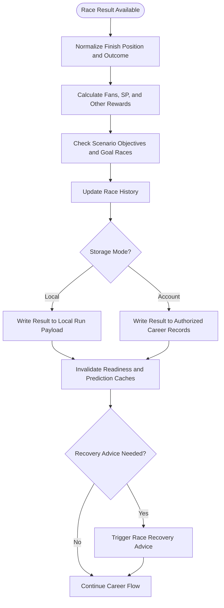
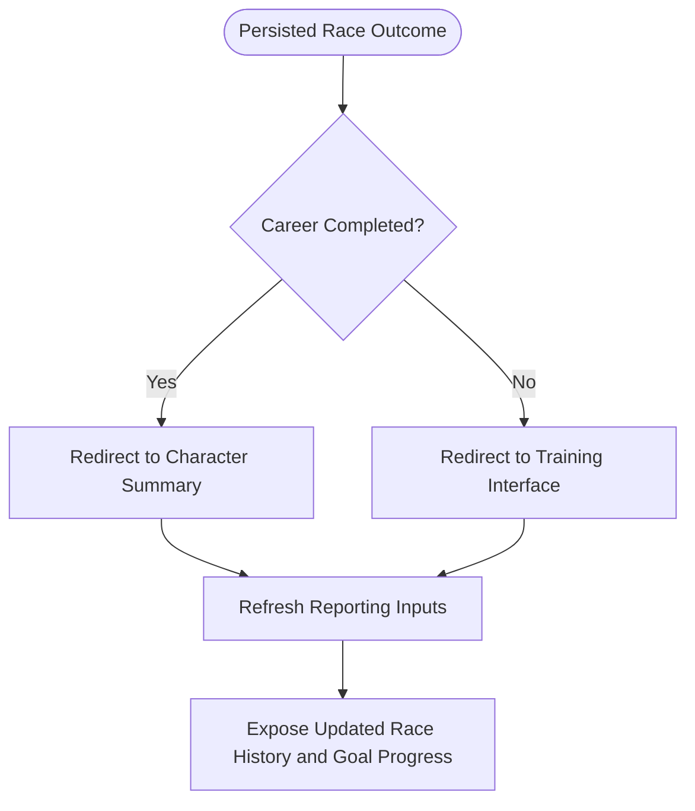

# FLOW-008: Race Entry and Result System Flow

## Umamusume Pretty Derby Career Planner

**Document Version**: 1.1.0
**Date**: March 10, 2026
**Project**: UmamusumeCareerPlanner
**Author**: Development Team
**Status**: Current - Repository aligned with race entry route, policy checks, and dual storage expectations

---

## 1. Overview

This flow documents the end-to-end race entry lifecycle, including readiness validation,
authorization, StorageMode-aware persistence, result recording, and post-race reporting updates.

Repository-aligned note: the explicit server-side entry route is `POST
/characters/{character}/races/{gameRace}/enter`, implemented by `RaceController::enter()` and
guarded by `CharacterPolicy::update()`. Local mode should preserve the same readiness and result
semantics inside UUID-oriented browser state, even when the persistence path is not a database-
backed route.

---

## 2. Race Entry Flow

```mermaid
flowchart TD
    Start([User Chooses Race Entry]) --> SelectRace[Select Target Race]
    SelectRace --> CheckMode{Storage Mode?}

    CheckMode -->|Account| RouteEntry[POST /characters/{character}/races/{gameRace}/enter]
    CheckMode -->|Local| LoadLocalRun[Load Local Run Payload by UUID]

    RouteEntry --> PolicyCheck[Authorize Character Update]
    PolicyCheck --> LoadAccountContext[Load Character and Race Context]
    LoadLocalRun --> LoadLocalContext[Load Local Character and Race Context]

    LoadAccountContext --> Readiness[Calculate Readiness Score]
    LoadLocalContext --> Readiness
    Readiness --> Strategy[Evaluate Recommended Strategy]
    Strategy --> Confirm{Enter Race?}

    Confirm -->|No| ReturnCalendar[Return to Race Calendar]
    Confirm -->|Yes| Execute[Execute Race Entry]

    Execute --> PersistEntry{Persist Entry Boundary}
    PersistEntry -->|Local| SaveLocalEntry[Persist Race Entry in Local Run Payload]
    PersistEntry -->|Account| SaveAccountEntry[Persist Race Entry in Authorized Career State]

    SaveLocalEntry --> Simulate[Simulate Race Result]
    SaveAccountEntry --> Simulate
```

> **Simulation Note**: The `Simulate Race Result` step models a planner-estimated outcome. In a career planning tool the "race" is the real game session the user plays; the planner records the user-reported actual result after the fact. Simulated results are planning aids and are not the authoritative outcome.

```text
[User Chooses Race Entry]
  -> [Select Target Race]
  -> {Storage Mode?}
     Local
       -> [Load Local Run Payload by UUID]
       -> [Load Local Character and Race Context]
     Account
       -> [POST /characters/{character}/races/{gameRace}/enter]
       -> [Authorize Character Update]
       -> [Load Character and Race Context]
  -> [Calculate Readiness Score]
  -> [Evaluate Recommended Strategy]
  -> {Enter Race?}
     No -> [Return to Race Calendar]
     Yes
       -> [Execute Race Entry]
       -> {Persist Entry Boundary}
          Local -> [Persist Race Entry in Local Run Payload]
          Account -> [Persist Race Entry in Authorized Career State]
       -> [Simulate Race Result]
```

### 2.1 Notes

- Account mode must pass ownership and authorization checks before any race-entry write occurs.
- Local mode uses the UUID-scoped browser payload and active session context as the write boundary.
- Readiness calculation and strategic evaluation should remain behaviorally consistent across both modes.

---

## 3. Result Recording Flow



```text
[Race Result Available]
  -> [Normalize Finish Position and Outcome]
  -> [Calculate Fans, SP, and Other Rewards]
  -> [Check Scenario Objectives and Goal Races]
  -> [Update Race History]
  -> {Storage Mode?}
     Local -> [Write Result to Local Run Payload]
     Account -> [Write Result to Authorized Career Records]
  -> [Invalidate Readiness and Prediction Caches]
  -> {Recovery Advice Needed?}
     Yes -> [Trigger Race Recovery Advice]
     No -> [Continue Career Flow]
```

### 3.1 Result Recording Notes

- Account mode writes use the `Race` model. Key persisted fields include `finish_position` (integer,
1-based) and `won_race` (boolean, true when `finish_position = 1`).
- Both fields are used downstream by career reporting and goal-progress checks.
- Local mode stores the same field semantics in the UUID-scoped run payload.

---

## 4. Post-Race Redirect and Reporting Flow



```text
[Persisted Race Outcome]
  -> {Career Completed?}
     Yes -> [Redirect to Character Summary]
     No -> [Redirect to Training Interface]
  -> [Refresh Reporting Inputs]
  -> [Expose Updated Race History and Goal Progress]
```

### 4.1 Reporting Implications

- Race results should be available to downstream career reporting and goal-progress views after persistence completes.
- Account-mode reporting reads from authorized database-backed career relationships.
- Local-mode reporting should derive from the current UUID-scoped run payload until the user
explicitly migrates that run into an account-backed record.

---

## Document Control

| Version | Date | Author | Changes |
| --- | --- | --- | --- |
| 1.1.0 | 2026-03-10 | Development Team | Added simulation vs actual clarification note; added Section 3.1 documenting Race model fields (finish_position, won_race). |
| 1.0.0 | 2026-03-08 | Development Team | Initial repository-aligned race entry and result flow covering route-level authorization, StorageMode-aware persistence, and post-race reporting behavior. |

---

## Related Documents

- [FLOW-003: Race Strategy System](../01-flows/FLOW-003_Race_Strategy_System.md)
- [PRD-003: Race Strategy](../02-prds/PRD-003_Race_Strategy.md)
- [SPEC-003: Race Strategy Technical](../02-specs/SPEC-003_Race_Strategy_Technical.md)
- [docs/01-diagrams/system-process-flow-diagrams.md](../01-diagrams/system-process-flow-diagrams.md)
