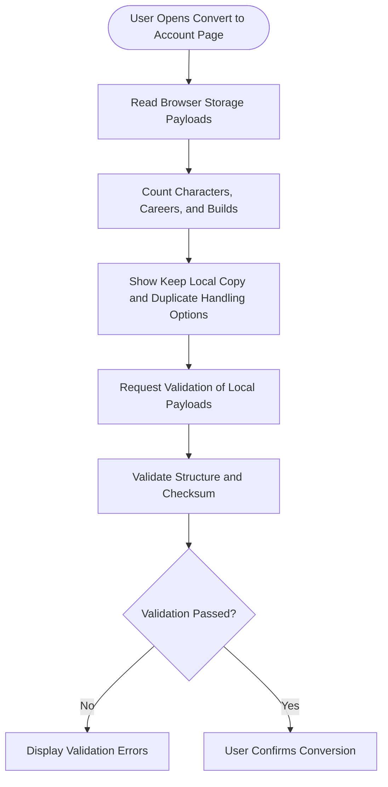
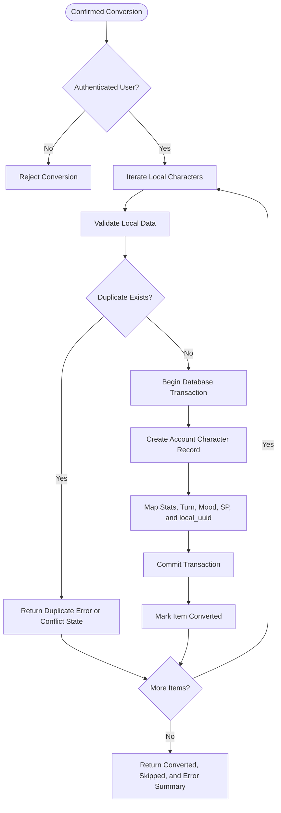
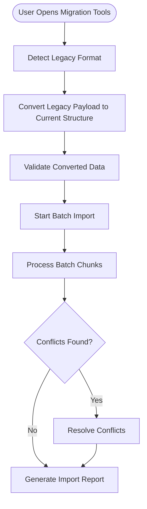
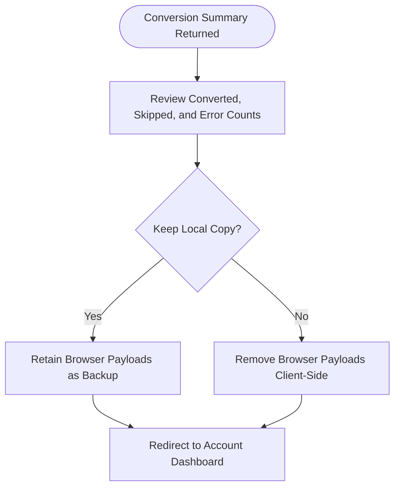

# FLOW-009: Storage Migration System Flow

## Umamusume Pretty Derby Career Planner

**Document Version**: 2.4.2
**Date**: April 7, 2026
**Project**: UmamusumeCareerPlanner
**Author**: Development Team
**Status**: Current - Repository aligned with LocalStorageService and migration interfaces

---

## 1. Overview

This flow documents how Local mode run data is migrated into Account mode records without breaking
UUID-based browser workflows or authenticated ownership guarantees.

Repository-aligned note: local-to-account conversion is modeled primarily through the local
conversion UI, `LocalStorageController`, and `LocalStorageService`. The generic
`MigrationController` and `DataMigrationService` remain relevant for legacy-format conversion and
batch import workflows, but they are not the only migration boundary in the application.

---

## 2. Local Conversion Preparation Flow



```text
[User Opens Convert to Account Page]
  -> [Read Browser Storage Payloads]
  -> [Count Characters, Careers, and Builds]
  -> [Show Keep Local Copy and Duplicate Handling Options]
  -> [Request Validation of Local Payloads]
  -> [Validate Structure and Checksum]
  -> {Validation Passed?}
     No -> [Display Validation Errors]
     Yes -> [User Confirms Conversion]
```

### 2.1 Notes

- Local browser payloads remain UUID-oriented before conversion.
- Validation protects the conversion boundary before any database-backed record is created.
- The local conversion UI may offer client-side post-conversion cleanup, but the server-side
responsibility is the authenticated persistence step.
- The local conversion page is accessible from the data management hub at `/local-data`.

---

## 3. Local-to-Account Conversion Flow



```text
[Confirmed Conversion]
  -> {Authenticated User?}
     No -> [Reject Conversion]
     Yes -> [Iterate Local Characters]
  -> [Validate Local Data]
  -> {Duplicate Exists?}
     Yes -> [Return Duplicate Error or Conflict State]
     No
       -> [Begin Database Transaction]
       -> [Create Account Character Record]
       -> [Map Stats, Turn, Mood, SP, and local_uuid]
       -> [Commit Transaction]
       -> [Mark Item Converted]
  -> {More Items?}
     Yes -> [Iterate Local Characters]
     No -> [Return Converted, Skipped, and Error Summary]
```

### 3.1 Persistence Notes

- The current server-side conversion path stores the originating local UUID on the created account-
backed character record.
- Duplicate detection currently checks the authenticated user's existing character set before
insert. The check uses character name and scenario type as the conflict key; if a local UUID already
appears on an existing account record, that item is also skipped.
- Conversion is transaction-bound per item so partial failures can be reported cleanly.

---

## 4. Legacy and Batch Migration Flow



```text
[User Opens Migration Tools]
  -> [Detect Legacy Format]
  -> [Convert Legacy Payload to Current Structure]
  -> [Validate Converted Data]
  -> [Start Batch Import]
  -> [Process Batch Chunks]
  -> {Conflicts Found?}
     Yes -> [Resolve Conflicts]
     No -> [Generate Import Report]
```

### 4.1 Scope Boundary

- Use the local conversion flow when migrating browser-managed Local mode data into the authenticated account.
- Use the legacy and batch migration flow when importing older exported formats or external
structured payloads that are not simply current browser-state promotion.

---

## 5. Post-Conversion Outcome Flow



```text
[Conversion Summary Returned]
  -> [Review Converted, Skipped, and Error Counts]
  -> {Keep Local Copy?}
     Yes -> [Retain Browser Payloads as Backup]
     No -> [Remove Browser Payloads Client-Side]
  -> [Redirect to Account Dashboard]
```

---

## Document Control

| Version | Date | Author | Changes |
| --- | --- | --- | --- |
| 2.4.2 | 2026-04-07 | Development Team | Synchronized suite-wide documentation metadata and preserved verified storage migration flow behavior. |
| 1.1.0 | 2026-03-10 | Development Team | Clarified duplicate detection criteria (name + scenario type + existing local_uuid check); added /local-data UI path reference to Section 2. |
| 1.0.0 | 2026-03-08 | Development Team | Initial repository-aligned storage migration flow covering LocalStorageService conversion, duplicate detection, transaction boundaries, and the separate legacy batch migration path. |

---

## Related Documents

- [FLOW-001: Character Management System](../01-flows/FLOW-001_Character_Management_System.md)
- [FLOW-008: Race Entry and Result System](../01-flows/FLOW-008_Race_Entry_and_Result_System.md)
- [docs/01-diagrams/data-flow-diagram.md](../01-diagrams/data-flow-diagram.md)
- [docs/00-core-docs/010_SCD_Source_Code_Documentation.md](../00-core-docs/010_SCD_Source_Code_Documentation.md)
