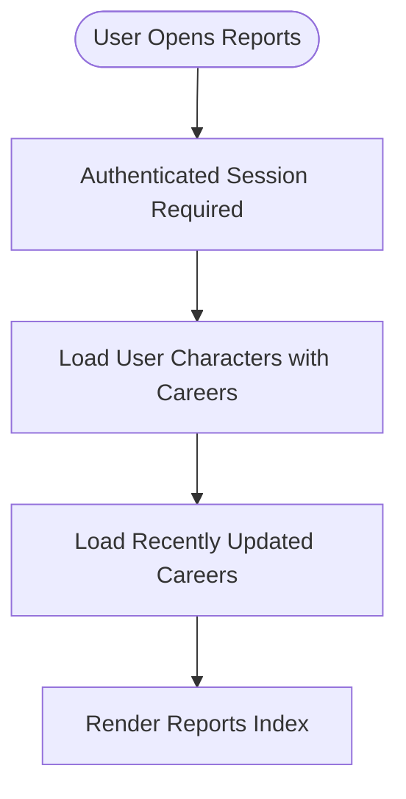
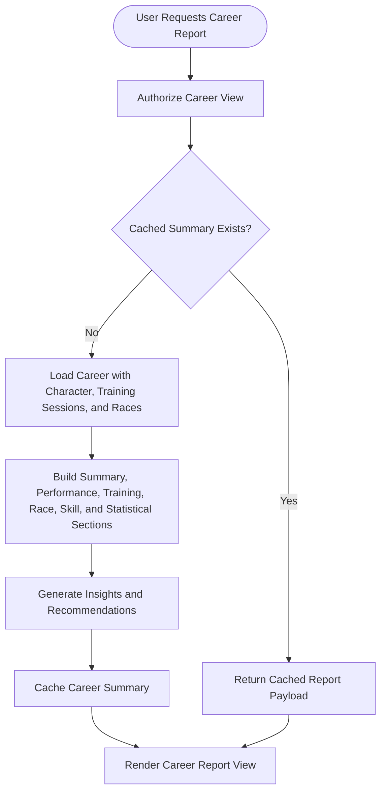
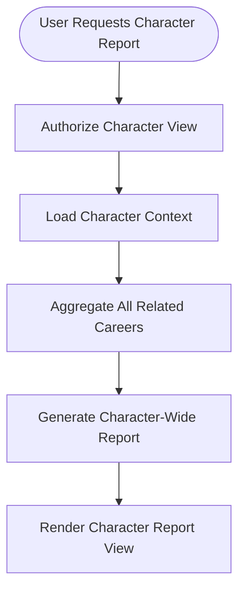
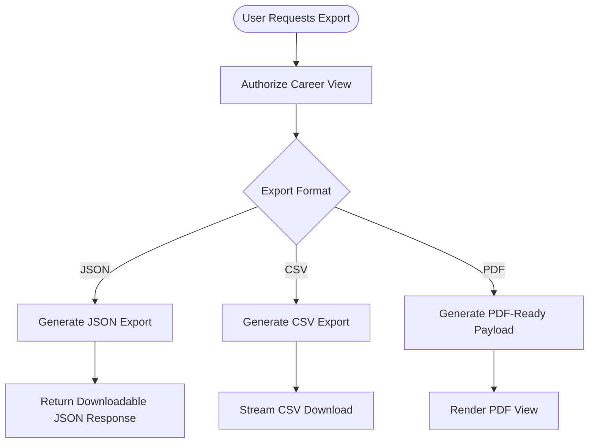
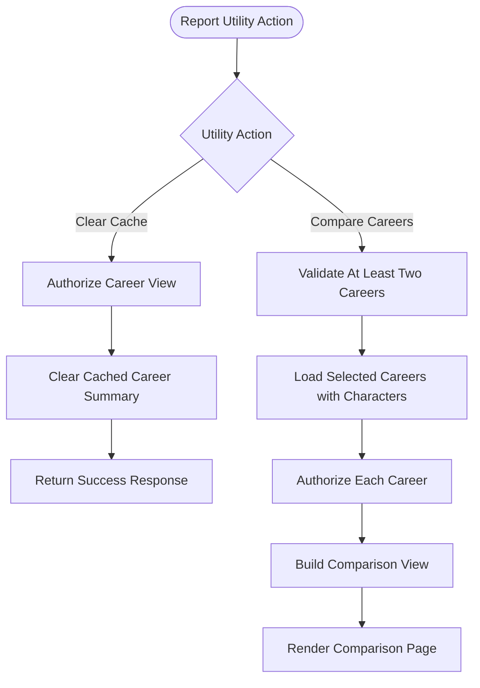

# FLOW-010: Reporting System Flow

## Umamusume Pretty Derby Career Planner

**Document Version**: 1.1.0
**Date**: March 10, 2026
**Project**: UmamusumeCareerPlanner
**Author**: Development Team
**Status**: Current - Repository aligned with `CareerReportController` and `CareerReportingService`

---

## 1. Overview

This flow documents the transition from persisted career and race data into user-facing reports,
report exports, and cache invalidation.

Repository-aligned note: the current reporting surface is account-mode and policy-guarded. Report
generation is served through `CareerReportController` and `CareerReportingService`, using
`CareerPolicy` and `CharacterPolicy` to enforce ownership boundaries before summary, character-wide,
comparison, and export actions are executed.

---

## 2. Reports Index Flow

The reports index presents the authenticated user with a list of their characters and recently
updated careers, serving as the entry point for all report generation and export actions.



```text
[User Opens Reports]
  -> [Authenticated Session Required]
  -> [Load User Characters with Careers]
  -> [Load Recently Updated Careers]
  -> [Render Reports Index]
```

---

## 3. Career Report Generation Flow



```text
[User Requests Career Report]
  -> [Authorize Career View]
  -> {Cached Summary Exists?}
     Yes -> [Return Cached Report Payload]
     No
       -> [Load Career with Character, Training Sessions, and Races]
       -> [Build Summary, Performance, Training, Race, Skill, and Statistical Sections]
       -> [Generate Insights and Recommendations]
       -> [Cache Career Summary]
  -> [Render Career Report View]
```

### 3.1 Scope Note

- Career reports are generated from persisted account-mode records.
- Local UUID-oriented runs are not currently served through these controller routes and should be
migrated before relying on the reporting UI.

---

## 4. Character Report Flow



```text
[User Requests Character Report]
  -> [Authorize Character View]
  -> [Load Character Context]
  -> [Aggregate All Related Careers]
  -> [Generate Character-Wide Report]
  -> [Render Character Report View]
```

---

## 5. Export Flow



> **PDF Export Status**: PDF export renders a Blade view formatted for print/PDF. Full server-side PDF generation (e.g., via headless Chrome or wkhtmltopdf) is not currently implemented; the rendered view is intended for browser print-to-PDF by the user.

```text
[User Requests Export]
  -> [Authorize Career View]
  -> {Export Format}
     JSON -> [Generate JSON Export] -> [Return Downloadable JSON Response]
     CSV -> [Generate CSV Export] -> [Stream CSV Download]
     PDF -> [Generate PDF-Ready Payload] -> [Render PDF View]
```

---

## 6. Cache Invalidation and Comparison Flow



```text
[Report Utility Action]
  -> {Utility Action}
     Clear Cache
       -> [Authorize Career View]
       -> [Clear Cached Career Summary]
       -> [Return Success Response]
     Compare Careers
       -> [Validate At Least Two Careers]
       -> [Load Selected Careers with Characters]
       -> [Authorize Each Career]
       -> [Build Comparison View]
       -> [Render Comparison Page]
```

---

## 7. Reporting Inputs and Upstream Dependencies

- Race results, training sessions, and current career state must already be persisted before the
reporting pipeline can generate stable outputs.
- Post-race updates documented in `FLOW-008` become reporting inputs once they are written to the
account-backed career record.
- Career report caching reduces repeated computation, and explicit cache-clear actions allow
administrators or users to refresh stale summaries after major updates.

---

## Document Control

| Version | Date | Author | Changes |
| --- | --- | --- | --- |
| 1.1.0 | 2026-03-10 | Development Team | Added section description to Reports Index Flow; added PDF export status note clarifying browser print-to-PDF approach vs server-side generation. |
| 1.0.0 | 2026-03-08 | Development Team | Initial repository-aligned reporting flow covering index, summary generation, character reports, exports, comparison, and cache invalidation. |

---

## Related Documents

- [FLOW-008: Race Entry and Result System](../01-flows/FLOW-008_Race_Entry_and_Result_System.md)
- [FLOW-009: Storage Migration System](../01-flows/FLOW-009_Storage_Migration_System.md)
- [docs/00-core-docs/004_SDS_Software_Design_Specifications.md](../00-core-
docs/004_SDS_Software_Design_Specifications.md)
- [docs/00-core-docs/010_SCD_Source_Code_Documentation.md](../00-core-docs/010_SCD_Source_Code_Documentation.md)
