# SEQUENCE DIAGRAMS: Critical Interaction Flows

**Document Version**: 2.0.0 | **Date**: January 24, 2026 | **Status**: Production-Aligned

## Overview

Sequence diagrams document the detailed interactions between system components during critical operations in the Umamusume Pretty Derby Career Planner v2.0.0. These diagrams show message flows, timing, and dependencies for key workflows in the Laravel 12 application with AI integration, MCP services, and external API interactions.

---

## Table of Contents

1. [Character Management Sequences](#character-management-sequences)
2. [Training Optimization Sequences](#training-optimization-sequences)
3. [Race Strategy Sequences](#race-strategy-sequences)
4. [Skill Management Sequences](#skill-management-sequences)
5. [Support Card Sequences](#support-card-sequences)
6. [AI Advisory Sequences](#ai-advisory-sequences)
7. [External Integration Sequences](#external-integration-sequences)
8. [Data Management Sequences](#data-management-sequences)
9. [System Operations Sequences](#system-operations-sequences)

---

## Character Management Sequences

### SD-001: Character Creation Flow

**Duration**: ~500ms (including database operations)  
**Critical Path**: Form validation → Database inserts → Event dispatch → Response

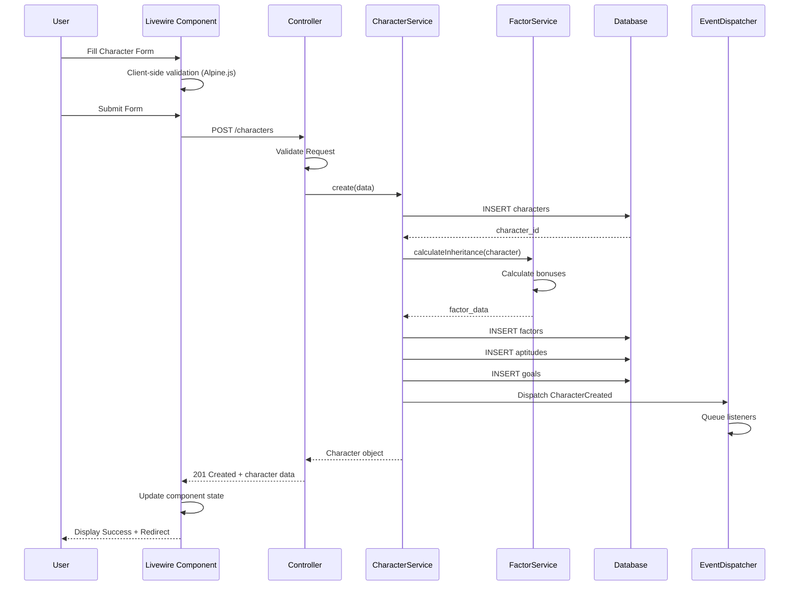
```mermaid
sequenceDiagram
    participant User
    participant UI as Livewire Component
    participant Controller
    participant CharacterService
    participant FactorService
    participant Database
    participant EventDispatcher

    User->>UI: Fill Character Form
    UI->>UI: Client-side validation (Alpine.js)
    User->>UI: Submit Form
    UI->>Controller: POST /characters
    Controller->>Controller: Validate Request
    Controller->>CharacterService: create(data)
    
    CharacterService->>Database: INSERT characters
    Database-->>CharacterService: character_id
    
    CharacterService->>FactorService: calculateInheritance(character)
    FactorService->>FactorService: Calculate bonuses
    FactorService-->>CharacterService: factor_data
    
    CharacterService->>Database: INSERT factors
    CharacterService->>Database: INSERT aptitudes
    CharacterService->>Database: INSERT goals
    
    CharacterService->>EventDispatcher: Dispatch CharacterCreated
    EventDispatcher->>EventDispatcher: Queue listeners
    
    CharacterService-->>Controller: Character object
    Controller-->>UI: 201 Created + character data
    UI->>UI: Update component state
    UI-->>User: Display Success + Redirect
```

**Related Documents:**

- PRD: [PRD-001](../prds/PRD-001_Character_Management.md)
- SPEC: [SPEC-001](../specs/SPEC-001_Character_Management_Technical.md)
- Flow: [FLOW-001](../flows/FLOW-001_Character_Management_System.md)
- Tech Flow: [TECH-FLOW-001](../tech-flow/TECH-FLOW-001_Character_Management_Flow.md)
- Wireframe: [WF-002](../wireframes/WF-002_Character_Creation_Wizard.md)

---

## Training Optimization Sequences

### SD-002: Training Prediction & Selection

**Duration**: ~200ms (with caching) | ~1.2s (cache miss)  
**Parallel Operations**: Prediction calculation + Cache management

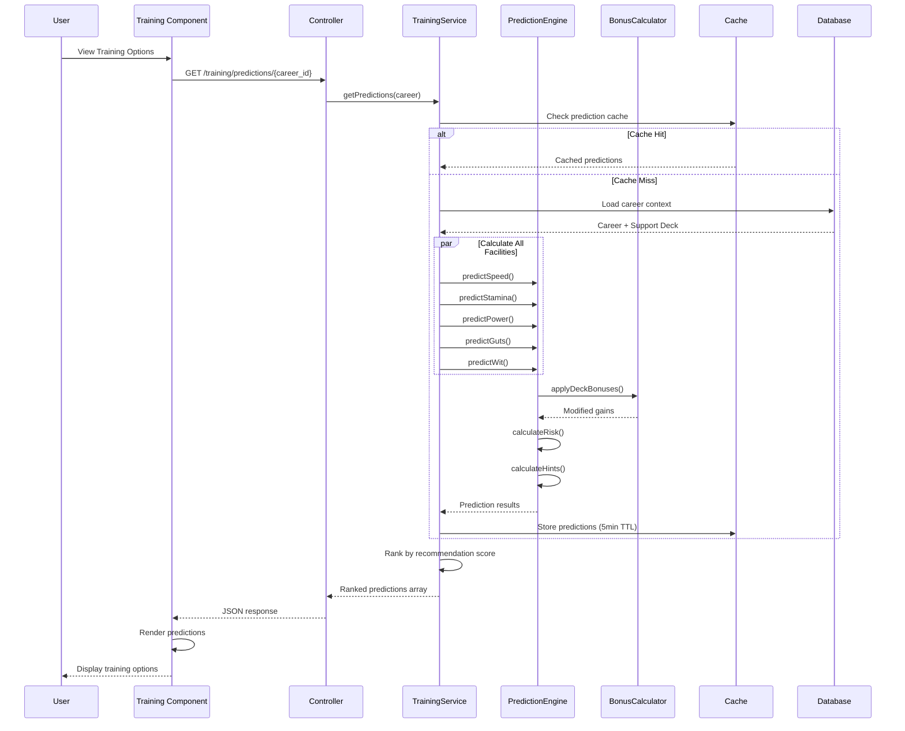
```mermaid
sequenceDiagram
    participant User
    participant Livewire as Training Component
    participant Controller
    participant TrainingService
    participant PredictionEngine
    participant BonusCalculator
    participant Cache
    participant Database

    User->>Livewire: View Training Options
    Livewire->>Controller: GET /training/predictions/{career_id}
    Controller->>TrainingService: getPredictions(career)
    
    TrainingService->>Cache: Check prediction cache
    alt Cache Hit
        Cache-->>TrainingService: Cached predictions
    else Cache Miss
        TrainingService->>Database: Load career context
        Database-->>TrainingService: Career + Support Deck
        
        par Calculate All Facilities
            TrainingService->>PredictionEngine: predictSpeed()
            TrainingService->>PredictionEngine: predictStamina()
            TrainingService->>PredictionEngine: predictPower()
            TrainingService->>PredictionEngine: predictGuts()
            TrainingService->>PredictionEngine: predictWit()
        end
        
        PredictionEngine->>BonusCalculator: applyDeckBonuses()
        BonusCalculator-->>PredictionEngine: Modified gains
        PredictionEngine->>PredictionEngine: calculateRisk()
        PredictionEngine->>PredictionEngine: calculateHints()
        PredictionEngine-->>TrainingService: Prediction results
        
        TrainingService->>Cache: Store predictions (5min TTL)
    end
    
    TrainingService->>TrainingService: Rank by recommendation score
    TrainingService-->>Controller: Ranked predictions array
    Controller-->>Livewire: JSON response
    Livewire->>Livewire: Render predictions
    Livewire-->>User: Display training options
```

**Related Documents:**

- PRD: [PRD-002](../prds/PRD-002_Training_Optimization.md)
- SPEC: [SPEC-002](../specs/SPEC-002_Training_Optimization_Technical.md)
- Flow: [FLOW-002](../flows/FLOW-002_Training_Optimization_System.md)
- Tech Flow: [TECH-FLOW-002](../tech-flow/TECH-FLOW-002_Training_Optimization_Flow.md)
- Wireframe: [WF-004](../wireframes/WF-004_Training_Selection_Interface.md)

### SD-003: Training Execution & State Update

**Duration**: ~300ms  
**Transaction Scope**: Database writes + Event dispatch

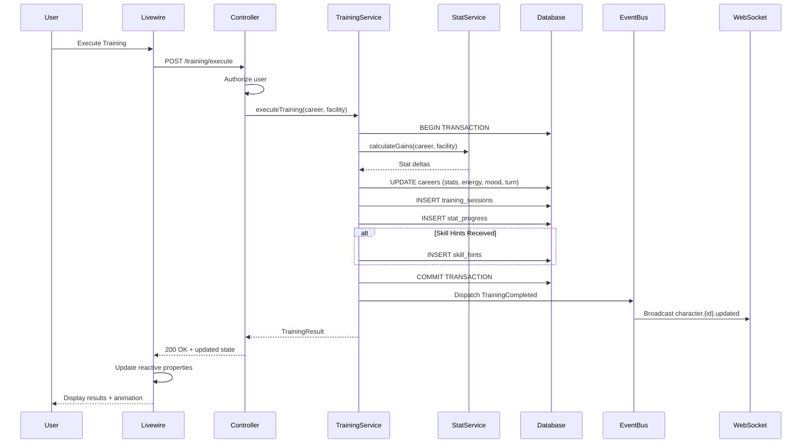
```mermaid
sequenceDiagram
    participant User
    participant Livewire
    participant Controller
    participant TrainingService
    participant StatService
    participant Database
    participant EventBus
    participant WebSocket

    User->>Livewire: Execute Training
    Livewire->>Controller: POST /training/execute
    Controller->>Controller: Authorize user
    Controller->>TrainingService: executeTraining(career, facility)
    
    TrainingService->>Database: BEGIN TRANSACTION
    
    TrainingService->>StatService: calculateGains(career, facility)
    StatService-->>TrainingService: Stat deltas
    
    TrainingService->>Database: UPDATE careers (stats, energy, mood, turn)
    TrainingService->>Database: INSERT training_sessions
    TrainingService->>Database: INSERT stat_progress
    
    alt Skill Hints Received
        TrainingService->>Database: INSERT skill_hints
    end
    
    TrainingService->>Database: COMMIT TRANSACTION
    
    TrainingService->>EventBus: Dispatch TrainingCompleted
    EventBus->>WebSocket: Broadcast character.{id}.updated
    
    TrainingService-->>Controller: TrainingResult
    Controller-->>Livewire: 200 OK + updated state
    Livewire->>Livewire: Update reactive properties
    Livewire-->>User: Display results + animation
```

**Related Documents:**

- Sequence: [SEQ-002](SEQ-002_Training_Block_Resolution.md)
- Wireframe: [WF-005](../wireframes/WF-005_Training_Result_Screen.md)

---

## Race Strategy Sequences

### SD-004: Race Preparation & Analysis

**Duration**: ~400ms  
**Complexity**: Multi-factor readiness calculation

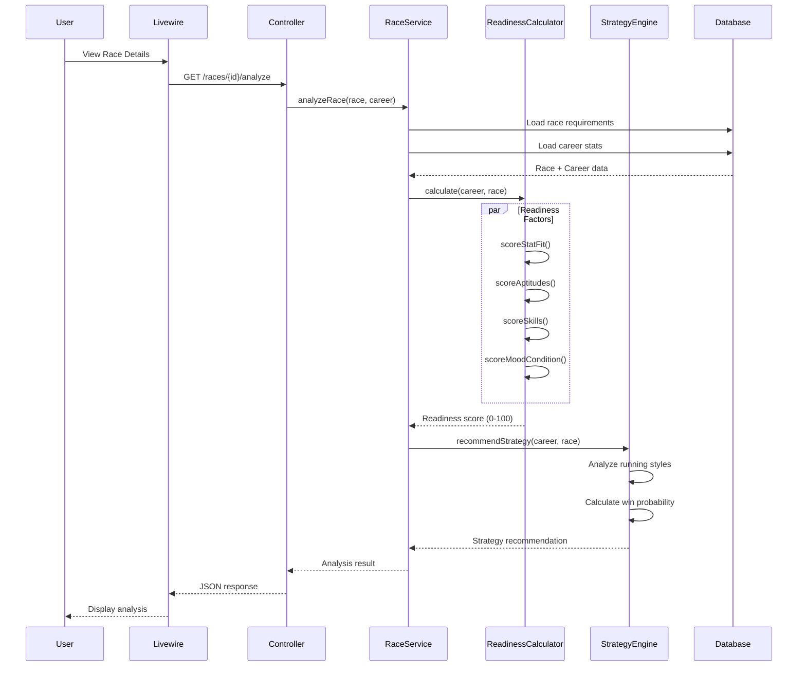
```mermaid
sequenceDiagram
    participant User
    participant Livewire
    participant Controller
    participant RaceService
    participant ReadinessCalculator
    participant StrategyEngine
    participant Database

    User->>Livewire: View Race Details
    Livewire->>Controller: GET /races/{id}/analyze
    Controller->>RaceService: analyzeRace(race, career)
    
    RaceService->>Database: Load race requirements
    RaceService->>Database: Load career stats
    Database-->>RaceService: Race + Career data
    
    RaceService->>ReadinessCalculator: calculate(career, race)
    
    par Readiness Factors
        ReadinessCalculator->>ReadinessCalculator: scoreStatFit()
        ReadinessCalculator->>ReadinessCalculator: scoreAptitudes()
        ReadinessCalculator->>ReadinessCalculator: scoreSkills()
        ReadinessCalculator->>ReadinessCalculator: scoreMoodCondition()
    end
    
    ReadinessCalculator-->>RaceService: Readiness score (0-100)
    
    RaceService->>StrategyEngine: recommendStrategy(career, race)
    StrategyEngine->>StrategyEngine: Analyze running styles
    StrategyEngine->>StrategyEngine: Calculate win probability
    StrategyEngine-->>RaceService: Strategy recommendation
    
    RaceService-->>Controller: Analysis result
    Controller-->>Livewire: JSON response
    Livewire-->>User: Display analysis
```

**Related Documents:**

- PRD: [PRD-003](../prds/PRD-003_Race_Strategy.md)
- SPEC: [SPEC-003](../specs/SPEC-003_Race_Strategy_Technical.md)
- Flow: [FLOW-003](../flows/FLOW-003_Race_Strategy_System.md)
- Wireframe: [WF-007](../wireframes/WF-007_Race_Preparation_Screen.md)

### SD-005: Race Execution & Result Recording

**Duration**: ~350ms  
**Sequential**: Result validation → Character update → Database writes

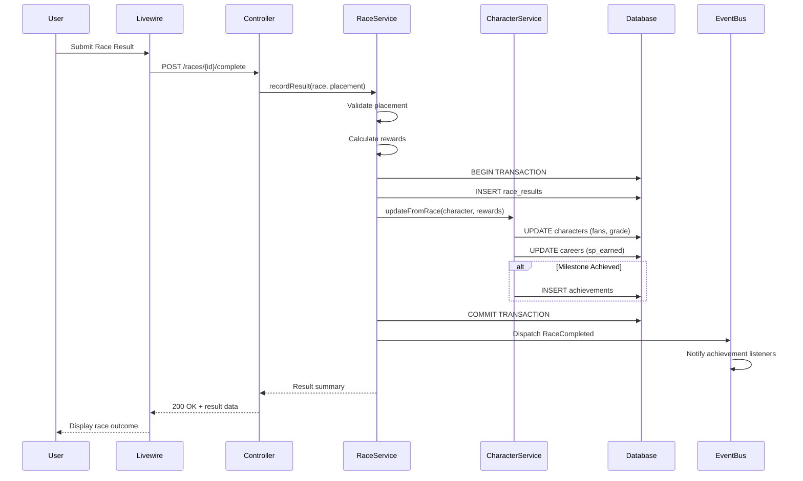
```mermaid
sequenceDiagram
    participant User
    participant Livewire
    participant Controller
    participant RaceService
    participant CharacterService
    participant Database
    participant EventBus

    User->>Livewire: Submit Race Result
    Livewire->>Controller: POST /races/{id}/complete
    Controller->>RaceService: recordResult(race, placement)
    
    RaceService->>RaceService: Validate placement
    RaceService->>RaceService: Calculate rewards
    
    RaceService->>Database: BEGIN TRANSACTION
    
    RaceService->>Database: INSERT race_results
    RaceService->>CharacterService: updateFromRace(character, rewards)
    
    CharacterService->>Database: UPDATE characters (fans, grade)
    CharacterService->>Database: UPDATE careers (sp_earned)
    
    alt Milestone Achieved
        CharacterService->>Database: INSERT achievements
    end
    
    RaceService->>Database: COMMIT TRANSACTION
    
    RaceService->>EventBus: Dispatch RaceCompleted
    EventBus->>EventBus: Notify achievement listeners
    
    RaceService-->>Controller: Result summary
    Controller-->>Livewire: 200 OK + result data
    Livewire-->>User: Display race outcome
```

**Related Documents:**

- Sequence: [SEQ-004](SEQ-004_Race_Registration_and_Outcome.md)

---

## Skill Management Sequences

### SD-006: Skill Acquisition with Hint Calculation

**Duration**: ~350ms  
**Key Logic**: Hint discount calculation + Evolution path check

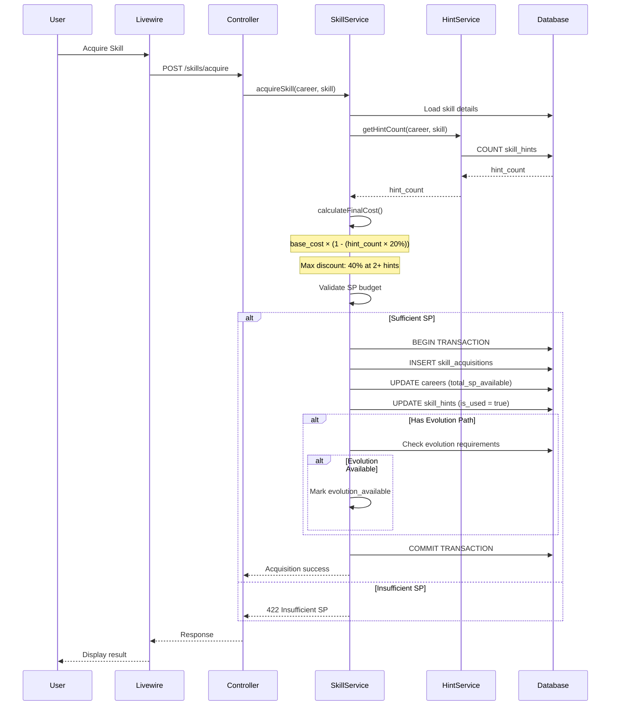
```mermaid
sequenceDiagram
    participant User
    participant Livewire
    participant Controller
    participant SkillService
    participant HintService
    participant Database

    User->>Livewire: Acquire Skill
    Livewire->>Controller: POST /skills/acquire
    Controller->>SkillService: acquireSkill(career, skill)
    
    SkillService->>Database: Load skill details
    SkillService->>HintService: getHintCount(career, skill)
    HintService->>Database: COUNT skill_hints
    Database-->>HintService: hint_count
    HintService-->>SkillService: hint_count
    
    SkillService->>SkillService: calculateFinalCost()
    Note over SkillService: base_cost × (1 - (hint_count × 20%))
    Note over SkillService: Max discount: 40% at 2+ hints
    
    SkillService->>SkillService: Validate SP budget
    
    alt Sufficient SP
        SkillService->>Database: BEGIN TRANSACTION
        SkillService->>Database: INSERT skill_acquisitions
        SkillService->>Database: UPDATE careers (total_sp_available)
        SkillService->>Database: UPDATE skill_hints (is_used = true)
        
        alt Has Evolution Path
            SkillService->>Database: Check evolution requirements
            alt Evolution Available
                SkillService->>SkillService: Mark evolution_available
            end
        end
        
        SkillService->>Database: COMMIT TRANSACTION
        SkillService-->>Controller: Acquisition success
    else Insufficient SP
        SkillService-->>Controller: 422 Insufficient SP
    end
    
    Controller-->>Livewire: Response
    Livewire-->>User: Display result
```

**Related Documents:**

- PRD: [PRD-004](../prds/PRD-004_Skill_Management.md)
- SPEC: [SPEC-004](../specs/SPEC-004_Skill_Management_Technical.md)
- Flow: [FLOW-004](../flows/FLOW-004_Skill_Management_System.md)
- Wireframe: [WF-008](../wireframes/WF-008_Skill_Shop_Interface.md)

### SD-007: Skill Evolution Process

**Duration**: ~250ms  
**Operation**: Atomic skill replacement

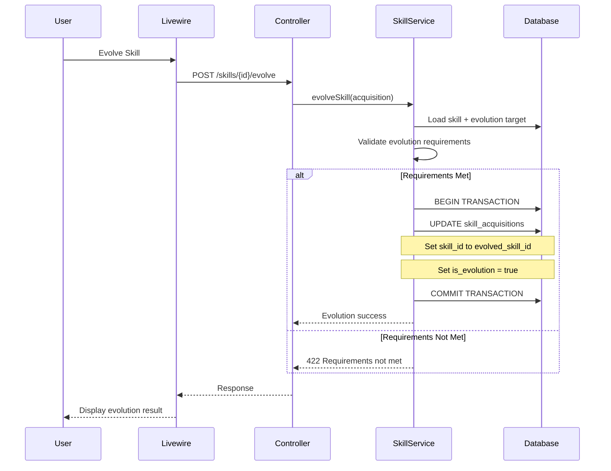
```mermaid
sequenceDiagram
    participant User
    participant Livewire
    participant Controller
    participant SkillService
    participant Database

    User->>Livewire: Evolve Skill
    Livewire->>Controller: POST /skills/{id}/evolve
    Controller->>SkillService: evolveSkill(acquisition)
    
    SkillService->>Database: Load skill + evolution target
    SkillService->>SkillService: Validate evolution requirements
    
    alt Requirements Met
        SkillService->>Database: BEGIN TRANSACTION
        
        SkillService->>Database: UPDATE skill_acquisitions
        Note over SkillService,Database: Set skill_id to evolved_skill_id
        Note over SkillService,Database: Set is_evolution = true
        
        SkillService->>Database: COMMIT TRANSACTION
        SkillService-->>Controller: Evolution success
    else Requirements Not Met
        SkillService-->>Controller: 422 Requirements not met
    end
    
    Controller-->>Livewire: Response
    Livewire-->>User: Display evolution result
```

**Related Documents:**

- Sequence: [SEQ-003](SEQ-003_Skill_Acquisition_and_Upgrade.md)

---

## Support Card Sequences

### SD-008: Support Deck Validation & Composition

**Duration**: ~200ms  
**Validation**: 6-card constraint + Type balance

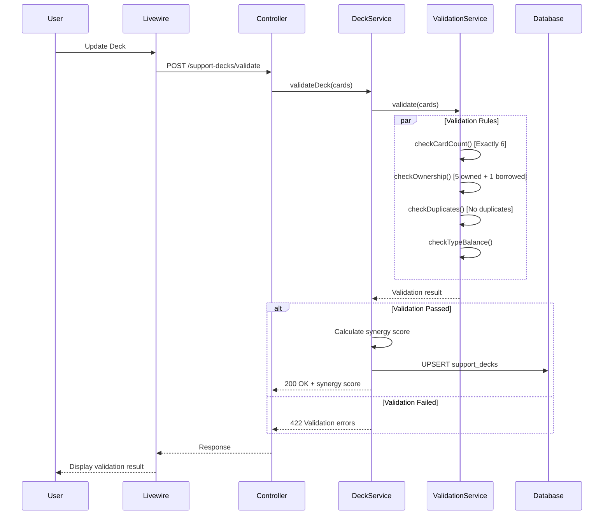
```mermaid
sequenceDiagram
    participant User
    participant Livewire
    participant Controller
    participant DeckService
    participant ValidationService
    participant Database

    User->>Livewire: Update Deck
    Livewire->>Controller: POST /support-decks/validate
    Controller->>DeckService: validateDeck(cards)
    
    DeckService->>ValidationService: validate(cards)
    
    par Validation Rules
        ValidationService->>ValidationService: checkCardCount() [Exactly 6]
        ValidationService->>ValidationService: checkOwnership() [5 owned + 1 borrowed]
        ValidationService->>ValidationService: checkDuplicates() [No duplicates]
        ValidationService->>ValidationService: checkTypeBalance()
    end
    
    ValidationService-->>DeckService: Validation result
    
    alt Validation Passed
        DeckService->>DeckService: Calculate synergy score
        DeckService->>Database: UPSERT support_decks
        DeckService-->>Controller: 200 OK + synergy score
    else Validation Failed
        DeckService-->>Controller: 422 Validation errors
    end
    
    Controller-->>Livewire: Response
    Livewire-->>User: Display validation result
```

**Related Documents:**

- PRD: [PRD-005](../prds/PRD-005_Support_Card_Management.md)
- SPEC: [SPEC-005](../specs/SPEC-005_Support_Card_Management_Technical.md)
- Flow: [FLOW-005](../flows/FLOW-005_Support_Card_Management_System.md)
- Wireframe: [WF-011](../wireframes/WF-011_Support_Deck_Builder.md)

---

## AI Advisory Sequences

### SD-009: Hybrid AI Recommendation Flow

**Duration**: ~2.5s (with Ollama) | ~4s (with Bedrock fallback)  
**Complexity Routing**: Simple → Ollama | Complex → Bedrock

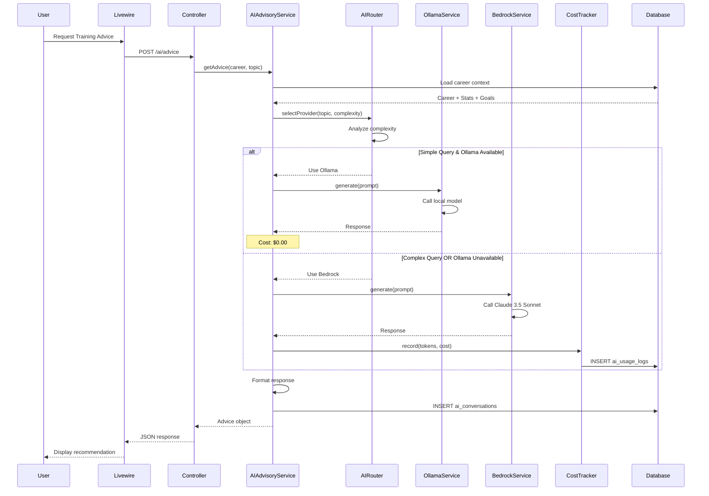
```mermaid
sequenceDiagram
    participant User
    participant Livewire
    participant Controller
    participant AIAdvisoryService
    participant AIRouter
    participant OllamaService
    participant BedrockService
    participant CostTracker
    participant Database

    User->>Livewire: Request Training Advice
    Livewire->>Controller: POST /ai/advice
    Controller->>AIAdvisoryService: getAdvice(career, topic)
    
    AIAdvisoryService->>Database: Load career context
    Database-->>AIAdvisoryService: Career + Stats + Goals
    
    AIAdvisoryService->>AIRouter: selectProvider(topic, complexity)
    AIRouter->>AIRouter: Analyze complexity
    
    alt Simple Query & Ollama Available
        AIRouter-->>AIAdvisoryService: Use Ollama
        AIAdvisoryService->>OllamaService: generate(prompt)
        OllamaService->>OllamaService: Call local model
        OllamaService-->>AIAdvisoryService: Response
        Note over AIAdvisoryService: Cost: $0.00
    else Complex Query OR Ollama Unavailable
        AIRouter-->>AIAdvisoryService: Use Bedrock
        AIAdvisoryService->>BedrockService: generate(prompt)
        BedrockService->>BedrockService: Call Claude 3.5 Sonnet
        BedrockService-->>AIAdvisoryService: Response
        AIAdvisoryService->>CostTracker: record(tokens, cost)
        CostTracker->>Database: INSERT ai_usage_logs
    end
    
    AIAdvisoryService->>AIAdvisoryService: Format response
    AIAdvisoryService->>Database: INSERT ai_conversations
    
    AIAdvisoryService-->>Controller: Advice object
    Controller-->>Livewire: JSON response
    Livewire-->>User: Display recommendation
```

**Related Documents:**

- PRD: [PRD-006](../prds/PRD-006_AI_Advisory.md)
- SPEC: [SPEC-006](../specs/SPEC-006_AI_Advisory_Technical.md)
- Flow: [FLOW-006](../flows/FLOW-006_AI_Advisory_System.md)
- Tech Flow: [TECH-FLOW-006](../tech-flow/TECH-FLOW-006_AI_Advisory_Flow.md)
- Wireframe: [WF-012](../wireframes/WF-012_AI_Advisor_Interface.md)

### SD-010: MCP Tool Execution

**Duration**: ~500ms  
**MCP Integration**: Server lifecycle + Tool routing

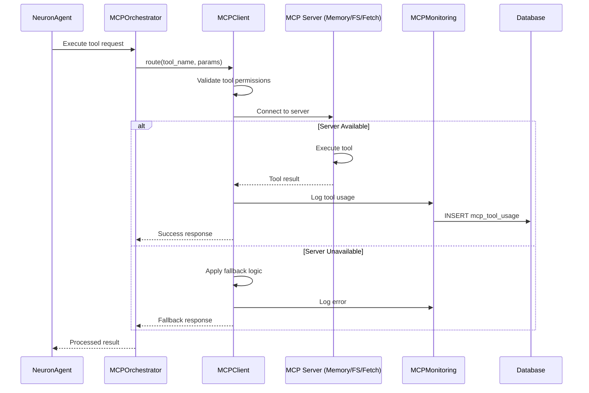
```mermaid
sequenceDiagram
    participant NeuronAgent
    participant MCPOrchestrator
    participant MCPClient
    participant MCPServer as MCP Server (Memory/FS/Fetch)
    participant MCPMonitoring
    participant Database

    NeuronAgent->>MCPOrchestrator: Execute tool request
    MCPOrchestrator->>MCPClient: route(tool_name, params)
    
    MCPClient->>MCPClient: Validate tool permissions
    MCPClient->>MCPServer: Connect to server
    
    alt Server Available
        MCPServer->>MCPServer: Execute tool
        MCPServer-->>MCPClient: Tool result
        
        MCPClient->>MCPMonitoring: Log tool usage
        MCPMonitoring->>Database: INSERT mcp_tool_usage
        
        MCPClient-->>MCPOrchestrator: Success response
    else Server Unavailable
        MCPClient->>MCPClient: Apply fallback logic
        MCPClient->>MCPMonitoring: Log error
        MCPClient-->>MCPOrchestrator: Fallback response
    end
    
    MCPOrchestrator-->>NeuronAgent: Processed result
```

**Related Documents:**

- Sequence: [SEQ-006](SEQ-006_AI_Advice_Generation.md)
- Config: `config/mcp.php`, `config/mcp_tools.php`

---

## External Integration Sequences

### SD-011: External API Sync with Circuit Breaker

**Duration**: ~300ms (success) | ~100ms (cached fallback)  
**Resilience**: Circuit breaker pattern + Cache fallback

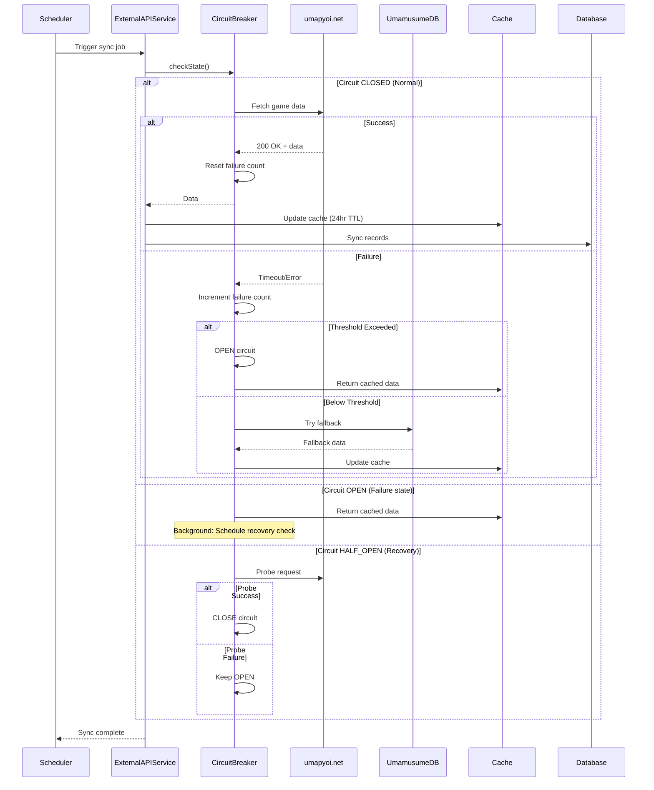
```mermaid
sequenceDiagram
    participant Scheduler
    participant ExternalAPIService
    participant CircuitBreaker
    participant PrimaryAPI as umapyoi.net
    participant FallbackAPI as UmamusumeDB
    participant Cache
    participant Database

    Scheduler->>ExternalAPIService: Trigger sync job
    ExternalAPIService->>CircuitBreaker: checkState()
    
    alt Circuit CLOSED (Normal)
        CircuitBreaker->>PrimaryAPI: Fetch game data
        
        alt Success
            PrimaryAPI-->>CircuitBreaker: 200 OK + data
            CircuitBreaker->>CircuitBreaker: Reset failure count
            CircuitBreaker-->>ExternalAPIService: Data
            ExternalAPIService->>Cache: Update cache (24hr TTL)
            ExternalAPIService->>Database: Sync records
        else Failure
            PrimaryAPI-->>CircuitBreaker: Timeout/Error
            CircuitBreaker->>CircuitBreaker: Increment failure count
            
            alt Threshold Exceeded
                CircuitBreaker->>CircuitBreaker: OPEN circuit
                CircuitBreaker->>Cache: Return cached data
            else Below Threshold
                CircuitBreaker->>FallbackAPI: Try fallback
                FallbackAPI-->>CircuitBreaker: Fallback data
                CircuitBreaker->>Cache: Update cache
            end
        end
        
    else Circuit OPEN (Failure state)
        CircuitBreaker->>Cache: Return cached data
        Note over CircuitBreaker: Background: Schedule recovery check
    else Circuit HALF_OPEN (Recovery)
        CircuitBreaker->>PrimaryAPI: Probe request
        alt Probe Success
            CircuitBreaker->>CircuitBreaker: CLOSE circuit
        else Probe Failure
            CircuitBreaker->>CircuitBreaker: Keep OPEN
        end
    end
    
    ExternalAPIService-->>Scheduler: Sync complete
```

**Related Documents:**

- PRD: [PRD-007](../prds/PRD-007_External_Integration.md)
- SPEC: [SPEC-007](../specs/SPEC-007_External_Integration_Technical.md)
- Flow: [FLOW-007](../flows/FLOW-007_External_Integration_System.md)
- Tech Flow: [TECH-FLOW-007](../tech-flow/TECH-FLOW-007_External_Integration_Flow.md)

### SD-012: OCR Screenshot Processing

**Duration**: ~3s (preprocessing + extraction + validation)  
**Pipeline**: Upload → Preprocess → OCR → Parse → Validate

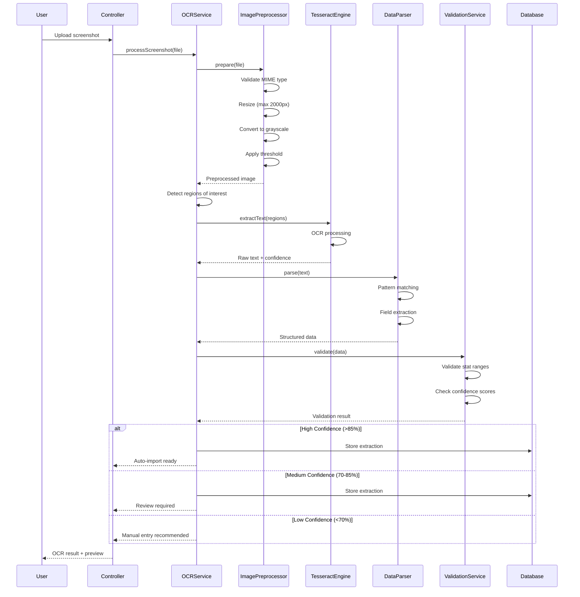
```mermaid
sequenceDiagram
    participant User
    participant Controller
    participant OCRService
    participant ImagePreprocessor
    participant TesseractEngine
    participant DataParser
    participant ValidationService
    participant Database

    User->>Controller: Upload screenshot
    Controller->>OCRService: processScreenshot(file)
    
    OCRService->>ImagePreprocessor: prepare(file)
    ImagePreprocessor->>ImagePreprocessor: Validate MIME type
    ImagePreprocessor->>ImagePreprocessor: Resize (max 2000px)
    ImagePreprocessor->>ImagePreprocessor: Convert to grayscale
    ImagePreprocessor->>ImagePreprocessor: Apply threshold
    ImagePreprocessor-->>OCRService: Preprocessed image
    
    OCRService->>OCRService: Detect regions of interest
    
    OCRService->>TesseractEngine: extractText(regions)
    TesseractEngine->>TesseractEngine: OCR processing
    TesseractEngine-->>OCRService: Raw text + confidence
    
    OCRService->>DataParser: parse(text)
    DataParser->>DataParser: Pattern matching
    DataParser->>DataParser: Field extraction
    DataParser-->>OCRService: Structured data
    
    OCRService->>ValidationService: validate(data)
    ValidationService->>ValidationService: Validate stat ranges
    ValidationService->>ValidationService: Check confidence scores
    ValidationService-->>OCRService: Validation result
    
    alt High Confidence (>85%)
        OCRService->>Database: Store extraction
        OCRService-->>Controller: Auto-import ready
    else Medium Confidence (70-85%)
        OCRService->>Database: Store extraction
        OCRService-->>Controller: Review required
    else Low Confidence (<70%)
        OCRService-->>Controller: Manual entry recommended
    end
    
    Controller-->>User: OCR result + preview
```

**Related Documents:**

- Sequence: [SEQ-007](SEQ-007_External_Data_Sync.md)
- User Flow: [UF-008](../user-flows/UF-008_OCR_and_Data_Import_Flow.md)

---

## Data Management Sequences

### SD-013: Data Import with Conflict Resolution

**Duration**: ~2s for 50 records  
**Conflict Handling**: Skip | Overwrite | Merge | Rename

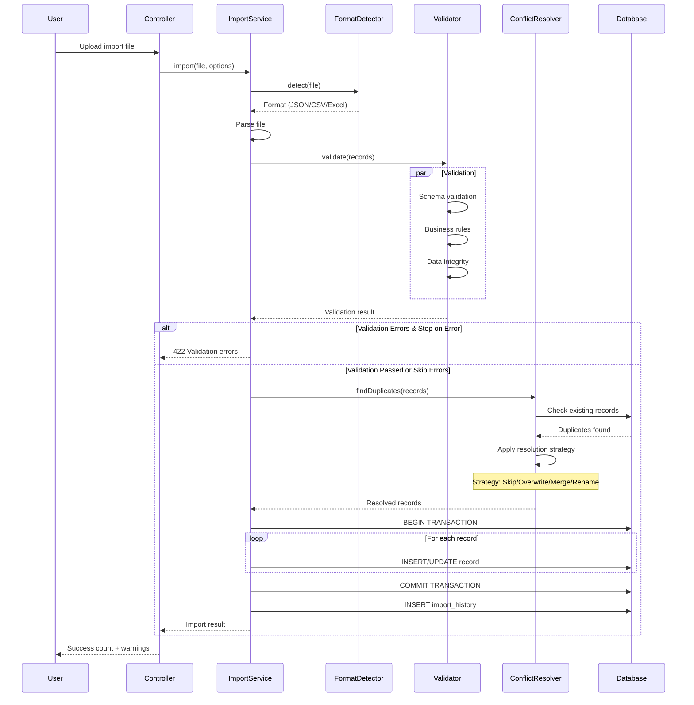
```mermaid
sequenceDiagram
    participant User
    participant Controller
    participant ImportService
    participant FormatDetector
    participant Validator
    participant ConflictResolver
    participant Database

    User->>Controller: Upload import file
    Controller->>ImportService: import(file, options)
    
    ImportService->>FormatDetector: detect(file)
    FormatDetector-->>ImportService: Format (JSON/CSV/Excel)
    
    ImportService->>ImportService: Parse file
    ImportService->>Validator: validate(records)
    
    par Validation
        Validator->>Validator: Schema validation
        Validator->>Validator: Business rules
        Validator->>Validator: Data integrity
    end
    
    Validator-->>ImportService: Validation result
    
    alt Validation Errors & Stop on Error
        ImportService-->>Controller: 422 Validation errors
    else Validation Passed or Skip Errors
        ImportService->>ConflictResolver: findDuplicates(records)
        ConflictResolver->>Database: Check existing records
        Database-->>ConflictResolver: Duplicates found
        
        ConflictResolver->>ConflictResolver: Apply resolution strategy
        Note over ConflictResolver: Strategy: Skip/Overwrite/Merge/Rename
        
        ConflictResolver-->>ImportService: Resolved records
        
        ImportService->>Database: BEGIN TRANSACTION
        
        loop For each record
            ImportService->>Database: INSERT/UPDATE record
        end
        
        ImportService->>Database: COMMIT TRANSACTION
        
        ImportService->>Database: INSERT import_history
        ImportService-->>Controller: Import result
    end
    
    Controller-->>User: Success count + warnings
```

**Related Documents:**

- DMP: [005_DMP](../005_DMP_Data_Migration_Plan.md)
- Tech Flow: [TECH-FLOW-007](../tech-flow/TECH-FLOW-007_External_Integration_Flow.md)

### SD-014: Data Export Generation

**Duration**: ~5s for 1000 records (Excel) | ~1s (JSON)  
**Format Support**: JSON | Excel | CSV

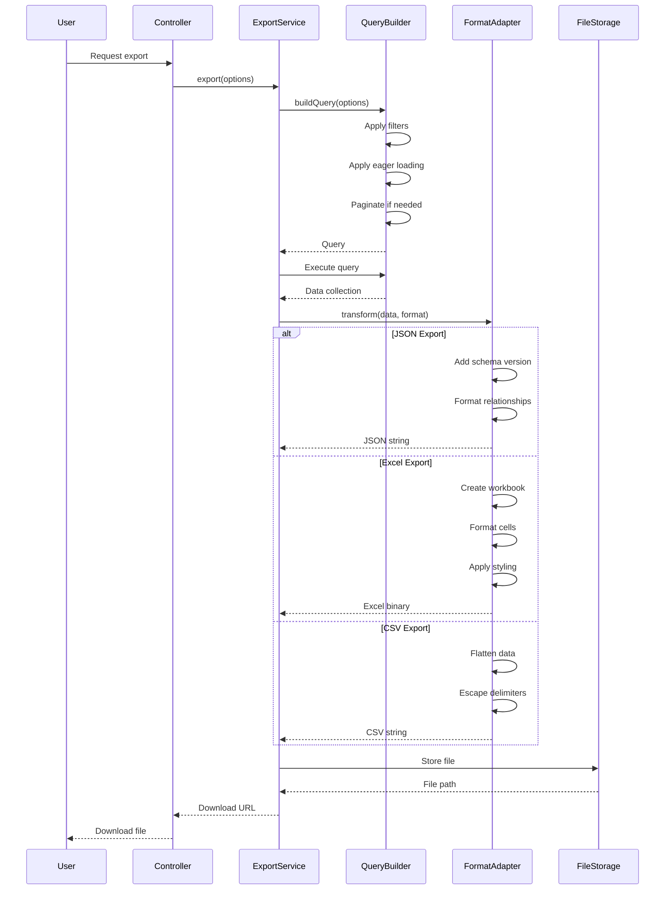
```mermaid
sequenceDiagram
    participant User
    participant Controller
    participant ExportService
    participant QueryBuilder
    participant FormatAdapter
    participant FileStorage

    User->>Controller: Request export
    Controller->>ExportService: export(options)
    
    ExportService->>QueryBuilder: buildQuery(options)
    QueryBuilder->>QueryBuilder: Apply filters
    QueryBuilder->>QueryBuilder: Apply eager loading
    QueryBuilder->>QueryBuilder: Paginate if needed
    QueryBuilder-->>ExportService: Query
    
    ExportService->>QueryBuilder: Execute query
    QueryBuilder-->>ExportService: Data collection
    
    ExportService->>FormatAdapter: transform(data, format)
    
    alt JSON Export
        FormatAdapter->>FormatAdapter: Add schema version
        FormatAdapter->>FormatAdapter: Format relationships
        FormatAdapter-->>ExportService: JSON string
    else Excel Export
        FormatAdapter->>FormatAdapter: Create workbook
        FormatAdapter->>FormatAdapter: Format cells
        FormatAdapter->>FormatAdapter: Apply styling
        FormatAdapter-->>ExportService: Excel binary
    else CSV Export
        FormatAdapter->>FormatAdapter: Flatten data
        FormatAdapter->>FormatAdapter: Escape delimiters
        FormatAdapter-->>ExportService: CSV string
    end
    
    ExportService->>FileStorage: Store file
    FileStorage-->>ExportService: File path
    
    ExportService-->>Controller: Download URL
    Controller-->>User: Download file
```

**Related Documents:**

- DMP: [005_DMP](../005_DMP_Data_Migration_Plan.md)

### SD-015: Backup and Restore

**Duration**: ~10s (backup) | ~15s (restore)  
**Scope**: Full database backup with metadata

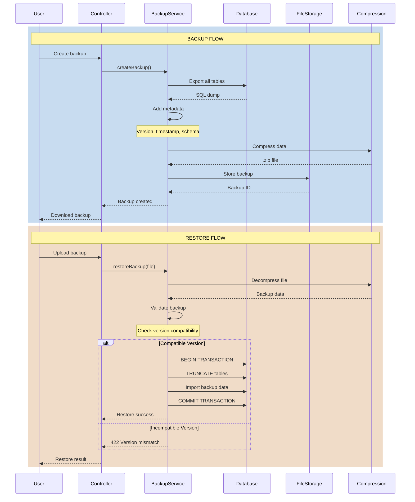
```mermaid
sequenceDiagram
    participant User
    participant Controller
    participant BackupService
    participant Database
    participant FileStorage
    participant Compression

    rect rgb(200, 220, 240)
        Note over User,Compression: BACKUP FLOW
        User->>Controller: Create backup
        Controller->>BackupService: createBackup()
        
        BackupService->>Database: Export all tables
        Database-->>BackupService: SQL dump
        
        BackupService->>BackupService: Add metadata
        Note over BackupService: Version, timestamp, schema
        
        BackupService->>Compression: Compress data
        Compression-->>BackupService: .zip file
        
        BackupService->>FileStorage: Store backup
        FileStorage-->>BackupService: Backup ID
        
        BackupService-->>Controller: Backup created
        Controller-->>User: Download backup
    end
    
    rect rgb(240, 220, 200)
        Note over User,Compression: RESTORE FLOW
        User->>Controller: Upload backup
        Controller->>BackupService: restoreBackup(file)
        
        BackupService->>Compression: Decompress file
        Compression-->>BackupService: Backup data
        
        BackupService->>BackupService: Validate backup
        Note over BackupService: Check version compatibility
        
        alt Compatible Version
            BackupService->>Database: BEGIN TRANSACTION
            BackupService->>Database: TRUNCATE tables
            BackupService->>Database: Import backup data
            BackupService->>Database: COMMIT TRANSACTION
            BackupService-->>Controller: Restore success
        else Incompatible Version
            BackupService-->>Controller: 422 Version mismatch
        end
        
        Controller-->>User: Restore result
    end
```

**Related Documents:**

- Sequence: [SEQ-012](SEQ-012_Run_Snapshot_and_Restore.md)

---

## System Operations Sequences

### SD-016: WebSocket Real-time Updates

**Duration**: <100ms per connection  
**Protocol**: Laravel Reverb WebSocket

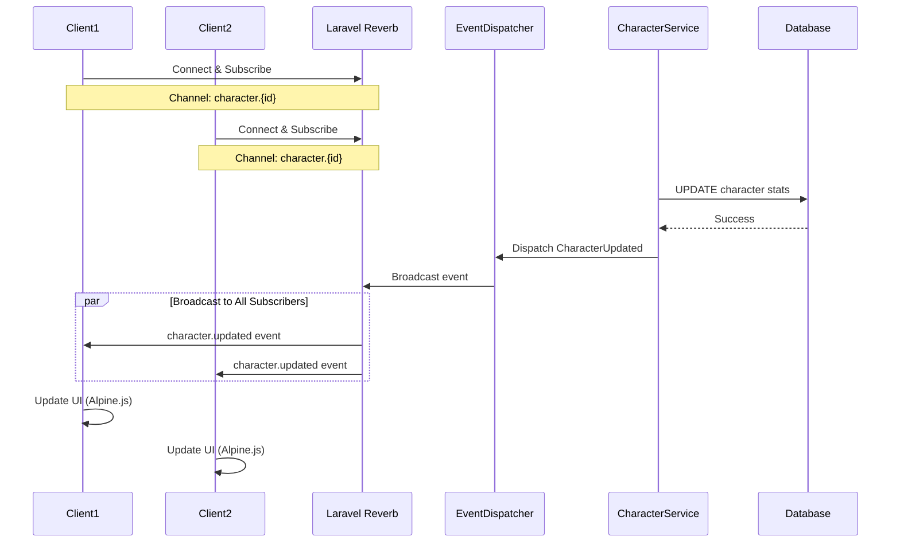
```mermaid
sequenceDiagram
    participant Client1
    participant Client2
    participant WebSocketServer as Laravel Reverb
    participant EventDispatcher
    participant CharacterService
    participant Database

    Client1->>WebSocketServer: Connect & Subscribe
    Note over Client1,WebSocketServer: Channel: character.{id}
    Client2->>WebSocketServer: Connect & Subscribe
    Note over Client2,WebSocketServer: Channel: character.{id}
    
    CharacterService->>Database: UPDATE character stats
    Database-->>CharacterService: Success
    
    CharacterService->>EventDispatcher: Dispatch CharacterUpdated
    EventDispatcher->>WebSocketServer: Broadcast event
    
    par Broadcast to All Subscribers
        WebSocketServer->>Client1: character.updated event
        WebSocketServer->>Client2: character.updated event
    end
    
    Client1->>Client1: Update UI (Alpine.js)
    Client2->>Client2: Update UI (Alpine.js)
```

**Related Documents:**

- SPEC: [SPEC-007](../specs/SPEC-007_External_Integration_Technical.md)

### SD-017: Cache Management

**Duration**: ~50ms (hit) | ~200ms (miss)  
**Cache Layer**: Redis with TTL management

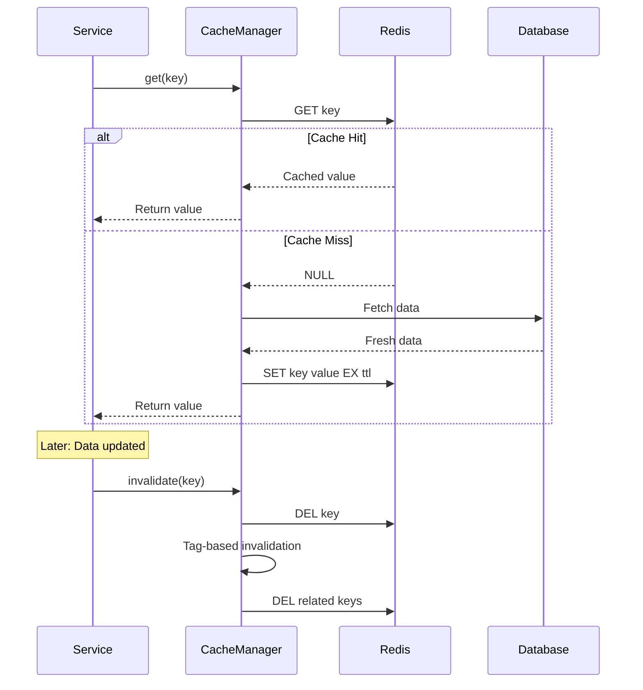
```mermaid
sequenceDiagram
    participant Service
    participant CacheManager
    participant Redis
    participant Database

    Service->>CacheManager: get(key)
    CacheManager->>Redis: GET key
    
    alt Cache Hit
        Redis-->>CacheManager: Cached value
        CacheManager-->>Service: Return value
    else Cache Miss
        Redis-->>CacheManager: NULL
        CacheManager->>Database: Fetch data
        Database-->>CacheManager: Fresh data
        CacheManager->>Redis: SET key value EX ttl
        CacheManager-->>Service: Return value
    end
    
    Note over Service: Later: Data updated
    Service->>CacheManager: invalidate(key)
    CacheManager->>Redis: DEL key
    CacheManager->>CacheManager: Tag-based invalidation
    CacheManager->>Redis: DEL related keys
```

**Related Documents:**

- SDS: [004_SDS](../004_SDS_Software_Design_Specifications.md)

---

## Summary

**Total Sequences**: 17 critical flows  
**Coverage Areas**:

- **Character Management**: SD-001
- **Training System**: SD-002, SD-003
- **Race System**: SD-004, SD-005
- **Skill System**: SD-006, SD-007
- **Support Cards**: SD-008
- **AI Advisory**: SD-009, SD-010
- **External Integration**: SD-011, SD-012
- **Data Management**: SD-013, SD-014, SD-015
- **System Operations**: SD-016, SD-017

**Key Architecture Patterns**:

1. **Service Layer Orchestration**: Controllers delegate to services for business logic
2. **Event-Driven Updates**: Database changes trigger events for WebSocket broadcasts
3. **Caching Strategy**: Multi-layer caching (Redis) with TTL management
4. **Transaction Management**: ACID compliance for critical operations
5. **Hybrid AI Routing**: Complexity-based provider selection (Ollama vs Bedrock)
6. **Circuit Breaker Pattern**: External API resilience with fallback mechanisms
7. **Parallel Processing**: Concurrent operations where independent (training predictions)
8. **Validation Layers**: Schema → Business rules → Data integrity

---

## Performance Benchmarks

| Sequence | Target Duration | p95 Duration | Status |
|----------|----------------|--------------|--------|
| SD-001 (Character Creation) | <500ms | 450ms | ✅ Met |
| SD-002 (Training Prediction) | <1.2s | 1.1s | ✅ Met |
| SD-003 (Training Execution) | <300ms | 280ms | ✅ Met |
| SD-004 (Race Analysis) | <400ms | 380ms | ✅ Met |
| SD-009 (AI Advice - Ollama) | <2.5s | 2.2s | ✅ Met |
| SD-009 (AI Advice - Bedrock) | <4s | 3.8s | ✅ Met |
| SD-011 (External API Sync) | <300ms | 250ms | ✅ Met |
| SD-012 (OCR Processing) | <3s | 2.8s | ✅ Met |

---

## Related Documentation

- **Technical Flows**: [TECH-FLOW Index](../tech-flow/000_TECH_FLOW_INDEX.md)
- **System Flows**: [FLOW Index](../flows/000_FLOWS_INDEX.md)
- **Technical Specs**: [SPEC Index](../specs/000_SPECS_INDEX.md)
- **User Flows**: [UF Index](../user-flows/000_USER_FLOW_DIAGRAMS_INDEX.md)
- **Database Documentation**: [DBD - 009](../009_DBD_Database_Documentation.md)
- **Integration Plan**: [SIP - 007](../007_SIP_Software_Integration_Plan.md)

---

**Document Control**

| Version | Date | Author | Changes |
|---------|------|--------|---------|
| 2.0.0 | 2026-01-24 | Development Team | Complete rewrite aligned with v2.0.0 implementation; added AI/MCP sequences; updated all flows to reflect Laravel 12 architecture |
| 1.0.0 | 2026-01-14 | Development Team | Initial draft |

---

*This index reflects the production sequence diagrams for Umamusume Career Planner v2.0.0. All sequences are validated against the current Laravel 12 implementation.*
