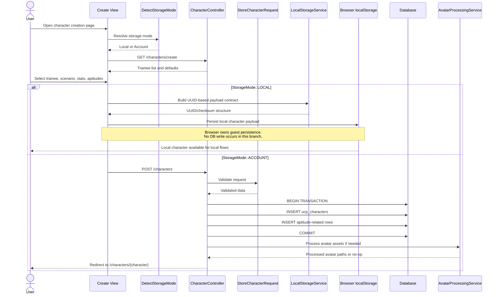
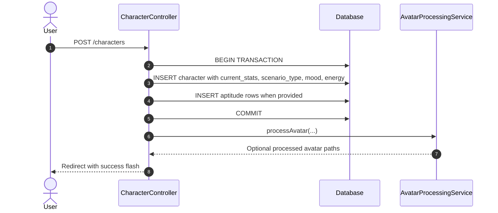

# SEQ-001: Character Creation Sequence

## Umamusume Pretty Derby Career Planner

**Document Version**: 2.3.0
**Date**: March 8, 2026
**Related Documents**: [PRD-001], [SPEC-001], [FLOW-001], [FLOW-009], [TECH-FLOW-001]

---

## 1. Overview

### 1.1 Purpose

This sequence diagram documents the current character creation workflow as implemented in the
repository. It explicitly distinguishes `StorageMode::LOCAL`, where persistence is browser-managed,
from `StorageMode::ACCOUNT`, where `CharacterController::store()` creates database-backed records.

### 1.2 Scope

**Covers:**

- Loading the character creation page and trainee catalog
- Storage-mode resolution before persistence
- Browser-managed local creation payloads and UUID usage
- Authenticated account-mode creation through `POST /characters`
- Aptitude persistence and post-create redirect behavior

**Does not currently cover:**

- Support deck persistence during initial character creation
- Dedicated inheritance-factor persistence in `CharacterController::store()`
- A guest-facing server endpoint that creates local characters in the database

### 1.3 Implementation Notes

- `DetectStorageMode` resolves mode from route, session, and auth context.
- `CharacterController::create()` renders the create page with `GameCharacter` data.
- `CharacterController::store()` creates a `Character` row and aptitude rows inside a database transaction.
- Local mode uses UUID-oriented browser payloads aligned with `LocalStorageService` conventions.
- Support deck configuration happens later in the deck-builder flows.

---

## 2. Participants

| Component | Type | Responsibility |
| --- | --- | --- |
| **User** | Actor | Selects trainee, scenario, and creation options |
| **Create View** | Presentation | Blade and client-side form logic for the creation page |
| **DetectStorageMode** | Middleware | Resolves `StorageMode::LOCAL` versus `StorageMode::ACCOUNT` |
| **CharacterController** | Application | Renders the create page and stores account-mode characters |
| **StoreCharacterRequest** | Validation | Validates account-mode create input |
| **LocalStorageService** | Domain Service | Defines UUID and local payload conventions |
| **Browser localStorage** | Client Storage | Stores guest/local character payloads |
| **Database** | Infrastructure | Persists account-mode `ucp_characters` rows and related aptitude records |
| **AvatarProcessingService** | Domain Service | Performs avatar post-processing after commit |

---

## 3. Sequence Flow

### 3.1 Storage-Aware Creation Flow



### 3.2 Account-Mode Persistence Details



---

## 4. Detailed Interactions

### 4.1 Account Mode

- `CharacterController::store()` is the authoritative server-side create path.
- The transaction persists the `Character` record plus aptitude rows.
- The controller initializes JSON-backed state such as `current_stats`, `goals`, `race_schedule`,
`training_plan`, and related containers directly on the character.
- Avatar processing runs after commit and is intentionally outside the transaction.

### 4.2 Local Mode

- Guests default to `StorageMode::LOCAL` through `StorageMode::fromRequest()`.
- Local payloads use UUID-oriented identifiers and browser persistence conventions defined by `LocalStorageService`.
- The repository does not currently expose a guest `POST /characters` equivalent that creates
database records for local runs.
- Local data becomes database-backed only during the storage conversion flow.

### 4.3 Clarifications

- Inheritance-factor activation probabilities are domain concepts, but they are not persisted by the
current `CharacterController::store()` path.
- Support deck validation is a separate workflow handled after creation in
[SEQ-016](SEQ-016_Support_Deck_Configuration.md).
- Public identifiers are mode-dependent: UUIDs in local mode and numeric IDs in account mode.

---

## 5. Data Structures

### 5.1 Account-Mode Character Payload

```php
[
    'name' => 'Special Week',
    'scenario_type' => 'ura',
    'career_stage' => 'junior',
    'current_turn' => 1,
    'current_stats' => [...],
    'energy_level' => 100,
    'mood_status' => 'normal',
    'status' => 'active',
]
```

### 5.2 Local-Mode Payload Shape

```php
[
    'uuid' => 'generated-uuid',
    'version' => 1,
    'created_at' => 'iso-8601',
    'updated_at' => 'iso-8601',
    'data' => [...],
    'checksum' => 'xxh3-hash',
]
```

---

## 6. Error Handling

- Validation failures in `StorageMode::ACCOUNT` redirect back with input.
- Database failures roll back the transaction and log the exception.
- `StorageMode::LOCAL` treats browser state as untrusted and validates it before later conversion.

---

## 7. Related Documentation

- [FLOW-001](../01-flows/FLOW-001_Character_Management_System.md)
- [FLOW-009](../01-flows/FLOW-009_Storage_Migration_System.md)
- [SEQ-016](SEQ-016_Support_Deck_Configuration.md)
- [SEQ-017](SEQ-017_Storage_Mode_Transition.md)
