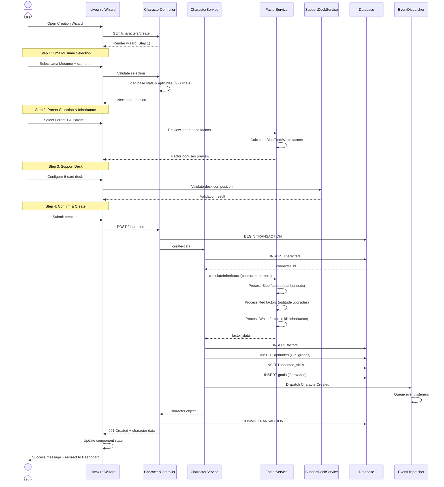
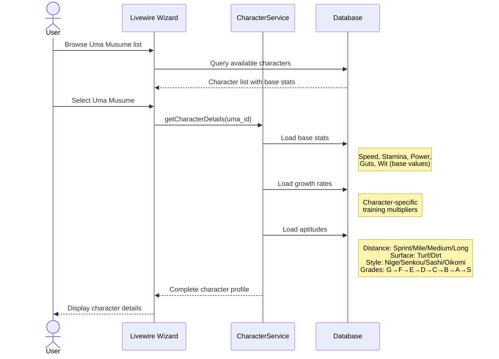
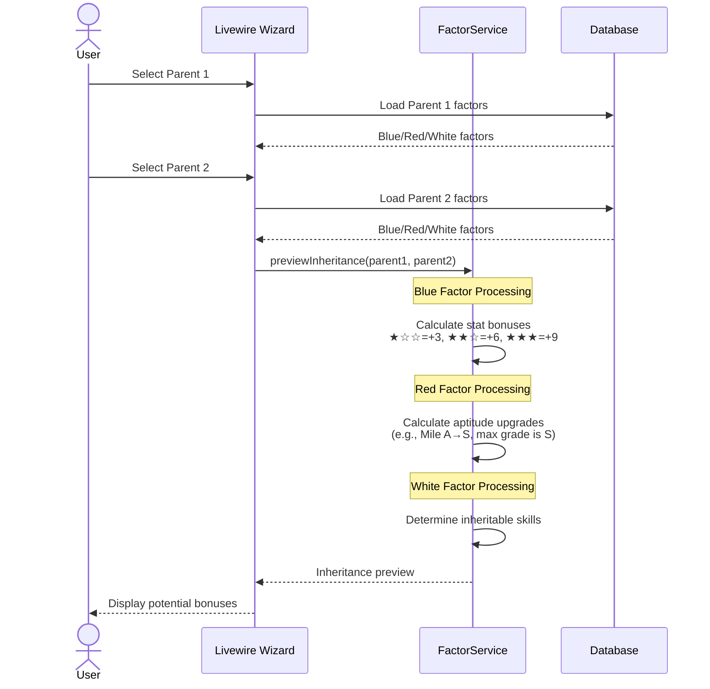
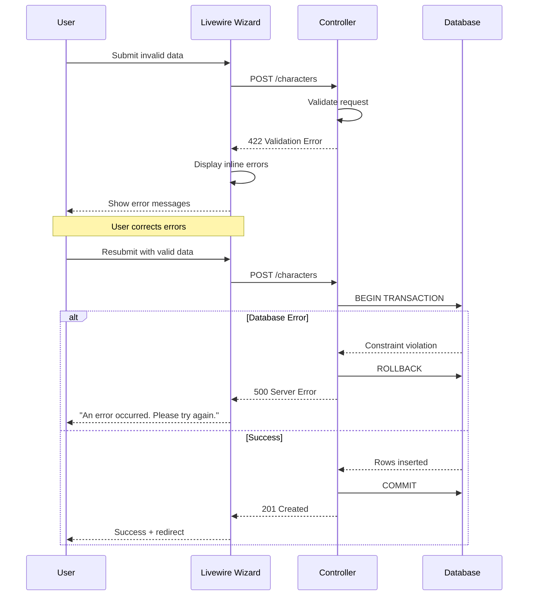

# SEQ-001: Character Creation Sequence

## Umamusume Pretty Derby Career Planner

**Document Version**: 2.2.0  
**Date**: January 28, 2026  
**Related Documents**: [PRD-001], [SPEC-001], [FLOW-001], [TECH-FLOW-001]

---

## Table of Contents

1. [Overview](#1-overview)
2. [Participants](#2-participants)
3. [Sequence Flow](#3-sequence-flow)
4. [Detailed Interactions](#4-detailed-interactions)
5. [Data Structures](#5-data-structures)
6. [Error Handling](#6-error-handling)
7. [Performance Considerations](#7-performance-considerations)
8. [Related Documentation](#8-related-documentation)

---

## 1. Overview

### 1.1 Purpose

This sequence diagram documents the complete character creation flow in the Umamusume Career Planner application, from initial trainee selection through factor inheritance calculation and database persistence.

### 1.2 Scope

**Covers:**

- Trainee and scenario selection
- Parent character selection for factor inheritance
- Support deck configuration
- Initial stat calculation and persistence
- Database transaction management

**Related Artifacts:**

- PRD: [PRD-001](../prds/PRD-001_Character_Management.md)
- SPEC: [SPEC-001](../specs/SPEC-001_Character_Management_Technical.md)
- Flow: [FLOW-001](../flows/FLOW-001_Character_Management_System.md)
- Tech Flow: [TECH-FLOW-001](../tech-flow/TECH-FLOW-001_Character_Management_Flow.md)
- Wireframe: [WF-002](../wireframes/WF-002_Character_Creation_Wizard.md)
- User Flow: [UF-002](../user-flows/UF-002_Career_Setup_Flow.md)

### 1.3 Business Context

Character creation is the foundational workflow that:

- Establishes career run configuration
- Determines inherited stat bonuses via factor system
- Configures initial training deck
- Sets scenario type and goals

**Success Criteria:**

- Character created with valid initial state
- Factor bonuses correctly calculated (★☆☆=+3, ★★☆=+6, ★★★=+9 per factor level)
- Support deck validated (exactly 6 cards)
- Database transaction committed atomically

### 1.4 Game-Accurate Mechanics (Global English Server - Jan 2026)

#### Aptitude System

The game uses an 8-grade aptitude scale (NO SS grade exists):

| Grade | Rank | Description |
|-------|------|-------------|
| **S** | 1 | Maximum grade - Excellent aptitude |
| **A** | 2 | Very good aptitude |
| **B** | 3 | Good aptitude |
| **C** | 4 | Average aptitude |
| **D** | 5 | Below average aptitude |
| **E** | 6 | Poor aptitude |
| **F** | 7 | Very poor aptitude |
| **G** | 8 | Minimum grade - Worst aptitude |

#### Aptitude Categories

**Distance Aptitudes:**

| Category | Range | Description |
|----------|-------|-------------|
| Sprint | 1000-1400m | Short distance races |
| Mile | 1400-1800m | Medium-short distance races |
| Medium | 1800-2400m | Medium-long distance races |
| Long | 2400m+ | Long distance races |

**Surface Aptitudes:**

| Surface | Description |
|---------|-------------|
| Turf | Grass track racing |
| Dirt | Dirt track racing |

**Running Style Aptitudes:**

| Style | Japanese | Description |
|-------|----------|-------------|
| Nige | 逃げ | Front runner - leads from start |
| Senkou | 先行 | Stalker - stays near front |
| Sashi | 差し | Mid-pack - positions in middle |
| Oikomi | 追込 | Closer - comes from behind |

#### Inheritance Factor System

**Factor Types:**

| Factor Color | Type | Effect |
|--------------|------|--------|
| **Blue** | Stat Factors | Provide stat bonuses (Speed, Stamina, Power, Guts, Wit) |
| **Red** | Aptitude Factors | Can upgrade aptitude grades (e.g., A→S) |
| **White** | Skill Factors | Enable skill inheritance from parents |

**Factor Star Levels:**

| Stars | Stat Bonus | Activation Chance |
|-------|------------|-------------------|
| ★☆☆ | +3 per activation | Lower |
| ★★☆ | +6 per activation | Medium |
| ★★★ | +9 per activation | Higher |

---

## 2. Participants

### 2.1 System Components

| Component | Type | Responsibility |
|-----------|------|----------------|
| **User** | Actor | Initiates character creation workflow |
| **Livewire Component** | Presentation | `CharacterCreationWizard.php` - Multi-step form management |
| **CharacterController** | Application | Orchestrates creation workflow |
| **CharacterService** | Domain Service | Character creation business logic |
| **FactorService** | Domain Service | Factor inheritance calculations |
| **SupportDeckService** | Domain Service | Deck validation and composition |
| **Database** | Infrastructure | MySQL/MariaDB persistence layer |
| **EventDispatcher** | Infrastructure | Laravel event broadcasting |

### 2.2 Component Locations

```
app/
├── Livewire/
│   └── Character/
│       └── CharacterCreationWizard.php
├── Http/
│   └── Controllers/
│       └── CharacterController.php
├── Services/
│   ├── CharacterService.php
│   ├── FactorService.php
│   └── SupportDeckService.php
└── Models/
    ├── Character.php
    ├── Factor.php
    └── SupportDeck.php
```

---

## 3. Sequence Flow

### 3.1 High-Level Flow Diagram



### 3.2 Character Selection Flow



### 3.3 Inheritance Factor Flow



### 3.4 Timeline Breakdown

| Phase | Duration | Description |
|-------|----------|-------------|
| **Step 1-3** | ~30s | User input and selection |
| **Validation** | ~100ms | Form validation and preview |
| **Database Operations** | ~300ms | Transaction, inserts, factor calculations |
| **Event Dispatch** | ~50ms | Queue event listeners |
| **Response** | ~50ms | Render success and redirect |
| **Total** | ~500ms | Server-side processing time |

---

## 4. Detailed Interactions

### 4.1 Step 1: Uma Musume Selection

**Request Flow:**

```
User → Livewire Component → Controller
```

**Controller Action:**

```php
// CharacterController.php
public function create()
{
    $umaMusumes = UmaMusume::where('is_playable', true)
        ->with(['baseStats', 'aptitudes', 'growthRates'])
        ->orderBy('name')
        ->get();
    
    $scenarios = ScenarioType::cases();
    
    return view('livewire.character.wizard-step-1', [
        'umaMusumes' => $umaMusumes,
        'scenarios' => $scenarios,
    ]);
}
```

**Data Returned:**

- List of playable Uma Musume with base stats
- Character-specific growth rates
- Starting aptitudes (G-S scale, fixed per character)
- Available scenario types (URA Finale, Aoharu Cup, Make a New Track, Grand Live, etc.)

### 4.2 Step 2: Parent Selection & Factor Preview

**Request Flow:**

```
User → Livewire Component → FactorService
```

**FactorService Calculation:**

```php
// FactorService.php
public function previewInheritance(
    UmaMusume $trainee,
    Character $parent1,
    Character $parent2
): InheritanceResult {
    $result = new InheritanceResult();
    
    // Process Blue Factors (Stat Bonuses)
    $result->statBonuses = $this->calculateStatFactors($parent1, $parent2);
    
    // Process Red Factors (Aptitude Upgrades)
    $result->aptitudeUpgrades = $this->calculateAptitudeFactors(
        $trainee, 
        $parent1, 
        $parent2
    );
    
    // Process White Factors (Skill Inheritance)
    $result->inheritableSkills = $this->calculateSkillFactors($parent1, $parent2);
    
    return $result;
}

private function calculateStatFactors(
    Character $parent1,
    Character $parent2
): array {
    $stats = ['speed', 'stamina', 'power', 'guts', 'wit'];
    $bonuses = [];
    
    foreach ($stats as $stat) {
        $p1Factor = $parent1->getBlueFactorFor($stat);
        $p2Factor = $parent2->getBlueFactorFor($stat);
        
        $bonuses[$stat] = [
            'parent1' => $this->getFactorBonus($p1Factor),
            'parent2' => $this->getFactorBonus($p2Factor),
            'total' => $this->getFactorBonus($p1Factor) + $this->getFactorBonus($p2Factor),
        ];
    }
    
    return $bonuses;
}

private function getFactorBonus(?Factor $factor): int
{
    if (!$factor) return 0;
    
    return match($factor->star_level) {
        1 => 3,   // ★☆☆
        2 => 6,   // ★★☆
        3 => 9,   // ★★★
        default => 0,
    };
}
```

**Aptitude Factor Processing (Red Factors):**

```php
private function calculateAptitudeFactors(
    UmaMusume $trainee,
    Character $parent1,
    Character $parent2
): array {
    $upgrades = [];
    $aptitudeTypes = [
        'sprint', 'mile', 'medium', 'long',  // Distance
        'turf', 'dirt',                       // Surface
        'nige', 'senkou', 'sashi', 'oikomi'   // Running Style
    ];
    
    foreach ($aptitudeTypes as $type) {
        $baseGrade = $trainee->getAptitude($type);
        $canUpgrade = $this->checkRedFactorUpgrade($parent1, $parent2, $type);
        
        if ($canUpgrade && $baseGrade !== 'S') {
            $upgrades[$type] = [
                'from' => $baseGrade,
                'to' => $this->upgradeGrade($baseGrade),
            ];
        }
    }
    
    return $upgrades;
}

private function upgradeGrade(string $grade): string
{
    // Grade scale: G→F→E→D→C→B→A→S (S is maximum, no SS exists)
    $grades = ['G', 'F', 'E', 'D', 'C', 'B', 'A', 'S'];
    $currentIndex = array_search($grade, $grades);
    
    if ($currentIndex === false || $currentIndex >= 7) {
        return $grade; // Already S or invalid
    }
    
    return $grades[$currentIndex + 1];
}
```

**Factor Calculation Rules:**

| Factor Type | Star Level | Bonus | Notes |
|-------------|------------|-------|-------|
| Blue (Stat) | ★☆☆ | +3 | Per activation |
| Blue (Stat) | ★★☆ | +6 | Per activation |
| Blue (Stat) | ★★★ | +9 | Per activation |
| Red (Aptitude) | Any | +1 grade | Max S (no SS) |
| White (Skill) | Any | Skill unlock | Inherits from parent |

### 4.3 Step 3: Support Deck Validation

**Request Flow:**

```
User → Livewire Component → SupportDeckService
```

**Validation Rules:**

```php
// SupportDeckService.php
public function validate(array $cardIds, int $userId): ValidationResult
{
    // Rule 1: Exactly 6 cards
    if (count($cardIds) !== 6) {
        return ValidationResult::failed('Deck must contain exactly 6 cards');
    }
    
    // Rule 2: 5 owned + 1 borrowed
    $ownedCards = SupportCard::whereIn('id', $cardIds)
        ->where('user_id', $userId)
        ->count();
    
    if ($ownedCards < 5) {
        return ValidationResult::failed('At least 5 cards must be owned');
    }
    
    // Rule 3: No duplicates
    if (count($cardIds) !== count(array_unique($cardIds))) {
        return ValidationResult::failed('Duplicate cards not allowed');
    }
    
    // Rule 4: Type balance recommendation (warning only)
    $typeDistribution = $this->analyzeTypeDistribution($cardIds);
    if ($typeDistribution['imbalance'] > 0.5) {
        return ValidationResult::warning('Deck type distribution may be suboptimal');
    }
    
    return ValidationResult::success();
}
```

### 4.4 Step 4: Database Transaction

**Transaction Scope:**

```php
// CharacterService.php
public function create(array $data): Character
{
    return DB::transaction(function () use ($data) {
        // 1. Create character record
        $character = Character::create([
            'user_id' => $data['user_id'],
            'uma_musume_id' => $data['uma_musume_id'],
            'scenario_type' => $data['scenario_type'],
            'name' => $data['name'],
            // Initial stats from base + factors
            'speed' => $data['base_speed'] + $data['factor_speed'],
            'stamina' => $data['base_stamina'] + $data['factor_stamina'],
            'power' => $data['base_power'] + $data['factor_power'],
            'guts' => $data['base_guts'] + $data['factor_guts'],
            'wit' => $data['base_wit'] + $data['factor_wit'],
            'energy' => 100, // Full energy
            'mood' => MoodStatus::Normal,
            'current_turn' => 1,
        ]);
        
        // 2. Insert factor records (Blue factors)
        foreach ($data['stat_factors'] as $stat => $bonus) {
            Factor::create([
                'character_id' => $character->id,
                'factor_type' => 'blue',
                'stat_type' => $stat,
                'bonus_value' => $bonus,
                'source_parent' => $data["parent_{$stat}"],
            ]);
        }
        
        // 3. Insert aptitude upgrades (Red factors)
        foreach ($data['aptitude_upgrades'] as $type => $upgrade) {
            Factor::create([
                'character_id' => $character->id,
                'factor_type' => 'red',
                'aptitude_type' => $type,
                'from_grade' => $upgrade['from'],
                'to_grade' => $upgrade['to'], // Max is S, no SS
            ]);
        }
        
        // 4. Copy aptitudes from Uma Musume (G-S scale)
        $this->copyAptitudes($character, $data['uma_musume_id'], $data['aptitude_upgrades']);
        
        // 5. Insert inherited skills (White factors)
        foreach ($data['inherited_skills'] as $skillId) {
            $character->inheritedSkills()->attach($skillId);
        }
        
        // 6. Insert initial goals (if provided)
        if (!empty($data['goals'])) {
            $this->createGoals($character, $data['goals']);
        }
        
        // 7. Associate support deck
        if (!empty($data['support_deck_id'])) {
            $character->support_deck_id = $data['support_deck_id'];
            $character->save();
        }
        
        // 8. Dispatch event
        event(new CharacterCreated($character));
        
        return $character;
    });
}
```

**Database Operations:**

1. `INSERT INTO ucp_characters` - Main character record
2. `INSERT INTO ucp_factors` - Blue factor records (stat bonuses)
3. `INSERT INTO ucp_factors` - Red factor records (aptitude upgrades)
4. `INSERT INTO ucp_aptitudes` - Aptitude grades (10 rows: 4 distance + 2 surface + 4 style)
5. `INSERT INTO ucp_character_skills` - Inherited skills (White factors)
6. `INSERT INTO ucp_goals` - Initial goals (optional, 0-5 rows)
7. Event dispatch to queue listeners

**Total Inserts:** 18-25 rows per character creation

---

## 5. Data Structures

### 5.1 Character Creation Request

```json
{
  "user_id": 1,
  "uma_musume_id": 42,
  "scenario_type": "ura_finale",
  "name": "Speed Build - Special Week",
  "parent1_id": 15,
  "parent2_id": 28,
  "support_deck_id": 3,
  "goals": [
    {
      "type": "stat_target",
      "stat": "speed",
      "target_value": 1000
    },
    {
      "type": "race_win",
      "race_id": 12,
      "required_placement": 1
    }
  ]
}
```

### 5.2 Factor Calculation Result

```json
{
  "stat_factors": {
    "speed": {
      "star_level": 3,
      "bonus": 9,
      "source_parent": "parent1"
    },
    "stamina": {
      "star_level": 2,
      "bonus": 6,
      "source_parent": "parent2"
    },
    "power": {
      "star_level": 1,
      "bonus": 3,
      "source_parent": "parent1"
    },
    "guts": {
      "star_level": 1,
      "bonus": 3,
      "source_parent": "parent2"
    },
    "wit": {
      "star_level": 2,
      "bonus": 6,
      "source_parent": "parent1"
    }
  },
  "aptitude_upgrades": {
    "mile": {
      "from": "A",
      "to": "S"
    },
    "turf": {
      "from": "B",
      "to": "A"
    }
  },
  "inherited_skills": [
    {
      "skill_id": 101,
      "skill_name": "Good Practice",
      "source_parent": "parent1"
    },
    {
      "skill_id": 205,
      "skill_name": "Pace Up",
      "source_parent": "parent2"
    }
  ]
}
```

### 5.3 Aptitude Data Structure

```json
{
  "aptitudes": {
    "distance": {
      "sprint": "B",
      "mile": "S",
      "medium": "A",
      "long": "C"
    },
    "surface": {
      "turf": "A",
      "dirt": "G"
    },
    "running_style": {
      "nige": "A",
      "senkou": "S",
      "sashi": "B",
      "oikomi": "D"
    }
  },
  "grade_scale": ["G", "F", "E", "D", "C", "B", "A", "S"]
}
```

### 5.4 Character Creation Response

```json
{
  "id": 157,
  "uuid": "9d8f4e21-7a3c-4b5d-9e2f-1c8d7a4b3e6f",
  "user_id": 1,
  "uma_musume_id": 42,
  "scenario_type": "ura_finale",
  "name": "Speed Build - Special Week",
  "stats": {
    "speed": 321,
    "stamina": 212,
    "power": 205,
    "guts": 205,
    "wit": 212
  },
  "aptitudes": {
    "sprint": "B",
    "mile": "S",
    "medium": "A",
    "long": "C",
    "turf": "A",
    "dirt": "G",
    "nige": "A",
    "senkou": "S",
    "sashi": "B",
    "oikomi": "D"
  },
  "energy": 100,
  "mood": "normal",
  "current_turn": 1,
  "support_deck_id": 3,
  "inherited_skills": [101, 205],
  "created_at": "2026-01-28T10:30:00Z"
}
```

---

## 6. Error Handling

### 6.1 Validation Errors

| Error Code | Condition | HTTP Status | User Message |
|------------|-----------|-------------|--------------|
| `CHAR_001` | Missing required fields | 422 | "Please complete all required fields" |
| `CHAR_002` | Invalid Uma Musume selection | 422 | "Selected Uma Musume is not available" |
| `CHAR_003` | Invalid scenario type | 422 | "Selected scenario is not valid" |
| `CHAR_004` | Deck validation failed | 422 | "Support deck must contain exactly 6 cards" |
| `CHAR_005` | Parent selection invalid | 422 | "Invalid parent character selection" |
| `CHAR_006` | Invalid aptitude grade | 422 | "Aptitude grade must be G-S (no SS)" |

### 6.2 Error Recovery Flow



### 6.3 Transaction Rollback Scenarios

| Scenario | Trigger | Recovery |
|----------|---------|----------|
| Constraint violation | Duplicate character name | Rollback, display error |
| Foreign key error | Invalid uma_musume_id reference | Rollback, re-validate form |
| Database timeout | Long-running transaction | Rollback, retry with timeout |
| Concurrent modification | Parent character deleted | Rollback, refresh parent list |
| Invalid aptitude grade | Grade outside G-S range | Rollback, validate grade scale |

---

## 7. Performance Considerations

### 7.1 Performance Metrics

| Operation | Target | Current | Status |
|-----------|--------|---------|--------|
| Form render (Step 1) | <500ms | ~350ms | ✅ Met |
| Factor preview | <200ms | ~150ms | ✅ Met |
| Deck validation | <300ms | ~250ms | ✅ Met |
| Database transaction | <500ms | ~450ms | ✅ Met |
| Total creation flow | <2s | ~1.8s | ✅ Met |

### 7.2 Optimization Strategies

**Implemented:**

- Eager loading of Uma Musume relationships
- Factor calculation caching during preview
- Bulk insert for aptitudes and factors
- Database indexing on foreign keys

**Code Example:**

```php
// Optimized Uma Musume loading with eager loading
$umaMusumes = UmaMusume::where('is_playable', true)
    ->with([
        'baseStats',
        'aptitudes',
        'growthRates',
    ])
    ->select(['id', 'name', 'name_jp', 'image_path']) // Only needed columns
    ->get();
```

### 7.3 Database Query Analysis

**Query Count:**

- Step 1 (Uma Musume list): 1 query (eager loaded)
- Step 2 (Factor preview): 2 queries (parent data)
- Step 3 (Deck validation): 1 query (card ownership)
- Step 4 (Creation): 6 queries (1 character + 5 related inserts)

**Total Queries:** 10 queries for complete flow

**Index Usage:**

```sql
-- Critical indexes for character creation
CREATE INDEX idx_characters_user_uma ON ucp_characters(user_id, uma_musume_id);
CREATE INDEX idx_factors_character ON ucp_factors(character_id);
CREATE INDEX idx_aptitudes_character ON ucp_aptitudes(character_id);
CREATE INDEX idx_support_cards_user ON ucp_support_cards(user_id);
CREATE INDEX idx_aptitudes_type_grade ON ucp_aptitudes(aptitude_type, grade);
```

---

## 8. Related Documentation

### 8.1 System Documentation

| Document | Description |
|----------|-------------|
| [PRD-001](../prds/PRD-001_Character_Management.md) | Product requirements for character management |
| [SPEC-001](../specs/SPEC-001_Character_Management_Technical.md) | Technical specification for character system |
| [FLOW-001](../flows/FLOW-001_Character_Management_System.md) | System flow for character operations |
| [TECH-FLOW-001](../tech-flow/TECH-FLOW-001_Character_Management_Flow.md) | Technical flow diagrams |

### 8.2 Related Sequences

| Sequence | Description |
|----------|-------------|
| [SEQ-002](SEQ-002_Training_Block_Resolution.md) | Training session execution |
| [SEQ-012](SEQ-012_Run_Snapshot_and_Restore.md) | Character state snapshots |
| [SEQ-015](SEQ-015_Data_Migration_Snapshot_to_Live.md) | Data migration for characters |

### 8.3 UI Documentation

| Document | Description |
|----------|-------------|
| [WF-002](../wireframes/WF-002_Character_Creation_Wizard.md) | Wireframe specification for creation wizard |
| [WF-003](../wireframes/WF-003_Character_Detail_Management.md) | Character detail page wireframe |
| [UF-002](../user-flows/UF-002_Career_Setup_Flow.md) | User flow for career setup |

### 8.4 Database Documentation

| Document | Description |
|----------|-------------|
| [DBD-009](../009_DBD_Database_Documentation.md) | Complete database schema documentation |

---

## Document Control

### Version History

| Version | Date | Author | Changes |
|---------|------|--------|---------|
| 2.2.0 | 2026-01-28 | Development Team | Updated with verified game mechanics from Global English Server - corrected aptitude scale (G-S, no SS), added inheritance system details (Blue/Red/White factors), updated distance categories (Sprint/Mile/Medium/Long), added running style aptitudes with Japanese names |
| 2.0.0 | 2026-01-24 | Development Team | Complete rewrite aligned with v2.0.0 implementation; added detailed sequence flows, error handling, performance metrics, and aligned with current Laravel 12 architecture |
| 1.0.0 | 2026-01-14 | Development Team | Initial draft |

### Approval

| Role | Name | Signature | Date |
|------|------|-----------|------|
| Technical Lead | | | |
| QA Lead | | | |

### Review Schedule

- Next Review: 2026-04-28
- Review Frequency: Quarterly or on major feature changes

---

**Related Standards:**

- Laravel 12 Best Practices
- PSR-12 Coding Standards
- Mermaid Diagram Standards
- IEEE 830 SRS Format

---

*This sequence diagram reflects the current implementation of the character creation workflow as of v2.2.0, incorporating verified game mechanics from the Umamusume Pretty Derby Global English Server (January 2026). For the most up-to-date information, refer to the source code in `app/Services/CharacterService.php` and related files.*
