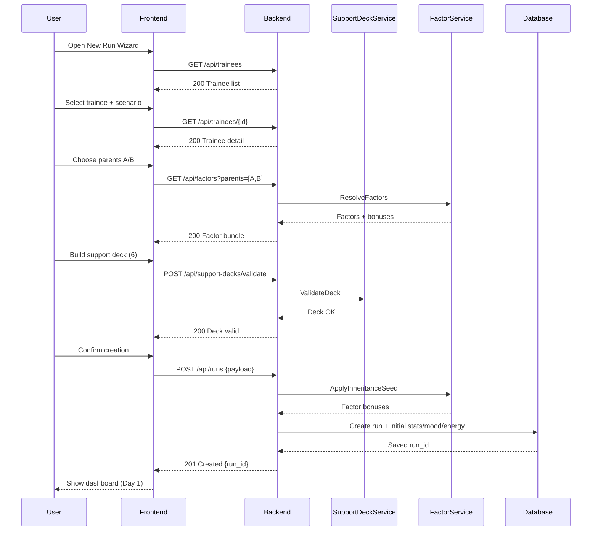

# SEQ-001: Character Creation Sequence

## Umamusume Pretty Derby Career Planner

**Document Version**: 1.0  
**Date**: January 14, 2026  
**Related Documents**: [PRD-001], [SPEC-001], [FLOW-001]

**Source Specs**:

- `.kiro/specs/umamusume-career-planner-main/requirements.md` (Requirement 1: Character State Management)
- `.kiro/specs/umamusume-career-planner-main/design.md` (Character Creation Flow)

**Related Artifacts**:

- PRD: [PRD-001](../prds/PRD-001_Character_Management.md)
- SPEC: [SPEC-001](../specs/SPEC-001_Character_Management_Technical.md)
- Flow: [FLOW-001](../flows/FLOW-001_Character_Management_System.md)
- Tech Flow: [TECH-FLOW-001](../tech-flow/TECH-FLOW-001_Character_Management_Flow.md)
- Wireframes: [WF-002](../wireframes/WF-002_Character_Creation_Wizard.md)
- User Flows: [UF-002](../user-flows/UF-002_Career_Setup_Flow.md)

---

## Sequence Overview

- User starts a new run, selects trainee/scenario/parents, builds support deck, and confirms creation.
- System validates selections, applies factor bonuses, and initializes run state.

## Sequence Diagram

