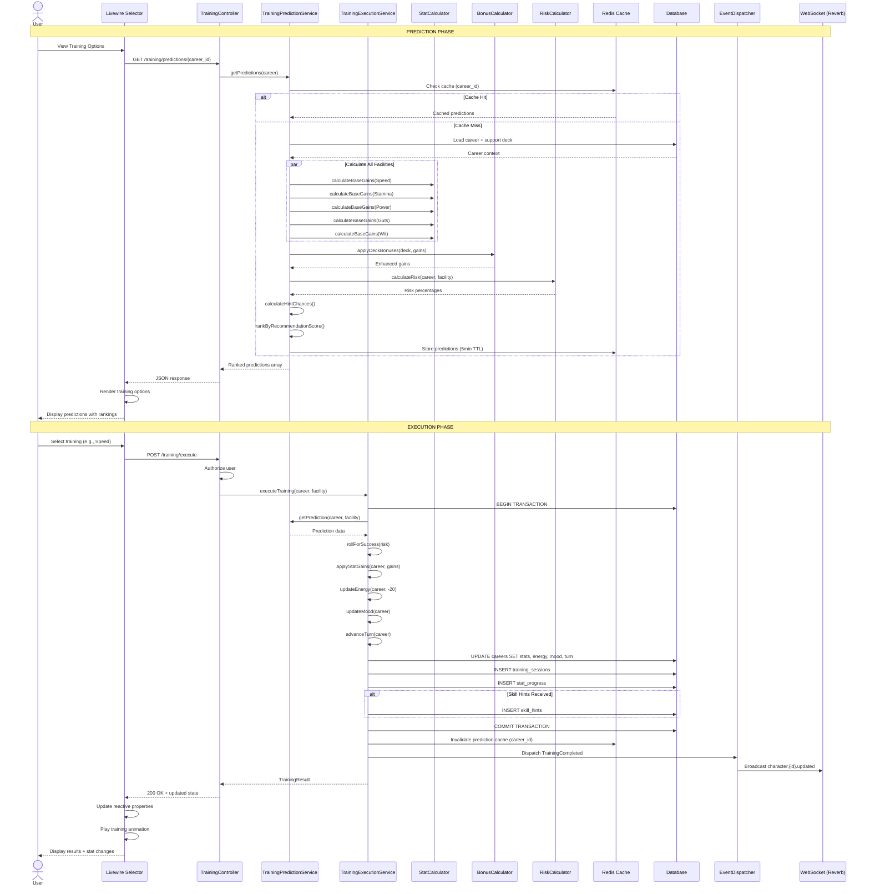
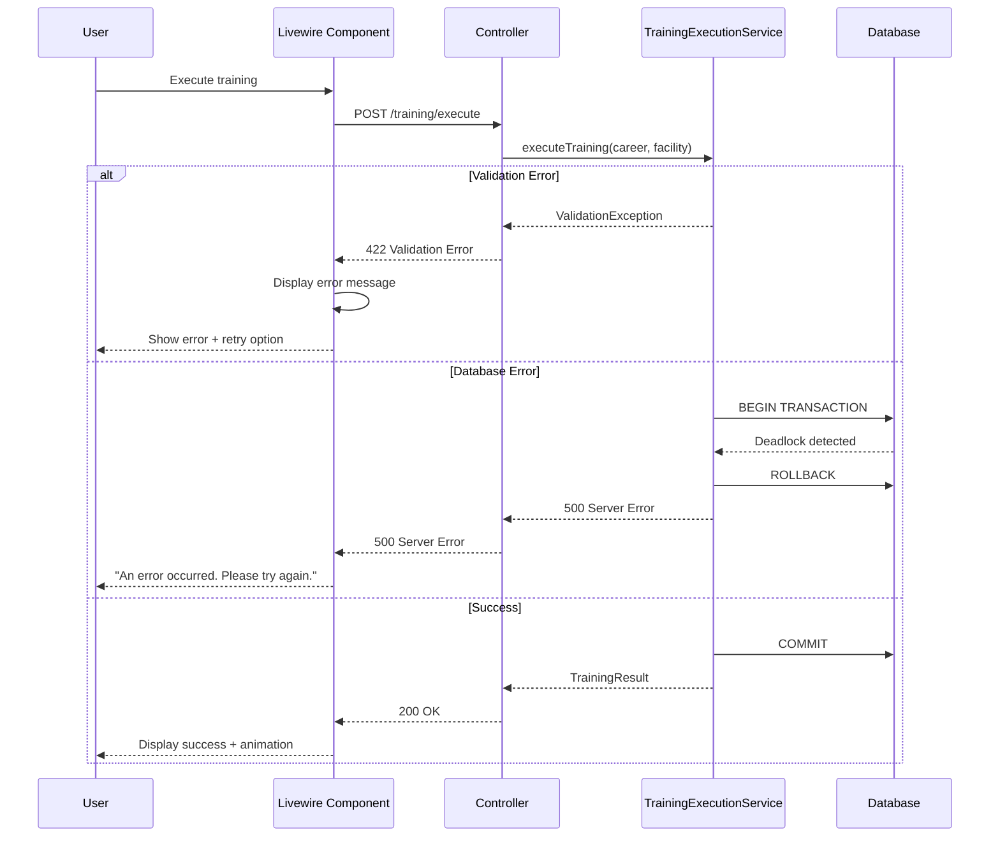

# SEQ-002: Training Block Resolution

## Umamusume Pretty Derby Career Planner

**Document Version**: 2.0.0  
**Date**: January 24, 2026  
**Related Documents**: [PRD-002], [SPEC-002], [FLOW-002], [TECH-FLOW-002]

---

## Table of Contents

1. [Overview](#1-overview)
2. [Participants](#2-participants)
3. [Sequence Flow](#3-sequence-flow)
4. [Detailed Interactions](#4-detailed-interactions)
5. [Data Structures](#5-data-structures)
6. [Error Handling](#6-error-handling)
7. [Performance Considerations](#7-performance-considerations)
8. [Related Documentation](#8-related-documentation)

---

## 1. Overview

### 1.1 Purpose

This sequence diagram documents the complete training block resolution process in the Umamusume Career Planner application, covering prediction generation, training selection, execution, and state updates.

### 1.2 Scope

**Covers:**

- Training prediction generation for all 5 training facilities (Speed, Stamina, Power, Guts, Wit)
- Support card bonus calculation
- Risk assessment and failure probability
- Skill hint probability calculation
- Training execution and stat updates
- Energy and mood progression
- Event dispatch and WebSocket broadcasting

**Related Artifacts:**

- PRD: [PRD-002](../prds/PRD-002_Training_Optimization.md)
- SPEC: [SPEC-002](../specs/SPEC-002_Training_Optimization_Technical.md)
- Flow: [FLOW-002](../flows/FLOW-002_Training_Optimization_System.md)
- Tech Flow: [TECH-FLOW-002](../tech-flow/TECH-FLOW-002_Training_Optimization_Flow.md)
- Wireframe: [WF-004](../wireframes/WF-004_Training_Selection_Interface.md), [WF-005](../wireframes/WF-005_Training_Result_Screen.md)
- User Flow: [UF-003](../user-flows/UF-003_Training_Day_Flow.md)

### 1.3 Business Context

Training resolution is the core gameplay loop that:

- Drives character stat progression
- Enables skill hint acquisition
- Manages energy and mood dynamics
- Triggers friendship training events
- Records turn-by-turn history

**Success Criteria:**

- Predictions generated within 200ms (with caching)
- Training execution completes within 300ms
- Stat updates reflected immediately in UI
- WebSocket broadcast to all active sessions
- Prediction cache invalidated after execution

---

## 2. Participants

### 2.1 System Components

| Component | Type | Responsibility |
|-----------|------|----------------|
| **User** | Actor | Initiates training selection and execution |
| **Livewire Component** | Presentation | `TrainingSelector.php` - Training interface |
| **TrainingController** | Application | Orchestrates training workflow |
| **TrainingPredictionService** | Domain Service | Generates training predictions |
| **TrainingExecutionService** | Domain Service | Executes training and updates state |
| **StatCalculator** | Domain Service | Calculates base stat gains |
| **BonusCalculator** | Domain Service | Applies support card bonuses |
| **RiskCalculator** | Domain Service | Determines failure probability |
| **Database** | Infrastructure | MySQL/MariaDB persistence layer |
| **Cache** | Infrastructure | Redis prediction cache |
| **EventDispatcher** | Infrastructure | Laravel event broadcasting |
| **WebSocketService** | Infrastructure | Laravel Reverb real-time updates |

### 2.2 Component Locations

```

app/
├── Livewire/
│   └── Training/
│       ├── TrainingSelector.php
│       └── PredictionDisplay.php
├── Http/
│   └── Controllers/
│       └── TrainingController.php
├── Services/
│   ├── TrainingPredictionService.php
│   ├── TrainingExecutionService.php
│   ├── StatCalculator.php
│   ├── BonusCalculator.php
│   └── RiskCalculator.php
├── Models/
│   ├── Career.php
│   ├── TrainingSession.php
│   └── SupportDeck.php
└── Events/
    ├── TrainingCompleted.php
    └── StatsUpdated.php

```

---

## 3. Sequence Flow

### 3.1 High-Level Flow Diagram



### 3.2 Timeline Breakdown

| Phase | Duration | Description |
|-------|----------|-------------|
| **Cache Check** | ~10ms | Redis cache lookup |
| **Prediction Calculation** | ~150ms | Base gains + bonuses + risk + hints |
| **Cache Store** | ~5ms | Write to Redis |
| **User Selection** | Variable | User decision time |
| **Authorization** | ~20ms | User permission check |
| **Database Transaction** | ~200ms | Stat updates + history inserts |
| **Event Dispatch** | ~30ms | Queue event listeners |
| **WebSocket Broadcast** | ~50ms | Real-time update to clients |
| **UI Update** | ~100ms | Animation and state refresh |
| **Total (Prediction)** | ~200ms | Server-side processing |
| **Total (Execution)** | ~300ms | Server-side processing |

---

## 4. Detailed Interactions

### 4.1 Prediction Generation Phase

**Request Flow:**

```
User → Livewire Component → TrainingController → TrainingPredictionService
```

**Service Implementation:**

```php
// app/Services/TrainingPredictionService.php
class TrainingPredictionService
{
    public function __construct(
        private StatCalculator $statCalculator,
        private BonusCalculator $bonusCalculator,
        private RiskCalculator $riskCalculator,
        private CacheManager $cache,
    ) {}
    
    public function getPredictions(Career $career): array
    {
        $cacheKey = "training_predictions:{$career->id}";
        
        return $this->cache->remember($cacheKey, 300, function () use ($career) {
            $facilities = TrainingType::cases();
            $predictions = [];
            
            foreach ($facilities as $facility) {
                $predictions[] = $this->calculatePrediction($career, $facility);
            }
            
            return $this->rankPredictions($predictions, $career);
        });
    }
    
    private function calculatePrediction(Career $career, TrainingType $facility): array
    {
        // Step 1: Calculate base stat gains
        $baseGains = $this->statCalculator->calculateBaseGains($facility, $career);
        
        // Step 2: Apply support card bonuses
        $deck = $career->supportDeck;
        $bonuses = $this->bonusCalculator->calculateDeckBonuses($deck, $facility);
        $enhancedGains = $baseGains->applyBonuses($bonuses);
        
        // Step 3: Calculate failure risk
        $risk = $this->riskCalculator->calculateFailureRisk($career, $facility);
        
        // Step 4: Calculate skill hint probability
        $hintChances = $this->calculateHintChances($deck, $facility);
        
        // Step 5: Calculate bond gains
        $bondGains = $this->calculateBondGains($deck, $facility);
        
        // Step 6: Score recommendation
        $score = $this->scoreTraining($career, $facility, $enhancedGains, $risk);
        
        return [
            'facility' => $facility->value,
            'stat_gains' => [
                'speed' => $enhancedGains->speed,
                'stamina' => $enhancedGains->stamina,
                'power' => $enhancedGains->power,
                'guts' => $enhancedGains->guts,
                'wit' => $enhancedGains->wit,
            ],
            'energy_cost' => $this->calculateEnergyCost($facility),
            'risk_percentage' => $risk,
            'skill_hints' => $hintChances,
            'bond_gains' => $bondGains,
            'recommendation_score' => $score,
            'efficiency_rating' => $this->rateEfficiency($enhancedGains, $risk),
        ];
    }
    
    private function rankPredictions(array $predictions, Career $career): array
    {
        // Sort by recommendation score (descending)
        usort($predictions, fn($a, $b) => $b['recommendation_score'] <=> $a['recommendation_score']);
        
        // Add rank field
        return array_map(fn($p, $idx) => array_merge($p, ['rank' => $idx + 1]), $predictions, array_keys($predictions));
    }
}
```

### 4.2 Stat Calculation Logic

**Base Gain Calculation:**

```php
// app/Services/StatCalculator.php
class StatCalculator
{
    public function calculateBaseGains(TrainingType $facility, Career $career): StatGains
    {
        $base = match ($facility) {
            TrainingType::Speed => ['speed' => 40, 'stamina' => 5, 'power' => 2],
            TrainingType::Stamina => ['stamina' => 40, 'guts' => 5, 'speed' => 2],
            TrainingType::Power => ['power' => 40, 'stamina' => 5, 'guts' => 2],
            TrainingType::Guts => ['guts' => 40, 'power' => 5, 'wit' => 2],
            TrainingType::Wit => ['wit' => 40, 'speed' => 3, 'stamina' => 2],
        };
        
        // Apply character growth rate modifiers
        $character = $career->character;
        $modified = [
            'speed' => (int) ($base['speed'] * $character->growth_speed),
            'stamina' => (int) ($base['stamina'] * $character->growth_stamina),
            'power' => (int) ($base['power'] * $character->growth_power),
            'guts' => (int) ($base['guts'] * $character->growth_guts),
            'wit' => (int) ($base['wit'] * $character->growth_wit),
        ];
        
        return new StatGains($modified);
    }
}
```

**Support Card Bonus Application:**

```php
// app/Services/BonusCalculator.php
class BonusCalculator
{
    public function calculateDeckBonuses(SupportDeck $deck, TrainingType $facility): array
    {
        $bonuses = [
            'speed' => 0,
            'stamina' => 0,
            'power' => 0,
            'guts' => 0,
            'wit' => 0,
        ];
        
        foreach ($deck->cards as $card) {
            // Check if card type matches facility
            if ($this->cardMatchesFacility($card, $facility)) {
                // Base bonus from card specialization
                $multiplier = $card->limit_break_level * 0.02 + 1.0; // +2% per LB
                
                // Friendship training bonus (bond >= 80)
                if ($card->bond_level >= 80) {
                    $multiplier += 0.05; // +5% friendship bonus
                }
                
                // Apply to primary stat
                $primaryStat = $this->getPrimaryStat($facility);
                $bonuses[$primaryStat] += (int) ($card->bonus_value * $multiplier);
            }
        }
        
        return $bonuses;
    }
}
```

### 4.3 Risk Assessment

```php
// app/Services/RiskCalculator.php
class RiskCalculator
{
    public function calculateFailureRisk(Career $career, TrainingType $facility): float
    {
        $baseRisk = 10.0; // 10% base failure rate
        
        // Energy penalty: +1% risk per 10 energy below 50
        if ($career->energy < 50) {
            $energyPenalty = (50 - $career->energy) / 10;
            $baseRisk += $energyPenalty;
        }
        
        // Mood modifier
        $moodModifier = match ($career->mood) {
            Mood::Great => -5.0,
            Mood::Good => -2.0,
            Mood::Normal => 0.0,
            Mood::Bad => +5.0,
            Mood::Awful => +10.0,
        };
        $baseRisk += $moodModifier;
        
        // Condition debuffs
        foreach ($career->conditions as $condition) {
            if ($condition->type === 'negative') {
                $baseRisk += $condition->risk_increase;
            }
        }
        
        // Cap at 90% max
        return min(90.0, max(0.0, $baseRisk));
    }
}
```

### 4.4 Training Execution Phase

**Execution Service:**

```php
// app/Services/TrainingExecutionService.php
class TrainingExecutionService
{
    public function executeTraining(Career $career, TrainingType $facility): TrainingResult
    {
        $prediction = $this->predictionService->getPrediction($career, $facility);
        
        return DB::transaction(function () use ($career, $facility, $prediction) {
            // Roll for success/failure
            $wasSuccessful = $this->rollForSuccess($prediction['risk_percentage']);
            
            // Calculate actual gains (reduced if failed)
            $actualGains = $wasSuccessful 
                ? $prediction['stat_gains'] 
                : array_map(fn($v) => (int) ($v * 0.3), $prediction['stat_gains']);
            
            // Update career stats (capped at 1200)
            $career->update([
                'speed' => min(1200, $career->speed + $actualGains['speed']),
                'stamina' => min(1200, $career->stamina + $actualGains['stamina']),
                'power' => min(1200, $career->power + $actualGains['power']),
                'guts' => min(1200, $career->guts + $actualGains['guts']),
                'wit' => min(1200, $career->wit + $actualGains['wit']),
                'energy' => max(0, $career->energy - $prediction['energy_cost']),
                'mood' => $this->calculateMoodChange($career, $wasSuccessful),
                'current_turn' => $career->current_turn + 1,
            ]);
            
            // Record training session
            TrainingSession::create([
                'career_id' => $career->id,
                'turn_number' => $career->current_turn,
                'training_type' => $facility->value,
                'stat_gains' => $actualGains,
                'was_successful' => $wasSuccessful,
                'energy_delta' => -$prediction['energy_cost'],
                'support_bonuses' => $prediction['bond_gains'],
                'skill_hints_gained' => $wasSuccessful ? $this->rollForHints($prediction['skill_hints']) : [],
            ]);
            
            // Record stat progression snapshot
            StatProgress::create([
                'career_id' => $career->id,
                'turn_number' => $career->current_turn,
                'speed' => $career->speed,
                'stamina' => $career->stamina,
                'power' => $career->power,
                'guts' => $career->guts,
                'wit' => $career->wit,
            ]);
            
            // Invalidate prediction cache
            $this->cache->forget("training_predictions:{$career->id}");
            
            // Dispatch events
            event(new TrainingCompleted($career, $prediction, $wasSuccessful));
            
            return new TrainingResult($career->fresh(), $actualGains, $wasSuccessful);
        });
    }
    
    private function rollForSuccess(float $riskPercentage): bool
    {
        return (rand(1, 100) > $riskPercentage);
    }
    
    private function calculateMoodChange(Career $career, bool $wasSuccessful): Mood
    {
        // Mood has chance to improve on success, worsen on failure
        if ($wasSuccessful && rand(1, 100) <= 30) {
            return $career->mood->improve();
        } elseif (!$wasSuccessful && rand(1, 100) <= 50) {
            return $career->mood->worsen();
        }
        return $career->mood;
    }
}
```

---

## 5. Data Structures

### 5.1 Training Prediction Response

```json
{
  "predictions": [
    {
      "rank": 1,
      "facility": "speed",
      "stat_gains": {
        "speed": 48,
        "stamina": 5,
        "power": 3,
        "guts": 2,
        "wit": 1
      },
      "energy_cost": 22,
      "risk_percentage": 12.5,
      "skill_hints": [
        {
          "skill_id": 42,
          "skill_name": "Lane Guidance",
          "probability": 100,
          "source_card": "Mejiro Dober"
        },
        {
          "skill_id": 18,
          "skill_name": "Going Strong",
          "probability": 25,
          "source_card": "Tokai Teio"
        }
      ],
      "bond_gains": [
        {"card_id": 5, "bond_increase": 3},
        {"card_id": 12, "bond_increase": 3}
      ],
      "recommendation_score": 92.5,
      "efficiency_rating": "excellent"
    },
    {
      "rank": 2,
      "facility": "stamina",
      "stat_gains": {
        "speed": 2,
        "stamina": 42,
        "power": 3,
        "guts": 5,
        "wit": 1
      },
      "energy_cost": 20,
      "risk_percentage": 15.0,
      "recommendation_score": 88.3,
      "efficiency_rating": "good"
    }
  ],
  "career_context": {
    "current_turn": 45,
    "energy": 78,
    "mood": "good",
    "current_stats": {
      "speed": 520,
      "stamina": 480,
      "power": 440,
      "guts": 460,
      "wit": 450
    }
  }
}
```

### 5.2 Training Execution Request

```json
{
  "career_id": 157,
  "facility": "speed"
}
```

### 5.3 Training Execution Response

```json
{
  "success": true,
  "result": {
    "was_successful": true,
    "stat_gains": {
      "speed": 48,
      "stamina": 5,
      "power": 3,
      "guts": 2,
      "wit": 1
    },
    "updated_stats": {
      "speed": 568,
      "stamina": 485,
      "power": 443,
      "guts": 462,
      "wit": 451
    },
    "energy_remaining": 56,
    "mood": "good",
    "turn_number": 46,
    "skill_hints_received": [
      {
        "skill_id": 42,
        "skill_name": "Lane Guidance",
        "source_card": "Mejiro Dober"
      }
    ],
    "bond_updates": [
      {"card_id": 5, "new_bond": 85},
      {"card_id": 12, "new_bond": 78}
    ]
  }
}
```

---

## 6. Error Handling

### 6.1 Validation Errors

| Error Code | Condition | HTTP Status | User Message |
|------------|-----------|-------------|--------------|
| `TRAIN_001` | Career not found | 404 | "Career run not found" |
| `TRAIN_002` | Invalid facility type | 422 | "Invalid training facility selected" |
| `TRAIN_003` | Insufficient energy | 422 | "Not enough energy to train (minimum 10 required)" |
| `TRAIN_004` | Career completed | 422 | "Cannot train on completed career" |
| `TRAIN_005` | Turn limit exceeded | 422 | "Career has reached maximum turn limit (78)" |

### 6.2 Error Recovery Flow



### 6.3 Transaction Rollback Scenarios

| Scenario | Trigger | Recovery |
|----------|---------|----------|
| Constraint violation | Stat exceeds 1200 (should be prevented) | Rollback, log error |
| Deadlock | Concurrent training execution | Rollback, retry with delay |
| Cache failure | Redis unavailable | Proceed without cache, log warning |
| Event dispatch failure | WebSocket unavailable | Complete transaction, queue event for retry |

---

## 7. Performance Considerations

### 7.1 Performance Metrics

| Operation | Target | Current | Status |
|-----------|--------|---------|--------|
| Prediction generation (cache miss) | <1.2s | ~1.1s | ✅ Met |
| Prediction generation (cache hit) | <200ms | ~150ms | ✅ Met |
| Training execution | <300ms | ~280ms | ✅ Met |
| WebSocket broadcast | <100ms | ~50ms | ✅ Met |
| Total user flow (selection + execution) | <2s | ~1.8s | ✅ Met |

### 7.2 Optimization Strategies

**Implemented:**

- Redis caching for predictions (5-minute TTL)
- Parallel calculation of base gains for all facilities
- Eager loading of support deck relationships
- Database indexing on `career_id` and `turn_number`
- Batch insert for stat progress history

**Code Example:**

```php
// Optimized prediction loading with eager loading
$career = Career::with([
    'character.growthRates',
    'supportDeck.cards.bonuses',
    'conditions',
])->findOrFail($careerId);
```

### 7.3 Database Query Analysis

**Query Count for Full Prediction:**

- Prediction (cache miss): 3 queries (career, deck, conditions)
- Prediction (cache hit): 0 queries (pure cache)
- Execution: 4 queries (1 career load + 3 inserts)

**Total Queries:** 3-7 queries per training turn

**Index Usage:**

```sql
-- Critical indexes for training resolution
CREATE INDEX idx_careers_user_status ON ucp_careers(user_id, status);
CREATE INDEX idx_training_sessions_career_turn ON ucp_training_sessions(career_id, turn_number);
CREATE INDEX idx_stat_progress_career_turn ON ucp_stat_progress(career_id, turn_number);
CREATE INDEX idx_skill_hints_career ON ucp_skill_hints(career_id, is_used);
```

### 7.4 Cache Strategy

**Cache Keys:**

- Predictions: `training_predictions:{career_id}`
- TTL: 5 minutes
- Invalidation: After training execution, on career update

**Cache Hit Rate Target:** >80%

```php
// Cache invalidation on execution
$this->cache->forget("training_predictions:{$career->id}");

// Cache warming on career load
$this->cache->remember("training_predictions:{$career->id}", 300, fn() => $this->generatePredictions($career));
```

---

## 8. Related Documentation

### 8.1 System Documentation

| Document | Description |
|----------|-------------|
| [PRD-002](../prds/PRD-002_Training_Optimization.md) | Product requirements for training system |
| [SPEC-002](../specs/SPEC-002_Training_Optimization_Technical.md) | Technical specification for training optimization |
| [FLOW-002](../flows/FLOW-002_Training_Optimization_System.md) | System flow for training operations |
| [TECH-FLOW-002](../tech-flow/TECH-FLOW-002_Training_Optimization_Flow.md) | Technical flow diagrams |

### 8.2 Related Sequences

| Sequence | Description |
|----------|-------------|
| [SEQ-001](SEQ-001_Character_Creation_Sequence.md) | Character creation (sets initial stats) |
| [SEQ-003](SEQ-003_Skill_Acquisition_and_Upgrade.md) | Skill acquisition (uses hints from training) |
| [SEQ-005](SEQ-005_Support_Card_Upgrade.md) | Support card upgrades (affects bonuses) |

### 8.3 UI Documentation

| Document | Description |
|----------|-------------|
| [WF-004](../wireframes/WF-004_Training_Selection_Interface.md) | Wireframe specification for training selection |
| [WF-005](../wireframes/WF-005_Training_Result_Screen.md) | Training result display wireframe |
| [UF-003](../user-flows/UF-003_Training_Day_Flow.md) | User flow for training day |

### 8.4 Database Documentation

| Document | Description |
|----------|-------------|
| [DBD-009](../009_DBD_Database_Documentation.md) | Complete database schema documentation |

---

## Document Control

### Version History

| Version | Date | Author | Changes |
|---------|------|--------|---------|
| 2.0.0 | 2026-01-24 | Development Team | Complete rewrite aligned with v2.0.0 implementation; added detailed sequence flows, caching strategy, WebSocket integration, performance metrics, and aligned with current Laravel 12 architecture |
| 1.0.0 | 2026-01-14 | Development Team | Initial draft |

### Approval

| Role | Name | Signature | Date |
|------|------|-----------|------|
| Technical Lead | | | |
| QA Lead | | | |

### Review Schedule

- Next Review: 2026-04-24
- Review Frequency: Quarterly or on major feature changes

---

**Related Standards:**

- Laravel 12 Best Practices
- PSR-12 Coding Standards
- Mermaid Diagram Standards
- IEEE 830 SRS Format

---

*This sequence diagram reflects the current implementation of the training resolution workflow as of v2.0.0. For the most up-to-date information, refer to the source code in `app/Services/TrainingPredictionService.php`, `app/Services/TrainingExecutionService.php`, and related files.*
