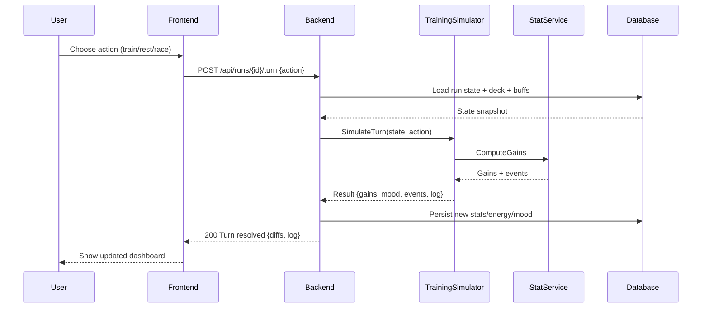

# SEQ-002: Training Block Resolution

## Umamusume Pretty Derby Career Planner

**Document Version**: 1.0  
**Date**: January 14, 2026  
**Related Documents**: [PRD-001], [SPEC-002], [FLOW-002]

**Source Specs**:

- `.kiro/specs/umamusume-career-planner-main/requirements.md` (Requirement 2: Training Prediction Engine)
- `.kiro/specs/umamusume-career-planner-main/design.md` (Training Resolution Flow)

**Related Artifacts**:

- PRD: [PRD-002](../prds/PRD-002_Training_Optimization.md)
- SPEC: [SPEC-002](../specs/SPEC-002_Training_Optimization_Technical.md)
- Flow: [FLOW-002](../flows/FLOW-002_Training_Optimization_System.md)
- Tech Flow: [TECH-FLOW-002](../tech-flow/TECH-FLOW-002_Training_Optimization_Flow.md)
- Wireframes: [WF-004](../wireframes/WF-004_Training_Selection_Interface.md), [WF-005](../wireframes/WF-005_Training_Result_Screen.md)
- User Flows: [UF-003](../user-flows/UF-003_Training_Day_Flow.md)

---

## Sequence Overview

- Resolves a single turn: fetch context, simulate training/race/rest, apply gains, update mood/energy, persist.

## Sequence Diagram

