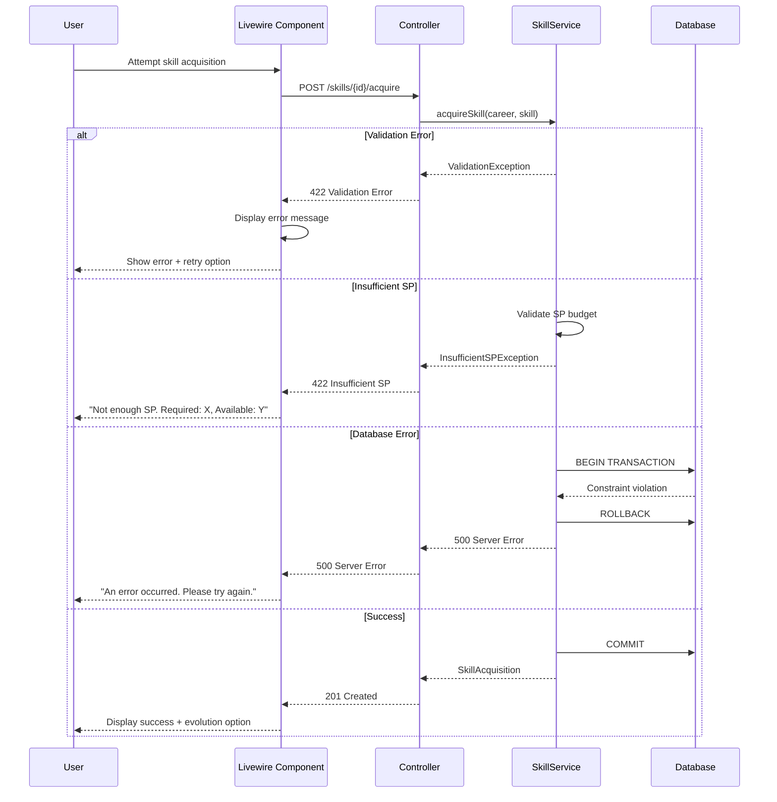

# SEQ-003: Skill Acquisition and Upgrade

## Umamusume Pretty Derby Career Planner

**Document Version**: 2.2.0
**Date**: January 28, 2026
**Related Documents**: [PRD-004], [SPEC-004], [FLOW-004], [TECH-FLOW-004]

---

## Table of Contents

1. [Overview](#1-overview)
2. [Participants](#2-participants)
3. [Sequence Flow](#3-sequence-flow)
4. [Detailed Interactions](#4-detailed-interactions)
5. [Data Structures](#5-data-structures)
6. [Error Handling](#6-error-handling)
7. [Performance Considerations](#7-performance-considerations)
8. [Related Documentation](#8-related-documentation)

---

## 1. Overview

### 1.1 Purpose

This sequence diagram documents skill acquisition and upgrade behavior at a technical level.
`StorageMode::ACCOUNT` acquisition and evolution are database-backed as `SkillAcquisition` records.
`StorageMode::LOCAL` skill planning and hint visibility should be treated as browser-managed or
advisory-only unless explicitly converted into account-backed persistence.

### 1.2 Scope

**Covers:**

- Skill catalog browsing and search
- Skill hint tracking and SP cost calculation
- Skill acquisition with validation
- Skill evolution from Normal to Rare
- SP budget validation and enforcement
- Skill status management (Acquired, Skipped, Suggested)

**Related Artifacts:**

- PRD: [PRD-004](../02-prds/PRD-004_Skill_Management.md)
- SPEC: [SPEC-004](../02-specs/SPEC-004_Skill_Management_Technical.md)
- Flow: [FLOW-004](../01-flows/FLOW-004_Skill_Management_System.md)
- Tech Flow: [TECH-FLOW-004](../01-tech-flow/TECH-FLOW-004_Skill_Management_Flow.md)
- Wireframe: [WF-008](../01-wireframes/WF-008_Skill_Shop_Interface.md),
[WF-009](../01-wireframes/WF-009_Skill_Loadout_Manager.md)
- User Flow: [UF-005](../01-user-flows/UF-005_Skill_Management_Flow.md)

### 1.3 Business Context

Skill management is a critical resource optimization workflow that:

- Enables strategic SP allocation across 78 turns
- Provides hint-based cost reduction (5 levels: 10%/20%/30%/35%/40% max)
- Supports skill evolution for enhanced effects
- Tracks skill acquisition history
- Manages active skill loadouts

**Success Criteria:**

- Skill acquired with correct SP deduction
- Hint discounts applied accurately (5 levels: 10%/20%/30%/35%/40%)
- Evolution paths validated before upgrade
- SP budget enforced (total_sp_available constraint)
- Skill status updated atomically

---

## 2. Participants

### 2.1 System Components

| Component | Type | Responsibility |
| --- | --- | --- |
| **User** | Actor | Initiates skill acquisition and management |
| **Livewire Component** | Presentation | `SkillCatalog.php`, `SkillAcquisition.php` - Skill browsing and purchase |
| **SkillController** | Application | Orchestrates skill operations |
| **SkillService** | Domain Service | Skill acquisition and evolution business logic |
| **SkillHintService** | Domain Service | Hint tracking and discount calculation for account-backed skill state; local-mode hint state remains browser-managed until conversion |
| **SkillEvolutionService** | Domain Service | Evolution path validation and execution |
| **Database** | Infrastructure | MySQL/MariaDB persistence layer |
| **EventDispatcher** | Infrastructure | Laravel event broadcasting |

**Storage-mode note:** `StorageMode::LOCAL` state may remain browser-managed and UUID-oriented until
converted through the storage transition flow documented in
[SEQ-017](SEQ-017_Storage_Mode_Transition.md).

### 2.2 Component Locations

```text

app/
├── Livewire/
│   └── Skills/
│       ├── SkillCatalog.php
│       ├── SkillAcquisition.php
│       └── SkillLoadout.php
├── Http/
│   └── Controllers/
│       └── SkillController.php
├── Services/
│   ├── SkillService.php
│   ├── SkillHintService.php
│   └── SkillEvolutionService.php
└── Models/
    ├── Skill.php
    ├── SkillHint.php
    └── SkillAcquisition.php

```

---

## 3. Sequence Flow

### 3.1 High-Level Flow Diagram

```mermaid
sequenceDiagram
    actor User
    participant UI as Skill UI
    participant Controller as SkillController
    participant SkillSvc as SkillService
    participant DB as Database
    participant Local as Browser localStorage

    User->>UI: Browse skill catalog

    alt StorageMode::ACCOUNT
        User->>Controller: Acquire or evolve skill
        Controller->>Controller: Authorize account-backed mutation
        Controller->>SkillSvc: Execute acquisition/evolution
        SkillSvc->>DB: Persist SkillAcquisition and related updates
        SkillSvc-->>Controller: Updated result
        Controller-->>UI: Account-backed success or error
    else StorageMode::LOCAL
        User->>UI: Plan skill purchase or view hint-adjusted cost
        UI->>Local: Update local skill planning state
        Local-->>UI: Updated local plan
    end
```text

### 3.2 Timeline Breakdown

| Phase | Duration | Description |
| --- | --- | --- |
| **Catalog Load** | ~150ms | Load skills with hints and costs |
| **User Selection** | Variable | User browses and selects skill |
| **Cost Calculation** | ~50ms | Calculate hint-based discount |
| **Validation** | ~100ms | Validate SP budget and requirements |
| **Database Transaction** | ~200ms | Insert acquisition, update SP, mark hints used |
| **Evolution Check** | ~50ms | Check if evolution path available |
| **Event Dispatch** | ~30ms | Queue event listeners |
| **UI Update** | ~100ms | Update component state |
| **Total (Acquisition)** | ~350ms | Server-side processing time |
| **Total (Evolution)** | ~250ms | Additional evolution processing |

---

## 4. Detailed Interactions

### 4.1 Skill Catalog Loading

**Request Flow:**

```
User → Livewire Component → SkillController → SkillService
```text

**Controller Action:**

```php
// SkillController.php
public function index(Career $career)
{
    $skills = $this->skillService->getAvailableSkills($career);

    return view('livewire.skills.catalog', [
        'skills' => $skills,
        'totalSP' => $career->total_sp_available,
    ]);
}
```

**Service Implementation:**

```php
// SkillService.php
public function getAvailableSkills(Career $career): Collection
{
    $acquiredSkillIds = $career->skillAcquisitions()
        ->where('is_active', true)
        ->pluck('skill_id')
        ->toArray();

    $skills = Skill::whereNotIn('id', $acquiredSkillIds)
        ->with('evolutionTarget')
        ->get();

    return $skills->map(function ($skill) use ($career) {
        $hintCount = $this->hintService->getHintCount($career, $skill);
        $finalCost = $this->calculateFinalCost($skill->base_sp_cost, $hintCount);

        return [
            'id' => $skill->id,
            'name' => $skill->name,
            'name_jp' => $skill->name_jp,
            'rarity' => $skill->rarity,
            'skill_type' => $skill->skill_type,
            'base_sp_cost' => $skill->base_sp_cost,
            'hint_count' => $hintCount,
            'discount_percentage' => min($hintCount * 20, 40),
            'final_sp_cost' => $finalCost,
            'can_afford' => $career->total_sp_available >= $finalCost,
            'has_evolution' => $skill->evolutionTarget !== null,
            'effects' => $skill->effects,
        ];
    });
}
```text

### 4.2 Hint-Based Cost Calculation (Game-Accurate - Global English Server Jan 2026)

**Calculation Rules:**

The hint system provides progressive SP cost discounts with 5 levels:

| Hint Level | Discount | Cumulative | Multiplier | Example (160 SP base) |
| --- | --- | --- | --- | --- |
| 0 hints | 0% | 0% | 1.00 | 160 SP |
| 1 hint | 10% | 10% | 0.90 | 144 SP |
| 2 hints | 10% | 20% | 0.80 | 128 SP |
| 3 hints | 10% | 30% | 0.70 | 112 SP |
| 4 hints | 5% | 35% | 0.65 | 104 SP |
| 5 hints | 5% | 40% (MAX) | 0.60 | 96 SP |

**Additional Discount Sources:**

| Source | Discount | Stacking |
| --- | --- | --- |
| Fast Learner Condition | +10% | Additive with hints |
| Skill Sparks (Inheritance) | Variable | Based on star rating |
| Hint Books | +1 hint level | Green (Normal), Gold (Rare) |

**Calculation Implementation:**

```php
// SkillService.php
private function calculateFinalCost(int $baseCost, int $hintLevel, bool $hasFastLearner = false): int
{
    // Game-accurate hint discounts: 10%/10%/10%/5%/5% = 40% max
    $hintDiscount = match($hintLevel) {
        0 => 0.00,
        1 => 0.10,
        2 => 0.20,
        3 => 0.30,
        4 => 0.35,
        5 => 0.40,
        default => 0.40, // Cap at 40%
    };

    // Fast Learner adds +10% additional discount
    $fastLearnerDiscount = $hasFastLearner ? 0.10 : 0.00;

    // Discounts are additive, capped at 50%
    $totalDiscount = min(0.50, $hintDiscount + $fastLearnerDiscount);

    return (int) ceil($baseCost * (1 - $totalDiscount));
}
```

**Hint Service:**

```php
// SkillHintService.php
public function getHintCount(Career $career, Skill $skill): int
{
    return SkillHint::where('career_id', $career->id)
        ->where('skill_id', $skill->id)
        ->where('is_used', false)
        ->count();
}

public function markHintsAsUsed(Career $career, Skill $skill): void
{
    SkillHint::where('career_id', $career->id)
        ->where('skill_id', $skill->id)
        ->where('is_used', false)
        ->update(['is_used' => true]);
}
```text

### 4.3 Skill Acquisition Transaction

**Transaction Scope:**

```php
// SkillService.php
public function acquireSkill(Career $career, Skill $skill): SkillAcquisition
{
    return DB::transaction(function () use ($career, $skill) {
        // 1. Get hint count
        $hintCount = $this->hintService->getHintCount($career, $skill);

        // 2. Calculate final cost
        $finalCost = $this->calculateFinalCost($skill->base_sp_cost, $hintCount);

        // 3. Validate SP budget
        if ($career->total_sp_available < $finalCost) {
            throw new InsufficientSPException(
                "Insufficient SP. Required: {$finalCost}, Available: {$career->total_sp_available}"
            );
        }

        // 4. Create acquisition record
        $acquisition = SkillAcquisition::create([
            'career_id' => $career->id,
            'skill_id' => $skill->id,
            'turn_acquired' => $career->current_turn,
            'sp_cost_paid' => $finalCost,
            'base_sp_cost' => $skill->base_sp_cost,
            'hint_count_used' => $hintCount,
            'is_active' => true,
            'is_evolution' => false,
        ]);

        // 5. Deduct SP from budget
        $career->decrement('total_sp_available', $finalCost);

        // 6. Mark hints as used
        $this->hintService->markHintsAsUsed($career, $skill);

        // 7. Check for evolution availability
        if ($skill->evolutionTarget) {
            $acquisition->evolution_available = $this->evolutionService
                ->checkEvolutionRequirements($career, $skill);
        }

        // 8. Dispatch event
        event(new SkillAcquired($career, $skill, $acquisition));

        return $acquisition;
    });
}
```

**Database Operations:**

1. `SELECT COUNT(*) FROM skill_hints` - Get hint count
2. `INSERT INTO skill_acquisitions` - Create acquisition record
3. `UPDATE careers SET total_sp_available = total_sp_available - ?` - Deduct SP
4. `UPDATE skill_hints SET is_used = true` - Mark hints used
5. `SELECT * FROM skills WHERE id = ?` - Check evolution target (if applicable)

**Total Queries:** 4-5 queries per acquisition

### 4.4 Skill Evolution

**Evolution Requirements:**

- Base skill must be acquired
- Base skill must have evolution_target_id defined
- Evolution target must exist in catalog
- No additional SP cost required (one-time upgrade)

**Evolution Service:**

```php
// SkillEvolutionService.php
public function evolveSkill(SkillAcquisition $acquisition): SkillAcquisition
{
    $baseSkill = $acquisition->skill;

    if (!$baseSkill->evolutionTarget) {
        throw new NoEvolutionPathException("Skill {$baseSkill->name} has no evolution path");
    }

    return DB::transaction(function () use ($acquisition, $baseSkill) {
        // Update acquisition to point to evolved skill
        $acquisition->update([
            'skill_id' => $baseSkill->evolution_target_id,
            'is_evolution' => true,
            'evolved_at' => now(),
            'base_skill_id' => $baseSkill->id,
        ]);

        event(new SkillEvolved($acquisition->career, $baseSkill, $baseSkill->evolutionTarget));

        return $acquisition->fresh();
    });
}

public function checkEvolutionRequirements(Career $career, Skill $skill): bool
{
    if (!$skill->evolutionTarget) {
        return false;
    }

    // Evolution is always available if target exists (no additional requirements in base system)
    return true;
}
```text

**Evolution Example:**

| Base Skill (Normal) | Evolved Skill (Rare) |
| --- | --- |
| Go with the Flow | Lane Legerdemain |
| Stamina Boost | Endurance Master |
| Acceleration | Explosive Speed |

---

## 5. Data Structures

### 5.1 Skill Catalog Request

**Query Parameters:**

```json
{
  "career_id": 157,
  "filter": {
    "rarity": ["normal", "rare"],
    "skill_type": ["speed", "stamina"],
    "affordable_only": true
  },
  "sort": "final_cost",
  "order": "asc"
}
```

### 5.2 Skill Catalog Response

```json
{
  "skills": [
    {
      "id": 42,
      "name": "Lane Guidance",
      "name_jp": "レーンガイダンス",
      "rarity": "normal",
      "skill_type": "speed",
      "base_sp_cost": 120,
      "hint_count": 2,
      "discount_percentage": 40,
      "final_sp_cost": 72,
      "can_afford": true,
      "has_evolution": true,
      "evolution_target": {
        "id": 215,
        "name": "Lane Legerdemain",
        "rarity": "rare"
      },
      "effects": {
        "description": "Slightly reduces SP consumption when changing lanes",
        "activation_rate": "Medium"
      }
    },
    {
      "id": 18,
      "name": "Going Strong",
      "name_jp": "良バ場◎",
      "rarity": "normal",
      "skill_type": "universal",
      "base_sp_cost": 100,
      "hint_count": 0,
      "discount_percentage": 0,
      "final_sp_cost": 100,
      "can_afford": true,
      "has_evolution": false,
      "effects": {
        "description": "Increases speed on good track condition",
        "activation_condition": "Good track"
      }
    }
  ],
  "career_context": {
    "total_sp_available": 450,
    "current_turn": 45,
    "acquired_skill_count": 8
  }
}
```text

### 5.3 Skill Acquisition Request

```json
{
  "career_id": 157,
  "skill_id": 42
}
```

### 5.4 Skill Acquisition Response

```json
{
  "success": true,
  "acquisition": {
    "id": 89,
    "career_id": 157,
    "skill_id": 42,
    "skill_name": "Lane Guidance",
    "turn_acquired": 45,
    "sp_cost_paid": 72,
    "base_sp_cost": 120,
    "hint_count_used": 2,
    "discount_percentage": 40,
    "is_active": true,
    "is_evolution": false,
    "evolution_available": true
  },
  "updated_sp_balance": 378,
  "message": "Skill 'Lane Guidance' acquired for 72 SP (40% discount from 2 hints)"
}
```text

### 5.5 Skill Evolution Request

```json
{
  "acquisition_id": 89
}
```

### 5.6 Skill Evolution Response

```json
{
  "success": true,
  "evolution": {
    "id": 89,
    "career_id": 157,
    "skill_id": 215,
    "skill_name": "Lane Legerdemain",
    "base_skill_id": 42,
    "base_skill_name": "Lane Guidance",
    "is_evolution": true,
    "evolved_at": "2026-01-24T10:30:00Z"
  },
  "message": "Skill evolved from 'Lane Guidance' to 'Lane Legerdemain'"
}
```text

---

## 6. Error Handling

### 6.1 Validation Errors

| Error Code | Condition | HTTP Status | User Message |
| --- | --- | --- | --- |
| `SKILL_001` | Career not found | 404 | "Career run not found" |
| `SKILL_002` | Skill not found | 404 | "Skill not found in catalog" |
| `SKILL_003` | Insufficient SP | 422 | "Insufficient SP. Required: {cost}, Available: {balance}" |
| `SKILL_004` | Skill already acquired | 422 | "Skill already acquired in this career" |
| `SKILL_005` | No evolution path | 422 | "This skill has no evolution available" |
| `SKILL_006` | Evolution requirements not met | 422 | "Evolution requirements not met" |
| `SKILL_007` | Invalid skill status | 422 | "Invalid skill status value" |

### 6.2 Error Recovery Flow



### 6.3 Transaction Rollback Scenarios

| Scenario | Trigger | Recovery |
| --- | --- | --- |
| Constraint violation | Duplicate skill acquisition | Rollback, display error |
| Foreign key error | Invalid skill_id reference | Rollback, re-validate catalog |
| SP budget violation | Concurrent SP deduction | Rollback, refresh SP balance |
| Hint marking failure | SkillHint update error | Rollback, retry transaction |

---

## 7. Performance Considerations

### 7.1 Performance Metrics

| Operation | Target | Current | Status |
| --- | --- | --- | --- |
| Catalog load (100 skills) | <500ms | ~350ms | ✅ Met |
| Skill search/filter | <200ms | ~150ms | ✅ Met |
| Skill acquisition | <350ms | ~280ms | ✅ Met |
| Skill evolution | <250ms | ~200ms | ✅ Met |
| Hint count calculation | <100ms | ~50ms | ✅ Met |

### 7.2 Optimization Strategies

**Implemented:**

- Eager loading of evolution targets
- Hint count pre-calculation and caching
- Database indexing on foreign keys
- Batch hint marking in single UPDATE

**Code Example:**

```php
// Optimized skill loading with eager loading
$skills = Skill::whereNotIn('id', $acquiredSkillIds)
    ->with([
        'evolutionTarget',
        'skillType',
    ])
    ->select(['id', 'name', 'name_jp', 'rarity', 'skill_type', 'base_sp_cost', 'evolution_target_id'])
    ->get();
```text

### 7.3 Database Query Analysis

**Query Count for Full Acquisition:**

- Catalog load: 2 queries (skills + acquired IDs)
- Hint count: 1 query per skill (optimized to batch)
- Acquisition: 4 queries (insert + update + hint marking + event)

**Total Queries:** 2-6 queries per acquisition

**Index Usage:**

```sql
-- Critical indexes for skill acquisition
CREATE INDEX idx_skill_acquisitions_career_active ON ucp_skill_acquisitions(career_id, is_active);
CREATE INDEX idx_skill_hints_career_skill_unused ON ucp_skill_hints(career_id, skill_id, is_used);
CREATE INDEX idx_skills_evolution ON ucp_skills(evolution_target_id);
CREATE INDEX idx_skills_rarity_type ON ucp_skills(rarity, skill_type);
```

### 7.4 Cache Strategy

**Cache Keys:**

- Skill catalog: `skills.catalog.career.{id}`
- Hint counts: `skill.hints.career.{career_id}.skill.{skill_id}`
- TTL: 5 minutes

**Cache Invalidation:**

```php
// Invalidate on acquisition
$this->cache->forget("skills.catalog.career.{$career->id}");
$this->cache->forget("skill.hints.career.{$career->id}.skill.{$skill->id}");

// Invalidate on hint received (via training)
$this->cache->forget("skill.hints.career.{$career->id}.*");
```text

---

## 8. Related Documentation

### 8.1 System Documentation

| Document | Description |
| --- | --- |
| [PRD-004](../02-prds/PRD-004_Skill_Management.md) | Product requirements for skill management |
| [SPEC-004](../02-specs/SPEC-004_Skill_Management_Technical.md) | Technical specification for skill system |
| [FLOW-004](../01-flows/FLOW-004_Skill_Management_System.md) | System flow for skill operations |
| [TECH-FLOW-004](../01-tech-flow/TECH-FLOW-004_Skill_Management_Flow.md) | Technical flow diagrams |

### 8.2 Related Sequences

| Sequence | Description |
| --- | --- |
| [SEQ-001](SEQ-001_Character_Creation_Sequence.md) | Character creation (initializes skill budget) |
| [SEQ-002](SEQ-002_Training_Block_Resolution.md) | Training execution (generates skill hints) |
| [SEQ-004](SEQ-004_Race_Registration_and_Outcome.md) | Race completion (awards SP) |

### 8.3 UI Documentation

| Document | Description |
| --- | --- |
| [WF-008](../01-wireframes/WF-008_Skill_Shop_Interface.md) | Wireframe specification for skill catalog |
| [WF-009](../01-wireframes/WF-009_Skill_Loadout_Manager.md) | Skill loadout management wireframe |
| [UF-005](../01-user-flows/UF-005_Skill_Management_Flow.md) | User flow for skill management |

### 8.4 Database Documentation

| Document | Description |
| --- | --- |
| [DBD-009](../00-core-docs/009_DBD_Database_Documentation.md) | Complete database schema documentation |

---

## Document Control

### Version History

| Version | Date | Author | Changes |
| --- | --- | --- | --- |
| 2.0.0 | 2026-01-24 | Development Team | Complete rewrite aligned with v2.0.0 implementation; added detailed sequence flows, hint calculation logic, evolution system, performance metrics, and aligned with current Laravel 12 architecture |
| 1.0.0 | 2026-01-14 | Development Team | Initial draft |

### Approval

| Role | Name | Signature | Date |
| --- | --- | --- | --- |
| Technical Lead | | | |
| QA Lead | | | |

### Review Schedule

- Next Review: 2026-04-24
- Review Frequency: Quarterly or on major feature changes

---

**Related Standards:**

- Laravel 12 Best Practices
- PSR-12 Coding Standards
- Mermaid Diagram Standards
- IEEE 830 SRS Format

---

*This sequence diagram reflects the current implementation of the skill acquisition and evolution
workflow as of v2.0.0. For the most up-to-date information, refer to the source code in
`app/Services/SkillService.php`, `app/Services/SkillHintService.php`,
`app/Services/SkillEvolutionService.php`, and related files.*
