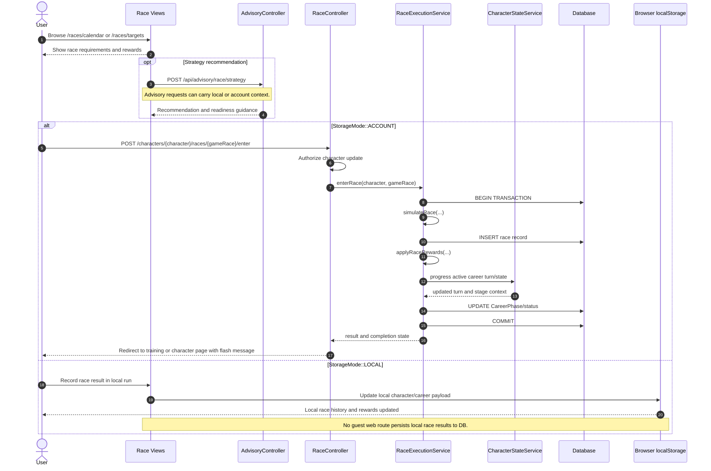
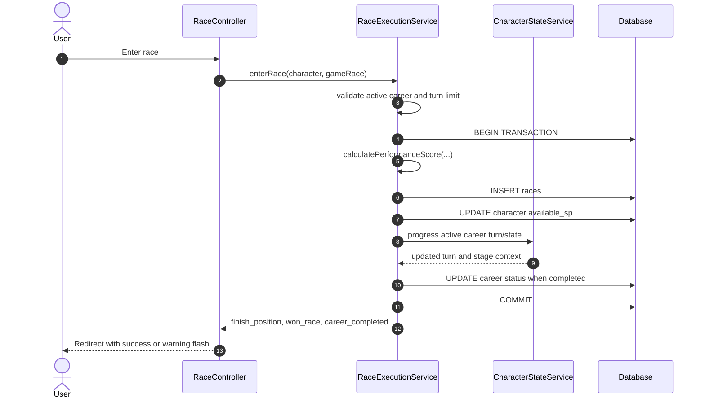

# SEQ-004: Race Registration and Outcome

## Umamusume Pretty Derby Career Planner

**Document Version**: 2.4.2
**Date**: April 7, 2026
**Related Documents**: [PRD-003], [SPEC-003], [FLOW-003], [FLOW-008], [TECH-FLOW-003]

---

## 1. Overview

### 1.1 Purpose

This sequence diagram documents the current race workflow in the repository. It separates race
browsing and advisory preparation from the concrete account-mode entry flow handled by
`RaceController::enter()` and `RaceExecutionService`.

### 1.2 Scope

**Covers:**

- Calendar and target-race browsing
- Optional race-strategy advisory requests
- Account-mode race entry through `RaceController::enter()`
- `RaceExecutionService` result simulation, reward application, and turn progression
- Local-mode result tracking boundary

### 1.3 Implementation Notes

- The concrete entry route is `POST /characters/{character}/races/{gameRace}/enter`.
- `RaceController::enter()` authorizes against `CharacterPolicy::update()` before execution.
- `RaceExecutionService` owns race simulation, reward application, turn progression, and race persistence.
- `RaceConditionService` exists for weather and track-condition penalty logic; it is not the web
entry service for account-mode race execution.
- Guest/local runs do not have an equivalent server-side web race-entry route in the current implementation.

---

## 2. Participants

| Component | Type | Responsibility |
| --- | --- | --- |
| **User** | Actor | Browses races and enters a character into a race |
| **Race Views** | Presentation | Calendar, target, and race-detail pages |
| **RaceController** | Application | Orchestrates account-mode race entry |
| **RaceExecutionService** | Domain Service | Simulates race outcomes and records rewards |
| **RaceConditionService** | Domain Service | Supplies condition-penalty logic for analysis features |
| **CharacterStateService** | Domain Service | Advances turns and `CareerPhase` state during race execution |
| **AdvisoryController** | API Controller | Provides optional storage-aware race strategy guidance |
| **Database** | Infrastructure | Persists `races`, `careers`, and `characters` |
| **Browser localStorage** | Client Storage | Holds local-mode race results for guest runs |

---

## 3. Sequence Flow

### 3.1 Preparation and Storage-Aware Entry

### 3.2 Account-Mode Execution Details

---

## 4. Detailed Interactions

### 4.1 Preparation

- `RaceController::calendar()` and `RaceController::targets()` render the current browsing surfaces.
- The older `/races/{id}/analyze` endpoint is not the active web flow represented by current routes.
- Storage-aware race guidance is better represented by the advisory APIs than by a separate web analysis action.

### 4.2 Account Mode

- The race-entry path requires a database-backed character and authorization.
- `RaceExecutionService` calculates performance from current stats, race requirements, distance
category, and grade modifier.
- Performance calculation considers surface aptitude, distance aptitude, running-style aptitude,
equipped skill bonuses, and active weather/track-condition modifiers.
- The service records the race, adds SP rewards, and advances the turn through `CharacterStateService`.
- Career completion is derived from the updated turn count rather than from a separate grade-progression service.

### 4.3 Local Mode

- Local-mode runs still need race outcome tracking, but the browser owns that state.
- UUID-oriented identifiers remain on the client until conversion.
- Advisory endpoints can still analyze local race context because they accept explicit `storage_mode` values.

### 4.4 Clarifications

- Aptitude grades remain `G` through `S`; this document no longer mixes aptitude grades with other rank systems.
- `RaceConditionService` is documented here only for its actual responsibility: condition penalties
and analysis support.
- The account-mode web race flow is documented in more detail in
[FLOW-008](../01-flows/FLOW-008_Race_Entry_and_Result_System.md).

---

## 5. Error Handling

- Missing active career or turn exhaustion returns an error message and redirect.
- Authorization failures are handled before the race service executes.
- Local-mode race tracking issues remain client-side until conversion or export.

---

## 6. Related Documentation

- [FLOW-003](../01-flows/FLOW-003_Race_Strategy_System.md)
- [FLOW-008](../01-flows/FLOW-008_Race_Entry_and_Result_System.md)
- [SEQ-017](SEQ-017_Storage_Mode_Transition.md)
---

## Document Control

### Version History

| Version | Date | Author | Changes |
| --- | --- | --- | --- |
| 2.4.2 | 2026-04-07 | Development Team | Standardized version and formatting across sequence documentation suite |
| 2.0.0 | 2026-01-24 | Development Team | Complete rewrite aligned with v2.0.0 implementation baseline |
| 1.0.0 | 2026-01-14 | Development Team | Initial draft |

### Approval

| Role | Name | Signature | Date |
| --- | --- | --- | --- |
| Technical Lead | | | |
| QA Lead | | | |

### Review Schedule

- Next Review: 2026-07-07
- Review Frequency: Quarterly or on major feature changes

---

**Related Standards:**

- Laravel 12 Best Practices
- PSR-12 Coding Standards
- Mermaid Diagram Standards
- KRISA Documentation Format

---

*This sequence diagram reflects the current implementation as of v2.4.2. For the most up-to-date information, refer to the source code and related documentation.*
