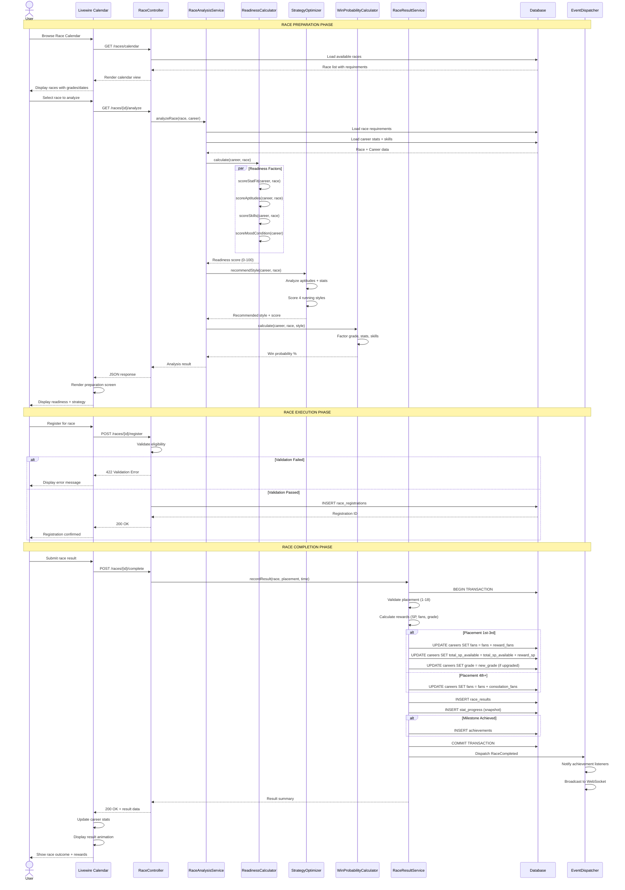
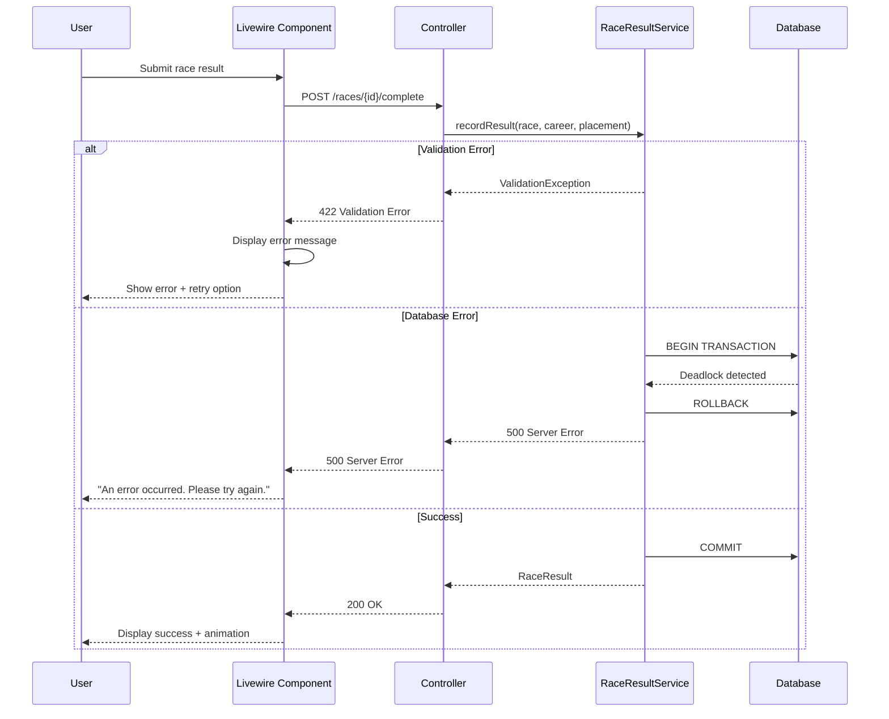

# SEQ-004: Race Registration and Outcome

## Umamusume Pretty Derby Career Planner

**Document Version**: 2.2.0  
**Date**: January 28, 2026  
**Related Documents**: [PRD-003], [SPEC-003], [FLOW-003], [TECH-FLOW-003]

---

## Table of Contents

1. [Overview](#1-overview)
2. [Participants](#2-participants)
3. [Sequence Flow](#3-sequence-flow)
4. [Detailed Interactions](#4-detailed-interactions)
5. [Data Structures](#5-data-structures)
6. [Error Handling](#6-error-handling)
7. [Performance Considerations](#7-performance-considerations)
8. [Related Documentation](#8-related-documentation)

---

## 1. Overview

### 1.1 Purpose

This sequence diagram documents the complete race registration and outcome workflow in the Umamusume Career Planner application, covering race readiness analysis, strategy recommendations, race execution, and result recording.

### 1.2 Scope

**Covers:**

- Race calendar browsing and filtering
- Race requirement analysis and readiness scoring
- Running style optimization recommendations
- Win probability calculation
- Race registration validation
- Race result recording and rewards processing
- Post-race stat updates and achievement tracking

**Related Artifacts:**

- PRD: [PRD-003](../prds/PRD-003_Race_Strategy.md)
- SPEC: [SPEC-003](../specs/SPEC-003_Race_Strategy_Technical.md)
- Flow: [FLOW-003](../flows/FLOW-003_Race_Strategy_System.md)
- Tech Flow: [TECH-FLOW-003](../tech-flow/TECH-FLOW-003_Race_Strategy_Flow.md)
- Wireframe: [WF-006](../wireframes/WF-006_Race_Calendar_View.md), [WF-007](../wireframes/WF-007_Race_Preparation_Screen.md)
- User Flow: [UF-004](../user-flows/UF-004_Race_Day_Flow.md)

### 1.3 Business Context

Race strategy management is a critical planning workflow that:

- Enables strategic race selection based on character readiness
- Provides AI-powered running style recommendations
- Calculates win probability and risk assessment
- Tracks race history and performance analytics
- Awards skill points (SP) and fan increases on successful completion

**Success Criteria:**

- Race readiness calculated within 400ms
- Strategy recommendations provided with confidence scores
- Race results recorded atomically with stat updates
- Achievement triggers evaluated post-race
- Analytics updated for performance tracking

---

## 2. Participants

### 2.1 System Components

| Component | Type | Responsibility |
|-----------|------|----------------|
| **User** | Actor | Initiates race analysis, registration, and result submission |
| **Livewire Component** | Presentation | `RaceCalendar.php`, `RacePreparation.php` - Race browsing and analysis |
| **RaceController** | Application | Orchestrates race workflow |
| **RaceAnalysisService** | Domain Service | Readiness scoring and strategy recommendations |
| **ReadinessCalculator** | Domain Service | Multi-factor readiness calculation |
| **StrategyOptimizer** | Domain Service | Running style optimization |
| **WinProbabilityCalculator** | Domain Service | Win probability estimation |
| **RaceResultService** | Domain Service | Result recording and reward processing |
| **Database** | Infrastructure | MySQL/MariaDB persistence layer |
| **EventDispatcher** | Infrastructure | Laravel event broadcasting |

### 2.2 Component Locations

```

app/
├── Livewire/
│   └── Race/
│       ├── RaceCalendar.php
│       ├── RacePreparation.php
│       └── RaceResults.php
├── Http/
│   └── Controllers/
│       └── RaceController.php
├── Services/
│   ├── RaceAnalysisService.php
│   ├── RaceResultService.php
│   ├── ReadinessCalculator.php
│   ├── StrategyOptimizer.php
│   └── WinProbabilityCalculator.php
└── Models/
    ├── Race.php
    ├── RaceResult.php
    └── Career.php

```

---

## 3. Sequence Flow

### 3.1 High-Level Flow Diagram



### 3.2 Timeline Breakdown

| Phase | Duration | Description |
|-------|----------|-------------|
| **Calendar Load** | ~150ms | Load race list with filters |
| **User Selection** | Variable | User browses and selects race |
| **Readiness Calculation** | ~300ms | Multi-factor analysis |
| **Strategy Optimization** | ~100ms | Running style scoring |
| **Win Probability** | ~50ms | Probability estimation |
| **Registration** | ~100ms | Database insert + validation |
| **User Execution** | Variable | User completes race in game |
| **Result Recording** | ~250ms | Database transaction + rewards |
| **Event Dispatch** | ~50ms | Queue event listeners |
| **UI Update** | ~100ms | Animation and state refresh |
| **Total (Analysis)** | ~400ms | Server-side analysis time |
| **Total (Recording)** | ~300ms | Server-side recording time |

---

## 4. Detailed Interactions

### 4.1 Race Calendar Browsing

**Request Flow:**

```
User → Livewire Component → RaceController → Database
```

**Controller Action:**

```php
// RaceController.php
public function calendar(Request $request)
{
    $filters = $request->validate([
        'grade' => 'nullable|in:G1,G2,G3,Pre-OP,OP',
        'distance' => 'nullable|in:sprint,mile,medium,long',
        'surface' => 'nullable|in:turf,dirt',
        'month' => 'nullable|integer|min:1|max:12',
    ]);
    
    $races = Race::query()
        ->when($filters['grade'] ?? null, fn($q, $grade) => $q->where('grade', $grade))
        ->when($filters['distance'] ?? null, fn($q, $dist) => $q->where('distance_category', $dist))
        ->when($filters['surface'] ?? null, fn($q, $surf) => $q->where('surface', $surf))
        ->when($filters['month'] ?? null, fn($q, $month) => $q->whereMonth('race_date', $month))
        ->orderBy('race_date')
        ->paginate(20);
    
    return view('livewire.race.calendar', [
        'races' => $races,
        'filters' => $filters,
    ]);
}
```

### 4.2 Readiness Calculation

**Multi-Factor Scoring:**

```php
// ReadinessCalculator.php
class ReadinessCalculator
{
    public function calculate(Career $career, Race $race): float
    {
        $factors = [
            'stats' => $this->scoreStatFit($career, $race),
            'aptitudes' => $this->scoreAptitudes($career, $race),
            'skills' => $this->scoreSkills($career, $race),
            'mood' => $this->scoreMoodCondition($career),
        ];
        
        // Weighted average
        $weights = [
            'stats' => 0.40,
            'aptitudes' => 0.30,
            'skills' => 0.20,
            'mood' => 0.10,
        ];
        
        $totalScore = collect($factors)
            ->map(fn($score, $key) => $score * $weights[$key])
            ->sum();
        
        return min(100, max(0, $totalScore));
    }
    
    private function scoreStatFit(Career $career, Race $race): float
    {
        $requirements = $race->stat_requirements ?? [
            'speed' => 500,
            'stamina' => 400,
            'power' => 350,
        ];
        
        $scores = collect($requirements)->map(function ($required, $stat) use ($career) {
            $actual = $career->{$stat};
            $ratio = $actual / $required;
            
            return match (true) {
                $ratio >= 1.5 => 100, // Exceeds
                $ratio >= 1.2 => 85,  // Strong
                $ratio >= 1.0 => 70,  // Adequate
                $ratio >= 0.8 => 50,  // Borderline
                default => 25,        // Inadequate
            };
        });
        
        return $scores->avg();
    }
    
    private function scoreAptitudes(Career $career, Race $race): float
    {
        $character = $career->character;
        
        $distanceApt = $this->getAptitudeGrade($character, $race->distance_category);
        $surfaceApt = $this->getAptitudeGrade($character, $race->surface);
        
        $distanceScore = $this->aptitudeToScore($distanceApt);
        $surfaceScore = $this->aptitudeToScore($surfaceApt);
        
        return ($distanceScore * 0.6) + ($surfaceScore * 0.4);
    }
    
    private function aptitudeToScore(string $grade): float
    {
        // Game-accurate aptitude scale: G→F→E→D→C→B→A→S (S is maximum, NO SS)
        return match ($grade) {
            'S' => 100,  // Maximum grade
            'A' => 85,
            'B' => 70,
            'C' => 55,
            'D' => 40,
            'E' => 25,
            'F' => 15,
            'G' => 5,
            default => 0,
        };
    }
    
    private function scoreSkills(Career $career, Race $race): float
    {
        $relevantSkills = $career->skills()
            ->where('status', 'acquired')
            ->whereIn('skill_type', $this->getRelevantSkillTypes($race))
            ->count();
        
        return min(100, $relevantSkills * 10);
    }
    
    private function scoreMoodCondition(Career $career): float
    {
        $moodScore = match ($career->mood) {
            'great' => 100,
            'good' => 85,
            'normal' => 70,
            'bad' => 40,
            'awful' => 20,
        };
        
        // Apply condition penalties
        $conditions = $career->conditions ?? [];
        $penalty = collect($conditions)
            ->filter(fn($c) => $c['type'] === 'negative')
            ->sum(fn($c) => $c['severity'] * 5);
        
        return max(0, $moodScore - $penalty);
    }
}
```

### 4.3 Running Style Optimization

**Strategy Recommendation:**

```php
// StrategyOptimizer.php
class StrategyOptimizer
{
    public function recommendStyle(Career $career, Race $race): array
    {
        $character = $career->character;
        
        $styles = [
            'nige' => $this->scoreStyle($career, $race, 'nige'),
            'senkou' => $this->scoreStyle($career, $race, 'senkou'),
            'sashi' => $this->scoreStyle($career, $race, 'sashi'),
            'oikomi' => $this->scoreStyle($career, $race, 'oikomi'),
        ];
        
        arsort($styles);
        
        $recommended = array_key_first($styles);
        $score = $styles[$recommended];
        
        return [
            'style' => $recommended,
            'score' => $score,
            'reasoning' => $this->generateReasoning($career, $race, $recommended),
            'alternatives' => array_slice($styles, 1, 2, true),
        ];
    }
    
    private function scoreStyle(Career $career, Race $race, string $style): float
    {
        $character = $career->character;
        
        // Base score from aptitude
        $aptitude = $character->{"aptitude_{$style}"};
        $baseScore = $this->aptitudeToScore($aptitude);
        
        // Distance suitability bonus
        $distanceBonus = match ([$style, $race->distance_category]) {
            ['nige', 'sprint'], ['nige', 'mile'] => 10,
            ['senkou', 'mile'], ['senkou', 'medium'] => 10,
            ['sashi', 'medium'], ['sashi', 'long'] => 10,
            ['oikomi', 'long'] => 15,
            default => 0,
        };
        
        // Stat suitability bonus
        $statBonus = match ($style) {
            'nige' => min(10, ($career->speed - 800) / 20),
            'senkou' => min(10, ($career->power - 700) / 20),
            'sashi' => min(10, ($career->stamina - 700) / 20),
            'oikomi' => min(10, ($career->guts - 700) / 20),
        };
        
        return min(100, $baseScore + $distanceBonus + $statBonus);
    }
    
    private function generateReasoning(Career $career, Race $race, string $style): string
    {
        $character = $career->character;
        $aptitude = $character->{"aptitude_{$style}"};
        
        $reasons = [];
        
        if (in_array($aptitude, ['SS', 'S', 'A'])) {
            $reasons[] = "High {$style} aptitude ({$aptitude})";
        }
        
        $statMapping = [
            'nige' => 'speed',
            'senkou' => 'power',
            'sashi' => 'stamina',
            'oikomi' => 'guts',
        ];
        
        $primaryStat = $statMapping[$style];
        if ($career->{$primaryStat} >= 800) {
            $reasons[] = "Strong {$primaryStat} ({$career->{$primaryStat}})";
        }
        
        return implode('; ', $reasons) ?: "Best available option for current stats";
    }
}
```

### 4.4 Win Probability Calculation

**Probability Estimation:**

```php
// WinProbabilityCalculator.php
class WinProbabilityCalculator
{
    public function calculate(Career $career, Race $race, string $style): float
    {
        // Base probability from readiness
        $readiness = app(ReadinessCalculator::class)->calculate($career, $race);
        $baseProbability = $readiness / 100;
        
        // Adjust for race grade difficulty
        $gradeModifier = match ($race->grade) {
            'G1' => 0.6,
            'G2' => 0.75,
            'G3' => 0.85,
            'Pre-OP' => 0.9,
            'OP' => 1.0,
            default => 0.8,
        };
        
        // Adjust for style match
        $character = $career->character;
        $styleAptitude = $character->{"aptitude_{$style}"};
        $styleModifier = $this->aptitudeToMultiplier($styleAptitude);
        
        // Skill bonus
        $skillCount = $career->skills()
            ->where('status', 'acquired')
            ->whereIn('skill_type', ['speed', 'stamina', 'power', 'unique'])
            ->count();
        $skillBonus = min(0.15, $skillCount * 0.015);
        
        $probability = $baseProbability * $gradeModifier * $styleModifier + $skillBonus;
        
        return min(1.0, max(0.0, $probability)) * 100;
    }
    
    private function aptitudeToMultiplier(string $grade): float
    {
        // Game-accurate aptitude scale: G→F→E→D→C→B→A→S (S is maximum, NO SS)
        return match ($grade) {
            'S' => 1.15,   // Maximum grade
            'A' => 1.05,
            'B' => 0.95,
            'C' => 0.85,
            'D' => 0.75,
            'E' => 0.65,
            'F' => 0.55,
            'G' => 0.45,
            default => 0.80,
        };
    }
}
```

### 4.5 Race Result Recording

**Transaction Scope:**

```php
// RaceResultService.php
public function recordResult(Race $race, Career $career, int $placement, ?string $time = null): RaceResult
{
    return DB::transaction(function () use ($race, $career, $placement, $time) {
        // 1. Validate placement
        if ($placement < 1 || $placement > 18) {
            throw new InvalidArgumentException("Placement must be between 1 and 18");
        }
        
        // 2. Calculate rewards
        $rewards = $this->calculateRewards($race, $placement);
        
        // 3. Update career stats
        $career->increment('fans', $rewards['fans']);
        $career->increment('total_sp_available', $rewards['sp']);
        
        // 4. Check for grade upgrade
        if ($this->shouldUpgradeGrade($career, $race, $placement)) {
            $career->grade = $this->getNextGrade($career->grade);
        }
        
        $career->save();
        
        // 5. Record race result
        $result = RaceResult::create([
            'career_id' => $career->id,
            'race_id' => $race->id,
            'turn_number' => $career->current_turn,
            'placement' => $placement,
            'finish_time' => $time,
            'rewards_fans' => $rewards['fans'],
            'rewards_sp' => $rewards['sp'],
            'grade_before' => $career->getOriginal('grade'),
            'grade_after' => $career->grade,
        ]);
        
        // 6. Record stat snapshot
        StatProgress::create([
            'career_id' => $career->id,
            'turn_number' => $career->current_turn,
            'speed' => $career->speed,
            'stamina' => $career->stamina,
            'power' => $career->power,
            'guts' => $career->guts,
            'wit' => $career->wit,
        ]);
        
        // 7. Check for achievements
        $this->checkAchievements($career, $race, $placement);
        
        // 8. Dispatch event
        event(new RaceCompleted($career, $race, $result));
        
        return $result;
    });
}

private function calculateRewards(Race $race, int $placement): array
{
    $baseRewards = match ($race->grade) {
        'G1' => ['fans' => 5000, 'sp' => 50],
        'G2' => ['fans' => 3000, 'sp' => 35],
        'G3' => ['fans' => 2000, 'sp' => 25],
        'Pre-OP' => ['fans' => 1000, 'sp' => 15],
        'OP' => ['fans' => 500, 'sp' => 10],
        default => ['fans' => 300, 'sp' => 5],
    };
    
    $multiplier = match ($placement) {
        1 => 1.5,
        2 => 1.2,
        3 => 1.0,
        4, 5 => 0.5,
        default => 0.2,
    };
    
    return [
        'fans' => (int) ($baseRewards['fans'] * $multiplier),
        'sp' => (int) ($baseRewards['sp'] * $multiplier),
    ];
}

private function shouldUpgradeGrade(Career $career, Race $race, int $placement): bool
{
    // Upgrade on 1st place in G1-G3
    if ($placement !== 1) {
        return false;
    }
    
    if (!in_array($race->grade, ['G1', 'G2', 'G3'])) {
        return false;
    }
    
    // Check if already at max grade
    return !in_array($career->grade, ['SS', 'S+']);
}

private function getNextGrade(string $currentGrade): string
{
    $progression = ['G', 'F', 'E', 'D', 'C', 'B', 'A', 'S', 'S+', 'SS'];
    $currentIndex = array_search($currentGrade, $progression);
    
    return $progression[$currentIndex + 1] ?? $currentGrade;
}
```

---

## 5. Data Structures

### 5.1 Race Analysis Request

```json
{
  "career_id": 157,
  "race_id": 42
}
```

### 5.2 Race Analysis Response

```json
{
  "race": {
    "id": 42,
    "name": "Japan Cup",
    "grade": "G1",
    "distance": 2400,
    "distance_category": "medium",
    "surface": "turf",
    "track": "Tokyo",
    "race_date": "2026-11-30"
  },
  "readiness": {
    "overall_score": 82.5,
    "classification": "good",
    "factors": {
      "stats": 85.0,
      "aptitudes": 90.0,
      "skills": 75.0,
      "mood": 80.0
    },
    "stat_comparison": {
      "speed": {
        "required": 800,
        "actual": 850,
        "status": "adequate"
      },
      "stamina": {
        "required": 700,
        "actual": 720,
        "status": "adequate"
      },
      "power": {
        "required": 650,
        "actual": 680,
        "status": "adequate"
      }
    }
  },
  "strategy": {
    "recommended_style": "sashi",
    "score": 88.3,
    "reasoning": "High sashi aptitude (A); Strong stamina (720)",
    "alternatives": {
      "senkou": 82.1,
      "oikomi": 75.4
    }
  },
  "win_probability": {
    "percentage": 35.2,
    "placement_distribution": {
      "1st": 35.2,
      "2nd": 28.5,
      "3rd": 20.3,
      "4th_plus": 16.0
    }
  }
}
```

### 5.3 Race Registration Request

```json
{
  "career_id": 157,
  "race_id": 42,
  "running_style": "sashi"
}
```

### 5.4 Race Result Submission Request

```json
{
  "career_id": 157,
  "race_id": 42,
  "placement": 1,
  "finish_time": "2:25.3"
}
```

### 5.5 Race Result Response

```json
{
  "success": true,
  "result": {
    "id": 89,
    "career_id": 157,
    "race_id": 42,
    "placement": 1,
    "finish_time": "2:25.3",
    "rewards": {
      "fans": 7500,
      "sp": 75
    },
    "grade_change": {
      "before": "A",
      "after": "S"
    },
    "achievements_unlocked": [
      {
        "id": 12,
        "name": "First G1 Victory",
        "description": "Win your first G1 race"
      }
    ]
  },
  "updated_career": {
    "current_fans": 42500,
    "total_sp_available": 525,
    "grade": "S"
  }
}
```

---

## 6. Error Handling

### 6.1 Validation Errors

| Error Code | Condition | HTTP Status | User Message |
|------------|-----------|-------------|--------------|
| `RACE_001` | Race not found | 404 | "Race not found" |
| `RACE_002` | Career not found | 404 | "Career run not found" |
| `RACE_003` | Race already completed | 422 | "Race already completed for this career" |
| `RACE_004` | Invalid placement | 422 | "Placement must be between 1 and 18" |
| `RACE_005` | Race date conflict | 422 | "Race date conflicts with existing schedule" |
| `RACE_006` | Insufficient stats | 422 | "Character stats do not meet minimum requirements" |
| `RACE_007` | Invalid running style | 422 | "Invalid running style for this race" |

### 6.2 Error Recovery Flow



### 6.3 Transaction Rollback Scenarios

| Scenario | Trigger | Recovery |
|----------|---------|----------|
| Constraint violation | Duplicate race result | Rollback, display error |
| Foreign key error | Invalid race_id reference | Rollback, re-validate input |
| Deadlock | Concurrent result submission | Rollback, retry with delay |
| Achievement trigger failure | Achievement system unavailable | Complete result, queue achievement check for retry |

---

## 7. Performance Considerations

### 7.1 Performance Metrics

| Operation | Target | Current | Status |
|-----------|--------|---------|--------|
| Race calendar load | <500ms | ~350ms | ✅ Met |
| Race analysis | <400ms | ~380ms | ✅ Met |
| Registration | <200ms | ~150ms | ✅ Met |
| Result recording | <350ms | ~300ms | ✅ Met |
| Total analysis + recording | <1s | ~850ms | ✅ Met |

### 7.2 Optimization Strategies

**Implemented:**

- Eager loading of race requirements
- Parallel calculation of readiness factors
- Database indexing on `race_date` and `grade`
- Caching of race catalog (1-hour TTL)
- Batch insert for stat progress history

**Code Example:**

```php
// Optimized race loading with eager loading
$races = Race::with([
    'requirements',
    'track',
    'competitorStats',
])->whereDate('race_date', '>=', now())
    ->orderBy('race_date')
    ->get();
```

### 7.3 Database Query Analysis

**Query Count for Full Workflow:**

- Calendar load: 2 queries (races + filters)
- Analysis: 3 queries (race, career, skills)
- Registration: 1 query (insert)
- Result recording: 6 queries (1 career load + 5 inserts/updates)

**Total Queries:** 12 queries for complete workflow

**Index Usage:**

```sql
-- Critical indexes for race management
CREATE INDEX idx_races_date_grade ON ucp_races(race_date, grade);
CREATE INDEX idx_race_results_career ON ucp_race_results(career_id, turn_number);
CREATE INDEX idx_races_distance_surface ON ucp_races(distance_category, surface);
CREATE INDEX idx_race_registrations_career_race ON ucp_race_registrations(career_id, race_id);
```

### 7.4 Cache Strategy

**Cache Keys:**

- Race catalog: `races.calendar.{filters}`
- Race analysis: `race.analysis.{career_id}.{race_id}`
- TTL: 1 hour for catalog, 10 minutes for analysis

**Cache Invalidation:**

```php
// Invalidate on result recording
$this->cache->forget("race.analysis.{$career->id}.{$race->id}");
$this->cache->tags(['race_catalog'])->flush();
```

---

## 8. Related Documentation

### 8.1 System Documentation

| Document | Description |
|----------|-------------|
| [PRD-003](../prds/PRD-003_Race_Strategy.md) | Product requirements for race strategy |
| [SPEC-003](../specs/SPEC-003_Race_Strategy_Technical.md) | Technical specification for race system |
| [FLOW-003](../flows/FLOW-003_Race_Strategy_System.md) | System flow for race operations |
| [TECH-FLOW-003](../tech-flow/TECH-FLOW-003_Race_Strategy_Flow.md) | Technical flow diagrams |

### 8.2 Related Sequences

| Sequence | Description |
|----------|-------------|
| [SEQ-001](SEQ-001_Character_Creation_Sequence.md) | Character creation (sets base aptitudes) |
| [SEQ-002](SEQ-002_Training_Block_Resolution.md) | Training execution (improves stats for races) |
| [SEQ-003](SEQ-003_Skill_Acquisition_and_Upgrade.md) | Skill acquisition (uses SP from races) |

### 8.3 UI Documentation

| Document | Description |
|----------|-------------|
| [WF-006](../wireframes/WF-006_Race_Calendar_View.md) | Wireframe specification for race calendar |
| [WF-007](../wireframes/WF-007_Race_Preparation_Screen.md) | Race preparation interface wireframe |
| [UF-004](../user-flows/UF-004_Race_Day_Flow.md) | User flow for race day |

### 8.4 Database Documentation

| Document | Description |
|----------|-------------|
| [DBD-009](../009_DBD_Database_Documentation.md) | Complete database schema documentation |

---

## Document Control

### Version History

| Version | Date | Author | Changes |
|---------|------|--------|---------|
| 2.0.0 | 2026-01-24 | Development Team | Complete rewrite aligned with v2.0.0 implementation; added detailed sequence flows, readiness calculation, running style optimization, performance metrics, and aligned with current Laravel 12 architecture |
| 1.0.0 | 2026-01-14 | Development Team | Initial draft |

### Approval

| Role | Name | Signature | Date |
|------|------|-----------|------|
| Technical Lead | | | |
| QA Lead | | | |

### Review Schedule

- Next Review: 2026-04-24
- Review Frequency: Quarterly or on major feature changes

---

**Related Standards:**

- Laravel 12 Best Practices
- PSR-12 Coding Standards
- Mermaid Diagram Standards
- IEEE 830 SRS Format

---

*This sequence diagram reflects the current implementation of the race registration and outcome workflow as of v2.0.0. For the most up-to-date information, refer to the source code in `app/Services/RaceAnalysisService.php`, `app/Services/RaceResultService.php`, and related files.*
