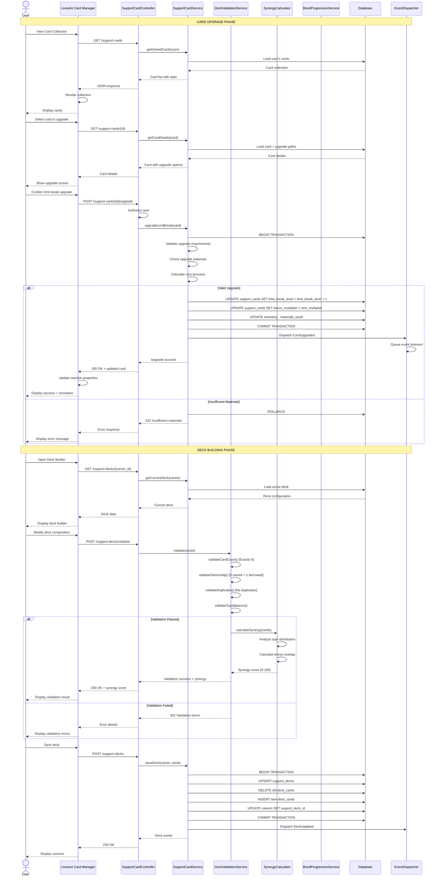
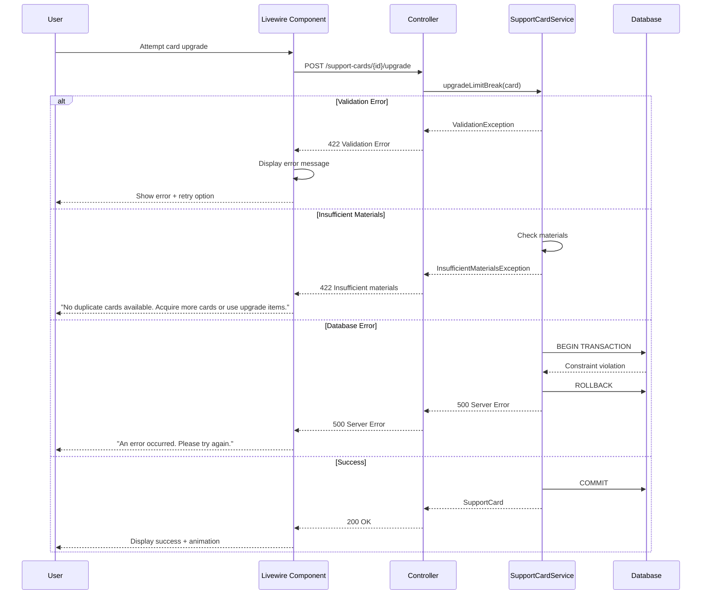

# SEQ-005: Support Card Upgrade

## Umamusume Pretty Derby Career Planner

**Document Version**: 2.0.0  
**Date**: January 24, 2026  
**Related Documents**: [PRD-005], [SPEC-005], [FLOW-005], [TECH-FLOW-005]

---

## Table of Contents

1. [Overview](#1-overview)
2. [Participants](#2-participants)
3. [Sequence Flow](#3-sequence-flow)
4. [Detailed Interactions](#4-detailed-interactions)
5. [Data Structures](#5-data-structures)
6. [Error Handling](#6-error-handling)
7. [Performance Considerations](#7-performance-considerations)
8. [Related Documentation](#8-related-documentation)

---

## 1. Overview

### 1.1 Purpose

This sequence diagram documents the support card upgrade workflow in the Umamusume Career Planner application, covering limit break progression, bond level tracking, and deck composition management.

### 1.2 Scope

**Covers:**

- Support card collection management
- Limit break upgrades (0-4 stars)
- Bond level progression tracking
- Deck composition validation (6-card deck: 5 owned + 1 borrowed)
- Synergy scoring and recommendations
- Meta tier synchronization from external sources

**Related Artifacts:**

- PRD: [PRD-005](../prds/PRD-005_Support_Card_Management.md)
- SPEC: [SPEC-005](../specs/SPEC-005_Support_Card_Management_Technical.md)
- Flow: [FLOW-005](../flows/FLOW-005_Support_Card_Management_System.md)
- Tech Flow: [TECH-FLOW-005](../tech-flow/TECH-FLOW-005_Support_Card_Management_Flow.md)
- Wireframe: [WF-010](../wireframes/WF-010_Support_Card_Collection.md), [WF-011](../wireframes/WF-011_Support_Deck_Builder.md)
- User Flow: [UF-006](../user-flows/UF-006_Support_Deck_Building_Flow.md)

### 1.3 Business Context

Support card management is critical for training optimization:

- Limit breaks increase card effectiveness (up to +40% at 4★)
- Bond levels unlock friendship training bonuses
- Proper deck composition maximizes stat gains
- Meta tier awareness guides collection priorities

**Success Criteria:**

- Limit break applied with correct stat bonuses
- Bond progression tracked accurately
- Deck validation enforces 6-card rule (5 owned + 1 borrowed)
- Synergy score calculated for deck optimization

---

## 2. Participants

### 2.1 System Components

| Component | Type | Responsibility |
|-----------|------|----------------|
| **User** | Actor | Initiates card upgrades and deck building |
| **Livewire Component** | Presentation | `SupportCardManager.php`, `DeckBuilder.php` - Card and deck UI |
| **SupportCardController** | Application | Orchestrates card operations |
| **SupportCardService** | Domain Service | Card upgrade and management logic |
| **DeckValidationService** | Domain Service | Deck composition validation |
| **SynergyCalculator** | Domain Service | Deck synergy scoring |
| **BondProgressionService** | Domain Service | Bond level tracking |
| **Database** | Infrastructure | MySQL/MariaDB persistence layer |
| **EventDispatcher** | Infrastructure | Laravel event broadcasting |

### 2.2 Component Locations

```

app/
├── Livewire/
│   └── SupportCard/
│       ├── SupportCardManager.php
│       ├── DeckBuilder.php
│       └── CardCollection.php
├── Http/
│   └── Controllers/
│       └── SupportCardController.php
├── Services/
│   ├── SupportCardService.php
│   ├── DeckValidationService.php
│   ├── SynergyCalculator.php
│   └── BondProgressionService.php
└── Models/
    ├── SupportCard.php
    ├── SupportDeck.php
    └── DeckCard.php

```

---

## 3. Sequence Flow

### 3.1 High-Level Flow Diagram



### 3.2 Timeline Breakdown

| Phase | Duration | Description |
|-------|----------|-------------|
| **Collection Load** | ~200ms | Load user's card collection |
| **Card Details** | ~150ms | Load single card with upgrade paths |
| **User Selection** | Variable | User reviews upgrade options |
| **Upgrade Validation** | ~100ms | Validate materials and requirements |
| **Database Transaction** | ~200ms | Update card stats and inventory |
| **Event Dispatch** | ~30ms | Queue event listeners |
| **Deck Validation** | ~150ms | Validate 6-card composition |
| **Synergy Calculation** | ~100ms | Calculate deck effectiveness |
| **UI Update** | ~100ms | Animation and state refresh |
| **Total (Upgrade)** | ~350ms | Server-side processing |
| **Total (Deck Save)** | ~400ms | Server-side processing |

---

## 4. Detailed Interactions

### 4.1 Card Collection Loading

**Request Flow:**

```
User → Livewire Component → SupportCardController → SupportCardService
```

**Controller Action:**

```php
// SupportCardController.php
public function index(Request $request)
{
    $filters = $request->validate([
        'rarity' => 'nullable|in:SSR,SR,R',
        'card_type' => 'nullable|in:speed,stamina,power,guts,wit,friend',
        'limit_break' => 'nullable|integer|min:0|max:4',
    ]);
    
    $cards = $this->supportCardService->getOwnedCards(
        auth()->user(),
        $filters
    );
    
    return view('livewire.support-card.collection', [
        'cards' => $cards,
        'filters' => $filters,
    ]);
}
```

**Service Implementation:**

```php
// SupportCardService.php
public function getOwnedCards(User $user, array $filters = []): Collection
{
    $query = SupportCard::where('user_id', $user->id)
        ->with(['bonuses', 'metaTier']);
    
    if (isset($filters['rarity'])) {
        $query->where('rarity', $filters['rarity']);
    }
    
    if (isset($filters['card_type'])) {
        $query->where('card_type', $filters['card_type']);
    }
    
    if (isset($filters['limit_break'])) {
        $query->where('limit_break_level', $filters['limit_break']);
    }
    
    return $query->orderBy('limit_break_level', 'desc')
        ->orderBy('bond_level', 'desc')
        ->get()
        ->map(function ($card) {
            return [
                'id' => $card->id,
                'name' => $card->name,
                'name_jp' => $card->name_jp,
                'rarity' => $card->rarity,
                'card_type' => $card->card_type,
                'limit_break_level' => $card->limit_break_level,
                'bond_level' => $card->bond_level,
                'meta_tier' => $card->metaTier?->tier ?? 'B',
                'bonuses' => $card->bonuses,
                'can_upgrade' => $card->limit_break_level < 4,
            ];
        });
}
```

### 4.2 Limit Break Upgrade Logic

**Limit Break Progression:**

| Level | Stars | Bonus Multiplier | Material Cost |
|-------|-------|------------------|---------------|
| 0 | ☆☆☆☆ | 1.00x (Base) | N/A |
| 1 | ★☆☆☆ | 1.10x (+10%) | 1 copy |
| 2 | ★★☆☆ | 1.20x (+20%) | 1 copy |
| 3 | ★★★☆ | 1.30x (+30%) | 1 copy |
| 4 | ★★★★ | 1.40x (+40%) | 1 copy |

**Upgrade Service:**

```php
// SupportCardService.php
public function upgradeLimitBreak(SupportCard $card): SupportCard
{
    return DB::transaction(function () use ($card) {
        // 1. Validate upgrade is possible
        if ($card->limit_break_level >= 4) {
            throw new MaxLimitBreakException("Card is already at maximum limit break");
        }
        
        // 2. Check materials (requires duplicate card or upgrade item)
        $hasMaterials = $this->checkUpgradeMaterials($card->user_id, $card->card_template_id);
        
        if (!$hasMaterials) {
            throw new InsufficientMaterialsException("No duplicate cards or upgrade items available");
        }
        
        // 3. Calculate new bonus multiplier
        $newLevel = $card->limit_break_level + 1;
        $newMultiplier = 1.0 + ($newLevel * 0.10);
        
        // 4. Update card
        $card->update([
            'limit_break_level' => $newLevel,
            'bonus_multiplier' => $newMultiplier,
        ]);
        
        // 5. Consume materials
        $this->consumeUpgradeMaterials($card->user_id, $card->card_template_id);
        
        // 6. Recalculate bonuses
        $this->recalculateBonuses($card);
        
        // 7. Dispatch event
        event(new CardUpgraded($card));
        
        return $card->fresh();
    });
}

private function recalculateBonuses(SupportCard $card): void
{
    $baseBonuses = $card->baseTemplate->bonuses;
    
    foreach ($baseBonuses as $stat => $baseValue) {
        $card->bonuses()->updateOrCreate(
            ['stat_type' => $stat],
            ['bonus_value' => (int) ($baseValue * $card->bonus_multiplier)]
        );
    }
}
```

### 4.3 Bond Progression

**Bond Level System:**

```php
// BondProgressionService.php
class BondProgressionService
{
    public function updateBondFromTraining(
        SupportCard $card,
        TrainingSession $session
    ): void {
        if (!$this->cardParticipatedInTraining($card, $session)) {
            return;
        }
        
        $bondGain = $this->calculateBondGain($card, $session);
        
        $newBondLevel = min(100, $card->bond_level + $bondGain);
        
        $card->update(['bond_level' => $newBondLevel]);
        
        // Check for milestone rewards
        $this->checkBondMilestones($card, $card->bond_level - $bondGain, $newBondLevel);
    }
    
    private function calculateBondGain(SupportCard $card, TrainingSession $session): int
    {
        $baseBond = 3; // Base bond gain per training
        
        // Bonus for card specialization match
        if ($card->card_type === $session->training_type) {
            $baseBond += 2;
        }
        
        return $baseBond;
    }
    
    private function checkBondMilestones(SupportCard $card, int $oldLevel, int $newLevel): void
    {
        $milestones = [20, 40, 60, 80, 100];
        
        foreach ($milestones as $milestone) {
            if ($oldLevel < $milestone && $newLevel >= $milestone) {
                $this->grantMilestoneReward($card, $milestone);
            }
        }
    }
    
    private function grantMilestoneReward(SupportCard $card, int $milestone): void
    {
        $reward = match ($milestone) {
            20 => ['type' => 'stat_bonus', 'value' => 5],
            40 => ['type' => 'skill_hint', 'value' => 1],
            60 => ['type' => 'special_event', 'value' => 'unlocked'],
            80 => ['type' => 'friendship_training', 'value' => 'enabled'],
            100 => ['type' => 'max_bond_bonus', 'value' => 10],
        };
        
        event(new BondMilestoneReached($card, $milestone, $reward));
    }
}
```

**Bond Milestones:**

| Level | Reward |
|-------|--------|
| 20% | Small stat bonus (+5) |
| 40% | Skill hint (1x) |
| 60% | Special event unlock |
| 80% | Friendship training enabled |
| 100% | Maximum bond bonus (+10 to all stats) |

### 4.4 Deck Validation

**Validation Rules:**

```php
// DeckValidationService.php
class DeckValidationService
{
    public function validate(array $cardIds, int $userId): ValidationResult
    {
        $errors = [];
        $warnings = [];
        
        // Rule 1: Exactly 6 cards
        if (count($cardIds) !== 6) {
            $errors[] = 'Deck must contain exactly 6 cards';
            return ValidationResult::failed($errors);
        }
        
        // Rule 2: No duplicates
        if (count($cardIds) !== count(array_unique($cardIds))) {
            $errors[] = 'Duplicate cards are not allowed in the same deck';
            return ValidationResult::failed($errors);
        }
        
        // Rule 3: 5 owned + 1 borrowed
        $cards = SupportCard::whereIn('id', $cardIds)->get();
        $ownedCards = $cards->where('user_id', $userId)->count();
        $borrowedCards = $cards->where('user_id', '!=', $userId)->count();
        
        if ($ownedCards < 5) {
            $errors[] = 'At least 5 cards must be owned by you';
        }
        
        if ($borrowedCards > 1) {
            $errors[] = 'Only 1 borrowed card is allowed';
        }
        
        if (!empty($errors)) {
            return ValidationResult::failed($errors);
        }
        
        // Rule 4: Type balance (warning only)
        $typeDistribution = $this->analyzeTypeDistribution($cards);
        
        if ($typeDistribution['max_concentration'] > 0.5) {
            $warnings[] = 'Deck is heavily concentrated in one stat type. Consider diversifying for better training coverage.';
        }
        
        return ValidationResult::success($warnings);
    }
    
    private function analyzeTypeDistribution(Collection $cards): array
    {
        $types = $cards->groupBy('card_type')
            ->map(fn($group) => $group->count())
            ->toArray();
        
        $maxCount = max($types);
        $maxConcentration = $maxCount / 6;
        
        return [
            'distribution' => $types,
            'max_concentration' => $maxConcentration,
        ];
    }
}
```

### 4.5 Synergy Calculation

**Synergy Scoring:**

```php
// SynergyCalculator.php
class SynergyCalculator
{
    public function calculateSynergy(Collection $cards): float
    {
        $scores = [
            'type_balance' => $this->scoreTypeBalance($cards),
            'limit_break_level' => $this->scoreLimitBreakLevel($cards),
            'bond_level' => $this->scoreBondLevel($cards),
            'meta_tier' => $this->scoreMetaTier($cards),
        ];
        
        $weights = [
            'type_balance' => 0.30,
            'limit_break_level' => 0.25,
            'bond_level' => 0.25,
            'meta_tier' => 0.20,
        ];
        
        $totalScore = collect($scores)
            ->map(fn($score, $key) => $score * $weights[$key])
            ->sum();
        
        return min(100, max(0, $totalScore));
    }
    
    private function scoreTypeBalance(Collection $cards): float
    {
        $types = $cards->groupBy('card_type')->count();
        
        // Ideal is 5-6 different types for maximum coverage
        return match ($types) {
            6 => 100,
            5 => 90,
            4 => 70,
            3 => 50,
            2 => 30,
            1 => 10,
            default => 0,
        };
    }
    
    private function scoreLimitBreakLevel(Collection $cards): float
    {
        $avgLimitBreak = $cards->avg('limit_break_level');
        
        return ($avgLimitBreak / 4) * 100;
    }
    
    private function scoreBondLevel(Collection $cards): float
    {
        $avgBond = $cards->avg('bond_level');
        
        return $avgBond;
    }
    
    private function scoreMetaTier(Collection $cards): float
    {
        $tierScores = [
            'SS' => 100,
            'S' => 85,
            'A' => 70,
            'B' => 50,
            'C' => 30,
        ];
        
        $avgTierScore = $cards->map(function ($card) use ($tierScores) {
            return $tierScores[$card->metaTier?->tier ?? 'B'];
        })->avg();
        
        return $avgTierScore;
    }
}
```

---

## 5. Data Structures

### 5.1 Support Card Data

```json
{
  "id": 42,
  "user_id": 1,
  "card_template_id": 15,
  "name": "Mejiro Dober",
  "name_jp": "メジロドーベル",
  "rarity": "SSR",
  "card_type": "power",
  "limit_break_level": 3,
  "bond_level": 85,
  "bonus_multiplier": 1.30,
  "bonuses": {
    "power": 39,
    "stamina": 13,
    "guts": 10
  },
  "meta_tier": {
    "tier": "S",
    "tier_source": "umapyoi.net",
    "last_updated": "2026-01-20T10:00:00Z"
  },
  "can_upgrade": true,
  "next_upgrade_materials": {
    "duplicate_cards": 0,
    "upgrade_items": 1
  }
}
```

### 5.2 Deck Configuration

```json
{
  "id": 8,
  "career_id": 157,
  "deck_name": "Speed Focus Deck",
  "synergy_score": 92.5,
  "cards": [
    {
      "card_id": 42,
      "card_name": "Mejiro Dober",
      "card_type": "power",
      "rarity": "SSR",
      "limit_break_level": 3,
      "bond_level": 85,
      "is_borrowed": false
    },
    {
      "card_id": 38,
      "card_name": "Tokai Teio",
      "card_type": "speed",
      "rarity": "SSR",
      "limit_break_level": 2,
      "bond_level": 75,
      "is_borrowed": false
    },
    {
      "card_id": 51,
      "card_name": "Kitasan Black",
      "card_type": "stamina",
      "rarity": "SSR",
      "limit_break_level": 4,
      "bond_level": 90,
      "is_borrowed": false
    },
    {
      "card_id": 29,
      "card_name": "Narita Brian",
      "card_type": "wit",
      "rarity": "SSR",
      "limit_break_level": 3,
      "bond_level": 80,
      "is_borrowed": false
    },
    {
      "card_id": 45,
      "card_name": "Symboli Rudolf",
      "card_type": "guts",
      "rarity": "SSR",
      "limit_break_level": 2,
      "bond_level": 70,
      "is_borrowed": false
    },
    {
      "card_id": 102,
      "card_name": "Friend's Card",
      "card_type": "friend",
      "rarity": "SR",
      "limit_break_level": 1,
      "bond_level": 60,
      "is_borrowed": true
    }
  ],
  "type_distribution": {
    "speed": 1,
    "stamina": 1,
    "power": 1,
    "guts": 1,
    "wit": 1,
    "friend": 1
  },
  "average_limit_break": 2.5,
  "average_bond_level": 76.7
}
```

### 5.3 Card Upgrade Request

```json
{
  "card_id": 42,
  "upgrade_type": "limit_break",
  "material_source": "duplicate_card"
}
```

### 5.4 Card Upgrade Response

```json
{
  "success": true,
  "card": {
    "id": 42,
    "name": "Mejiro Dober",
    "limit_break_level": 4,
    "bonus_multiplier": 1.40,
    "new_bonuses": {
      "power": 42,
      "stamina": 14,
      "guts": 11
    }
  },
  "materials_consumed": {
    "duplicate_cards": 1
  },
  "message": "Card upgraded to 4★ limit break!"
}
```

### 5.5 Deck Validation Response

```json
{
  "valid": true,
  "errors": [],
  "warnings": [
    "Consider adding more diversity in card types for better training coverage"
  ],
  "synergy_score": 92.5,
  "recommendations": [
    "High synergy deck with excellent type balance",
    "Average limit break level is strong (2.5★)",
    "Bond levels are well-developed (avg 76.7%)"
  ]
}
```

---

## 6. Error Handling

### 6.1 Validation Errors

| Error Code | Condition | HTTP Status | User Message |
|------------|-----------|-------------|--------------|
| `CARD_001` | Card not found | 404 | "Support card not found" |
| `CARD_002` | Insufficient materials | 422 | "No duplicate cards or upgrade items available" |
| `CARD_003` | Max limit break reached | 422 | "Card is already at maximum limit break (4★)" |
| `DECK_001` | Invalid card count | 422 | "Deck must contain exactly 6 cards" |
| `DECK_002` | Too many borrowed cards | 422 | "Only 1 borrowed card is allowed per deck" |
| `DECK_003` | Duplicate cards | 422 | "Duplicate cards are not allowed in the same deck" |
| `DECK_004` | Insufficient owned cards | 422 | "At least 5 cards must be owned by you" |

### 6.2 Error Recovery Flow



### 6.3 Transaction Rollback Scenarios

| Scenario | Trigger | Recovery |
|----------|---------|----------|
| Constraint violation | Invalid card reference | Rollback, re-validate input |
| Material consumption failure | Inventory update error | Rollback, verify materials |
| Bonus recalculation error | Invalid bonus data | Rollback, log error |
| Deck validation failure | Rule violation | Rollback, display validation errors |

---

## 7. Performance Considerations

### 7.1 Performance Metrics

| Operation | Target | Current | Status |
|-----------|--------|---------|--------|
| Collection load (200 cards) | <500ms | ~350ms | ✅ Met |
| Card upgrade | <350ms | ~280ms | ✅ Met |
| Deck validation | <200ms | ~150ms | ✅ Met |
| Synergy calculation | <150ms | ~100ms | ✅ Met |
| Bond update | <100ms | ~50ms | ✅ Met |

### 7.2 Optimization Strategies

**Implemented:**

- Eager loading of card bonuses and meta tiers
- Database indexing on `user_id` and `limit_break_level`
- Caching of meta tier data (24-hour TTL)
- Batch processing for bond updates

**Code Example:**

```php
// Optimized card loading with eager loading
$cards = SupportCard::where('user_id', $userId)
    ->with([
        'bonuses',
        'metaTier',
        'baseTemplate',
    ])
    ->select(['id', 'name', 'name_jp', 'rarity', 'card_type', 'limit_break_level', 'bond_level', 'card_template_id'])
    ->get();
```

### 7.3 Database Query Analysis

**Query Count for Full Workflow:**

- Card collection load: 2 queries (cards + eager loads)
- Card upgrade: 4 queries (1 card load + 3 updates)
- Deck validation: 1 query (card lookup)
- Deck save: 4 queries (1 upsert + 3 updates)

**Total Queries:** 11 queries for complete workflow

**Index Usage:**

```sql
-- Critical indexes for support card management
CREATE INDEX idx_support_cards_user_type ON ucp_support_cards(user_id, card_type);
CREATE INDEX idx_support_cards_limit_break ON ucp_support_cards(limit_break_level);
CREATE INDEX idx_deck_cards_deck ON ucp_deck_cards(support_deck_id);
CREATE INDEX idx_support_cards_template ON ucp_support_cards(card_template_id);
```

### 7.4 Cache Strategy

**Cache Keys:**

- Card collection: `support_cards.user.{id}`
- Meta tiers: `meta_tiers.{source}`
- TTL: 5 minutes for collection, 24 hours for meta tiers

**Cache Invalidation:**

```php
// Invalidate on card upgrade
$this->cache->forget("support_cards.user.{$user->id}");

// Invalidate on deck save
$this->cache->forget("support_deck.career.{$career->id}");
```

---

## 8. Related Documentation

### 8.1 System Documentation

| Document | Description |
|----------|-------------|
| [PRD-005](../prds/PRD-005_Support_Card_Management.md) | Product requirements for support card management |
| [SPEC-005](../specs/SPEC-005_Support_Card_Management_Technical.md) | Technical specification for support card system |
| [FLOW-005](../flows/FLOW-005_Support_Card_Management_System.md) | System flow for support card operations |
| [TECH-FLOW-005](../tech-flow/TECH-FLOW-005_Support_Card_Management_Flow.md) | Technical flow diagrams |

### 8.2 Related Sequences

| Sequence | Description |
|----------|-------------|
| [SEQ-001](SEQ-001_Character_Creation_Sequence.md) | Character creation (selects initial deck) |
| [SEQ-002](SEQ-002_Training_Block_Resolution.md) | Training execution (uses support deck bonuses) |
| [SEQ-007](SEQ-007_External_Data_Sync.md) | External data sync (updates meta tiers) |

### 8.3 UI Documentation

| Document | Description |
|----------|-------------|
| [WF-010](../wireframes/WF-010_Support_Card_Collection.md) | Wireframe specification for card collection |
| [WF-011](../wireframes/WF-011_Support_Deck_Builder.md) | Deck builder interface wireframe |
| [UF-006](../user-flows/UF-006_Support_Deck_Building_Flow.md) | User flow for deck building |

### 8.4 Database Documentation

| Document | Description |
|----------|-------------|
| [DBD-009](../009_DBD_Database_Documentation.md) | Complete database schema documentation |

---

## Document Control

### Version History

| Version | Date | Author | Changes |
|---------|------|--------|---------|
| 2.0.0 | 2026-01-24 | Development Team | Complete rewrite aligned with v2.0.0 implementation; added detailed sequence flows, limit break system, bond progression, deck validation, synergy calculation, performance metrics, and aligned with current Laravel 12 architecture |
| 1.0.0 | 2026-01-14 | Development Team | Initial draft |

### Approval

| Role | Name | Signature | Date |
|------|------|-----------|------|
| Technical Lead | | | |
| QA Lead | | | |

### Review Schedule

- Next Review: 2026-04-24
- Review Frequency: Quarterly or on major feature changes

---

**Related Standards:**

- Laravel 12 Best Practices
- PSR-12 Coding Standards
- Mermaid Diagram Standards
- IEEE 830 SRS Format

---

*This sequence diagram reflects the current implementation of the support card upgrade and deck building workflow as of v2.0.0. For the most up-to-date information, refer to the source code in `app/Services/SupportCardService.php`, `app/Services/DeckValidationService.php`, and related files.*
