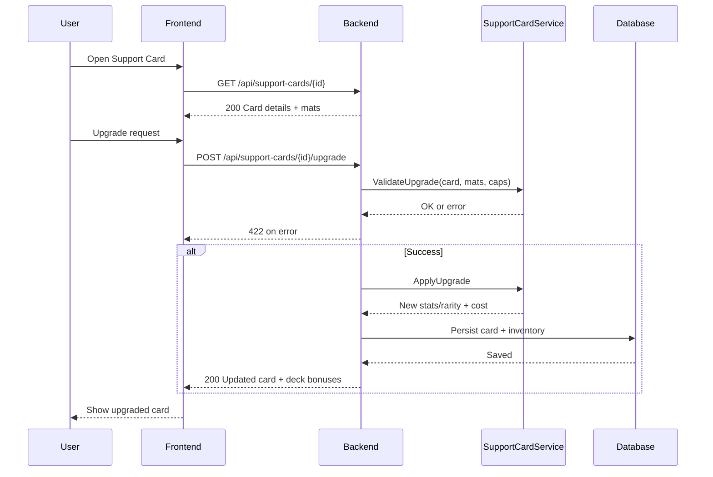

# SEQ-005: Support Card Upgrade

## Umamusume Pretty Derby Career Planner

**Document Version**: 1.0  
**Date**: January 14, 2026  
**Related Documents**: [PRD-001], [SPEC-005], [FLOW-005]
**Source Specs**:

- `.kiro/specs/umamusume-career-planner-main/requirements.md` (Requirement 6: Support Card Configuration)
- `.kiro/specs/umamusume-career-planner-main/design.md` (Support Card Upgrade Flow)

**Related Artifacts**:

- PRD: [PRD-005](../prds/PRD-005_Support_Card_Management.md)
- SPEC: [SPEC-005](../specs/SPEC-005_Support_Card_Management_Technical.md)
- Flow: [FLOW-005](../flows/FLOW-005_Support_Card_Management_System.md)
- Tech Flow: [TECH-FLOW-005](../tech-flow/TECH-FLOW-005_Support_Card_Management_Flow.md)
- Wireframes: [WF-010](../wireframes/WF-010_Support_Card_Collection.md), [WF-011](../wireframes/WF-011_Support_Deck_Builder.md)
- User Flows: [UF-006](../user-flows/UF-006_Support_Deck_Building_Flow.md)

---

## Sequence Overview

- User enhances support card level/rarity; system checks materials/caps, applies upgrade, updates deck bonuses.

## Sequence Diagram

