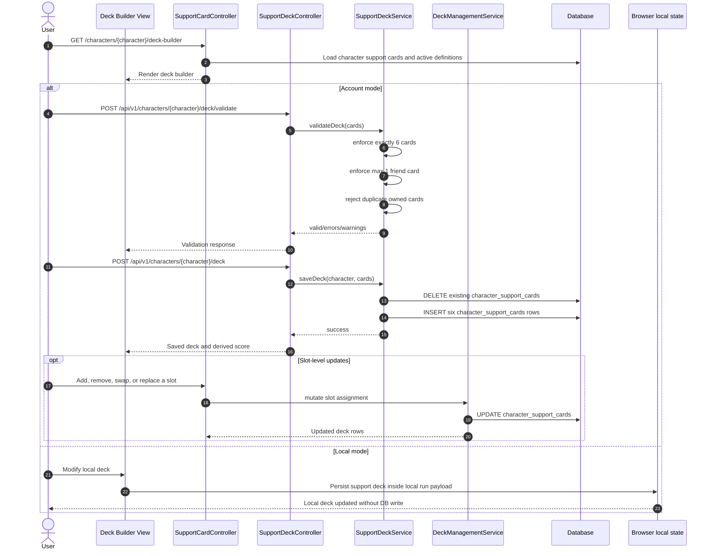

# SEQ-005: Support Card Upgrade and Deck Persistence

## Umamusume Pretty Derby Career Planner

**Document Version**: 2.4.2
**Date**: April 7, 2026
**Related Documents**: [PRD-005], [SPEC-005], [FLOW-005], [TECH-FLOW-005], [SEQ-016]

---

## 1. Overview

### 1.1 Purpose

This sequence diagram documents the support-card persistence flow that is actually implemented in
the codebase. The active backend supports deck composition, validation, slot updates, and
persistence of `limit_break_level` and `friendship_level` metadata.

### 1.2 Scope

**Covers:**

- Support card browsing and deck-builder entry
- Deck validation through `SupportDeckService`
- Slot-level mutations through `DeckManagementService`
- Persistence to `character_support_cards`
- Local-mode browser-managed deck state

**Does not currently cover:**

- A material inventory economy for upgrading support cards
- A universal backend-enforced limit-break multiplier formula
- A bond-gain formula owned by the deck services themselves

### 1.3 Implementation Notes

- The primary deck-builder UI route is `/characters/{character}/deck-builder`.
- The account-mode APIs use both `SupportCardController` and `Api\SupportDeckController` /
`Api\V1\DeckManagementController`.
- The active deck attached to a character is primarily represented by `character_support_cards` in current flows.
- `SupportDeck` and `ucp_support_decks` exist for named-deck abstractions, but the builder flow most
directly manipulates `CharacterSupportCard` rows.

---

## 2. Participants

| Component | Type | Responsibility |
| --- | --- | --- |
| **User** | Actor | Builds and maintains a six-card support deck |
| **Deck Builder View** | Presentation | Character-specific deck-builder interface |
| **SupportCardController** | Application | Serves the deck-builder page and legacy mutation routes |
| **SupportDeckController** | API Controller | Validates and saves full deck payloads |
| **DeckManagementService** | Domain Service | Slot-level add, remove, swap, replace, and statistics logic |
| **SupportDeckService** | Domain Service | Six-card validation, save, recommendations, and tier calculation |
| **CharacterSupportCard** | Data Model | Stores equipped card slots for a character |
| **SupportCardDefinition** | Data Model | Stores support-card reference data and max limit break |
| **Browser local state** | Client Storage | Holds local-mode deck state for guest runs |
| **Database** | Infrastructure | Persists deck rows and card definitions |

---

## 3. Sequence Flow

### 3.1 Account-Mode Deck Flow with Local Branch



---

## 4. Detailed Interactions

### 4.1 Validation Rules Actually Enforced

- Deck must contain exactly six cards.
- At most one card may be marked `is_friend_card = true`.
- Duplicate owned cards are rejected.
- `limit_break_level` is validated against `SupportCardDefinition::max_limit_break`.
- `friendship_level` is stored as an integer from `0` to `100`.

### 4.2 Limit Break Semantics

- The backend stores limit-break level as metadata.
- The code validates the allowed range but does not apply a universal multiplier formula inside
`SupportDeckService` or `DeckManagementService`.
- This document therefore avoids claiming a fixed `+5%` or `+10%` multiplier schedule that the
active code path does not enforce.
- In the game, limit-break level (0–4) increases the card’s stat bonuses and friendship-training
bonus. These per-card effects feed into training calculations as part of the `StatBonus` and
`FriendshipMultiplier` components (see SEQ-002 section 2.1).

### 4.3 Bond and Friendship Semantics

- `friendship_level` is tracked per equipped card.
- `SupportCardDeck` value-object logic treats `80` as the friendship threshold; a card at bond ≥ 80
activates Friendship Training (1.10×–1.35× gain multiplier depending on rarity).
- Exact per-training bond gain math is not owned by this deck persistence flow and is intentionally omitted here.

### 4.4 Storage-Mode Boundary

- Account mode persists `character_support_cards` and exposes deck APIs.
- Local mode keeps support-card selection inside the browser-managed run payload.
- Conversion to account mode later persists local choices via the storage-transition flow.

---

## 5. Data Structures

### 5.1 Persisted Deck Row

```php
[
    'character_id' => 42,
    'support_card_id' => 101,
    'position_slot' => 1,
    'is_friend_card' => false,
    'limit_break_level' => 2,
    'friendship_level' => 64,
]
```

### 5.2 Full Save Payload

```php
[
    'cards' => [
        ['support_card_id' => 101, 'is_friend_card' => false, 'limit_break_level' => 2, 'friendship_level' => 64],
        ['support_card_id' => 102, 'is_friend_card' => false],
        ['support_card_id' => 103, 'is_friend_card' => false],
        ['support_card_id' => 104, 'is_friend_card' => false],
        ['support_card_id' => 105, 'is_friend_card' => false],
        ['support_card_id' => 999, 'is_friend_card' => true],
    ],
]
```

---

## 6. Related Documentation

- [FLOW-005](../01-flows/FLOW-005_Support_Card_Management_System.md)
- [SEQ-016](SEQ-016_Support_Deck_Configuration.md)
- [SEQ-017](SEQ-017_Storage_Mode_Transition.md)
---

## Document Control

### Version History

| Version | Date | Author | Changes |
| --- | --- | --- | --- |
| 2.4.2 | 2026-04-07 | Development Team | Standardized version and formatting across sequence documentation suite |
| 2.0.0 | 2026-01-24 | Development Team | Complete rewrite aligned with v2.0.0 implementation baseline |
| 1.0.0 | 2026-01-14 | Development Team | Initial draft |

### Approval

| Role | Name | Signature | Date |
| --- | --- | --- | --- |
| Technical Lead | | | |
| QA Lead | | | |

### Review Schedule

- Next Review: 2026-07-07
- Review Frequency: Quarterly or on major feature changes

---

**Related Standards:**

- Laravel 12 Best Practices
- PSR-12 Coding Standards
- Mermaid Diagram Standards
- KRISA Documentation Format

---

*This sequence diagram reflects the current implementation as of v2.4.2. For the most up-to-date information, refer to the source code and related documentation.*
