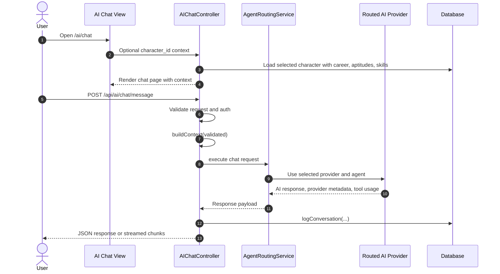
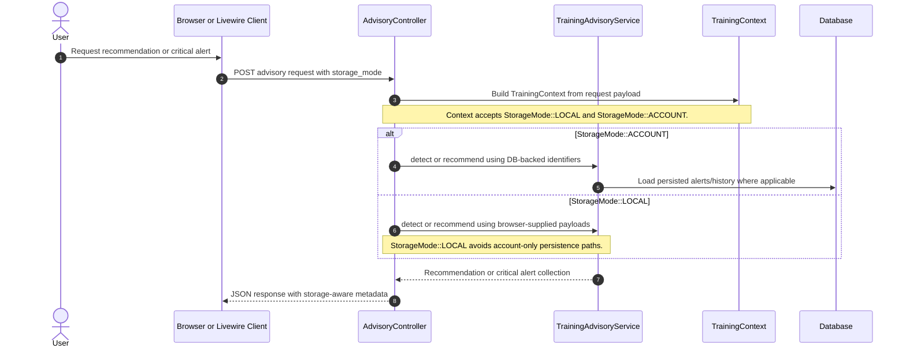

# SEQ-006: AI Advice Generation

## Umamusume Pretty Derby Career Planner

**Document Version**: 2.4.2
**Date**: April 7, 2026
**Related Documents**: [PRD-006], [SPEC-006], [FLOW-006], [TECH-FLOW-006]

---

## 1. Overview

### 1.1 Purpose

This sequence diagram documents the active AI request paths in the repository. The most important
distinction is between the authenticated chat experience handled by `AIChatController` and the
storage-aware advisory APIs that accept explicit local or account context.

### 1.2 Scope

**Covers:**

- Authenticated AI chat requests and streaming responses
- Provider and agent routing through `AgentRoutingService`
- Character-context loading for chat
- Conversation logging and message history persistence
- Storage-aware advisory requests built from `TrainingContext`

### 1.3 Implementation Notes

- The chat page is served by `GET /ai/chat`.
- Chat API routes are under `/api/ai/chat/*` and require authentication.
- `AIChatController` uses `AgentRoutingService`, not the older `AIRouterService` or `AIAdvisoryController` naming.
- `OllamaService` uses the Cloudstudio facade agent interface rather than raw controller-managed `/api/generate` calls.
- Advisory endpoints such as `/api/advisory/training/recommendations`,
`/api/advisory/race/strategy`, and `/api/advisory/critical/detect` accept `storage_mode` and can
analyze local-mode payloads.

---

## 2. Participants

| Component | Type | Responsibility |
| --- | --- | --- |
| **User** | Actor | Submits chat or advisory questions |
| **AI Chat View** | Presentation | Authenticated chat UI rendered by `AIChatController::index()` |
| **AIChatController** | Application | Validates chat requests, builds context, streams responses, and logs messages |
| **AgentRoutingService** | Domain Service | Chooses provider and agent execution path |
| **OllamaService / Bedrock path** | Infrastructure | Supplies local or cloud-backed inference |
| **ConversationManagementService** | Domain Service | Reads structured conversation history when needed |
| **AdvisoryController** | API Controller | Handles storage-aware training/race/critical advisory requests |
| **TrainingAdvisoryService** | Domain Service | Produces alerts and recommendations from `TrainingContext` |
| **Database** | Infrastructure | Persists chat messages, conversation metadata, and advisory artifacts |

---

## 3. Sequence Flow

### 3.1 Authenticated Chat Flow

### 3.2 Storage-Aware Advisory Flow

---

## 4. Detailed Interactions

### 4.1 Chat Path

- `AIChatController::index()` optionally loads a user-owned character when `character_id` is present.
- `sendMessage()` and `sendMessageStreaming()` both validate auth and request payloads before building context.
- Streaming is currently chunked after full-response generation, not true token-by-token provider streaming.
- Conversation messages are logged after a successful response.

### 4.2 Provider Routing

- Routing decisions are delegated to `AgentRoutingService`.
- The architecture favors provider and agent abstraction over controller-specific provider branches.
- `OllamaService` uses configured default model values such as `llama3.3`.

### 4.3 Storage-Mode Boundary

- The authenticated chat surface is an account-mode feature because the web and API chat routes require authentication.
- Advisory requests are the storage-aware entry point for local-mode runs because they accept
explicit `storage_mode` and context payloads.
- Local-mode advisory output can still include alerts and recommendations, but account-only
persistence features are skipped where necessary.
- Local-mode advisory requests may still receive recommendations and alerts, but account-only
conversation persistence and authenticated chat history should not be implied for those requests.

---

## 5. Error Handling

- Unauthenticated chat API requests return `401`.
- Missing character context for a requested `character_id` results in model-not-found handling.
- Provider failures are logged and surfaced as generic AI-processing errors unless debug output is enabled.
- Advisory failures return JSON errors while preserving the local/account request boundary.

---

## 6. Related Documentation

- [FLOW-006](../01-flows/FLOW-006_AI_Advisory_System.md)
- [SEQ-017](SEQ-017_Storage_Mode_Transition.md)
---

## Document Control

### Version History

| Version | Date | Author | Changes |
| --- | --- | --- | --- |
| 2.4.2 | 2026-04-07 | Development Team | Standardized version and formatting across sequence documentation suite |
| 2.0.0 | 2026-01-24 | Development Team | Complete rewrite aligned with v2.0.0 implementation baseline |
| 1.0.0 | 2026-01-14 | Development Team | Initial draft |

### Approval

| Role | Name | Signature | Date |
| --- | --- | --- | --- |
| Technical Lead | | | |
| QA Lead | | | |

### Review Schedule

- Next Review: 2026-07-07
- Review Frequency: Quarterly or on major feature changes

---

**Related Standards:**

- Laravel 12 Best Practices
- PSR-12 Coding Standards
- Mermaid Diagram Standards
- KRISA Documentation Format

---

*This sequence diagram reflects the current implementation as of v2.4.2. For the most up-to-date information, refer to the source code and related documentation.*
