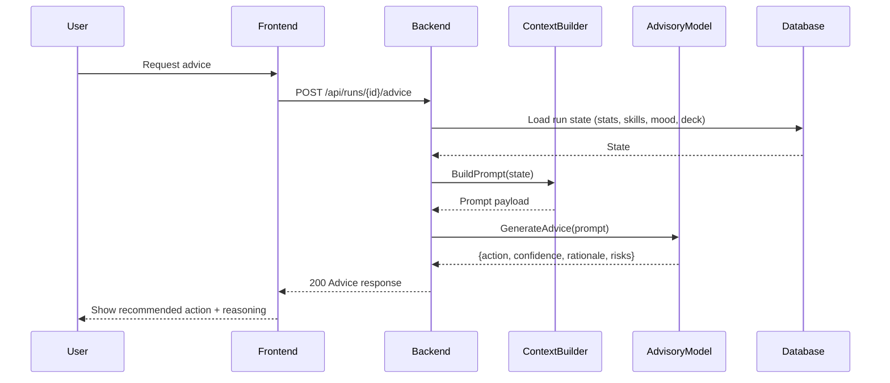

# SEQ-006: AI Advice Generation

## Umamusume Pretty Derby Career Planner

**Document Version**: 1.0  
**Date**: January 14, 2026  
**Related Documents**: [PRD-001], [SPEC-006], [FLOW-006]

**Source Specs**:

- `.kiro/specs/umamusume-career-planner-main/requirements.md` (AI Advisory Requirements)
- `.kiro/specs/umamusume-career-planner-main/design.md` (AI Advice Generation Flow)

**Related Artifacts**:

- PRD: [PRD-006](../prds/PRD-006_AI_Advisory.md)
- SPEC: [SPEC-006](../specs/SPEC-006_AI_Advisory_Technical.md)
- Flow: [FLOW-006](../flows/FLOW-006_AI_Advisory_System.md)
- Tech Flow: [TECH-FLOW-006](../tech-flow/TECH-FLOW-006_AI_Advisory_Flow.md)
- Wireframes: [WF-012](../wireframes/WF-012_AI_Advisor_Interface.md)
- User Flows: [UF-007](../user-flows/UF-007_AI_Advisor_Journey.md)

---

## Sequence Overview

- User asks for advice; system aggregates context, calls AI, surfaces recommended action and rationale.

## Sequence Diagram

