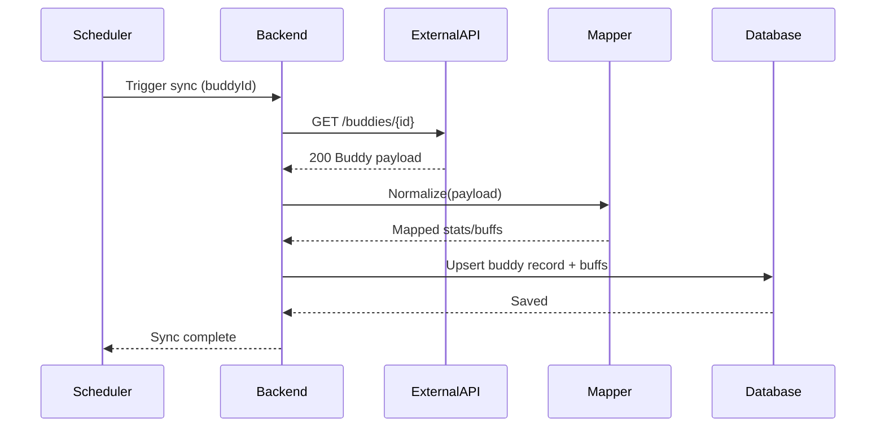

# SEQ-007: External Data Sync (Training Buddy)

## Umamusume Pretty Derby Career Planner

**Document Version**: 1.0  
**Date**: January 14, 2026  
**Related Documents**: [PRD-001], [SPEC-007], [FLOW-007]

**Source Specs**:

- `.kiro/specs/umamusume-career-planner-main/requirements.md` (External Integration Requirements)
- `.kiro/specs/umamusume-career-planner-main/design.md` (External Sync Flow)

**Related Artifacts**:

- PRD: [PRD-007](../prds/PRD-007_External_Integration.md)
- SPEC: [SPEC-007](../specs/SPEC-007_External_Integration_Technical.md)
- Flow: [FLOW-007](../flows/FLOW-007_External_Integration_System.md)
- Tech Flow: [TECH-FLOW-007](../tech-flow/TECH-FLOW-007_External_Integration_Flow.md)
- User Flows: [UF-008](../user-flows/UF-008_OCR_and_Data_Import_Flow.md)

---

## Sequence Overview

- Syncs external training buddy stats; system pulls data, normalizes, applies buffs.

## Sequence Diagram

