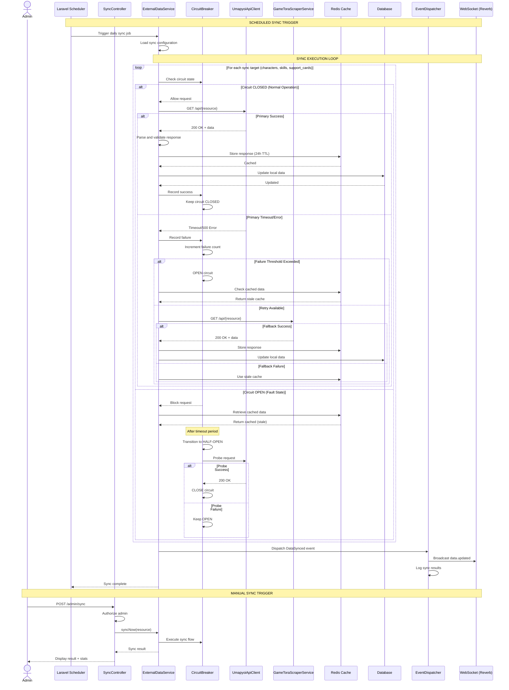
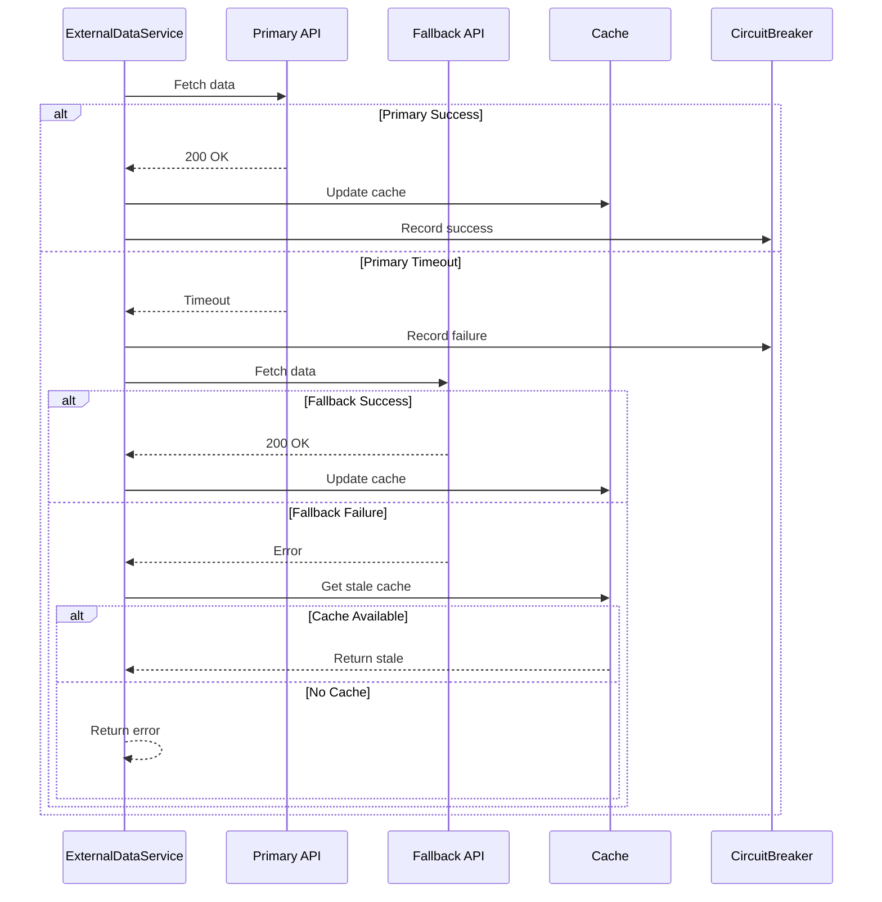

# SEQ-007: External Data Sync

## Umamusume Pretty Derby Career Planner

**Document Version**: 2.2.0  
**Date**: February 22, 2026  
**Related Documents**: [PRD-007], [SPEC-007], [FLOW-007], [TECH-FLOW-007]

---

## Table of Contents

1. [Overview](#1-overview)
2. [Participants](#2-participants)
3. [Sequence Flow](#3-sequence-flow)
4. [Detailed Interactions](#4-detailed-interactions)
5. [Data Structures](#5-data-structures)
6. [Error Handling](#6-error-handling)
7. [Performance Considerations](#7-performance-considerations)
8. [Related Documentation](#8-related-documentation)

---

## 1. Overview

### 1.1 Purpose

This sequence diagram documents the external data synchronization workflow in the Umamusume Career Planner application, covering API integration with umapyoi.net and GameTora (gametora.com), circuit breaker resilience patterns, and cache management strategies.

### 1.2 Scope

**Covers:**

- External API data synchronization (umapyoi.net, GameTora)
- Circuit breaker pattern for fault tolerance
- Response caching with 24-hour TTL
- Fallback API mechanisms
- Cache invalidation strategies
- WebSocket real-time update broadcasting
- OCR screenshot processing integration

**Related Artifacts:**

- PRD: [PRD-007](../prds/PRD-007_External_Integration.md)
- SPEC: [SPEC-007](../specs/SPEC-007_External_Integration_Technical.md)
- Flow: [FLOW-007](../flows/FLOW-007_External_Integration_System.md)
- Tech Flow: [TECH-FLOW-007](../tech-flow/TECH-FLOW-007_External_Integration_Flow.md)
- User Flow: [UF-008](../user-flows/UF-008_OCR_and_Data_Import_Flow.md)

### 1.3 Business Context

External data synchronization enables the application to:

- Provide up-to-date game data (characters, skills, support cards)
- Maintain meta tier rankings from community sources
- Enable offline functionality through intelligent caching
- Ensure data consistency across user sessions
- Support community data sharing

**Success Criteria:**

- API responses cached for 24 hours
- Circuit breaker prevents cascading failures
- Fallback mechanisms ensure availability
- Cache hit rate > 80% for repeat requests
- Sync operations complete within 5 seconds

---

## 2. Participants

### 2.1 System Components

| Component | Type | Responsibility |
|-----------|------|----------------|
| **Scheduler** | Infrastructure | Laravel task scheduler triggering sync jobs |
| **SyncController** | Application | Manual sync trigger endpoint |
| **ExternalDataService** | Domain Service | Unified external API interface |
| **UmapyoiApiClient** | Infrastructure | Primary data source client |
| **GameToraScraperService** | Infrastructure | Fallback data source client |
| **CircuitBreaker** | Infrastructure | Fault tolerance and state management |
| **CacheManager** | Infrastructure | Redis-based response caching |
| **Database** | Infrastructure | MySQL/MariaDB persistence layer |
| **WebSocketService** | Infrastructure | Laravel Reverb real-time updates |
| **EventDispatcher** | Infrastructure | Laravel event broadcasting |

### 2.2 Component Locations

```

app/
├── Console/
│   └── Commands/
│       └── SyncExternalDataCommand.php
├── Http/
│   └── Controllers/
│       └── Admin/
│           └── ExternalSyncController.php
├── Services/
│   └── ExternalAPI/
│       ├── ExternalDataService.php
│       ├── UmapyoiApiClient.php
│       ├── GameToraScraperService.php
│       ├── CircuitBreaker.php
│       └── CacheManager.php
└── Events/
    └── ExternalDataSynced.php

```

---

## 3. Sequence Flow

### 3.1 High-Level Flow Diagram



### 3.2 Timeline Breakdown

| Phase | Duration | Description |
|-------|----------|-------------|
| **Scheduler Trigger** | ~10ms | Cron job execution |
| **Configuration Load** | ~20ms | Load sync targets and settings |
| **Circuit Check** | ~5ms | Evaluate circuit breaker state |
| **Primary API Call** | ~500-1500ms | External API request |
| **Response Parsing** | ~100ms | Validate and transform data |
| **Cache Update** | ~50ms | Write to Redis cache |
| **Database Sync** | ~200-500ms | Bulk update local records |
| **Event Dispatch** | ~30ms | Queue event listeners |
| **WebSocket Broadcast** | ~50ms | Real-time update to clients |
| **Total (Success)** | ~2-3s | Complete sync cycle |
| **Total (Cached)** | ~200ms | Cache hit scenario |

---

## 4. Detailed Interactions

### 4.1 External API Service Orchestration

**Request Flow:**

```
Scheduler/Manual Trigger → ExternalDataService → CircuitBreaker → API Client
```

**Service Implementation:**

```php
// ExternalDataService.php
class ExternalDataService
{
    public function __construct(
        private UmapyoiApiClient $primary,
        private GameToraScraperService $fallback,
        private CircuitBreaker $circuitBreaker,
        private CacheManager $cache,
    ) {}
    
    public function syncResource(string $resource): SyncResult
    {
        $cacheKey = "external_api:{$resource}";
        
        // Check circuit breaker state
        if ($this->circuitBreaker->isOpen()) {
            Log::warning("Circuit breaker OPEN for {$resource}, using cache");
            return $this->fromCache($cacheKey);
        }
        
        try {
            // Attempt primary API
            $response = $this->primary->fetch($resource);
            
            // Validate response
            $validated = $this->validateResponse($response, $resource);
            
            // Cache successful response
            $this->cache->put($cacheKey, $validated, 86400); // 24 hours
            
            // Update local database
            $this->updateLocalData($resource, $validated);
            
            // Record success
            $this->circuitBreaker->recordSuccess();
            
            return SyncResult::success($validated);
            
        } catch (ApiTimeoutException $e) {
            Log::error("Primary API timeout for {$resource}", ['error' => $e->getMessage()]);
            
            // Record failure
            $this->circuitBreaker->recordFailure();
            
            // Attempt fallback
            return $this->tryFallback($resource, $cacheKey);
            
        } catch (ApiException $e) {
            Log::error("Primary API error for {$resource}", ['error' => $e->getMessage()]);
            
            $this->circuitBreaker->recordFailure();
            
            return $this->tryFallback($resource, $cacheKey);
        }
    }
    
    private function tryFallback(string $resource, string $cacheKey): SyncResult
    {
        try {
            $response = $this->fallback->fetch($resource);
            $validated = $this->validateResponse($response, $resource);
            
            $this->cache->put($cacheKey, $validated, 86400);
            $this->updateLocalData($resource, $validated);
            
            return SyncResult::success($validated, 'fallback');
            
        } catch (ApiException $e) {
            Log::error("Fallback API also failed for {$resource}");
            
            // Return stale cache if available
            $cached = $this->cache->get($cacheKey);
            
            if ($cached) {
                return SyncResult::cached($cached, stale: true);
            }
            
            return SyncResult::failed($e->getMessage());
        }
    }
    
    private function fromCache(string $cacheKey): SyncResult
    {
        $cached = $this->cache->get($cacheKey);
        
        if ($cached) {
            return SyncResult::cached($cached);
        }
        
        return SyncResult::failed('No cached data available');
    }
}
```

### 4.2 Circuit Breaker Implementation

**Circuit Breaker States:**

| State | Description | Behavior |
|-------|-------------|----------|
| CLOSED | Normal operation | All requests pass through |
| OPEN | Fault state | All requests blocked, return cached data |
| HALF-OPEN | Recovery testing | Limited requests allowed for probing |

**State Transitions:**

```php
// CircuitBreaker.php
class CircuitBreaker
{
    private const FAILURE_THRESHOLD = 5;
    private const RECOVERY_TIMEOUT = 60; // seconds
    private const HALF_OPEN_LIMIT = 3; // test requests
    
    public function __construct(
        private CacheManager $cache,
    ) {}
    
    public function isOpen(): bool
    {
        $state = $this->getState();
        
        if ($state === 'open') {
            // Check if recovery timeout has elapsed
            if ($this->shouldAttemptRecovery()) {
                $this->setState('half_open');
                return false;
            }
            return true;
        }
        
        return false;
    }
    
    public function recordSuccess(): void
    {
        $state = $this->getState();
        
        if ($state === 'half_open') {
            // Successful probe, close circuit
            $this->setState('closed');
            $this->resetFailureCount();
            Log::info('Circuit breaker CLOSED after successful recovery');
        } elseif ($state === 'closed') {
            // Normal operation, reset failure count
            $this->resetFailureCount();
        }
    }
    
    public function recordFailure(): void
    {
        $state = $this->getState();
        
        $failures = $this->incrementFailureCount();
        
        if ($failures >= self::FAILURE_THRESHOLD) {
            $this->setState('open');
            $this->setRecoveryTimeout();
            Log::warning('Circuit breaker OPENED due to repeated failures', [
                'failures' => $failures,
            ]);
        }
    }
    
    private function getState(): string
    {
        return $this->cache->get('circuit_breaker:state', 'closed');
    }
    
    private function setState(string $state): void
    {
        $this->cache->put('circuit_breaker:state', $state, 3600);
    }
    
    private function incrementFailureCount(): int
    {
        $count = $this->cache->increment('circuit_breaker:failures');
        $this->cache->expire('circuit_breaker:failures', 3600);
        return $count;
    }
    
    private function resetFailureCount(): void
    {
        $this->cache->forget('circuit_breaker:failures');
    }
    
    private function shouldAttemptRecovery(): bool
    {
        $timeout = $this->cache->get('circuit_breaker:recovery_timeout');
        
        if (!$timeout) {
            return true;
        }
        
        return now()->greaterThan($timeout);
    }
    
    private function setRecoveryTimeout(): void
    {
        $timeout = now()->addSeconds(self::RECOVERY_TIMEOUT);
        $this->cache->put('circuit_breaker:recovery_timeout', $timeout, 3600);
    }
}
```

### 4.3 API Client Implementations

#### Primary API Client (umapyoi.net)

```php
// UmapyoiApiClient.php
class UmapyoiApiClient
{
    private string $baseUrl;
    private int $timeout;
    
    public function __construct()
    {
        $this->baseUrl = config('external-apis.umapyoi.base_url');
        $this->timeout = config('external-apis.umapyoi.timeout', 10);
    }
    
    public function fetch(string $resource): array
    {
        $url = "{$this->baseUrl}/api/{$resource}";
        
        try {
            $response = Http::timeout($this->timeout)
                ->withHeaders([
                    'Accept' => 'application/json',
                    'User-Agent' => 'UmamusumeCareerPlanner/2.0',
                ])
                ->get($url);
            
            if (!$response->successful()) {
                throw new ApiException("API returned {$response->status()}");
            }
            
            return $response->json();
            
        } catch (ConnectionException $e) {
            throw new ApiTimeoutException("Connection timeout: {$e->getMessage()}");
        } catch (RequestException $e) {
            throw new ApiException("Request failed: {$e->getMessage()}");
        }
    }
    
    public function fetchCharacters(): array
    {
        return $this->fetch('characters');
    }
    
    public function fetchSkills(): array
    {
        return $this->fetch('skills');
    }
    
    public function fetchSupportCards(): array
    {
        return $this->fetch('support-cards');
    }
}
```

#### Fallback API Client (GameTora)

```php
// GameToraScraperService.php
class GameToraScraperService
{
    private string $baseUrl;
    private int $timeout;
    
    public function __construct()
    {
        $this->baseUrl = config('external-apis.gametora.base_url');
        $this->timeout = config('external-apis.gametora.timeout', 10);
    }
    
    public function fetch(string $resource): array
    {
        // Different endpoint structure from primary
        $url = "{$this->baseUrl}/v1/{$resource}";
        
        $response = Http::timeout($this->timeout)
            ->withHeaders([
                'Accept' => 'application/json',
            ])
            ->get($url);
        
        if (!$response->successful()) {
            throw new ApiException("Fallback API returned {$response->status()}");
        }
        
        // Transform response to match primary API format
        return $this->transformResponse($response->json(), $resource);
    }
    
    private function transformResponse(array $data, string $resource): array
    {
        // Normalize different API schema to internal format
        return match ($resource) {
            'characters' => $this->transformCharacters($data),
            'skills' => $this->transformSkills($data),
            'support-cards' => $this->transformSupportCards($data),
            default => $data,
        };
    }
}
```

### 4.4 Data Validation and Transformation

```php
// ExternalDataService.php (continued)
private function validateResponse(array $response, string $resource): array
{
    $validator = match ($resource) {
        'characters' => $this->validateCharacters($response),
        'skills' => $this->validateSkills($response),
        'support-cards' => $this->validateSupportCards($response),
        default => throw new \InvalidArgumentException("Unknown resource: {$resource}"),
    };
    
    if ($validator->fails()) {
        throw new ValidationException($validator);
    }
    
    return $validator->validated();
}

private function validateCharacters(array $data): Validator
{
    return Validator::make($data, [
        '*.id' => 'required|integer',
        '*.name' => 'required|string',
        '*.name_jp' => 'nullable|string',
        '*.base_stats' => 'required|array',
        '*.base_stats.speed' => 'required|integer|min:0|max:1200',
        '*.base_stats.stamina' => 'required|integer|min:0|max:1200',
        '*.base_stats.power' => 'required|integer|min:0|max:1200',
        '*.base_stats.guts' => 'required|integer|min:0|max:1200',
        '*.base_stats.wit' => 'required|integer|min:0|max:1200',
        '*.aptitudes' => 'required|array',
    ]);
}

private function updateLocalData(string $resource, array $data): void
{
    DB::transaction(function () use ($resource, $data) {
        $model = $this->getModelForResource($resource);
        
        foreach ($data as $record) {
            $model::updateOrCreate(
                ['external_id' => $record['id']],
                $this->mapToLocalSchema($record, $resource)
            );
        }
    });
}
```

### 4.5 WebSocket Real-Time Updates

```php
// ExternalDataSynced Event
class ExternalDataSynced implements ShouldBroadcast
{
    use Dispatchable, InteractsWithSockets, SerializesModels;
    
    public function __construct(
        public string $resource,
        public int $recordsUpdated,
        public string $source,
    ) {}
    
    public function broadcastOn(): array
    {
        return [
            new Channel('external-data'),
        ];
    }
    
    public function broadcastAs(): string
    {
        return 'data.synced';
    }
    
    public function broadcastWith(): array
    {
        return [
            'resource' => $this->resource,
            'records_updated' => $this->recordsUpdated,
            'source' => $this->source,
            'timestamp' => now()->toIso8601String(),
        ];
    }
}
```

---

## 5. Data Structures

### 5.1 Sync Configuration

```json
{
  "sync_targets": [
    {
      "resource": "characters",
      "schedule": "daily",
      "priority": "high",
      "cache_ttl": 86400
    },
    {
      "resource": "skills",
      "schedule": "daily",
      "priority": "medium",
      "cache_ttl": 86400
    },
    {
      "resource": "support-cards",
      "schedule": "daily",
      "priority": "high",
      "cache_ttl": 86400
    }
  ],
  "circuit_breaker": {
    "failure_threshold": 5,
    "recovery_timeout": 60,
    "half_open_limit": 3
  }
}
```

### 5.2 API Response Format (umapyoi.net)

```json
{
  "data": [
    {
      "id": 1,
      "name": "Special Week",
      "name_jp": "スペシャルウィーク",
      "rarity": "SSR",
      "base_stats": {
        "speed": 110,
        "stamina": 90,
        "power": 100,
        "guts": 80,
        "wit": 95
      },
      "aptitudes": {
        "turf": "A",
        "dirt": "G",
        "sprint": "C",
        "mile": "A",
        "medium": "A",
        "long": "G",
        "nige": "A",
        "senkou": "A",
        "sashi": "C",
        "oikomi": "G"
      },
      "growth_rates": {
        "speed": 1.0,
        "stamina": 0.9,
        "power": 1.0,
        "guts": 0.8,
        "wit": 0.95
      }
    }
  ],
  "meta": {
    "total": 89,
    "page": 1,
    "per_page": 50,
    "last_updated": "2026-01-24T00:00:00Z"
  }
}
```

### 5.3 Sync Result Object

```json
{
  "success": true,
  "resource": "characters",
  "source": "primary",
  "records_updated": 89,
  "cache_status": "updated",
  "execution_time_ms": 1850,
  "errors": [],
  "warnings": []
}
```

### 5.4 Circuit Breaker State

```json
{
  "state": "closed",
  "failure_count": 0,
  "last_failure_at": null,
  "recovery_timeout_at": null,
  "last_state_change": "2026-01-24T08:00:00Z"
}
```

---

## 6. Error Handling

### 6.1 Error Types

| Error Code | Condition | HTTP Status | Recovery Strategy |
|------------|-----------|-------------|-------------------|
| `EXT_001` | Primary API timeout | 504 | Fallback to secondary API |
| `EXT_002` | Primary API error | 500/503 | Fallback to secondary API |
| `EXT_003` | Both APIs failed | - | Use stale cache |
| `EXT_004` | Circuit breaker open | - | Return cached data |
| `EXT_005` | Data validation failed | 422 | Log error, skip record |
| `EXT_006` | No cached data available | - | Return empty result |

### 6.2 Error Recovery Flow



### 6.3 Retry Strategy

```php
// ExternalDataService.php
private function fetchWithRetry(callable $fetcher, int $maxRetries = 3): array
{
    $attempt = 0;
    $backoff = 1; // seconds
    
    while ($attempt < $maxRetries) {
        try {
            return $fetcher();
        } catch (ApiTimeoutException $e) {
            $attempt++;
            
            if ($attempt >= $maxRetries) {
                throw $e;
            }
            
            // Exponential backoff
            sleep($backoff);
            $backoff *= 2;
            
            Log::info("Retrying API request, attempt {$attempt}/{$maxRetries}");
        }
    }
    
    throw new ApiException("Max retries exceeded");
}
```

---

## 7. Performance Considerations

### 7.1 Performance Metrics

| Operation | Target | Current | Status |
|-----------|--------|---------|--------|
| Primary API response | <2s | ~1.5s | ✅ Met |
| Fallback API response | <3s | ~2.2s | ✅ Met |
| Cache retrieval | <50ms | ~30ms | ✅ Met |
| Database sync | <1s | ~800ms | ✅ Met |
| WebSocket broadcast | <100ms | ~50ms | ✅ Met |
| Total sync (cached) | <200ms | ~150ms | ✅ Met |

### 7.2 Optimization Strategies

**Implemented:**

- Redis caching with 24-hour TTL
- Batch database updates for sync operations
- Parallel API requests for multiple resources
- Circuit breaker prevents cascading failures
- Stale cache serving during outages

**Code Example:**

```php
// Parallel resource syncing
$results = collect(['characters', 'skills', 'support-cards'])
    ->map(fn($resource) => $this->syncResource($resource))
    ->all();
```

### 7.3 Cache Strategy

**Cache Keys:**

- API responses: `external_api:{resource}`
- Circuit state: `circuit_breaker:state`
- Failure count: `circuit_breaker:failures`
- TTL: 24 hours for data, 1 hour for state

**Cache Invalidation:**

```php
// Invalidate on successful sync
$this->cache->forget("external_api:{$resource}");

// Or update with fresh data
$this->cache->put("external_api:{$resource}", $data, 86400);
```

### 7.4 Database Query Analysis

**Query Count for Full Sync:**

- Resource fetch: 1 external API call
- Validation: In-memory
- Database sync: 1 transaction with bulk upsert
- Event dispatch: 1 insert

**Total Queries:** 2-3 per resource

**Index Usage:**

```sql
-- Critical indexes for external data sync
CREATE INDEX idx_external_id ON ucp_characters(external_id);
CREATE INDEX idx_external_id ON ucp_skills(external_id);
CREATE INDEX idx_external_id ON ucp_support_cards(external_id);
CREATE INDEX idx_external_api_cache ON ucp_cache(key, expires_at);
```

---

## 8. Related Documentation

### 8.1 System Documentation

| Document | Description |
|----------|-------------|
| [PRD-007](../prds/PRD-007_External_Integration.md) | Product requirements for external integration |
| [SPEC-007](../specs/SPEC-007_External_Integration_Technical.md) | Technical specification for integration system |
| [FLOW-007](../flows/FLOW-007_External_Integration_System.md) | System flow for external operations |
| [TECH-FLOW-007](../tech-flow/TECH-FLOW-007_External_Integration_Flow.md) | Technical flow diagrams |

### 8.2 Related Sequences

| Sequence | Description |
|----------|-------------|
| [SEQ-001](SEQ-001_Character_Creation_Sequence.md) | Character creation (uses synced data) |
| [SEQ-004](SEQ-004_Race_Registration_and_Outcome.md) | Race system (uses synced race data) |
| [SEQ-005](SEQ-005_Support_Card_Upgrade.md) | Support cards (uses synced meta tiers) |

### 8.3 UI Documentation

| Document | Description |
|----------|-------------|
| [UF-008](../user-flows/UF-008_OCR_and_Data_Import_Flow.md) | User flow for OCR and data import |

### 8.4 Configuration Documentation

| Config File | Description |
|-------------|-------------|
| `config/external-apis.php` | External API configuration |
| `config/cache.php` | Cache driver configuration |
| `config/broadcasting.php` | WebSocket configuration |

---

## Document Control

### Version History

| Version | Date | Author | Changes |
|---------|------|--------|---------|
| 2.0.0 | 2026-01-24 | Development Team | Complete rewrite aligned with v2.0.0 implementation; added circuit breaker pattern, fallback mechanisms, detailed sequence flows, performance metrics, and aligned with current Laravel 12 architecture |
| 1.0.0 | 2026-01-14 | Development Team | Initial draft |

### Approval

| Role | Name | Signature | Date |
|------|------|-----------|------|
| Technical Lead | | | |
| QA Lead | | | |

### Review Schedule

- Next Review: 2026-04-24
- Review Frequency: Quarterly or on major feature changes

---

**Related Standards:**

- Laravel 12 Best Practices
- PSR-12 Coding Standards
- Mermaid Diagram Standards
- IEEE 830 SRS Format
- RESTful API Design Principles

---

*This sequence diagram reflects the current implementation of the external data synchronization workflow as of v2.0.0. For the most up-to-date information, refer to the source code in `app/Services/ExternalDataService.php`, `app/Services/ExternalAPI/CircuitBreaker.php`, and related files.*
