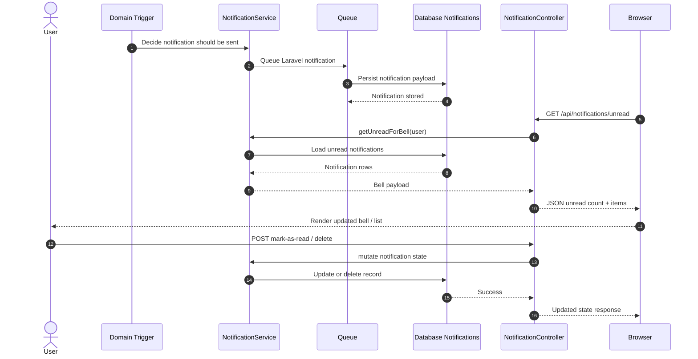
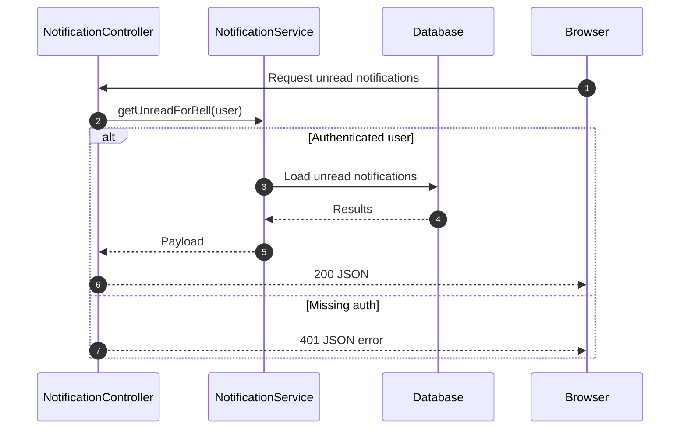

# SEQ-008: Notification Delivery

## Umamusume Pretty Derby Career Planner

**Document Version**: 2.4.2
**Date**: April 7, 2026
**Related Documents**: [PRD-007], [SPEC-007], [FLOW-007], [TECH-FLOW-007]

---

## Table of Contents

1. [Overview](#1-overview)
2. [Participants](#2-participants)
3. [Sequence Flow](#3-sequence-flow)
4. [Detailed Interactions](#4-detailed-interactions)
5. [Data Structures](#5-data-structures)
6. [Error Handling](#6-error-handling)
7. [Performance Considerations](#7-performance-considerations)
8. [Related Documentation](#8-related-documentation)

---

## 1. Overview

### 1.1 Purpose

This sequence diagram documents the notification delivery workflow in the Umamusume Career Planner
application, covering in-app notifications, queued delivery, email delivery, and user preference
management.

### 1.2 Scope

**Covers:**

- In-app and queued notification delivery
- In-app notification center
- Email notification delivery
- User notification preferences
- Notification priority and routing
- Quiet hours and scheduling
- Notification history and read status

**Related Artifacts:**

- PRD: [PRD-007](../02-prds/PRD-007_External_Integration.md)
- SPEC: [SPEC-007](../02-specs/SPEC-007_External_Integration_Technical.md)
- Flow: [FLOW-007](../01-flows/FLOW-007_External_Integration_System.md)
- Tech Flow: [TECH-FLOW-007](../01-tech-flow/TECH-FLOW-007_External_Integration_Flow.md)

### 1.3 Business Context

The notification system enables users to:

- Receive real-time updates on character stat changes
- Get race reminders and training suggestions
- Stay informed of achievement unlocks
- Manage notification preferences for different channels
- Control notification timing with quiet hours

**Success Criteria:**

- Notification state available on next refresh / poll cycle
- Email delivery within 5 minutes for non-urgent
- Preference changes applied immediately
- Quiet hours respected for all channels
- Read status synchronized across sessions

---

## 2. Participants

### 2.1 System Components

| Component | Type | Responsibility |
| --- | --- | --- |
| **Domain Trigger** | Application | Training, race, and alert flows that decide a notification should exist |
| **NotificationService** | Domain Service | Reads, marks, deletes, and creates user notification records |
| **NotificationController** | API Controller | Exposes notification center and unread bell endpoints |
| **Laravel Notifications** | Framework Channel | Persists queued database notifications for users |
| **PushNotificationService** | Infrastructure Service | Stores push subscriptions and quiet-hour preferences |
| **Queue** | Infrastructure | Processes queued notification classes |
| **Database** | Infrastructure | Stores `notifications` and `push_subscriptions` records |

### 2.2 Component Locations

```
app/
├── Http/Controllers/Api/
│   └── NotificationController.php
├── Notifications/
│   ├── CriticalAlertNotification.php
│   ├── RaceReadyNotification.php
│   └── TrainingReminderNotification.php
├── Services/
│   ├── NotificationService.php
│   └── Notifications/
│       └── PushNotificationService.php
└── Models/
    └── PushSubscription.php
```

---

## 3. Sequence Flow

### 3.1 High-Level Flow Diagram



### 3.2 Timeline Breakdown

| Phase | Typical Timing | Description |
| --- | --- | --- |
| **Notification dispatch** | Request-time + queue handoff | Domain flow schedules a notification |
| **Database persistence** | Queue worker dependent | Laravel notification stored in `notifications` |
| **Bell refresh** | Next refresh / poll cycle | Browser asks API for unread notifications |
| **Mark as read** | Single API round trip | Notification row updated for the user |

---

## 4. Detailed Interactions

### 4.1 Notification Service Reads and Mutations

**Request Flow:**

```
Browser/API → NotificationController → NotificationService → Database notifications
```

**Service Implementation:**

```php
class NotificationService
{
    public function getUnreadForBell(User $user, int $limit = 10): array
    {
        $unread = $user->unreadNotifications()
            ->take($limit)
            ->get()
            ->map(fn (DatabaseNotification $notification) => [
                'id' => $notification->id,
                'icon' => $notification->data['icon'] ?? '🔔',
                'title' => $notification->data['title'] ?? 'Notification',
                'message' => $notification->data['message'] ?? '',
                'action_url' => $notification->data['action_url'] ?? '',
                'priority' => $notification->data['priority'] ?? 'normal',
                'time_ago' => $notification->created_at?->diffForHumans(),
            ]);

        return [
            'notifications' => $unread,
            'unread_count' => $user->unreadNotifications()->count(),
        ];
    }
}
```

### 4.2 API Delivery to the Notification Bell

```php
class NotificationController extends Controller
{
    public function unread(Request $request): JsonResponse
    {
        $user = $request->user();

        if (! $user) {
            return response()->json(['message' => 'Unauthenticated.'], 401);
        }

        return response()->json(
            $this->notificationService->getUnreadForBell($user, limit: 10)
        );
    }
}
```

### 4.3 Queued Database Notification Persistence

The active notification classes in the codebase are queued Laravel notifications that currently
write to the `database` channel.

```php
class TrainingReminderNotification extends Notification implements ShouldQueue
{
    use Queueable;

    public function via(object $notifiable): array
    {
        return ['database'];
    }

    public function toArray(object $notifiable): array
    {
        return [
            'type' => 'training_reminder',
            'icon' => '🏃',
            'title' => 'Training Reminder',
            'message' => 'Turn reminder with suggested training context.',
            'priority' => 'normal',
        ];
    }
}
```

### 4.4 Push Subscription Preferences

Push subscription metadata is handled separately from database notifications and stores endpoint-
level preferences plus quiet-hour rules.

> **Note**: Push notifications are delivered through the browser’s Push API (`PushManager.subscribe()`)
> after the user grants notification permission. The browser receives push messages from the server
> via the Web Push Protocol and displays them as native OS notifications, even when the application
> tab is in the background.

```php
class PushNotificationService
{
    public function updatePreferences(User $user, string $endpoint, array $preferences): bool
    {
        $subscription = PushSubscription::query()
            ->where('user_id', $user->id)
            ->where('endpoint', $endpoint)
            ->first();

        if (! $subscription) {
            return false;
        }

        $subscription->update([
            'notification_preferences' => $preferences,
        ]);

        return true;
    }
}
```

### 4.5 Notification Types and Triggers

| Notification Type | Trigger Source | Persistence Channel | Delivery Surface |
| --- | --- | --- | --- |
| **Training Reminder** | Career/training flow | Database notification | Bell dropdown, notification center |
| **Race Ready** | Race availability flow | Database notification | Bell dropdown, notification center |
| **Critical Alert** | Admin/system alert flow | Database notification | Bell dropdown, notification center |
| **Push Subscription Event** | User device registration | `push_subscriptions` table | Browser/device preferences |

---

## 5. Data Structures

### 5.1 Notification Payload Shape

```json
{
  "id": "database-notification-uuid",
  "type": "training_reminder",
  "icon": "🏃",
  "title": "Training Reminder",
  "message": "Turn 12: Time to train your character!",
  "detail": "Suggested: Speed training",
  "action_url": "/careers/157",
  "action_label": "View Career",
  "priority": "normal",
  "read": false
}
```

### 5.2 Push Subscription Preferences

```json
{
  "race_reminders": true,
  "training_alerts": true,
  "sync_notifications": true,
  "quiet_hours_start": "22:00",
  "quiet_hours_end": "08:00"
}
```

### 5.3 Notification API Response

```json
{
  "notifications": [
    {
      "id": "database-notification-uuid",
      "icon": "🏇",
      "title": "Race Available",
      "message": "A race is ready for your current career.",
      "action_url": "/careers/157",
      "priority": "high",
      "time_ago": "2 minutes ago"
    }
  ],
  "unread_count": 1
}
```

---

## 6. Error Handling

### 6.1 API Error Conditions

| Condition | HTTP Status | User Message |
| --- | --- | --- |
| Unauthenticated notification request | 401 | "Unauthenticated." |
| Notification not found for mark/delete | 404 | "Notification not found." |
| Missing push subscription on preference update | 404-style service failure | Preference update returns `false` |

### 6.2 Recovery Flow



### 6.3 Retry Characteristics

| Operation | Retry Strategy |
| --- | --- |
| Queued notification class | Queue worker retry policy if configured for the job |
| Bell refresh API | Client retries by reloading or next poll cycle |
| Push preference updates | User retries after correcting endpoint or auth state |

---

## 7. Performance Considerations

### 7.1 Performance Metrics

| Operation | Target | Status |
| --- | --- | --- |
| Unread count query | < 50ms on indexed reads | Active target |
| Notification list page | Read-focused paginated query | Active target |
| Mark as read | Single record mutation | Active target |
| Queue-backed notification persistence | Worker-dependent but asynchronous | Active target |

### 7.2 Optimization Strategies

- Keep bell payloads small by limiting unread items.
- Use paginated reads for the full notification center.
- Let queued Laravel notifications handle persistence outside user-facing requests when possible.
- Store push preferences per subscription to avoid recomputing device rules.

### 7.3 Database Query Analysis

- Unread bell: one unread-notifications query plus unread count.
- Mark as read: one targeted notification lookup and one update.
- Delete: one targeted notification lookup and one delete.

### 7.4 Data Storage Strategy

- `notifications` stores user-facing database notifications.
- `push_subscriptions` stores per-endpoint push metadata and preference JSON.
- Browser clients fetch fresh state through the API rather than subscribing to WebSocket channels.

---

## 8. Related Documentation

### 8.1 System Documentation

| Document | Description |
| --- | --- |
| [PRD-007](../02-prds/PRD-007_External_Integration.md) | Product requirements for external integration |
| [SPEC-007](../02-specs/SPEC-007_External_Integration_Technical.md) | Technical specification for integration system |
| [FLOW-007](../01-flows/FLOW-007_External_Integration_System.md) | System flow for external operations |
| [TECH-FLOW-007](../01-tech-flow/TECH-FLOW-007_External_Integration_Flow.md) | Technical flow diagrams |

### 8.2 Related Sequences

| Sequence | Description |
| --- | --- |
| [SEQ-002](SEQ-002_Training_Block_Resolution.md) | Training completion triggers notifications |
| [SEQ-004](SEQ-004_Race_Registration_and_Outcome.md) | Race events trigger reminders and results |
| [SEQ-007](SEQ-007_External_Data_Sync.md) | External sync triggers update notifications |

### 8.3 Configuration Documentation

| Config File | Description |
| --- | --- |
| `app/Http/Controllers/Api/NotificationController.php` | Notification API surface for unread/list/read/delete flows |
| `config/mail.php` | Email delivery configuration |
| `config/queue.php` | Queue driver configuration |

---

## Document Control

### Version History

| Version | Date | Author | Changes |
| --- | --- | --- | --- |
| 2.3.0 | 2026-03-10 | Development Team | Added clarification that push notifications are delivered via browser Push API after user consent (section 4.4) |
| 2.1.0 | 2026-03-08 | Development Team | Re-aligned with current implementation: database notifications, unread polling endpoints, push subscription preferences, and queue-backed delivery surfaces |
| 2.0.0 | 2026-01-24 | Development Team | Complete rewrite aligned with v2.0.0 implementation baseline |
| 1.0.0 | 2026-01-14 | Development Team | Initial draft |

### Approval

| Role | Name | Signature | Date |
| --- | --- | --- | --- |
| Technical Lead | | | |
| QA Lead | | | |

### Review Schedule

- Next Review: 2026-04-24
- Review Frequency: Quarterly or on major feature changes

---

**Related Standards:**

- Laravel 12 Best Practices
- PSR-12 Coding Standards
- Mermaid Diagram Standards
- IEEE 830 SRS Format
- Laravel Notifications and Queue Standards

---

*This sequence diagram reflects the current notification workflow on the `develop` branch. For the
most up-to-date information, refer to the source code in `app/Services/NotificationService.php`,
`app/Http/Controllers/Api/NotificationController.php`, and
`app/Services/Notifications/PushNotificationService.php`.*
