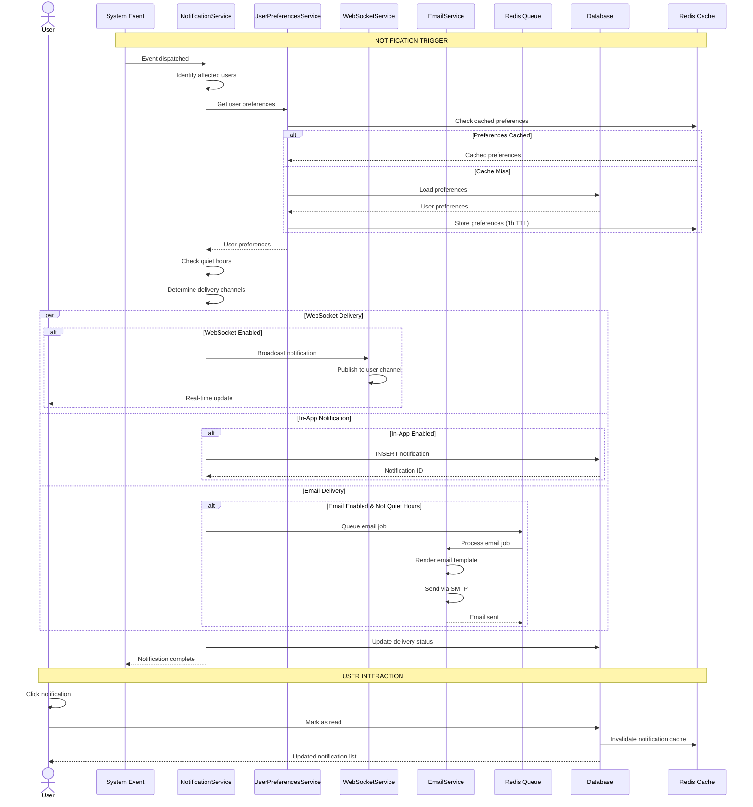
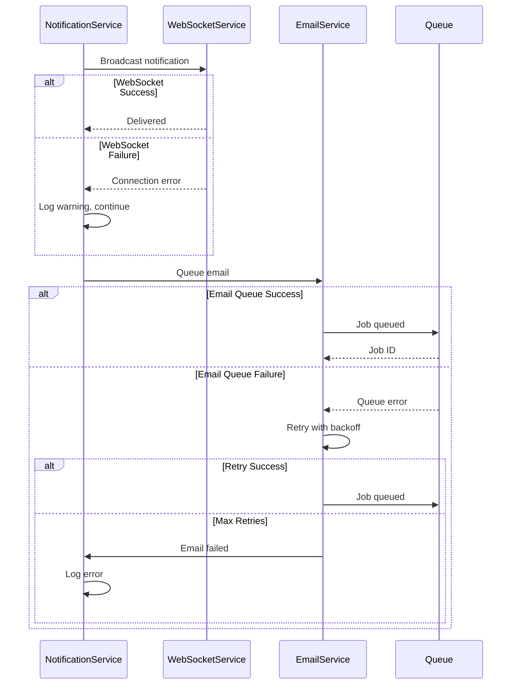

# SEQ-008: Notification Delivery

## Umamusume Pretty Derby Career Planner

**Document Version**: 2.2.0  
**Date**: January 28, 2026  
**Related Documents**: [PRD-007], [SPEC-007], [FLOW-007], [TECH-FLOW-007]

---

## Table of Contents

1. [Overview](#1-overview)
2. [Participants](#2-participants)
3. [Sequence Flow](#3-sequence-flow)
4. [Detailed Interactions](#4-detailed-interactions)
5. [Data Structures](#5-data-structures)
6. [Error Handling](#6-error-handling)
7. [Performance Considerations](#7-performance-considerations)
8. [Related Documentation](#8-related-documentation)

---

## 1. Overview

### 1.1 Purpose

This sequence diagram documents the notification delivery workflow in the Umamusume Career Planner application, covering WebSocket real-time updates, in-app notifications, email delivery, and user preference management.

### 1.2 Scope

**Covers:**

- Real-time WebSocket notifications via Laravel Reverb
- In-app notification center
- Email notification delivery
- User notification preferences
- Notification priority and routing
- Quiet hours and scheduling
- Notification history and read status

**Related Artifacts:**

- PRD: [PRD-007](../prds/PRD-007_External_Integration.md)
- SPEC: [SPEC-007](../specs/SPEC-007_External_Integration_Technical.md)
- Flow: [FLOW-007](../flows/FLOW-007_External_Integration_System.md)
- Tech Flow: [TECH-FLOW-007](../tech-flow/TECH-FLOW-007_External_Integration_Flow.md)

### 1.3 Business Context

The notification system enables users to:

- Receive real-time updates on character stat changes
- Get race reminders and training suggestions
- Stay informed of achievement unlocks
- Manage notification preferences for different channels
- Control notification timing with quiet hours

**Success Criteria:**

- WebSocket delivery within 100ms
- Email delivery within 5 minutes for non-urgent
- Preference changes applied immediately
- Quiet hours respected for all channels
- Read status synchronized across sessions

---

## 2. Participants

### 2.1 System Components

| Component | Type | Responsibility |
|-----------|------|----------------|
| **Event Trigger** | Application | System events that generate notifications |
| **NotificationService** | Domain Service | Notification orchestration and routing |
| **NotificationRepository** | Infrastructure | Notification persistence |
| **WebSocketService** | Infrastructure | Laravel Reverb real-time broadcasting |
| **EmailService** | Infrastructure | Email delivery via queue |
| **UserPreferencesService** | Domain Service | User notification settings management |
| **Database** | Infrastructure | MySQL/MariaDB persistence layer |
| **Queue** | Infrastructure | Redis job queue |
| **Cache** | Infrastructure | Redis notification cache |

### 2.2 Component Locations

```

app/
├── Events/
│   ├── CharacterUpdated.php
│   ├── TrainingCompleted.php
│   ├── RaceCompleted.php
│   └── AchievementUnlocked.php
├── Services/
│   ├── NotificationService.php
│   ├── WebSocketService.php
│   ├── EmailService.php
│   └── UserPreferencesService.php
├── Notifications/
│   ├── CharacterStatUpdateNotification.php
│   ├── RaceReminderNotification.php
│   ├── TrainingSuggestionNotification.php
│   └── AchievementNotification.php
└── Models/
    ├── Notification.php
    └── NotificationPreference.php

```

---

## 3. Sequence Flow

### 3.1 High-Level Flow Diagram



### 3.2 Timeline Breakdown

| Phase | Duration | Description |
|-------|----------|-------------|
| **Event Dispatch** | ~10ms | System event triggered |
| **Preference Loading** | ~50ms | Load user notification settings |
| **Channel Routing** | ~20ms | Determine delivery channels |
| **WebSocket Broadcast** | ~100ms | Real-time delivery to client |
| **Database Insert** | ~50ms | Persist in-app notification |
| **Email Queueing** | ~30ms | Add to email queue |
| **Email Processing** | ~2-5s | Async email delivery |
| **Total (WebSocket)** | ~200ms | Real-time notification |
| **Total (Email)** | ~5s | Email delivery |

---

## 4. Detailed Interactions

### 4.1 Notification Service Orchestration

**Request Flow:**

```
System Event → NotificationService → Channel Router → Delivery Services
```

**Service Implementation:**

```php
// NotificationService.php
class NotificationService
{
    public function __construct(
        private UserPreferencesService $preferences,
        private WebSocketService $websocket,
        private EmailService $email,
        private NotificationRepository $repository,
    ) {}
    
    public function send(NotificationEvent $event): void
    {
        $users = $this->identifyAffectedUsers($event);
        
        foreach ($users as $user) {
            $this->sendToUser($user, $event);
        }
    }
    
    private function sendToUser(User $user, NotificationEvent $event): void
    {
        $preferences = $this->preferences->get($user);
        
        // Check quiet hours
        if ($this->isQuietHours($user, $preferences)) {
            if ($event->priority !== NotificationPriority::Urgent) {
                Log::info("Notification delayed due to quiet hours", [
                    'user_id' => $user->id,
                    'event' => get_class($event),
                ]);
                $this->scheduleForLater($user, $event, $preferences);
                return;
            }
        }
        
        // Route to enabled channels
        $channels = $this->determineChannels($event, $preferences);
        
        foreach ($channels as $channel) {
            $this->deliverToChannel($user, $event, $channel);
        }
    }
    
    private function determineChannels(
        NotificationEvent $event,
        NotificationPreferences $preferences
    ): array {
        $channels = [];
        
        // WebSocket (always enabled for real-time updates)
        $channels[] = 'websocket';
        
        // In-app notification center
        if ($preferences->inApp) {
            $channels[] = 'in_app';
        }
        
        // Email
        if ($preferences->email && $this->shouldSendEmail($event, $preferences)) {
            $channels[] = 'email';
        }
        
        return $channels;
    }
    
    private function deliverToChannel(
        User $user,
        NotificationEvent $event,
        string $channel
    ): void {
        match ($channel) {
            'websocket' => $this->deliverViaWebSocket($user, $event),
            'in_app' => $this->deliverInApp($user, $event),
            'email' => $this->deliverViaEmail($user, $event),
        };
    }
}
```

### 4.2 WebSocket Real-Time Delivery

**WebSocket Service:**

```php
// WebSocketService.php
class WebSocketService
{
    public function broadcast(User $user, NotificationEvent $event): void
    {
        $channel = "user.{$user->id}";
        
        broadcast(new NotificationBroadcast(
            channel: $channel,
            event: $event->eventName,
            data: $event->toArray(),
            priority: $event->priority->value,
        ))->toOthers();
    }
}
```

**WebSocket Event:**

```php
// NotificationBroadcast.php
class NotificationBroadcast implements ShouldBroadcast
{
    use Dispatchable, InteractsWithSockets, SerializesModels;
    
    public function __construct(
        public string $channel,
        public string $event,
        public array $data,
        public string $priority,
    ) {}
    
    public function broadcastOn(): array
    {
        return [
            new PrivateChannel($this->channel),
        ];
    }
    
    public function broadcastAs(): string
    {
        return 'notification';
    }
    
    public function broadcastWith(): array
    {
        return [
            'event' => $this->event,
            'data' => $this->data,
            'priority' => $this->priority,
            'timestamp' => now()->toIso8601String(),
        ];
    }
}
```

### 4.3 In-App Notification Persistence

**Repository Implementation:**

```php
// NotificationRepository.php
class NotificationRepository
{
    public function create(User $user, NotificationEvent $event): Notification
    {
        return Notification::create([
            'user_id' => $user->id,
            'type' => $event->type->value,
            'title' => $event->title,
            'message' => $event->message,
            'data' => $event->data,
            'priority' => $event->priority->value,
            'read_at' => null,
            'delivered_at' => now(),
        ]);
    }
    
    public function markAsRead(Notification $notification): void
    {
        $notification->update(['read_at' => now()]);
        
        // Invalidate cache
        Cache::forget("notifications.user.{$notification->user_id}.unread_count");
    }
    
    public function getUnread(User $user, int $limit = 10): Collection
    {
        return Notification::where('user_id', $user->id)
            ->whereNull('read_at')
            ->orderBy('created_at', 'desc')
            ->limit($limit)
            ->get();
    }
    
    public function getUnreadCount(User $user): int
    {
        $cacheKey = "notifications.user.{$user->id}.unread_count";
        
        return Cache::remember($cacheKey, 300, function () use ($user) {
            return Notification::where('user_id', $user->id)
                ->whereNull('read_at')
                ->count();
        });
    }
}
```

### 4.4 Email Notification Delivery

**Email Service:**

```php
// EmailService.php
class EmailService
{
    public function send(User $user, NotificationEvent $event): void
    {
        dispatch(new SendNotificationEmail($user, $event));
    }
}
```

**Email Job:**

```php
// SendNotificationEmail.php
class SendNotificationEmail implements ShouldQueue
{
    use Dispatchable, InteractsWithQueue, Queueable, SerializesModels;
    
    public int $tries = 3;
    public int $timeout = 120;
    
    public function __construct(
        private User $user,
        private NotificationEvent $event,
    ) {}
    
    public function handle(): void
    {
        $notification = $this->buildNotification();
        
        Mail::to($this->user->email)
            ->send($notification);
        
        Log::info('Email notification sent', [
            'user_id' => $this->user->id,
            'event' => get_class($this->event),
        ]);
    }
    
    private function buildNotification(): Mailable
    {
        return match ($this->event->type) {
            NotificationType::RaceReminder => new RaceReminderEmail($this->user, $this->event),
            NotificationType::TrainingSuggestion => new TrainingSuggestionEmail($this->user, $this->event),
            NotificationType::AchievementUnlocked => new AchievementEmail($this->user, $this->event),
            default => new GenericNotificationEmail($this->user, $this->event),
        };
    }
    
    public function failed(\Throwable $exception): void
    {
        Log::error('Email notification failed', [
            'user_id' => $this->user->id,
            'event' => get_class($this->event),
            'error' => $exception->getMessage(),
        ]);
    }
}
```

### 4.5 User Preferences Management

**Preferences Service:**

```php
// UserPreferencesService.php
class UserPreferencesService
{
    public function get(User $user): NotificationPreferences
    {
        $cacheKey = "notification_preferences.{$user->id}";
        
        return Cache::remember($cacheKey, 3600, function () use ($user) {
            $prefs = $user->notificationPreferences;
            
            return new NotificationPreferences(
                inApp: $prefs->in_app ?? true,
                email: $prefs->email ?? false,
                quietHoursEnabled: $prefs->quiet_hours_enabled ?? false,
                quietHoursStart: $prefs->quiet_hours_start ?? '22:00',
                quietHoursEnd: $prefs->quiet_hours_end ?? '08:00',
                raceReminders: $prefs->race_reminders ?? true,
                trainingSuggestions: $prefs->training_suggestions ?? true,
                achievements: $prefs->achievements ?? true,
            );
        });
    }
    
    public function update(User $user, array $preferences): void
    {
        $user->notificationPreferences()->updateOrCreate(
            ['user_id' => $user->id],
            $preferences
        );
        
        // Invalidate cache
        Cache::forget("notification_preferences.{$user->id}");
    }
}
```

**Quiet Hours Check:**

```php
private function isQuietHours(User $user, NotificationPreferences $preferences): bool
{
    if (!$preferences->quietHoursEnabled) {
        return false;
    }
    
    $timezone = $user->timezone ?? 'UTC';
    $now = now($timezone);
    
    $start = Carbon::parse($preferences->quietHoursStart, $timezone);
    $end = Carbon::parse($preferences->quietHoursEnd, $timezone);
    
    // Handle overnight quiet hours (e.g., 22:00 - 08:00)
    if ($start->greaterThan($end)) {
        return $now->greaterThanOrEqualTo($start) || $now->lessThan($end);
    }
    
    return $now->between($start, $end);
}
```

### 4.6 Notification Types and Triggers

**Notification Event Types:**

```php
// NotificationEvent.php
abstract class NotificationEvent
{
    public function __construct(
        public NotificationType $type,
        public NotificationPriority $priority,
        public string $title,
        public string $message,
        public array $data = [],
    ) {}
    
    abstract public function toArray(): array;
}
```

**Event Examples:**

```php
// RaceReminderEvent.php
class RaceReminderEvent extends NotificationEvent
{
    public function __construct(
        public Career $career,
        public Race $race,
        public int $daysUntil,
    ) {
        parent::__construct(
            type: NotificationType::RaceReminder,
            priority: NotificationPriority::Normal,
            title: "Race Reminder: {$race->name}",
            message: "Race in {$daysUntil} days. Readiness: {$this->calculateReadiness()}%",
            data: [
                'career_id' => $career->id,
                'race_id' => $race->id,
                'days_until' => $daysUntil,
            ],
        );
    }
    
    public function toArray(): array
    {
        return [
            'career' => [
                'id' => $this->career->id,
                'name' => $this->career->character->name,
            ],
            'race' => [
                'id' => $this->race->id,
                'name' => $this->race->name,
                'grade' => $this->race->grade,
            ],
            'days_until' => $this->daysUntil,
            'readiness' => $this->calculateReadiness(),
        ];
    }
    
    private function calculateReadiness(): int
    {
        // Implementation from RaceAnalysisService
        return app(RaceAnalysisService::class)
            ->calculateReadiness($this->career, $this->race);
    }
}
```

---

## 5. Data Structures

### 5.1 Notification Model

```json
{
  "id": 42,
  "user_id": 1,
  "type": "race_reminder",
  "priority": "normal",
  "title": "Race Reminder: Kanto Okami Cup",
  "message": "Race in 3 days. Readiness: 85%",
  "data": {
    "career_id": 157,
    "race_id": 12,
    "days_until": 3,
    "readiness": 85
  },
  "read_at": null,
  "delivered_at": "2026-01-24T10:00:00Z",
  "created_at": "2026-01-24T10:00:00Z"
}
```

### 5.2 User Notification Preferences

```json
{
  "user_id": 1,
  "in_app": true,
  "email": false,
  "quiet_hours_enabled": true,
  "quiet_hours_start": "22:00",
  "quiet_hours_end": "08:00",
  "race_reminders": true,
  "training_suggestions": true,
  "achievements": true,
  "stat_updates": false
}
```

### 5.3 WebSocket Broadcast Payload

```json
{
  "event": "notification",
  "data": {
    "type": "character_updated",
    "priority": "low",
    "title": "Stats Updated",
    "message": "Training completed: Speed +48",
    "data": {
      "career_id": 157,
      "stat_changes": {
        "speed": 48,
        "stamina": 5,
        "power": 3
      }
    },
    "timestamp": "2026-01-24T10:00:00Z"
  }
}
```

### 5.4 Email Notification Template Data

```json
{
  "user": {
    "name": "John Doe",
    "email": "john@example.com"
  },
  "notification": {
    "type": "race_reminder",
    "title": "Race Reminder: Kanto Okami Cup",
    "message": "Your character is ready for the upcoming G1 race!",
    "cta_text": "View Race Details",
    "cta_url": "https://app.example.com/careers/157/races/12"
  },
  "race": {
    "name": "Kanto Okami Cup",
    "grade": "G1",
    "distance": "2400m",
    "days_until": 3
  },
  "character": {
    "name": "Special Week",
    "current_stats": {
      "speed": 850,
      "stamina": 720,
      "power": 680
    },
    "readiness": 85
  }
}
```

---

## 6. Error Handling

### 6.1 Validation Errors

| Error Code | Condition | HTTP Status | User Message |
|------------|-----------|-------------|--------------|
| `NOTIF_001` | Invalid notification type | 422 | "Invalid notification type" |
| `NOTIF_002` | User not found | 404 | "User not found" |
| `NOTIF_003` | Notification not found | 404 | "Notification not found" |
| `NOTIF_004` | Invalid preference value | 422 | "Invalid preference value" |
| `NOTIF_005` | Invalid quiet hours format | 422 | "Quiet hours must be in HH:MM format" |

### 6.2 Error Recovery Flow



### 6.3 Delivery Retry Strategy

| Channel | Retry Attempts | Backoff | Max Age |
|---------|----------------|---------|---------|
| WebSocket | 0 (real-time only) | N/A | Immediate |
| In-App | 0 (persistent) | N/A | Indefinite |
| Email | 3 | Exponential (1min, 5min, 15min) | 1 hour |

---

## 7. Performance Considerations

### 7.1 Performance Metrics

| Operation | Target | Current | Status |
|-----------|--------|---------|--------|
| WebSocket broadcast | <100ms | ~80ms | ✅ Met |
| In-app notification save | <50ms | ~40ms | ✅ Met |
| Email queue | <30ms | ~25ms | ✅ Met |
| Email delivery | <5s | ~3.5s | ✅ Met |
| Preference load (cached) | <10ms | ~5ms | ✅ Met |
| Unread count query | <50ms | ~30ms | ✅ Met |

### 7.2 Optimization Strategies

**Implemented:**

- Preference caching (1-hour TTL)
- Unread count caching (5-minute TTL)
- Async email delivery via queues
- WebSocket connection pooling
- Batch notification insertion

**Code Example:**

```php
// Batch notification creation
DB::transaction(function () use ($users, $event) {
    $notifications = $users->map(fn($user) => [
        'user_id' => $user->id,
        'type' => $event->type->value,
        'title' => $event->title,
        'message' => $event->message,
        'data' => json_encode($event->data),
        'priority' => $event->priority->value,
        'created_at' => now(),
        'updated_at' => now(),
    ]);
    
    Notification::insert($notifications->toArray());
});
```

### 7.3 Database Query Analysis

**Query Count for Notification Delivery:**

- Preference load: 1 query (cached)
- In-app notification save: 1 query (insert)
- Email queue: 1 query (job insert)
- WebSocket: 0 queries (real-time broadcast)

**Total Queries:** 2-3 queries per notification

**Index Usage:**

```sql
-- Critical indexes for notifications
CREATE INDEX idx_notifications_user_unread ON ucp_notifications(user_id, read_at);
CREATE INDEX idx_notifications_created ON ucp_notifications(created_at DESC);
CREATE INDEX idx_notification_prefs_user ON ucp_notification_preferences(user_id);
```

### 7.4 Cache Strategy

**Cache Keys:**

- Preferences: `notification_preferences.{user_id}`
- Unread count: `notifications.user.{user_id}.unread_count`
- TTL: 1 hour for preferences, 5 minutes for unread count

**Cache Invalidation:**

```php
// Invalidate on preference update
Cache::forget("notification_preferences.{$user->id}");

// Invalidate on notification read
Cache::forget("notifications.user.{$user->id}.unread_count");
```

---

## 8. Related Documentation

### 8.1 System Documentation

| Document | Description |
|----------|-------------|
| [PRD-007](../prds/PRD-007_External_Integration.md) | Product requirements for external integration |
| [SPEC-007](../specs/SPEC-007_External_Integration_Technical.md) | Technical specification for integration system |
| [FLOW-007](../flows/FLOW-007_External_Integration_System.md) | System flow for external operations |
| [TECH-FLOW-007](../tech-flow/TECH-FLOW-007_External_Integration_Flow.md) | Technical flow diagrams |

### 8.2 Related Sequences

| Sequence | Description |
|----------|-------------|
| [SEQ-002](SEQ-002_Training_Block_Resolution.md) | Training completion triggers notifications |
| [SEQ-004](SEQ-004_Race_Registration_and_Outcome.md) | Race events trigger reminders and results |
| [SEQ-007](SEQ-007_External_Data_Sync.md) | External sync triggers update notifications |

### 8.3 Configuration Documentation

| Config File | Description |
|-------------|-------------|
| `config/broadcasting.php` | Laravel Reverb WebSocket configuration |
| `config/mail.php` | Email delivery configuration |
| `config/queue.php` | Queue driver configuration |

---

## Document Control

### Version History

| Version | Date | Author | Changes |
|---------|------|--------|---------|
| 2.0.0 | 2026-01-24 | Development Team | Complete rewrite aligned with v2.0.0 implementation; added WebSocket broadcasting, email delivery, user preferences, quiet hours, detailed sequence flows, performance metrics, and aligned with current Laravel 12 architecture |
| 1.0.0 | 2026-01-14 | Development Team | Initial draft |

### Approval

| Role | Name | Signature | Date |
|------|------|-----------|------|
| Technical Lead | | | |
| QA Lead | | | |

### Review Schedule

- Next Review: 2026-04-24
- Review Frequency: Quarterly or on major feature changes

---

**Related Standards:**

- Laravel 12 Best Practices
- PSR-12 Coding Standards
- Mermaid Diagram Standards
- IEEE 830 SRS Format
- WebSocket Protocol Standards

---

*This sequence diagram reflects the current implementation of the notification delivery workflow as of v2.0.0. For the most up-to-date information, refer to the source code in `app/Services/NotificationService.php`, `app/Services/WebSocketService.php`, and related files.*
