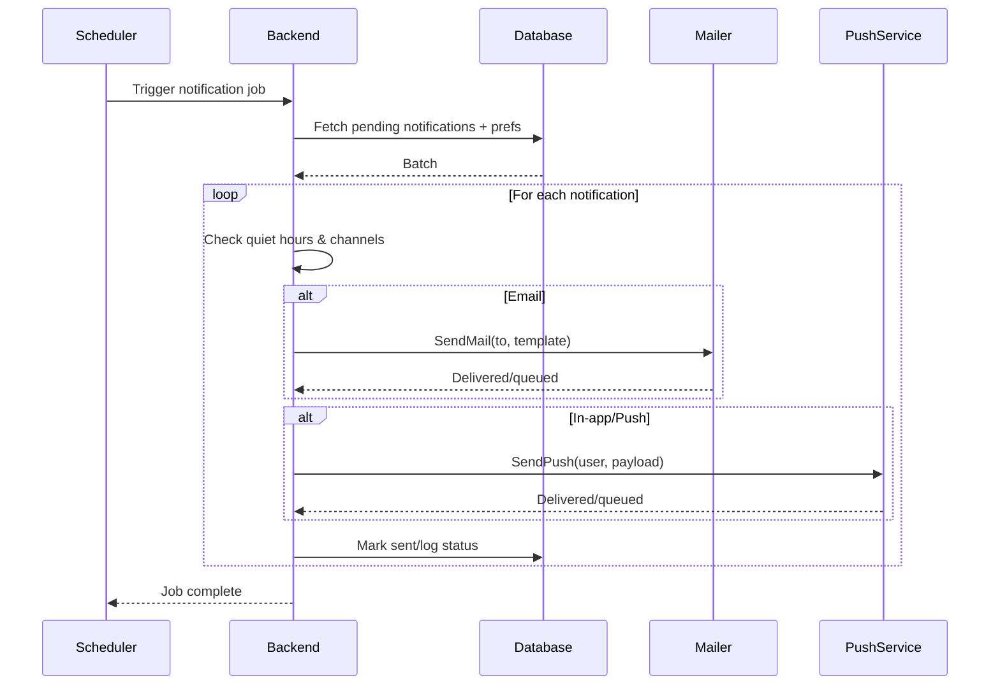

# SEQ-008: Notification Delivery

## Umamusume Pretty Derby Career Planner

**Document Version**: 1.0  
**Date**: January 14, 2026  
**Related Documents**: [PRD-001], [SPEC-008]
**Source Specs**:

- `.kiro/specs/umamusume-career-planner-main/requirements.md` (Notification Requirements)
- `.kiro/specs/umamusume-career-planner-main/design.md` (Notification System)

**Related Artifacts**:

- PRD: [PRD-007](../prds/PRD-007_External_Integration.md)
- SPEC: [SPEC-007](../specs/SPEC-007_External_Integration_Technical.md)
- Tech Flow: [TECH-FLOW-007](../tech-flow/TECH-FLOW-007_External_Integration_Flow.md)

---

## Sequence Overview

- Sends training/race reminders via in-app and email; respects user preferences and quiet hours.

## Sequence Diagram

