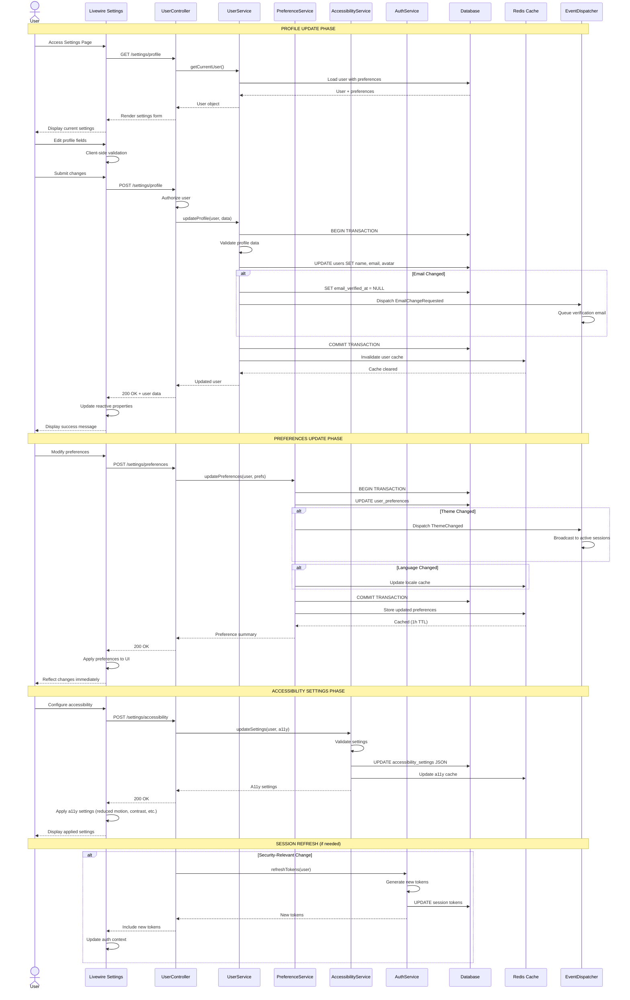
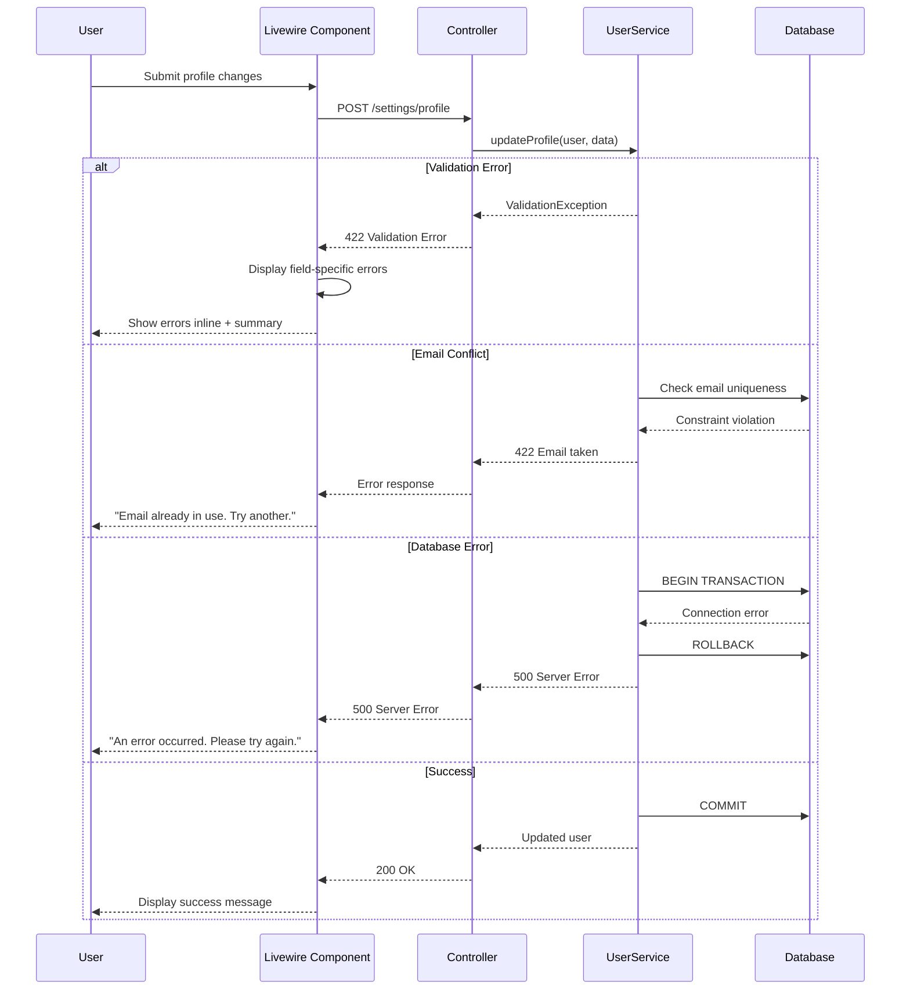

# SEQ-009: User Profile Update

## Umamusume Pretty Derby Career Planner

**Document Version**: 2.2.0  
**Date**: January 28, 2026  
**Related Documents**: [PRD-001], [SPEC-001], [FLOW-001]

---

## Table of Contents

1. [Overview](#1-overview)
2. [Participants](#2-participants)
3. [Sequence Flow](#3-sequence-flow)
4. [Detailed Interactions](#4-detailed-interactions)
5. [Data Structures](#5-data-structures)
6. [Error Handling](#6-error-handling)
7. [Performance Considerations](#7-performance-considerations)
8. [Related Documentation](#8-related-documentation)

---

## 1. Overview

### 1.1 Purpose

This sequence diagram documents the user profile update workflow in the Umamusume Career Planner application, covering profile management, preference updates, accessibility settings, AI configuration, and session management.

### 1.2 Scope

**Covers:**

- User profile information updates
- Preference management (UI, notifications, privacy)
- Accessibility settings configuration
- AI provider preferences
- MCP server configuration
- Session token refresh
- Cache invalidation for preference changes

**Related Artifacts:**

- PRD: [PRD-001](../prds/PRD-001_Character_Management.md)
- SPEC: [SPEC-001](../specs/SPEC-001_Character_Management_Technical.md)
- Flow: [FLOW-001](../flows/FLOW-001_Character_Management_System.md)

### 1.3 Business Context

User profile management enables:

- Personalized user experience through preferences
- Accessibility customization for inclusive design
- AI provider selection and cost management
- Theme and language preferences
- Notification preferences across channels

**Success Criteria:**

- Profile updates persisted within 200ms
- Preferences applied immediately to active session
- Cache invalidated for stale preference data
- Session refreshed if security-relevant changes occur
- UI reflects updated preferences without page reload

---

## 2. Participants

### 2.1 System Components

| Component | Type | Responsibility |
|-----------|------|----------------|
| **User** | Actor | Initiates profile and preference updates |
| **Livewire Component** | Presentation | `UserProfileSettings.php`, `PreferencesManager.php` - Settings UI |
| **UserController** | Application | Orchestrates profile operations |
| **UserService** | Domain Service | Profile update business logic |
| **PreferenceService** | Domain Service | Preference management |
| **AccessibilityService** | Domain Service | A11y settings validation and application |
| **AuthService** | Infrastructure | Session and token management |
| **Database** | Infrastructure | MySQL/MariaDB persistence layer |
| **Cache** | Infrastructure | Redis preference caching |
| **EventDispatcher** | Infrastructure | Laravel event broadcasting |

### 2.2 Component Locations

```

app/
├── Livewire/
│   └── Settings/
│       ├── UserProfileSettings.php
│       ├── PreferencesManager.php
│       ├── AccessibilitySettings.php
│       └── AIConfiguration.php
├── Http/
│   └── Controllers/
│       └── UserController.php
├── Services/
│   ├── UserService.php
│   ├── PreferenceService.php
│   ├── AccessibilityService.php
│   └── AuthService.php
└── Models/
    ├── User.php
    └── UserPreference.php

```

---

## 3. Sequence Flow

### 3.1 High-Level Flow Diagram



### 3.2 Timeline Breakdown

| Phase | Duration | Description |
|-------|----------|-------------|
| **Settings Load** | ~150ms | Load user and preferences |
| **User Validation** | ~50ms | Client-side field validation |
| **Profile Update** | ~150ms | Database update + validation |
| **Email Verification** | ~30ms | Queue verification email (if email changed) |
| **Cache Invalidation** | ~20ms | Clear user cache |
| **Preferences Update** | ~100ms | Update preference JSON |
| **A11y Settings** | ~80ms | Update accessibility settings |
| **Session Refresh** | ~100ms | Token regeneration (if needed) |
| **Event Dispatch** | ~30ms | Queue event listeners |
| **UI Update** | ~50ms | Apply settings to interface |
| **Total (Basic Update)** | ~350ms | Profile + prefs |
| **Total (Full Update)** | ~600ms | All settings + session refresh |

---

## 4. Detailed Interactions

### 4.1 Profile Update Service

**Request Flow:**

```
User → Livewire Component → UserController → UserService
```

**Service Implementation:**

```php
// UserService.php
class UserService
{
    public function __construct(
        private UserRepository $repository,
        private Cache $cache,
        private EventDispatcher $events,
    ) {}
    
    public function updateProfile(User $user, array $data): User
    {
        return DB::transaction(function () use ($user, $data) {
            // 1. Validate input
            $validated = $this->validateProfileData($data);
            
            // 2. Track email change
            $emailChanged = isset($validated['email']) && 
                            $validated['email'] !== $user->email;
            
            // 3. Update user record
            $user->update($validated);
            
            // 4. Handle email verification
            if ($emailChanged) {
                $user->update(['email_verified_at' => null]);
                $this->events->dispatch(new EmailChangeRequested($user, $validated['email']));
            }
            
            // 5. Handle avatar upload
            if (isset($validated['avatar'])) {
                $this->handleAvatarUpload($user, $validated['avatar']);
            }
            
            // 6. Clear cache
            $this->cache->forget("user.{$user->id}");
            $this->cache->forget("user.email.{$user->email}");
            
            return $user->fresh();
        });
    }
    
    private function validateProfileData(array $data): array
    {
        return validator($data, [
            'name' => 'sometimes|string|max:255',
            'email' => 'sometimes|email|max:255|unique:users,email',
            'avatar' => 'sometimes|image|max:2048', // 2MB max
        ])->validate();
    }
    
    private function handleAvatarUpload(User $user, UploadedFile $file): void
    {
        // Delete old avatar if exists
        if ($user->avatar_path) {
            Storage::delete($user->avatar_path);
        }
        
        // Store new avatar
        $path = $file->store('avatars', 'public');
        $user->update(['avatar_path' => $path]);
    }
}
```

### 4.2 Preference Management

**Preference Categories:**

```php
// PreferenceService.php
class PreferenceService
{
    public function updatePreferences(User $user, array $preferences): array
    {
        return DB::transaction(function () use ($user, $preferences) {
            $updated = [];
            
            // UI Preferences
            if (isset($preferences['ui'])) {
                $updated['ui'] = $this->updateUIPreferences($user, $preferences['ui']);
            }
            
            // Notification Preferences
            if (isset($preferences['notifications'])) {
                $updated['notifications'] = $this->updateNotificationPreferences($user, $preferences['notifications']);
            }
            
            // Privacy Preferences
            if (isset($preferences['privacy'])) {
                $updated['privacy'] = $this->updatePrivacyPreferences($user, $preferences['privacy']);
            }
            
            // AI Preferences
            if (isset($preferences['ai'])) {
                $updated['ai'] = $this->updateAIPreferences($user, $preferences['ai']);
            }
            
            // Update user preferences JSON
            $user->update(['preferences' => array_merge($user->preferences ?? [], $updated)]);
            
            // Cache updated preferences
            $this->cache->put("user.{$user->id}.preferences", $user->preferences, 3600);
            
            // Dispatch events for reactive changes
            if (isset($updated['ui']['theme'])) {
                event(new ThemeChanged($user, $updated['ui']['theme']));
            }
            
            return $updated;
        });
    }
    
    private function updateUIPreferences(User $user, array $ui): array
    {
        return validator($ui, [
            'theme' => 'sometimes|in:light,dark,system',
            'language' => 'sometimes|in:en,ja',
            'stat_display' => 'sometimes|in:numeric,circular,bars',
            'compact_view' => 'sometimes|boolean',
        ])->validate();
    }
    
    private function updateNotificationPreferences(User $user, array $notifications): array
    {
        return validator($notifications, [
            'race_reminders' => 'sometimes|boolean',
            'training_suggestions' => 'sometimes|boolean',
            'goal_alerts' => 'sometimes|boolean',
            'email_notifications' => 'sometimes|boolean',
        ])->validate();
    }
    
    private function updateAIPreferences(User $user, array $ai): array
    {
        return validator($ai, [
            'provider' => 'sometimes|in:local,cloud,hybrid',
            'auto_suggest' => 'sometimes|boolean',
            'suggestion_frequency' => 'sometimes|in:always,important,never',
            'cost_limit' => 'sometimes|numeric|min:0|max:100',
        ])->validate();
    }
}
```

### 4.3 Accessibility Settings

**A11y Service:**

```php
// AccessibilityService.php
class AccessibilityService
{
    public function updateSettings(User $user, array $settings): array
    {
        $validated = validator($settings, [
            'reduced_motion' => 'sometimes|boolean',
            'high_contrast' => 'sometimes|boolean',
            'screen_reader' => 'sometimes|boolean',
            'keyboard_navigation' => 'sometimes|boolean',
            'font_size' => 'sometimes|in:small,medium,large,extra-large',
            'focus_indicators' => 'sometimes|in:default,enhanced,high-contrast',
        ])->validate();
        
        $user->update(['accessibility_settings' => array_merge(
            $user->accessibility_settings ?? [],
            $validated
        )]);
        
        // Cache a11y settings for fast retrieval
        $this->cache->put(
            "user.{$user->id}.accessibility",
            $user->accessibility_settings,
            3600
        );
        
        return $validated;
    }
}
```

### 4.4 Session Refresh Logic

**Auth Service:**

```php
// AuthService.php
class AuthService
{
    public function refreshTokens(User $user): array
    {
        // Generate new access token
        $accessToken = $user->createToken('access_token')->plainTextToken;
        
        // Update last activity
        $user->update(['last_activity_at' => now()]);
        
        return [
            'access_token' => $accessToken,
            'token_type' => 'Bearer',
            'expires_in' => config('sanctum.expiration'),
        ];
    }
    
    public function requiresSessionRefresh(User $user, array $changes): bool
    {
        // Refresh session if security-sensitive fields changed
        $securityFields = ['email', 'password'];
        
        return collect($changes)->keys()->intersect($securityFields)->isNotEmpty();
    }
}
```

---

## 5. Data Structures

### 5.1 User Model

```json
{
  "id": 1,
  "uuid": "550e8400-e29b-41d4-a716-446655440000",
  "name": "John Doe",
  "email": "john@example.com",
  "email_verified_at": "2026-01-20T10:00:00Z",
  "avatar_path": "avatars/john-doe.jpg",
  "preferences": {
    "ui": {
      "theme": "dark",
      "language": "en",
      "stat_display": "circular",
      "compact_view": false
    },
    "notifications": {
      "race_reminders": true,
      "training_suggestions": true,
      "goal_alerts": true,
      "email_notifications": false
    },
    "privacy": {
      "show_profile": true,
      "share_stats": false
    },
    "ai": {
      "provider": "hybrid",
      "auto_suggest": true,
      "suggestion_frequency": "important",
      "cost_limit": 10.00
    }
  },
  "accessibility_settings": {
    "reduced_motion": false,
    "high_contrast": false,
    "screen_reader": false,
    "keyboard_navigation": true,
    "font_size": "medium",
    "focus_indicators": "default"
  },
  "ai_settings": {
    "default_provider": "ollama",
    "bedrock_enabled": true,
    "cost_tracking": true,
    "monthly_budget": 25.00
  },
  "mcp_settings": {
    "enabled": true,
    "servers": ["memory", "filesystem", "fetch"]
  },
  "created_at": "2026-01-15T08:00:00Z",
  "updated_at": "2026-01-24T10:30:00Z"
}
```

### 5.2 Profile Update Request

```json
{
  "name": "John Doe",
  "email": "newemail@example.com",
  "avatar": "<UploadedFile>",
  "preferences": {
    "ui": {
      "theme": "dark"
    },
    "notifications": {
      "race_reminders": false
    }
  }
}
```

### 5.3 Profile Update Response

```json
{
  "success": true,
  "user": {
    "id": 1,
    "name": "John Doe",
    "email": "newemail@example.com",
    "email_verified_at": null,
    "avatar_url": "https://app.example.com/storage/avatars/john-doe.jpg",
    "preferences": {
      "ui": {
        "theme": "dark",
        "language": "en"
      },
      "notifications": {
        "race_reminders": false
      }
    }
  },
  "messages": [
    "Profile updated successfully",
    "Verification email sent to newemail@example.com"
  ]
}
```

### 5.4 Accessibility Settings Response

```json
{
  "success": true,
  "settings": {
    "reduced_motion": true,
    "high_contrast": false,
    "screen_reader": true,
    "keyboard_navigation": true,
    "font_size": "large",
    "focus_indicators": "enhanced"
  },
  "applied": true
}
```

---

## 6. Error Handling

### 6.1 Validation Errors

| Error Code | Condition | HTTP Status | User Message |
|------------|-----------|-------------|--------------|
| `USER_001` | Invalid email format | 422 | "Please enter a valid email address" |
| `USER_002` | Email already taken | 422 | "This email is already in use" |
| `USER_003` | Name too long | 422 | "Name must be 255 characters or less" |
| `USER_004` | Avatar file too large | 422 | "Avatar must be 2MB or less" |
| `USER_005` | Invalid avatar format | 422 | "Avatar must be an image (jpg, png, gif)" |
| `USER_006` | Invalid preference value | 422 | "Invalid preference value provided" |
| `USER_007` | Unauthorized access | 403 | "You do not have permission to update this profile" |

### 6.2 Error Recovery Flow



### 6.3 Transaction Rollback Scenarios

| Scenario | Trigger | Recovery |
|----------|---------|----------|
| Constraint violation | Duplicate email | Rollback, display error |
| File upload failure | Storage error | Rollback, retain old avatar |
| Cache invalidation failure | Redis unavailable | Log warning, continue |
| Email send failure | SMTP error | Log error, queue retry |

---

## 7. Performance Considerations

### 7.1 Performance Metrics

| Operation | Target | Current | Status |
|-----------|--------|---------|--------|
| Settings page load | <500ms | ~350ms | ✅ Met |
| Profile update | <200ms | ~180ms | ✅ Met |
| Preferences update | <150ms | ~120ms | ✅ Met |
| A11y settings update | <100ms | ~80ms | ✅ Met |
| Avatar upload | <1s | ~850ms | ✅ Met |
| Cache invalidation | <50ms | ~20ms | ✅ Met |

### 7.2 Optimization Strategies

**Implemented:**

- Preference caching (1-hour TTL)
- Lazy loading of user settings
- Avatar image optimization (resize, compress)
- Batch preference updates

**Code Example:**

```php
// Optimized preference loading with caching
$preferences = Cache::remember("user.{$userId}.preferences", 3600, function () use ($user) {
    return $user->preferences;
});
```

### 7.3 Database Query Analysis

**Query Count for Profile Update:**

- User load: 1 query
- Email uniqueness check: 1 query (if email changed)
- Profile update: 1 query (update)
- Avatar cleanup: 0-1 queries (if old avatar exists)
- Preference update: 1 query (JSON update)

**Total Queries:** 3-5 queries per update

**Index Usage:**

```sql
-- Critical indexes for user management
CREATE UNIQUE INDEX idx_users_email ON ucp_users(email);
CREATE INDEX idx_users_uuid ON ucp_users(uuid);
CREATE INDEX idx_users_email_verified ON ucp_users(email_verified_at);
```

### 7.4 Cache Strategy

**Cache Keys:**

- User data: `user.{id}`
- User preferences: `user.{id}.preferences`
- User accessibility: `user.{id}.accessibility`
- Email lookup: `user.email.{email}`
- TTL: 1 hour for preferences, session-based for user data

**Cache Invalidation:**

```php
// Invalidate on profile update
$this->cache->forget("user.{$user->id}");
$this->cache->forget("user.{$user->id}.preferences");

// Invalidate on email change
$this->cache->forget("user.email.{$user->email}");
```

---

## 8. Related Documentation

### 8.1 System Documentation

| Document | Description |
|----------|-------------|
| [PRD-001](../prds/PRD-001_Character_Management.md) | Product requirements for user management |
| [SPEC-001](../specs/SPEC-001_Character_Management_Technical.md) | Technical specification for user system |
| [FLOW-001](../flows/FLOW-001_Character_Management_System.md) | System flow for user operations |

### 8.2 Related Sequences

| Sequence | Description |
|----------|-------------|
| [SEQ-001](SEQ-001_Character_Creation_Sequence.md) | Character creation (requires authenticated user) |
| [SEQ-008](SEQ-008_Notification_Delivery.md) | Notifications (uses user preferences) |

### 8.3 Configuration Documentation

| Config File | Description |
|-------------|-------------|
| `config/sanctum.php` | Authentication configuration |
| `config/filesystems.php` | Avatar storage configuration |

---

## Document Control

### Version History

| Version | Date | Author | Changes |
|---------|------|--------|---------|
| 2.0.0 | 2026-01-24 | Development Team | Complete rewrite aligned with v2.0.0 implementation; added detailed sequence flows, preference management, accessibility settings, performance metrics, and aligned with current Laravel 12 architecture |
| 1.0.0 | 2026-01-14 | Development Team | Initial draft |

### Approval

| Role | Name | Signature | Date |
|------|------|-----------|------|
| Technical Lead | | | |
| QA Lead | | | |

### Review Schedule

- Next Review: 2026-04-24
- Review Frequency: Quarterly or on major feature changes

---

**Related Standards:**

- Laravel 12 Best Practices
- PSR-12 Coding Standards
- Mermaid Diagram Standards
- IEEE 830 SRS Format

---

*This sequence diagram reflects the current implementation of the user profile update workflow as of v2.0.0. For the most up-to-date information, refer to the source code in `app/Services/UserService.php`, `app/Services/PreferenceService.php`, and related files.*
