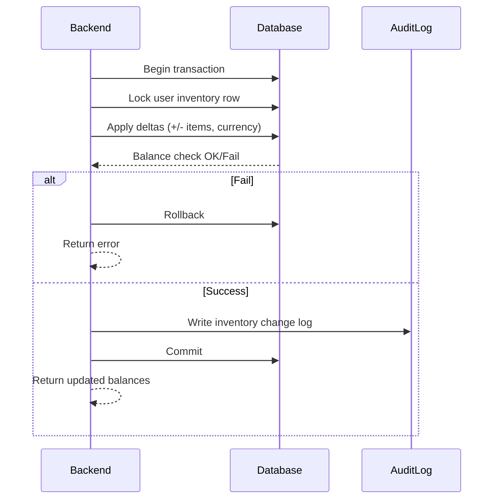

# SEQ-010: Inventory Transaction

## Umamusume Pretty Derby Career Planner

**Document Version**: 1.0  
**Date**: January 14, 2026  
**Related Documents**: [PRD-001], [SPEC-010]
**Source Specs**:

- `.kiro/specs/umamusume-career-planner-main/requirements.md` (Inventory Management)
- `.kiro/specs/umamusume-career-planner-main/design.md` (Inventory System)

**Related Artifacts**:

- PRD: [PRD-001](../prds/PRD-001_Character_Management.md)
- SPEC: [SPEC-001](../specs/SPEC-001_Character_Management_Technical.md)

---

## Sequence Overview

- Processes inventory adds/removals (items, mats, currencies) with atomicity and logging.

## Sequence Diagram

