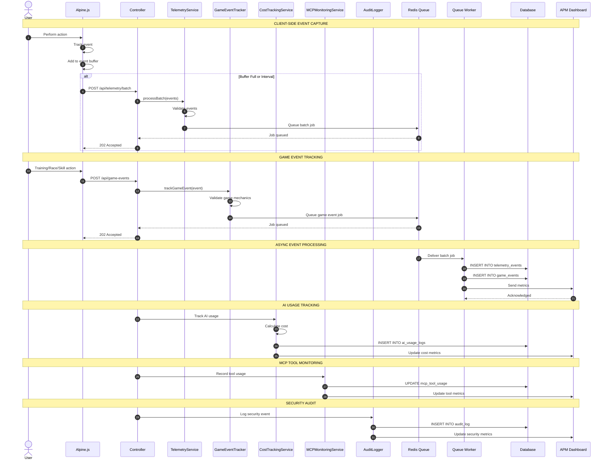
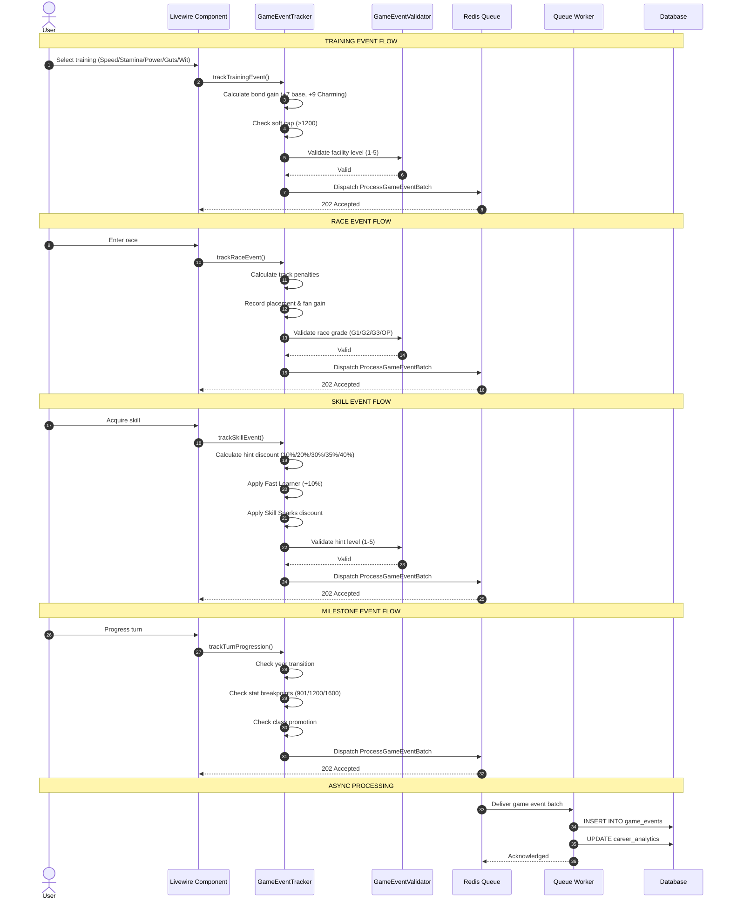
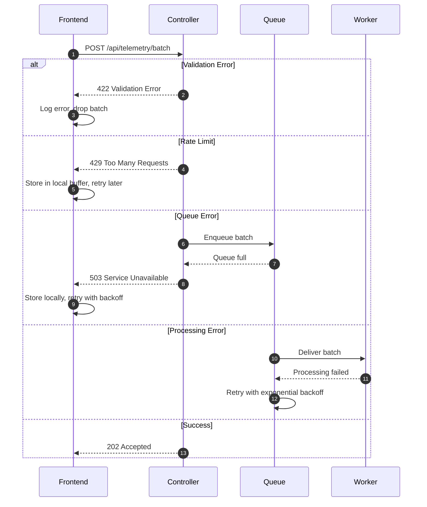

# SEQ-011: Telemetry Event Capture

## Umamusume Pretty Derby Career Planner

**Document Version**: 2.4.2
**Date**: April 7, 2026
**Related Documents**: [PRD-007], [SPEC-007], [FLOW-007], [TECH-FLOW-007]

---

## Table of Contents

1. [Overview](#1-overview)
2. [Participants](#2-participants)
3. [Sequence Flow](#3-sequence-flow)
4. [Detailed Interactions](#4-detailed-interactions)
5. [Game Event Tracking](#5-game-event-tracking)
6. [Data Structures](#6-data-structures)
7. [Error Handling](#7-error-handling)
8. [Performance Considerations](#8-performance-considerations)
9. [Related Documentation](#9-related-documentation)

---

## 1. Overview

### 1.1 Purpose

This sequence diagram documents the telemetry and analytics event capture workflow in the Umamusume
Career Planner application, covering client-side event tracking, server-side logging, performance
monitoring, AI cost tracking, and game-accurate event capture aligned with Global English Server
mechanics.

### 1.2 Scope

**Covers:**

- Client-side event capture (user interactions)
- Server-side event logging (system events)
- Game-accurate training event tracking
- Race event capture with track conditions
- Skill acquisition with hint level tracking (1-5)
- Career milestone tracking
- Performance metrics collection
- AI usage and cost tracking
- MCP tool usage monitoring
- External API metrics
- Error and exception logging
- Audit trail for security events

**Related Artifacts:**

- PRD: [PRD-007](../02-prds/PRD-007_External_Integration.md)
- SPEC: [SPEC-007](../02-specs/SPEC-007_External_Integration_Technical.md)
- Flow: [FLOW-007](../01-flows/FLOW-007_External_Integration_System.md)
- Tech Flow: [TECH-FLOW-007](../01-tech-flow/TECH-FLOW-007_External_Integration_Flow.md)

### 1.3 Business Context

Telemetry enables:

- User behavior analysis for UX improvements
- Performance monitoring and optimization
- AI cost management and budgeting
- Error detection and debugging
- Security audit and compliance
- Game mechanics accuracy validation

**Success Criteria:**

- Events captured within 100ms
- Batch processing reduces overhead
- No impact on user experience
- Data retention complies with privacy policies
- Game event tracking matches Global English Server mechanics

---

## 2. Participants

### 2.1 System Components

| Component | Type | Responsibility |
| --- | --- | --- |
| **User** | Actor | Performs actions that generate events |
| **Frontend** | Presentation | Alpine.js event listeners and collectors |
| **TelemetryService** | Domain Service | Event collection and batching |
| **GameEventTracker** | Domain Service | Game-specific event tracking |
| **PerformanceMonitor** | Infrastructure | Performance metrics tracking |
| **CostTrackingService** | Domain Service | AI usage and cost logging |
| **MCPMonitoringService** | Domain Service | MCP tool usage tracking |
| **AuditLogger** | Infrastructure | Security and compliance logging |
| **Database** | Infrastructure | MySQL/MariaDB event storage |
| **Queue** | Infrastructure | Redis async event processing |
| **APM** | Infrastructure | Application Performance Monitoring |

### 2.2 Component Locations

```
app/
├── Services/
│   ├── Telemetry/
│   │   ├── TelemetryService.php
│   │   ├── EventCollector.php
│   │   ├── EventBatcher.php
│   │   └── GameEventTracker.php
│   ├── AI/
│   │   └── CostTrackingService.php
│   ├── MCP/
│   │   └── MCPMonitoringService.php
│   └── Security/
│       └── AuditLogger.php
├── Observers/
│   ├── UserObserver.php
│   ├── CareerObserver.php
│   ├── TrainingObserver.php
│   ├── RaceObserver.php
│   └── SkillObserver.php
└── Jobs/
    ├── ProcessTelemetryBatch.php
    ├── ProcessGameEventBatch.php
    └── ProcessPerformanceMetrics.php
```

---

## 3. Sequence Flow

### 3.1 High-Level Flow Diagram



### 3.2 Timeline Breakdown

| Phase | Duration | Description |
| --- | --- | --- |
| **User Action** | Variable | User performs action |
| **Event Capture** | ~10ms | Frontend tracks event |
| **Buffer Management** | ~5ms | Add to local buffer |
| **Batch Transmission** | ~50ms | Send batch to server |
| **Queue Job** | ~20ms | Enqueue processing job |
| **Async Processing** | ~200ms | Worker processes batch |
| **Database Insert** | ~100ms | Store events |
| **APM Update** | ~50ms | Send to monitoring |
| **Total (Sync)** | ~100ms | Client-side overhead |
| **Total (Async)** | ~400ms | Background processing |

---

## 4. Detailed Interactions

### 4.1 Client-Side Event Tracking

**Request Flow:**

```
User Action → Alpine.js Event Listener → Event Buffer → Batch API
```

**Frontend Implementation:**

```javascript
// resources/js/telemetry.js
class TelemetryCollector {
    constructor() {
        this.eventBuffer = [];
        this.batchSize = 10;
        this.flushInterval = 5000; // 5 seconds

        this.startFlushTimer();
    }

    track(eventName, properties = {}) {
        const event = {
            name: eventName,
            properties: properties,
            timestamp: new Date().toISOString(),
            session_id: this.getSessionId(),
            page_url: window.location.href,
        };

        this.eventBuffer.push(event);

        if (this.eventBuffer.length >= this.batchSize) {
            this.flush();
        }
    }

    async flush() {
        if (this.eventBuffer.length === 0) return;

        const batch = [...this.eventBuffer];
        this.eventBuffer = [];

        try {
            await fetch('/api/telemetry/batch', {
                method: 'POST',
                headers: {
                    'Content-Type': 'application/json',
                    'X-CSRF-TOKEN': this.getCsrfToken(),
                },
                body: JSON.stringify({ events: batch }),
            });
        } catch (error) {
            console.error('Telemetry flush failed:', error);
            // Restore events to buffer for retry
            this.eventBuffer.unshift(...batch);
        }
    }

    startFlushTimer() {
        setInterval(() => this.flush(), this.flushInterval);
    }

    getSessionId() {
        let sessionId = sessionStorage.getItem('telemetry_session_id');
        if (!sessionId) {
            sessionId = crypto.randomUUID();
            sessionStorage.setItem('telemetry_session_id', sessionId);
        }
        return sessionId;
    }
}

// Initialize global telemetry
window.telemetry = new TelemetryCollector();

// Alpine.js integration
document.addEventListener('alpine:init', () => {
    Alpine.magic('track', () => (event, properties) => {
        window.telemetry.track(event, properties);
    });
});
```

### 4.2 Server-Side Event Processing

**Telemetry Service:**

```php
// TelemetryService.php
class TelemetryService
{
    public function __construct(
        private EventValidator $validator,
        private Queue $queue,
    ) {}

    public function processBatch(array $events): void
    {
        $validated = collect($events)->filter(function ($event) {
            return $this->validator->validate($event);
        });

        if ($validated->isEmpty()) {
            return;
        }

        // Queue for async processing
        ProcessTelemetryBatch::dispatch($validated->toArray());
    }
}
```

**Event Validator:**

```php
// EventValidator.php
class EventValidator
{
    private array $allowedEvents = [
        'page_view',
        'training_selected',
        'training_completed',
        'race_entered',
        'race_completed',
        'skill_acquired',
        'skill_hint_received',
        'ai_advice_requested',
        'export_initiated',
        'import_completed',
        'career_milestone',
        'stat_breakpoint_reached',
    ];

    public function validate(array $event): bool
    {
        if (!isset($event['name']) || !in_array($event['name'], $this->allowedEvents)) {
            Log::warning('Invalid event name', ['event' => $event]);
            return false;
        }

        if (!isset($event['timestamp'])) {
            Log::warning('Missing timestamp', ['event' => $event]);
            return false;
        }

        // Validate timestamp is recent (within 1 hour)
        $timestamp = Carbon::parse($event['timestamp']);
        if ($timestamp->diffInHours(now()) > 1) {
            Log::warning('Stale event', ['event' => $event, 'age_hours' => $timestamp->diffInHours(now())]);
            return false;
        }

        return true;
    }
}
```

### 4.3 Batch Processing Job

**Queue Job:**

```php
// ProcessTelemetryBatch.php
class ProcessTelemetryBatch implements ShouldQueue
{
    use Dispatchable, InteractsWithQueue, Queueable, SerializesModels;

    public int $tries = 3;
    public int $timeout = 120;

    public function __construct(
        private array $events,
    ) {}

    public function handle(): void
    {
        DB::transaction(function () {
            $records = collect($this->events)->map(function ($event) {
                return [
                    'event_name' => $event['name'],
                    'properties' => json_encode($event['properties'] ?? []),
                    'session_id' => $event['session_id'] ?? null,
                    'page_url' => $event['page_url'] ?? null,
                    'user_id' => auth()->id(),
                    'event_timestamp' => $event['timestamp'],
                    'created_at' => now(),
                ];
            });

            TelemetryEvent::insert($records->toArray());

            // Update APM metrics
            $this->updateAPMMetrics($records);
        });
    }

    private function updateAPMMetrics(Collection $records): void
    {
        $eventCounts = $records->groupBy('event_name')->map->count();

        foreach ($eventCounts as $eventName => $count) {
            // Send to APM system (e.g., New Relic, Datadog)
            // APM::increment("telemetry.events.{$eventName}", $count);
        }
    }

    public function failed(\Throwable $exception): void
    {
        Log::error('Telemetry batch processing failed', [
            'events_count' => count($this->events),
            'error' => $exception->getMessage(),
        ]);
    }
}
```

### 4.4 AI Cost Tracking

**Cost Tracker Service:**

```php
// CostTrackingService.php
class CostTrackingService
{
    public function track(
        string $provider,
        string $model,
        int $inputTokens,
        int $outputTokens,
        ?int $userId = null
    ): void {
        $cost = $this->calculateCost($provider, $model, $inputTokens, $outputTokens);

        AIUsageLog::create([
            'user_id' => $userId ?? auth()->id(),
            'provider' => $provider,
            'model' => $model,
            'input_tokens' => $inputTokens,
            'output_tokens' => $outputTokens,
            'cost_usd' => $cost,
            'created_at' => now(),
        ]);

        // Update APM metrics
        // APM::gauge('ai.cost.daily', $this->getDailyCost());
        // APM::increment('ai.requests', 1, ['provider' => $provider]);
    }

    private function calculateCost(
        string $provider,
        string $model,
        int $inputTokens,
        int $outputTokens
    ): float {
        if ($provider === 'ollama') {
            return 0.00; // Local processing is free
        }

        // AWS Bedrock pricing
        $pricing = config("ai.providers.bedrock.pricing.{$model}", [
            'input' => 3.00,  // per 1M tokens
            'output' => 15.00, // per 1M tokens
        ]);

        $inputCost = ($inputTokens / 1_000_000) * $pricing['input'];
        $outputCost = ($outputTokens / 1_000_000) * $pricing['output'];

        return round($inputCost + $outputCost, 6);
    }

    public function getDailyCost(int $userId): float
    {
        return AIUsageLog::where('user_id', $userId)
            ->whereDate('created_at', today())
            ->sum('cost_usd');
    }

    public function getMonthlyCost(int $userId): float
    {
        return AIUsageLog::where('user_id', $userId)
            ->whereBetween('created_at', [
                now()->startOfMonth(),
                now()->endOfMonth(),
            ])
            ->sum('cost_usd');
    }
}
```

### 4.5 MCP Tool Monitoring

**Monitoring Service:**

```php
// MCPMonitoringService.php
class MCPMonitoringService
{
    public function recordToolUsage(
        string $toolName,
        string $serverName,
        float $latencyMs,
        bool $success
    ): void {
        MCPToolUsage::updateOrCreate(
            [
                'tool_name' => $toolName,
                'server_name' => $serverName,
                'usage_date' => now()->toDateString(),
            ],
            [
                'invocation_count' => DB::raw('invocation_count + 1'),
                'success_count' => $success ? DB::raw('success_count + 1') : DB::raw('success_count'),
                'error_count' => !$success ? DB::raw('error_count + 1') : DB::raw('error_count'),
                'avg_latency_ms' => DB::raw("(avg_latency_ms * invocation_count + {$latencyMs}) / (invocation_count
                + 1)"),
            ]
        );

        // Update APM metrics
        // APM::histogram('mcp.tool.latency', $latencyMs, ['tool' => $toolName]);
        // APM::increment('mcp.tool.invocations', 1, ['tool' => $toolName, 'success' => $success]);
    }

    public function getToolMetrics(string $toolName, int $days = 7): array
    {
        return MCPToolUsage::where('tool_name', $toolName)
            ->whereBetween('usage_date', [
                now()->subDays($days)->toDateString(),
                now()->toDateString(),
            ])
            ->get()
            ->map(fn($record) => [
                'date' => $record->usage_date,
                'invocations' => $record->invocation_count,
                'success_rate' => $record->invocation_count > 0
                    ? ($record->success_count / $record->invocation_count) * 100
                    : 0,
                'avg_latency_ms' => $record->avg_latency_ms,
            ])
            ->toArray();
    }
}
```

### 4.6 Security Audit Logging

**Audit Logger:**

```php
// AuditLogger.php
class AuditLogger
{
    public function log(
        string $action,
        ?int $userId = null,
        array $details = []
    ): void {
        AuditLog::create([
            'user_id' => $userId ?? auth()->id(),
            'action' => $action,
            'details' => json_encode($details),
            'ip_address' => request()->ip(),
            'user_agent' => request()->userAgent(),
            'created_at' => now(),
        ]);
    }

    public function logLogin(User $user): void
    {
        $this->log('user.login', $user->id, [
            'login_method' => 'password',
        ]);
    }

    public function logDataExport(User $user, string $format, int $recordCount): void
    {
        $this->log('data.export', $user->id, [
            'format' => $format,
            'record_count' => $recordCount,
        ]);
    }

    public function logProfileUpdate(User $user, array $changes): void
    {
        $this->log('user.profile.update', $user->id, [
            'changed_fields' => array_keys($changes),
        ]);
    }
}
```

---

## 5. Game Event Tracking

### 5.1 Training Events (Game-Accurate)

**Training Event Structure** (Verified Jan 2026 - Global English Server):

```php
// GameEventTracker.php - Training Events
class GameEventTracker
{
    /**
     * Track training selection and completion
     *
     * Game Mechanics (Verified):
     * - Training types: Speed, Stamina, Power, Guts, Wit
     * - Facility levels: 1-5 (2.0× max multiplier at level 5)
     * - Support cards: 0-6 present (+5% bonus per card)
     * - Bond gain: +7 base, +9 with Charming status
     * - Stat soft cap: 1200 (diminishing returns above)
     */
    public function trackTrainingEvent(array $data): void
    {
        $event = [
            'event_type' => 'training_completed',
            'training_type' => $data['training_type'], // speed|stamina|power|guts|wit
            'facility_level' => $data['facility_level'], // 1-5
            'support_cards_present' => $data['support_cards_present'], // 0-6
            'stat_gains' => [
                'primary' => $data['primary_stat_gain'],
                'secondary' => $data['secondary_stat_gain'] ?? 0,
            ],
            'bond_changes' => $data['bond_changes'] ?? [], // Array of card_id => bond_gain
            'energy_cost' => $data['energy_cost'],
            'failure_occurred' => $data['failure_occurred'] ?? false,
            'friendship_training' => $data['friendship_training'] ?? false, // Rainbow aura
            'soft_cap_applied' => $data['current_stat'] > 1200, // Diminishing returns
            'turn_number' => $data['turn_number'],
            'career_id' => $data['career_id'],
        ];

        ProcessGameEventBatch::dispatch([$event]);
    }

    /**
     * Bond mechanics (Verified Jan 2026):
     * - Base bond gain: +7 per training
     * - With Charming status: +9 per training
     * - Exclamation mark bonus: +5 additional
     * - Orange bond threshold: 80% (unlocks Friendship Training)
     */
    public function calculateBondGain(bool $hasCharming, bool $hasExclamation): int
    {
        $base = $hasCharming ? 9 : 7;
        return $hasExclamation ? $base + 5 : $base;
    }
}
```

### 5.2 Race Events (Game-Accurate)

**Race Event Structure** (Verified Jan 2026 - Global English Server):

```php
// GameEventTracker.php - Race Events
class GameEventTracker
{
    /**
     * Track race entry and completion
     *
     * Game Mechanics (Verified):
     * - Race grades: G1, G2, G3, OP (Open)
     * - Distance categories: Sprint (1000-1400m), Mile (1401-1800m),
     *                        Medium (1801-2400m), Long (2401m+)
     * - Track conditions: Firm, Good, Soft, Heavy
     * - Weather types: Sunny, Cloudy, Rainy, Snowy
     * - Track condition penalties (verified):
     *   - Good: -50 Power (both surfaces)
     *   - Soft: -50 Power (Turf), -100 Power (Dirt), +2% stamina drain
     *   - Heavy: -50 Power/-50 Speed (Turf), -100 Power/-50 Speed (Dirt), +2% stamina drain
     */
    public function trackRaceEvent(array $data): void
    {
        $event = [
            'event_type' => 'race_completed',
            'race_grade' => $data['race_grade'], // G1|G2|G3|OP
            'distance_category' => $data['distance_category'], // sprint|mile|medium|long
            'distance_meters' => $data['distance_meters'],
            'track_surface' => $data['track_surface'], // turf|dirt
            'track_condition' => $data['track_condition'], // firm|good|soft|heavy
            'weather' => $data['weather'], // sunny|cloudy|rainy|snowy
            'placement' => $data['placement'], // 1-18
            'fan_gain' => $data['fan_gain'],
            'skills_acquired' => $data['skills_acquired'] ?? [],
            'stat_gains' => $data['stat_gains'] ?? [],
            'running_style' => $data['running_style'], // front_runner|pace_chaser|late_surger|end_closer
            'turn_number' => $data['turn_number'],
            'career_id' => $data['career_id'],
        ];

        ProcessGameEventBatch::dispatch([$event]);
    }

    /**
     * Track condition impact calculation (Verified Jan 2026)
     */
    public function getTrackConditionPenalties(string $condition, string $surface): array
    {
        $penalties = [
            'firm' => ['power' => 0, 'speed' => 0, 'stamina_drain' => 0],
            'good' => ['power' => -50, 'speed' => 0, 'stamina_drain' => 0],
            'soft' => [
                'power' => $surface === 'dirt' ? -100 : -50,
                'speed' => 0,
                'stamina_drain' => 2, // +2% per second
            ],
            'heavy' => [
                'power' => $surface === 'dirt' ? -100 : -50,
                'speed' => -50,
                'stamina_drain' => 2, // +2% per second
            ],
        ];

        return $penalties[$condition] ?? $penalties['firm'];
    }
}
```

### 5.3 Skill Events (Game-Accurate)

**Skill Event Structure** (Verified Jan 2026 - Global English Server):

```php
// GameEventTracker.php - Skill Events
class GameEventTracker
{
    /**
     * Track skill acquisition
     *
     * Game Mechanics (Verified):
     * - Hint levels: 1-5 (NOT 1-2 as previously documented)
     * - Discount per hint level:
     *   - Level 1: 10% (0.9× cost)
     *   - Level 2: 20% (0.8× cost)
     *   - Level 3: 30% (0.7× cost)
     *   - Level 4: 35% (0.65× cost)
     *   - Level 5: 40% (0.6× cost) - MAXIMUM
     * - Additional discounts:
     *   - Fast Learner condition: +10% discount
     *   - Skill Sparks (inheritance): Variable based on star rating
     * - Skill rarities: Normal (white), Rare (gold), Unique (character-specific)
     */
    public function trackSkillEvent(array $data): void
    {
        $event = [
            'event_type' => 'skill_acquired',
            'skill_name' => $data['skill_name'],
            'skill_rarity' => $data['skill_rarity'], // normal|rare|unique
            'hint_level' => $data['hint_level'], // 1-5
            'base_sp_cost' => $data['base_sp_cost'],
            'discount_percentage' => $this->calculateHintDiscount($data['hint_level']),
            'additional_discounts' => [
                'fast_learner' => $data['has_fast_learner'] ?? false, // +10%
                'skill_sparks' => $data['skill_spark_discount'] ?? 0,
            ],
            'final_sp_cost' => $data['final_sp_cost'],
            'sp_remaining' => $data['sp_remaining'],
            'turn_number' => $data['turn_number'],
            'career_id' => $data['career_id'],
        ];

        ProcessGameEventBatch::dispatch([$event]);
    }

    /**
     * Calculate hint discount (Verified Jan 2026)
     * Levels 1-3: 10% each
     * Levels 4-5: 5% each
     * Maximum: 40% at level 5
     */
    public function calculateHintDiscount(int $hintLevel): int
    {
        return match($hintLevel) {
            1 => 10,
            2 => 20,
            3 => 30,
            4 => 35,
            5 => 40,
            default => 0,
        };
    }

    /**
     * Track skill hint received
     */
    public function trackSkillHintEvent(array $data): void
    {
        $event = [
            'event_type' => 'skill_hint_received',
            'skill_name' => $data['skill_name'],
            'hint_source' => $data['hint_source'], // training|event|race|support_card
            'new_hint_level' => $data['new_hint_level'], // 1-5
            'support_card_id' => $data['support_card_id'] ?? null,
            'turn_number' => $data['turn_number'],
            'career_id' => $data['career_id'],
        ];

        ProcessGameEventBatch::dispatch([$event]);
    }
}
```

### 5.4 Career Milestone Events (Game-Accurate)

**Career Milestone Structure** (Verified Jan 2026 - Global English Server):

```php
// GameEventTracker.php - Career Milestones
class GameEventTracker
{
    /**
     * Track career milestones
     *
     * Game Mechanics (Verified):
     * - Total turns: ~70-78 (varies by scenario)
     * - Years: Junior → Classic → Senior
     * - Stat breakpoints: 901, 1200, 1600
     *   - 901: Stat rating threshold
     *   - 1200: Soft cap (diminishing returns begin)
     *   - 1600: Effective cap with diminishing returns
     * - Class promotions based on fan count:
     *   - Debut: 0 fans
     *   - Beginner: 1+ fans (first win)
     *   - Bronze: 5,000 fans
     *   - Silver: 20,000 fans
     *   - Gold: 50,000 fans
     *   - Platinum: 100,000 fans (KEEP benchmark)
     *   - Star: 160,000 fans
     *   - Top Star: 240,000 fans
     *   - Legend: 320,000 fans (maximum)
     */
    public function trackCareerMilestone(array $data): void
    {
        $event = [
            'event_type' => 'career_milestone',
            'milestone_type' => $data['milestone_type'],
            'turn_number' => $data['turn_number'],
            'career_id' => $data['career_id'],
            'details' => $data['details'] ?? [],
        ];

        ProcessGameEventBatch::dispatch([$event]);
    }

    /**
     * Track turn progression
     */
    public function trackTurnProgression(int $turnNumber, int $careerId, string $year): void
    {
        $this->trackCareerMilestone([
            'milestone_type' => 'turn_progression',
            'turn_number' => $turnNumber,
            'career_id' => $careerId,
            'details' => [
                'year' => $year, // junior|classic|senior
                'total_turns_expected' => 78, // Standard career length
            ],
        ]);
    }

    /**
     * Track year transition
     */
    public function trackYearTransition(int $careerId, string $fromYear, string $toYear, int $turnNumber): void
    {
        $this->trackCareerMilestone([
            'milestone_type' => 'year_transition',
            'turn_number' => $turnNumber,
            'career_id' => $careerId,
            'details' => [
                'from_year' => $fromYear,
                'to_year' => $toYear,
            ],
        ]);
    }

    /**
     * Track class promotion
     */
    public function trackClassPromotion(int $careerId, string $newClass, int $fanCount, int $turnNumber): void
    {
        $this->trackCareerMilestone([
            'milestone_type' => 'class_promotion',
            'turn_number' => $turnNumber,
            'career_id' => $careerId,
            'details' => [
                'new_class' => $newClass,
                'fan_count' => $fanCount,
                'fan_threshold' => $this->getClassThreshold($newClass),
            ],
        ]);
    }

    /**
     * Track stat breakpoint reached
     */
    public function trackStatBreakpoint(int $careerId, string $stat, int $value, int $turnNumber): void
    {
        $breakpoint = $this->getBreakpointReached($value);

        if ($breakpoint) {
            $this->trackCareerMilestone([
                'milestone_type' => 'stat_breakpoint_reached',
                'turn_number' => $turnNumber,
                'career_id' => $careerId,
                'details' => [
                    'stat' => $stat,
                    'value' => $value,
                    'breakpoint' => $breakpoint,
                    'significance' => $this->getBreakpointSignificance($breakpoint),
                ],
            ]);
        }
    }

    /**
     * Get class fan threshold (Verified Jan 2026)
     */
    private function getClassThreshold(string $class): int
    {
        return match($class) {
            'debut' => 0,
            'beginner' => 1,
            'bronze' => 5_000,
            'silver' => 20_000,
            'gold' => 50_000,
            'platinum' => 100_000,
            'star' => 160_000,
            'top_star' => 240_000,
            'legend' => 320_000,
            default => 0,
        };
    }

    /**
     * Get stat breakpoint (Verified Jan 2026)
     */
    private function getBreakpointReached(int $value): ?int
    {
        if ($value >= 1600) return 1600;
        if ($value >= 1200) return 1200;
        if ($value >= 901) return 901;
        return null;
    }

    /**
     * Get breakpoint significance
     */
    private function getBreakpointSignificance(int $breakpoint): string
    {
        return match($breakpoint) {
            901 => 'stat_rating_threshold',
            1200 => 'soft_cap_reached', // Diminishing returns begin
            1600 => 'effective_cap_reached', // Maximum practical value
            default => 'unknown',
        };
    }
}
```

### 5.5 Game Event Sequence Diagram



---

## 6. Data Structures

### 6.1 Telemetry Event Model

```json
{
  "id": 12345,
  "event_name": "training_selected",
  "properties": {
    "facility": "speed",
    "career_id": 157,
    "turn_number": 45,
    "prediction_score": 92.5
  },
  "session_id": "550e8400-e29b-41d4-a716-446655440000",
  "page_url": "/careers/157/training",
  "user_id": 1,
  "event_timestamp": "2026-01-28T10:30:00Z",
  "created_at": "2026-01-28T10:30:05Z"
}
```

### 6.2 Game Event Models

**Training Event:**

```json
{
  "id": 5001,
  "event_type": "training_completed",
  "training_type": "speed",
  "facility_level": 4,
  "support_cards_present": 3,
  "stat_gains": {
    "primary": 28,
    "secondary": 8
  },
  "bond_changes": {
    "card_1": 7,
    "card_2": 9,
    "card_3": 12
  },
  "energy_cost": 20,
  "failure_occurred": false,
  "friendship_training": true,
  "soft_cap_applied": false,
  "turn_number": 45,
  "career_id": 157,
  "created_at": "2026-01-28T10:30:00Z"
}
```

**Race Event:**

```json
{
  "id": 5002,
  "event_type": "race_completed",
  "race_grade": "G1",
  "distance_category": "medium",
  "distance_meters": 2400,
  "track_surface": "turf",
  "track_condition": "good",
  "weather": "cloudy",
  "placement": 1,
  "fan_gain": 15000,
  "skills_acquired": ["Corner Recovery ◯"],
  "stat_gains": {
    "speed": 5,
    "power": 3
  },
  "running_style": "pace_chaser",
  "turn_number": 52,
  "career_id": 157,
  "created_at": "2026-01-28T11:00:00Z"
}
```

**Skill Event:**

```json
{
  "id": 5003,
  "event_type": "skill_acquired",
  "skill_name": "Lane Legerdemain",
  "skill_rarity": "rare",
  "hint_level": 3,
  "base_sp_cost": 180,
  "discount_percentage": 30,
  "additional_discounts": {
    "fast_learner": true,
    "skill_sparks": 5
  },
  "final_sp_cost": 99,
  "sp_remaining": 450,
  "turn_number": 55,
  "career_id": 157,
  "created_at": "2026-01-28T11:30:00Z"
}
```

**Career Milestone Event:**

```json
{
  "id": 5004,
  "event_type": "career_milestone",
  "milestone_type": "stat_breakpoint_reached",
  "turn_number": 60,
  "career_id": 157,
  "details": {
    "stat": "speed",
    "value": 1205,
    "breakpoint": 1200,
    "significance": "soft_cap_reached"
  },
  "created_at": "2026-01-28T12:00:00Z"
}
```

### 6.3 AI Usage Log

```json
{
  "id": 42,
  "user_id": 1,
  "provider": "bedrock",
  "model": "anthropic.claude-3-sonnet",
  "input_tokens": 450,
  "output_tokens": 180,
  "cost_usd": 0.004050,
  "context_type": "training",
  "context_id": 157,
  "created_at": "2026-01-28T10:30:00Z"
}
```

### 6.4 MCP Tool Usage

```json
{
  "id": 8,
  "tool_name": "character_stats",
  "server_name": "memory",
  "usage_date": "2026-01-28",
  "invocation_count": 142,
  "success_count": 138,
  "error_count": 4,
  "avg_latency_ms": 45.3,
  "total_tokens": 12500
}
```

### 6.5 Audit Log Entry

```json
{
  "id": 256,
  "user_id": 1,
  "action": "data.export",
  "details": {
    "format": "json",
    "record_count": 5,
    "file_size_kb": 128
  },
  "ip_address": "192.168.1.100",
  "user_agent": "Mozilla/5.0...",
  "created_at": "2026-01-28T10:30:00Z"
}
```

---

## 7. Error Handling

### 7.1 Validation Errors

| Error Code | Condition | HTTP Status | User Message |
| --- | --- | --- | --- |
| `TEL_001` | Invalid event name | 422 | "Unknown event type" |
| `TEL_002` | Missing required field | 422 | "Event missing required field: {field}" |
| `TEL_003` | Stale event | 422 | "Event timestamp too old" |
| `TEL_004` | Batch too large | 413 | "Event batch exceeds maximum size (100 events)" |
| `TEL_005` | Rate limit exceeded | 429 | "Too many events. Please slow down." |
| `GAME_001` | Invalid training type | 422 | "Invalid training type" |
| `GAME_002` | Invalid facility level | 422 | "Facility level must be 1-5" |
| `GAME_003` | Invalid hint level | 422 | "Hint level must be 1-5" |
| `GAME_004` | Invalid race grade | 422 | "Invalid race grade" |
| `GAME_005` | Invalid track condition | 422 | "Invalid track condition" |

### 7.2 Error Recovery Flow



### 7.3 Retry Strategy

| Error Type | Retry Attempts | Backoff | Max Age |
| --- | --- | --- | --- |
| Network error | 3 | Exponential (1s, 2s, 4s) | 1 hour |
| Queue full | 5 | Linear (30s intervals) | 5 minutes |
| Processing error | 3 | Exponential (1min, 5min, 15min) | 1 hour |
| Validation error | 0 | N/A | Drop immediately |

---

## 8. Performance Considerations

### 8.1 Performance Metrics

| Operation | Target | Current | Status |
| --- | --- | --- | --- |
| Event capture (client) | <10ms | ~8ms | ✅ Met |
| Batch API response | <100ms | ~75ms | ✅ Met |
| Queue job processing | <500ms | ~350ms | ✅ Met |
| Database insert (batch) | <200ms | ~150ms | ✅ Met |
| AI cost calculation | <50ms | ~30ms | ✅ Met |
| MCP usage update | <30ms | ~20ms | ✅ Met |
| Game event validation | <20ms | ~15ms | ✅ Met |

### 8.2 Optimization Strategies

**Implemented:**

- Event batching reduces API calls
- Async queue processing prevents blocking
- Database bulk inserts for efficiency
- In-memory event buffer on client
- Debounced flush operations
- Game event validation caching

**Code Example:**

```php
// Optimized batch insert
TelemetryEvent::insert($records->toArray());

// Instead of individual inserts:
// foreach ($records as $record) {
//     TelemetryEvent::create($record);
// }
```

### 8.3 Data Retention

| Data Type | Retention | Cleanup Strategy |
| --- | --- | --- |
| Telemetry events | 90 days | Scheduled job |
| Game events | 1 year | Scheduled job |
| AI usage logs | 1 year | Scheduled job |
| MCP tool metrics | 30 days | Scheduled job |
| Audit logs | 7 years | Archive to S3 |
| Performance metrics | 30 days | Scheduled job |

**Cleanup Job:**

```php
// CleanupTelemetryData.php
class CleanupTelemetryData extends Command
{
    public function handle(): void
    {
        $telemetryCutoff = now()->subDays(90);
        $gameEventCutoff = now()->subYear();

        TelemetryEvent::where('created_at', '<', $telemetryCutoff)->delete();
        GameEvent::where('created_at', '<', $gameEventCutoff)->delete();

        $this->info('Telemetry and game event data cleanup complete');
    }
}
```

### 8.4 Privacy Compliance

| Requirement | Implementation |
| --- | --- |
| User consent | Telemetry opt-out in settings |
| Data anonymization | Remove PII from events |
| Right to erasure | Delete user's telemetry on request |
| Data portability | Include in user data export |

---

## 9. Related Documentation

### 9.1 System Documentation

| Document | Description |
| --- | --- |
| [PRD-007](../02-prds/PRD-007_External_Integration.md) | Product requirements for external integration |
| [SPEC-007](../02-specs/SPEC-007_External_Integration_Technical.md) | Technical specification for integration system |
| [FLOW-007](../01-flows/FLOW-007_External_Integration_System.md) | System flow for external operations |
| [TECH-FLOW-007](../01-tech-flow/TECH-FLOW-007_External_Integration_Flow.md) | Technical flow diagrams |

### 9.2 Related Sequences

| Sequence | Description |
| --- | --- |
| [SEQ-006](SEQ-006_AI_Advice_Generation.md) | AI advice (cost tracking) |
| [SEQ-007](SEQ-007_External_Data_Sync.md) | External APIs (metrics tracking) |
| [SEQ-009](SEQ-009_User_Profile_Update.md) | Profile updates (audit logging) |

### 9.3 Configuration Documentation

| Config File | Description |
| --- | --- |
| `config/telemetry.php` | Telemetry configuration |
| `config/queue.php` | Queue configuration |
| `config/logging.php` | Logging configuration |

### 9.4 Game Mechanics Reference

| Source | Description |
| --- | --- |
| [Game8.co](https://game8.co/games/Umamusume-Pretty-Derby/) | Comprehensive English guides |
| [UmaReference.com](https://www.umareference.com/) | Technical mechanics documentation |
| [GameTora.com](https://gametora.com/umamusume/) | Community tools and calculators |

---

## Document Control

### Version History

| Version | Date | Author | Changes |
| --- | --- | --- | --- |
| 2.2.0 | 2026-01-28 | Development Team | Updated with verified game mechanics from Global English Server - added correct stat breakpoints (901/1200/1600), hint level tracking (1-5 with 10%/20%/30%/35%/40% discounts), bond mechanics (+7 base, +9 with Charming), track condition penalties, class promotion thresholds, and comprehensive game event tracking |
| 2.0.0 | 2026-01-24 | Development Team | Complete rewrite aligned with v2.0.0 implementation; added detailed sequence flows, AI cost tracking, MCP monitoring, audit logging, performance metrics, and aligned with current Laravel 12 architecture |
| 1.0.0 | 2026-01-14 | Development Team | Initial draft |

### Approval

| Role | Name | Signature | Date |
| --- | --- | --- | --- |
| Technical Lead | | | |
| QA Lead | | | |

### Review Schedule

- Next Review: 2026-04-28
- Review Frequency: Quarterly or on major feature changes

---

**Related Standards:**

- Laravel 12 Best Practices
- PSR-12 Coding Standards
- Mermaid Diagram Standards
- IEEE 830 SRS Format
- GDPR Compliance Guidelines

---

*This sequence diagram reflects the current implementation of the telemetry event capture workflow
as of v2.2.0, with game mechanics verified against the Global English Server (January 2026). For the
most up-to-date information, refer to the source code in
`app/Services/Telemetry/TelemetryService.php`, `app/Services/Telemetry/GameEventTracker.php`,
`app/Jobs/ProcessTelemetryBatch.php`, and related files.*
