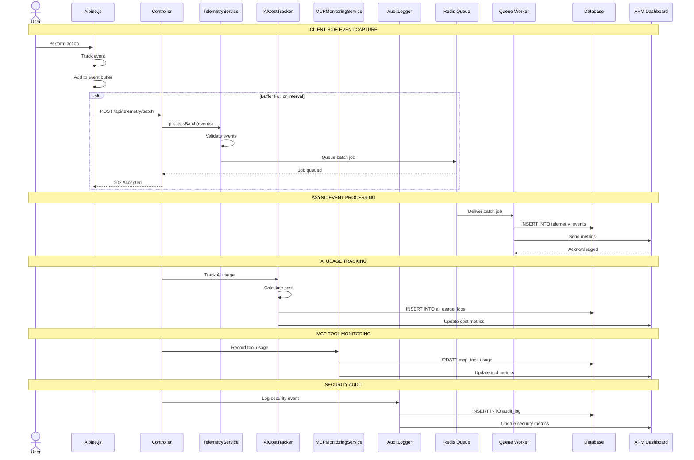
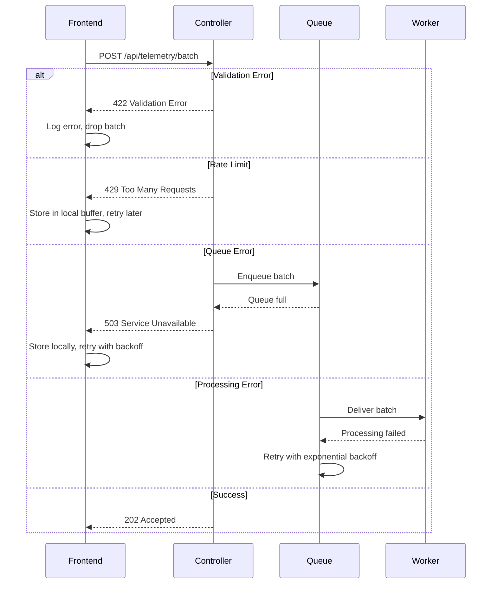

# SEQ-011: Telemetry Event Capture

## Umamusume Pretty Derby Career Planner

**Document Version**: 2.0.0  
**Date**: January 24, 2026  
**Related Documents**: [PRD-007], [SPEC-007], [FLOW-007], [TECH-FLOW-007]

---

## Table of Contents

1. [Overview](#1-overview)
2. [Participants](#2-participants)
3. [Sequence Flow](#3-sequence-flow)
4. [Detailed Interactions](#4-detailed-interactions)
5. [Data Structures](#5-data-structures)
6. [Error Handling](#6-error-handling)
7. [Performance Considerations](#7-performance-considerations)
8. [Related Documentation](#8-related-documentation)

---

## 1. Overview

### 1.1 Purpose

This sequence diagram documents the telemetry and analytics event capture workflow in the Umamusume Career Planner application, covering client-side event tracking, server-side logging, performance monitoring, and AI cost tracking.

### 1.2 Scope

**Covers:**

- Client-side event capture (user interactions)
- Server-side event logging (system events)
- Performance metrics collection
- AI usage and cost tracking
- MCP tool usage monitoring
- External API metrics
- Error and exception logging
- Audit trail for security events

**Related Artifacts:**

- PRD: [PRD-007](../prds/PRD-007_External_Integration.md)
- SPEC: [SPEC-007](../specs/SPEC-007_External_Integration_Technical.md)
- Flow: [FLOW-007](../flows/FLOW-007_External_Integration_System.md)
- Tech Flow: [TECH-FLOW-007](../tech-flow/TECH-FLOW-007_External_Integration_Flow.md)

### 1.3 Business Context

Telemetry enables:

- User behavior analysis for UX improvements
- Performance monitoring and optimization
- AI cost management and budgeting
- Error detection and debugging
- Security audit and compliance

**Success Criteria:**

- Events captured within 100ms
- Batch processing reduces overhead
- No impact on user experience
- Data retention complies with privacy policies

---

## 2. Participants

### 2.1 System Components

| Component | Type | Responsibility |
|-----------|------|----------------|
| **User** | Actor | Performs actions that generate events |
| **Frontend** | Presentation | Alpine.js event listeners and collectors |
| **TelemetryService** | Domain Service | Event collection and batching |
| **PerformanceMonitor** | Infrastructure | Performance metrics tracking |
| **AICostTracker** | Domain Service | AI usage and cost logging |
| **MCPMonitoringService** | Domain Service | MCP tool usage tracking |
| **AuditLogger** | Infrastructure | Security and compliance logging |
| **Database** | Infrastructure | MySQL/MariaDB event storage |
| **Queue** | Infrastructure | Redis async event processing |
| **APM** | Infrastructure | Application Performance Monitoring |

### 2.2 Component Locations

```

app/
├── Services/
│   ├── Telemetry/
│   │   ├── TelemetryService.php
│   │   ├── EventCollector.php
│   │   └── EventBatcher.php
│   ├── AI/
│   │   └── AICostTracker.php
│   ├── MCP/
│   │   └── MCPMonitoringService.php
│   └── Security/
│       └── AuditLogger.php
├── Observers/
│   ├── UserObserver.php
│   ├── CareerObserver.php
│   └── TrainingObserver.php
└── Jobs/
    ├── ProcessTelemetryBatch.php
    └── ProcessPerformanceMetrics.php

```

---

## 3. Sequence Flow

### 3.1 High-Level Flow Diagram



### 3.2 Timeline Breakdown

| Phase | Duration | Description |
|-------|----------|-------------|
| **User Action** | Variable | User performs action |
| **Event Capture** | ~10ms | Frontend tracks event |
| **Buffer Management** | ~5ms | Add to local buffer |
| **Batch Transmission** | ~50ms | Send batch to server |
| **Queue Job** | ~20ms | Enqueue processing job |
| **Async Processing** | ~200ms | Worker processes batch |
| **Database Insert** | ~100ms | Store events |
| **APM Update** | ~50ms | Send to monitoring |
| **Total (Sync)** | ~100ms | Client-side overhead |
| **Total (Async)** | ~400ms | Background processing |

---

## 4. Detailed Interactions

### 4.1 Client-Side Event Tracking

**Request Flow:**

```
User Action → Alpine.js Event Listener → Event Buffer → Batch API
```

**Frontend Implementation:**

```javascript
// resources/js/telemetry.js
class TelemetryCollector {
    constructor() {
        this.eventBuffer = [];
        this.batchSize = 10;
        this.flushInterval = 5000; // 5 seconds
        
        this.startFlushTimer();
    }
    
    track(eventName, properties = {}) {
        const event = {
            name: eventName,
            properties: properties,
            timestamp: new Date().toISOString(),
            session_id: this.getSessionId(),
            page_url: window.location.href,
        };
        
        this.eventBuffer.push(event);
        
        if (this.eventBuffer.length >= this.batchSize) {
            this.flush();
        }
    }
    
    async flush() {
        if (this.eventBuffer.length === 0) return;
        
        const batch = [...this.eventBuffer];
        this.eventBuffer = [];
        
        try {
            await fetch('/api/telemetry/batch', {
                method: 'POST',
                headers: {
                    'Content-Type': 'application/json',
                    'X-CSRF-TOKEN': this.getCsrfToken(),
                },
                body: JSON.stringify({ events: batch }),
            });
        } catch (error) {
            console.error('Telemetry flush failed:', error);
            // Restore events to buffer for retry
            this.eventBuffer.unshift(...batch);
        }
    }
    
    startFlushTimer() {
        setInterval(() => this.flush(), this.flushInterval);
    }
    
    getSessionId() {
        let sessionId = sessionStorage.getItem('telemetry_session_id');
        if (!sessionId) {
            sessionId = crypto.randomUUID();
            sessionStorage.setItem('telemetry_session_id', sessionId);
        }
        return sessionId;
    }
}

// Initialize global telemetry
window.telemetry = new TelemetryCollector();

// Alpine.js integration
document.addEventListener('alpine:init', () => {
    Alpine.magic('track', () => (event, properties) => {
        window.telemetry.track(event, properties);
    });
});
```

### 4.2 Server-Side Event Processing

**Telemetry Service:**

```php
// TelemetryService.php
class TelemetryService
{
    public function __construct(
        private EventValidator $validator,
        private Queue $queue,
    ) {}
    
    public function processBatch(array $events): void
    {
        $validated = collect($events)->filter(function ($event) {
            return $this->validator->validate($event);
        });
        
        if ($validated->isEmpty()) {
            return;
        }
        
        // Queue for async processing
        ProcessTelemetryBatch::dispatch($validated->toArray());
    }
}
```

**Event Validator:**

```php
// EventValidator.php
class EventValidator
{
    private array $allowedEvents = [
        'page_view',
        'training_selected',
        'race_entered',
        'skill_acquired',
        'ai_advice_requested',
        'export_initiated',
        'import_completed',
    ];
    
    public function validate(array $event): bool
    {
        if (!isset($event['name']) || !in_array($event['name'], $this->allowedEvents)) {
            Log::warning('Invalid event name', ['event' => $event]);
            return false;
        }
        
        if (!isset($event['timestamp'])) {
            Log::warning('Missing timestamp', ['event' => $event]);
            return false;
        }
        
        // Validate timestamp is recent (within 1 hour)
        $timestamp = Carbon::parse($event['timestamp']);
        if ($timestamp->diffInHours(now()) > 1) {
            Log::warning('Stale event', ['event' => $event, 'age_hours' => $timestamp->diffInHours(now())]);
            return false;
        }
        
        return true;
    }
}
```

### 4.3 Batch Processing Job

**Queue Job:**

```php
// ProcessTelemetryBatch.php
class ProcessTelemetryBatch implements ShouldQueue
{
    use Dispatchable, InteractsWithQueue, Queueable, SerializesModels;
    
    public int $tries = 3;
    public int $timeout = 120;
    
    public function __construct(
        private array $events,
    ) {}
    
    public function handle(): void
    {
        DB::transaction(function () {
            $records = collect($this->events)->map(function ($event) {
                return [
                    'event_name' => $event['name'],
                    'properties' => json_encode($event['properties'] ?? []),
                    'session_id' => $event['session_id'] ?? null,
                    'page_url' => $event['page_url'] ?? null,
                    'user_id' => auth()->id(),
                    'event_timestamp' => $event['timestamp'],
                    'created_at' => now(),
                ];
            });
            
            TelemetryEvent::insert($records->toArray());
            
            // Update APM metrics
            $this->updateAPMMetrics($records);
        });
    }
    
    private function updateAPMMetrics(Collection $records): void
    {
        $eventCounts = $records->groupBy('event_name')->map->count();
        
        foreach ($eventCounts as $eventName => $count) {
            // Send to APM system (e.g., New Relic, Datadog)
            // APM::increment("telemetry.events.{$eventName}", $count);
        }
    }
    
    public function failed(\Throwable $exception): void
    {
        Log::error('Telemetry batch processing failed', [
            'events_count' => count($this->events),
            'error' => $exception->getMessage(),
        ]);
    }
}
```

### 4.4 AI Cost Tracking

**Cost Tracker Service:**

```php
// AICostTracker.php
class AICostTracker
{
    public function track(
        string $provider,
        string $model,
        int $inputTokens,
        int $outputTokens,
        ?int $userId = null
    ): void {
        $cost = $this->calculateCost($provider, $model, $inputTokens, $outputTokens);
        
        AIUsageLog::create([
            'user_id' => $userId ?? auth()->id(),
            'provider' => $provider,
            'model' => $model,
            'input_tokens' => $inputTokens,
            'output_tokens' => $outputTokens,
            'cost_usd' => $cost,
            'created_at' => now(),
        ]);
        
        // Update APM metrics
        // APM::gauge('ai.cost.daily', $this->getDailyCost());
        // APM::increment('ai.requests', 1, ['provider' => $provider]);
    }
    
    private function calculateCost(
        string $provider,
        string $model,
        int $inputTokens,
        int $outputTokens
    ): float {
        if ($provider === 'ollama') {
            return 0.00; // Local processing is free
        }
        
        // AWS Bedrock pricing
        $pricing = config("ai.providers.bedrock.pricing.{$model}", [
            'input' => 3.00,  // per 1M tokens
            'output' => 15.00, // per 1M tokens
        ]);
        
        $inputCost = ($inputTokens / 1_000_000) * $pricing['input'];
        $outputCost = ($outputTokens / 1_000_000) * $pricing['output'];
        
        return round($inputCost + $outputCost, 6);
    }
    
    public function getDailyCost(int $userId): float
    {
        return AIUsageLog::where('user_id', $userId)
            ->whereDate('created_at', today())
            ->sum('cost_usd');
    }
    
    public function getMonthlyCost(int $userId): float
    {
        return AIUsageLog::where('user_id', $userId)
            ->whereBetween('created_at', [
                now()->startOfMonth(),
                now()->endOfMonth(),
            ])
            ->sum('cost_usd');
    }
}
```

### 4.5 MCP Tool Monitoring

**Monitoring Service:**

```php
// MCPMonitoringService.php
class MCPMonitoringService
{
    public function recordToolUsage(
        string $toolName,
        string $serverName,
        float $latencyMs,
        bool $success
    ): void {
        MCPToolUsage::updateOrCreate(
            [
                'tool_name' => $toolName,
                'server_name' => $serverName,
                'usage_date' => now()->toDateString(),
            ],
            [
                'invocation_count' => DB::raw('invocation_count + 1'),
                'success_count' => $success ? DB::raw('success_count + 1') : DB::raw('success_count'),
                'error_count' => !$success ? DB::raw('error_count + 1') : DB::raw('error_count'),
                'avg_latency_ms' => DB::raw("(avg_latency_ms * invocation_count + {$latencyMs}) / (invocation_count + 1)"),
            ]
        );
        
        // Update APM metrics
        // APM::histogram('mcp.tool.latency', $latencyMs, ['tool' => $toolName]);
        // APM::increment('mcp.tool.invocations', 1, ['tool' => $toolName, 'success' => $success]);
    }
    
    public function getToolMetrics(string $toolName, int $days = 7): array
    {
        return MCPToolUsage::where('tool_name', $toolName)
            ->whereBetween('usage_date', [
                now()->subDays($days)->toDateString(),
                now()->toDateString(),
            ])
            ->get()
            ->map(fn($record) => [
                'date' => $record->usage_date,
                'invocations' => $record->invocation_count,
                'success_rate' => $record->invocation_count > 0 
                    ? ($record->success_count / $record->invocation_count) * 100 
                    : 0,
                'avg_latency_ms' => $record->avg_latency_ms,
            ])
            ->toArray();
    }
}
```

### 4.6 Security Audit Logging

**Audit Logger:**

```php
// AuditLogger.php
class AuditLogger
{
    public function log(
        string $action,
        ?int $userId = null,
        array $details = []
    ): void {
        AuditLog::create([
            'user_id' => $userId ?? auth()->id(),
            'action' => $action,
            'details' => json_encode($details),
            'ip_address' => request()->ip(),
            'user_agent' => request()->userAgent(),
            'created_at' => now(),
        ]);
    }
    
    public function logLogin(User $user): void
    {
        $this->log('user.login', $user->id, [
            'login_method' => 'password',
        ]);
    }
    
    public function logDataExport(User $user, string $format, int $recordCount): void
    {
        $this->log('data.export', $user->id, [
            'format' => $format,
            'record_count' => $recordCount,
        ]);
    }
    
    public function logProfileUpdate(User $user, array $changes): void
    {
        $this->log('user.profile.update', $user->id, [
            'changed_fields' => array_keys($changes),
        ]);
    }
}
```

---

## 5. Data Structures

### 5.1 Telemetry Event Model

```json
{
  "id": 12345,
  "event_name": "training_selected",
  "properties": {
    "facility": "speed",
    "career_id": 157,
    "turn_number": 45,
    "prediction_score": 92.5
  },
  "session_id": "550e8400-e29b-41d4-a716-446655440000",
  "page_url": "/careers/157/training",
  "user_id": 1,
  "event_timestamp": "2026-01-24T10:30:00Z",
  "created_at": "2026-01-24T10:30:05Z"
}
```

### 5.2 AI Usage Log

```json
{
  "id": 42,
  "user_id": 1,
  "provider": "bedrock",
  "model": "anthropic.claude-3-sonnet",
  "input_tokens": 450,
  "output_tokens": 180,
  "cost_usd": 0.004050,
  "context_type": "training",
  "context_id": 157,
  "created_at": "2026-01-24T10:30:00Z"
}
```

### 5.3 MCP Tool Usage

```json
{
  "id": 8,
  "tool_name": "character_stats",
  "server_name": "memory",
  "usage_date": "2026-01-24",
  "invocation_count": 142,
  "success_count": 138,
  "error_count": 4,
  "avg_latency_ms": 45.3,
  "total_tokens": 12500
}
```

### 5.4 Audit Log Entry

```json
{
  "id": 256,
  "user_id": 1,
  "action": "data.export",
  "details": {
    "format": "json",
    "record_count": 5,
    "file_size_kb": 128
  },
  "ip_address": "192.168.1.100",
  "user_agent": "Mozilla/5.0...",
  "created_at": "2026-01-24T10:30:00Z"
}
```

---

## 6. Error Handling

### 6.1 Validation Errors

| Error Code | Condition | HTTP Status | User Message |
|------------|-----------|-------------|--------------|
| `TEL_001` | Invalid event name | 422 | "Unknown event type" |
| `TEL_002` | Missing required field | 422 | "Event missing required field: {field}" |
| `TEL_003` | Stale event | 422 | "Event timestamp too old" |
| `TEL_004` | Batch too large | 413 | "Event batch exceeds maximum size (100 events)" |
| `TEL_005` | Rate limit exceeded | 429 | "Too many events. Please slow down." |

### 6.2 Error Recovery Flow



### 6.3 Retry Strategy

| Error Type | Retry Attempts | Backoff | Max Age |
|------------|----------------|---------|---------|
| Network error | 3 | Exponential (1s, 2s, 4s) | 1 hour |
| Queue full | 5 | Linear (30s intervals) | 5 minutes |
| Processing error | 3 | Exponential (1min, 5min, 15min) | 1 hour |
| Validation error | 0 | N/A | Drop immediately |

---

## 7. Performance Considerations

### 7.1 Performance Metrics

| Operation | Target | Current | Status |
|-----------|--------|---------|--------|
| Event capture (client) | <10ms | ~8ms | ✅ Met |
| Batch API response | <100ms | ~75ms | ✅ Met |
| Queue job processing | <500ms | ~350ms | ✅ Met |
| Database insert (batch) | <200ms | ~150ms | ✅ Met |
| AI cost calculation | <50ms | ~30ms | ✅ Met |
| MCP usage update | <30ms | ~20ms | ✅ Met |

### 7.2 Optimization Strategies

**Implemented:**

- Event batching reduces API calls
- Async queue processing prevents blocking
- Database bulk inserts for efficiency
- In-memory event buffer on client
- Debounced flush operations

**Code Example:**

```php
// Optimized batch insert
TelemetryEvent::insert($records->toArray());

// Instead of individual inserts:
// foreach ($records as $record) {
//     TelemetryEvent::create($record);
// }
```

### 7.3 Data Retention

| Data Type | Retention | Cleanup Strategy |
|-----------|-----------|------------------|
| Telemetry events | 90 days | Scheduled job |
| AI usage logs | 1 year | Scheduled job |
| MCP tool metrics | 30 days | Scheduled job |
| Audit logs | 7 years | Archive to S3 |
| Performance metrics | 30 days | Scheduled job |

**Cleanup Job:**

```php
// CleanupTelemetryData.php
class CleanupTelemetryData extends Command
{
    public function handle(): void
    {
        $cutoff = now()->subDays(90);
        
        TelemetryEvent::where('created_at', '<', $cutoff)->delete();
        
        $this->info('Telemetry data cleanup complete');
    }
}
```

### 7.4 Privacy Compliance

| Requirement | Implementation |
|-------------|----------------|
| User consent | Telemetry opt-out in settings |
| Data anonymization | Remove PII from events |
| Right to erasure | Delete user's telemetry on request |
| Data portability | Include in user data export |

---

## 8. Related Documentation

### 8.1 System Documentation

| Document | Description |
|----------|-------------|
| [PRD-007](../prds/PRD-007_External_Integration.md) | Product requirements for external integration |
| [SPEC-007](../specs/SPEC-007_External_Integration_Technical.md) | Technical specification for integration system |
| [FLOW-007](../flows/FLOW-007_External_Integration_System.md) | System flow for external operations |
| [TECH-FLOW-007](../tech-flow/TECH-FLOW-007_External_Integration_Flow.md) | Technical flow diagrams |

### 8.2 Related Sequences

| Sequence | Description |
|----------|-------------|
| [SEQ-006](SEQ-006_AI_Advice_Generation.md) | AI advice (cost tracking) |
| [SEQ-007](SEQ-007_External_Data_Sync.md) | External APIs (metrics tracking) |
| [SEQ-009](SEQ-009_User_Profile_Update.md) | Profile updates (audit logging) |

### 8.3 Configuration Documentation

| Config File | Description |
|-------------|-------------|
| `config/telemetry.php` | Telemetry configuration |
| `config/queue.php` | Queue configuration |
| `config/logging.php` | Logging configuration |

---

## Document Control

### Version History

| Version | Date | Author | Changes |
|---------|------|--------|---------|
| 2.0.0 | 2026-01-24 | Development Team | Complete rewrite aligned with v2.0.0 implementation; added detailed sequence flows, AI cost tracking, MCP monitoring, audit logging, performance metrics, and aligned with current Laravel 12 architecture |
| 1.0.0 | 2026-01-14 | Development Team | Initial draft |

### Approval

| Role | Name | Signature | Date |
|------|------|-----------|------|
| Technical Lead | | | |
| QA Lead | | | |

### Review Schedule

- Next Review: 2026-04-24
- Review Frequency: Quarterly or on major feature changes

---

**Related Standards:**

- Laravel 12 Best Practices
- PSR-12 Coding Standards
- Mermaid Diagram Standards
- IEEE 830 SRS Format
- GDPR Compliance Guidelines

---

*This sequence diagram reflects the current implementation of the telemetry event capture workflow as of v2.0.0. For the most up-to-date information, refer to the source code in `app/Services/Telemetry/TelemetryService.php`, `app/Jobs/ProcessTelemetryBatch.php`, and related files.*
