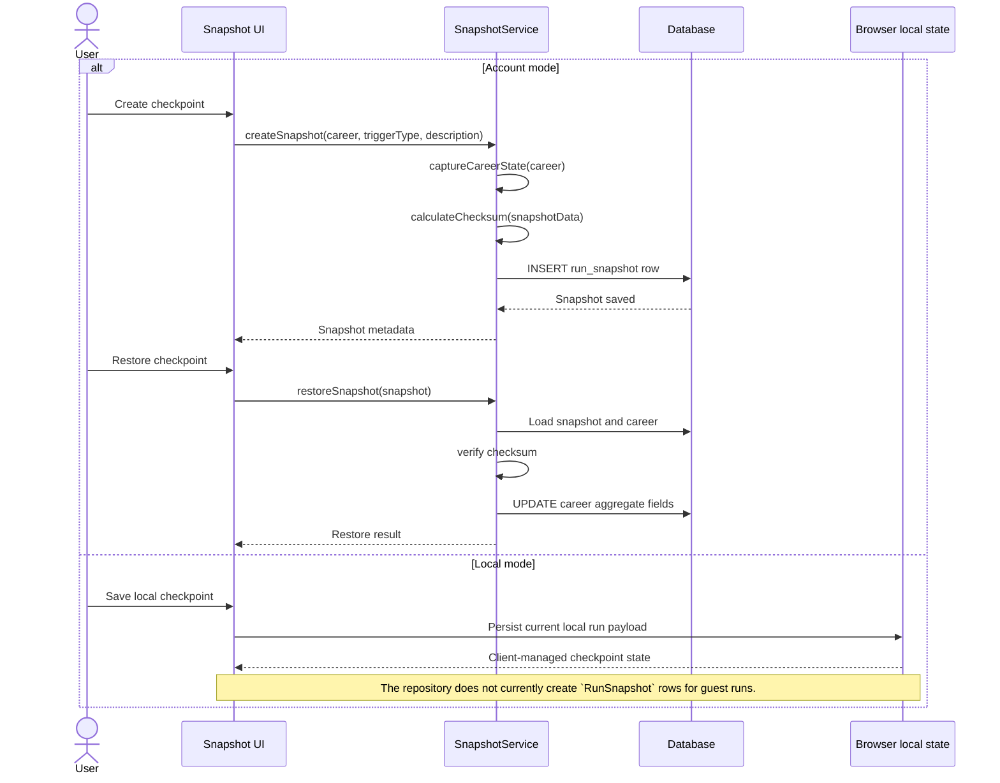
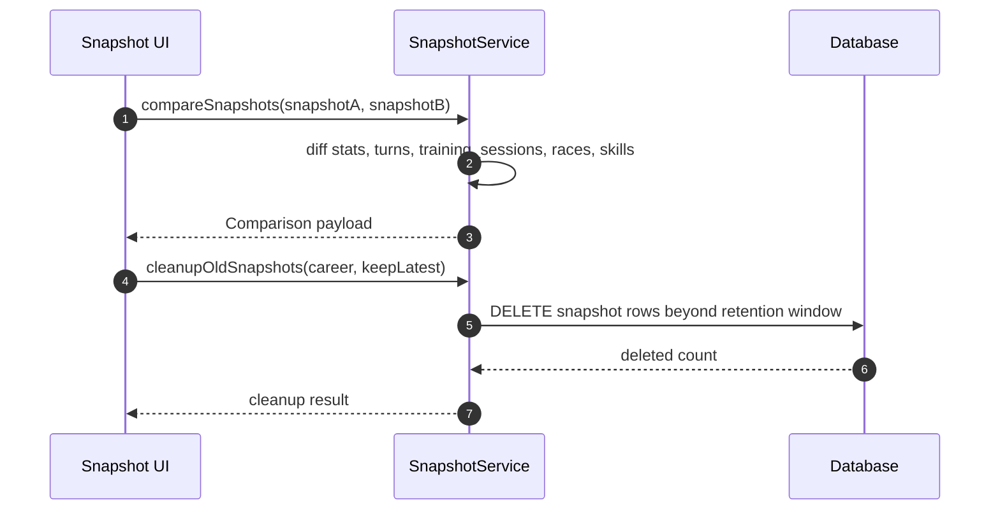

# SEQ-012: Run Snapshot and Restore

## Umamusume Pretty Derby Career Planner

**Document Version**: 2.3.0
**Date**: March 8, 2026
**Related Documents**: [PRD-001], [SPEC-001], [FLOW-001], [FLOW-009]

---

## 1. Overview

### 1.1 Purpose

This sequence diagram documents the currently implemented snapshot and restore behavior. It
distinguishes between account-mode snapshots persisted through `SnapshotService` and local-mode run
state, which remains browser-managed rather than being stored as `RunSnapshot` records.

### 1.2 Scope

**Covers:**

- Account-mode snapshot creation through `SnapshotService`
- Account-mode snapshot restore and compare operations
- Local-mode checkpoint boundary
- Integrity checking and cleanup behavior

### 1.3 Implementation Notes

- `SnapshotService::createSnapshot()` persists `RunSnapshot` rows tied to a database `Career`.
- Snapshot payloads are stored as arrays in `snapshot_data`; the service does not currently compress them.
- Restore updates aggregate career fields from the saved payload and verifies the checksum.
- The snapshot payload currently records `meta.version = '1.0'`; the earlier multi-version migration
narrative is not implemented in this service.
- Local-mode runs do not have a dedicated server-side snapshot route or `RunSnapshot` persistence path.

---

## 2. Participants

| Component | Type | Responsibility |
| --- | --- | --- |
| **User** | Actor | Creates or restores a checkpoint |
| **Snapshot UI** | Presentation | Snapshot controls in account-mode career views |
| **SnapshotService** | Domain Service | Creates, restores, compares, and cleans up snapshots |
| **RunSnapshot** | Data Model | Stores persisted snapshot payloads |
| **Career** | Data Model | Owns the snapshot relationship and restored fields |
| **Database** | Infrastructure | Persists snapshots and updated career state |
| **Browser local state** | Client Storage | Holds local-mode run state when no DB career exists |

---

## 3. Sequence Flow

### 3.1 Storage-Aware Snapshot Flow

### 3.2 Account-Mode Compare and Cleanup

---

## 4. Detailed Interactions

### 4.1 Snapshot Payload

- `captureCareerState()` records career metadata, aggregate stats, SP totals, training-session
summaries, race summaries, acquired-skill summaries, performance metrics, and a `meta.version`
value.
- The stored snapshot is an application-level aggregate snapshot rather than a full relational database dump.

### 4.2 Restore Behavior

- `restoreSnapshot()` verifies the checksum before applying changes.
- The service restores aggregate fields on the `Career` model such as turn, phase, status, final stats, and SP totals.
- The service does not currently replay or delete later `training_sessions`, `races`, or
`skill_acquisitions` rows during restore.

### 4.3 Local-Mode Boundary

- Local-mode runs remain browser-managed until conversion.
- This sequence therefore treats local checkpointing as a client concern rather than inventing a guest snapshot API.

---

## 5. Error Handling

- Missing career relationships return a restore failure message.
- Checksum mismatches block restore.
- Local-mode checkpoint failures are client-side storage failures, not backend snapshot failures.

---

## 6. Related Documentation

- [FLOW-001](../01-flows/FLOW-001_Character_Management_System.md)
- [FLOW-009](../01-flows/FLOW-009_Storage_Migration_System.md)
- [SEQ-017](SEQ-017_Storage_Mode_Transition.md)
