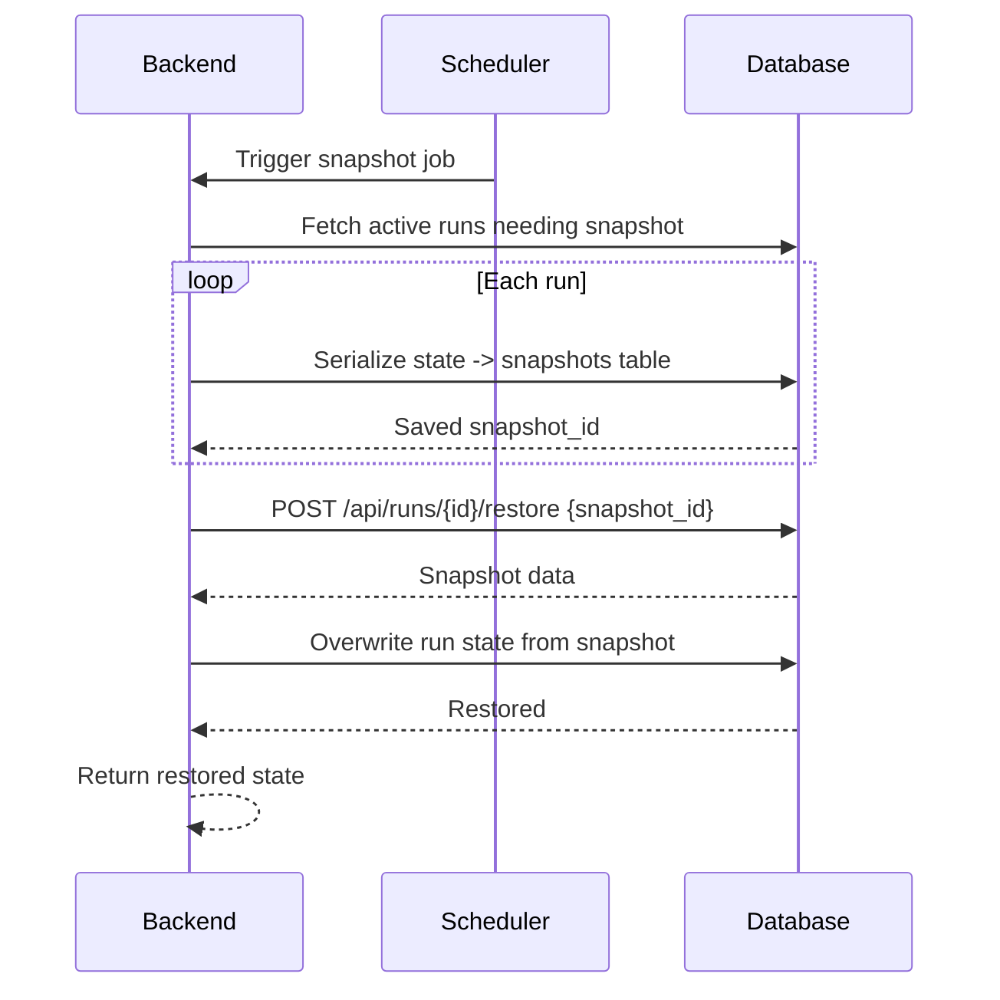

# SEQ-012: Run Snapshot and Restore

## Umamusume Pretty Derby Career Planner

**Document Version**: 1.0  
**Date**: January 14, 2026  
**Related Documents**: [PRD-001], [SPEC-012]
**Source Specs**:

- `.kiro/specs/umamusume-career-planner-main/requirements.md` (Snapshot/Restore Requirements)
- `.kiro/specs/umamusume-career-planner-main/design.md` (Snapshot System)

**Related Artifacts**:

- PRD: [PRD-001](../prds/PRD-001_Character_Management.md)
- SPEC: [SPEC-001](../specs/SPEC-001_Character_Management_Technical.md)
- Flow: [FLOW-001](../flows/FLOW-001_Character_Management_System.md)
- Tech Flow: [TECH-FLOW-001](../tech-flow/TECH-FLOW-001_Character_Management_Flow.md)

---

## Sequence Overview

- Saves periodic run snapshots and restores on request for what-if scenarios or rollback.

## Sequence Diagram

