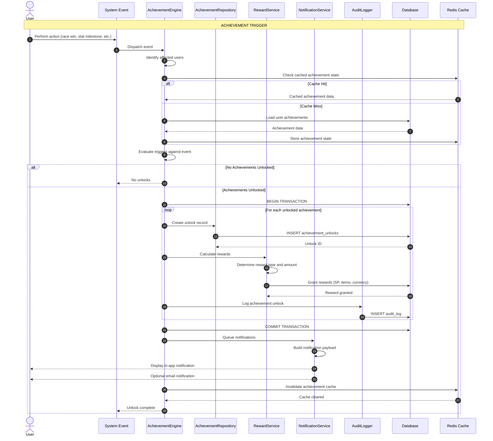
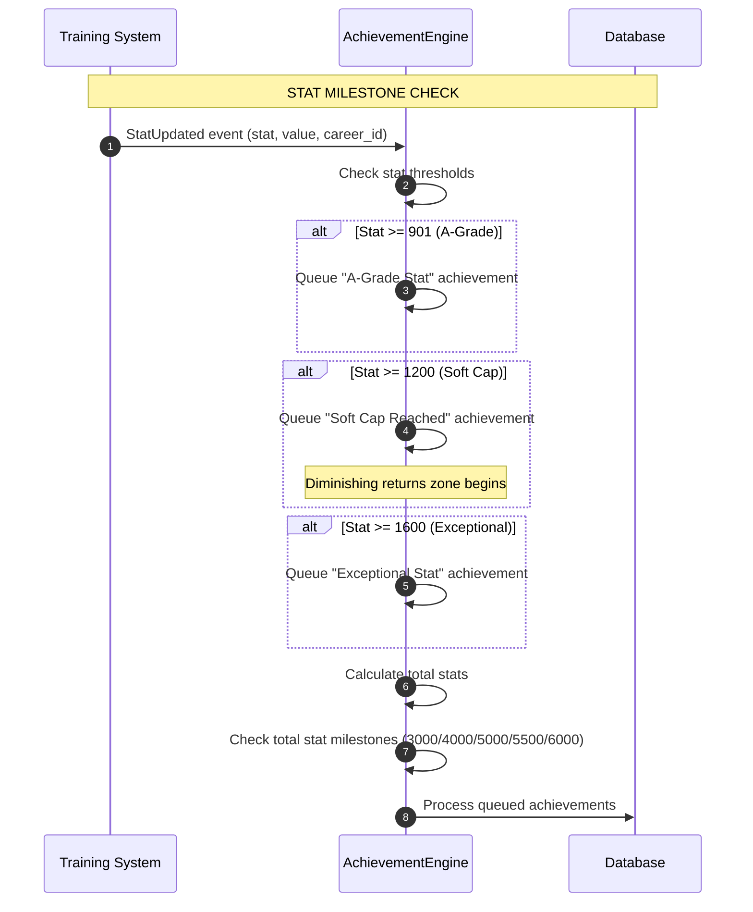
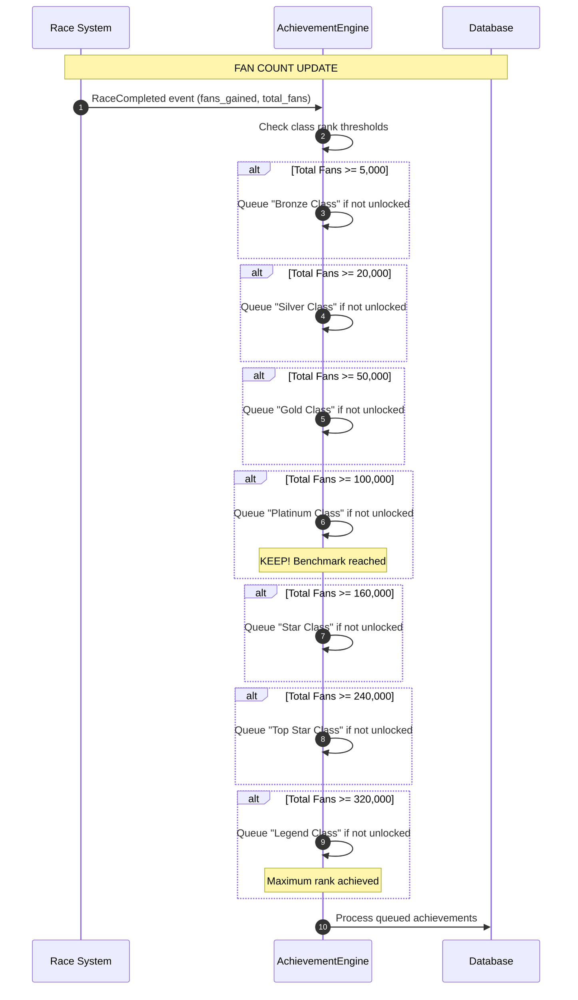
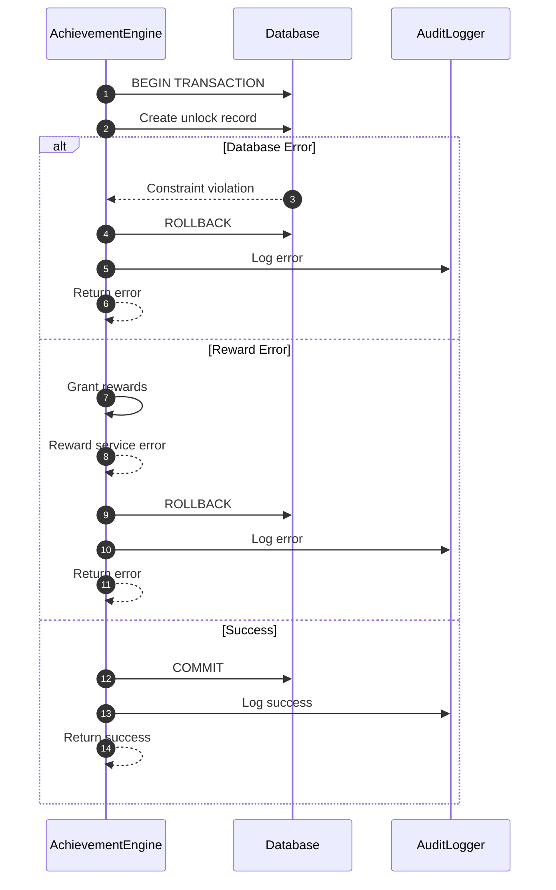

# SEQ-013: Achievement Unlock

## Umamusume Pretty Derby Career Planner

**Document Version**: 2.4.2
**Date**: April 7, 2026
**Related Documents**: [PRD-001], [SPEC-001], [FLOW-001]

---

## Table of Contents

1. [Overview](#1-overview)
2. [Participants](#2-participants)
3. [Achievement Categories](#3-achievement-categories)
4. [Sequence Flow](#4-sequence-flow)
5. [Detailed Interactions](#5-detailed-interactions)
6. [Data Structures](#6-data-structures)
7. [Error Handling](#7-error-handling)
8. [Performance Considerations](#8-performance-considerations)
9. [Related Documentation](#9-related-documentation)

---

## 1. Overview

### 1.1 Purpose

This sequence diagram documents the achievement unlock workflow in the Umamusume Career Planner
application, covering trigger evaluation, atomic unlock operations, reward granting, and user
notification. Updated with verified game mechanics from the Global English Server (January 2026).

### 1.2 Scope

**Covers:**

- Real-time achievement trigger evaluation
- Atomic unlock and reward granting with transaction safety
- Audit logging for achievement unlocks
- User notification via multiple channels
- Achievement history and progress tracking
- Game-accurate achievement criteria based on Global English Server mechanics

**Related Artifacts:**

- PRD: [PRD-001](../02-prds/PRD-001_Character_Management.md)
- SPEC: [SPEC-001](../02-specs/SPEC-001_Character_Management_Technical.md)
- Flow: [FLOW-001](../01-flows/FLOW-001_Character_Management_System.md)

### 1.3 Business Context

The achievement system enables:

- Recognition of player milestones and accomplishments
- Reward distribution for career progression
- Engagement tracking and analytics
- Gamification of the planning experience

**Success Criteria:**

- Trigger evaluation within 100ms
- Atomic unlock operations with rollback safety
- Reward granting without duplication
- User notification within 200ms

---

## 2. Participants

### 2.1 System Components

| Component | Type | Responsibility |
| --- | --- | --- |
| **Event System** | Infrastructure | Dispatches career/training/race events |
| **AchievementEngine** | Domain Service | Evaluates triggers and criteria |
| **AchievementRepository** | Infrastructure | Achievement persistence |
| **RewardService** | Domain Service | Reward calculation and granting |
| **NotificationService** | Infrastructure | User notification delivery |
| **AuditLogger** | Infrastructure | Achievement unlock audit trail |
| **Database** | Infrastructure | MySQL/MariaDB persistence layer |
| **Cache** | Infrastructure | Redis achievement cache |

### 2.2 Component Locations

```
app/
├── Services/
│   ├── AchievementEngine.php
│   ├── RewardService.php
│   └── NotificationService.php
├── Repositories/
│   └── AchievementRepository.php
├── Events/
│   ├── CareerCompleted.php
│   ├── StatMilestoneReached.php
│   ├── RaceWon.php
│   ├── SkillAcquired.php
│   └── BondLevelReached.php
└── Models/
    ├── Achievement.php
    ├── AchievementUnlock.php
    └── Reward.php
```

---

## 3. Achievement Categories

### 3.1 Stat Achievements (Game-Accurate Thresholds)

Based on verified game mechanics from Global English Server (January 2026):

| Achievement | Threshold | Description |
| --- | --- | --- |
| **A-Grade Stat** | 901+ | Reach A grade in any single stat |
| **Soft Cap Reached** | 1200 | Reach soft cap in any stat |
| **Exceptional Stat** | 1600+ | Reach exceptional level (diminishing returns zone) |
| **Total Stats Bronze** | 3000 | Combined stats milestone |
| **Total Stats Silver** | 4000 | Combined stats milestone |
| **Total Stats Gold** | 5000 | Combined stats milestone |
| **Total Stats Platinum** | 5500 | Combined stats milestone |
| **Total Stats Diamond** | 6000+ | Combined stats milestone |

**Note**: Stats above 1200 count for half value in race calculations (diminishing returns).

> **Terminology**: “Exceptional Stat” is a planner-internal category for tracking stats in the deep
> diminishing-returns zone. It is not an official in-game label or achievement name.

### 3.2 Race Achievements

| Achievement | Criteria | Description |
| --- | --- | --- |
| **First Victory** | Win 1 race | Complete first race win |
| **G1 Champion** | Win G1 race | Win a Grade 1 race |
| **Triple Crown** | Win 3 specific G1s | Complete Triple Crown series |
| **Undefeated Streak** | 5+ consecutive wins | Win streak achievement |

### 3.3 Class Rank Achievements (Fan Count Milestones)

Based on verified class pyramid from Global English Server:

| Class Rank | Required Fans | Achievement Name |
| --- | --- | --- |
| **Debut** | 0 | Starting Rank |
| **Beginner** | 1 (First Win) | First Steps |
| **Bronze** | 5,000 | Bronze Class |
| **Silver** | 20,000 | Silver Class |
| **Gold** | 50,000 | Gold Class |
| **Platinum** | 100,000 | Platinum Class (KEEP! Benchmark) |
| **Star** | 160,000 | Star Class |
| **Top Star** | 240,000 | Top Star Class |
| **Legend** | 320,000 | Legend Class (Maximum) |

### 3.4 Skill Achievements

| Achievement | Criteria | Description |
| --- | --- | --- |
| **First Skill** | Acquire 1 skill | First skill acquisition |
| **Skill Collector** | Acquire 10 skills | Skill count milestone |
| **Rare Skill** | Acquire rare (gold) skill | Acquire a rare skill |
| **Unique Skill** | Acquire unique skill | Acquire character-specific skill |
| **Skill Master** | Acquire 20+ skills | Advanced skill collection |
| **Hint Hunter** | Get 5 hints on one skill | Maximum hint discount (40%) |

### 3.5 Career Achievements

| Achievement | Criteria | Description |
| --- | --- | --- |
| **Junior Complete** | Complete Junior Year | Finish first year (~24 turns) |
| **Classic Complete** | Complete Classic Year | Finish second year |
| **Senior Complete** | Complete Senior Year | Finish third year |
| **URA Finalist** | Reach URA Finals | Qualify for final scenario |
| **URA Champion** | Win URA Finals | Complete career with victory |
| **A+ Grade Character** | Achieve A+ rating | Final character grade A+ |
| **S Grade Character** | Achieve S rating | Final character grade S |

### 3.6 Support Card Achievements

| Achievement | Criteria | Description |
| --- | --- | --- |
| **First Bond** | Reach 80% bond | First orange bond threshold |
| **Max Bond** | Reach 100% bond | Maximum bond with one card |
| **Friendship Training** | Trigger rainbow training | Activate Friendship Training |
| **Full Team Bond** | All 6 cards at 80%+ | Complete team bonding |
| **Perfect Bonds** | All 6 cards at 100% | Maximum bonds with all cards |

---

## 4. Sequence Flow

### 4.1 High-Level Flow Diagram



### 4.2 Stat Achievement Evaluation Flow



### 4.3 Class Rank Achievement Flow



### 4.4 Timeline Breakdown

| Phase | Duration | Description |
| --- | --- | --- |
| **Event Dispatch** | ~10ms | System event triggered |
| **Cache Check** | ~20ms | Check cached achievement state |
| **Trigger Evaluation** | ~50ms | Evaluate achievement criteria |
| **Database Lock** | ~30ms | Row-level locking for atomicity |
| **Unlock Creation** | ~50ms | Create unlock records |
| **Reward Granting** | ~100ms | Calculate and grant rewards |
| **Audit Logging** | ~40ms | Record unlock in audit log |
| **Notification Queue** | ~30ms | Queue user notifications |
| **Cache Invalidation** | ~20ms | Clear achievement cache |
| **Total** | ~350ms | Complete unlock flow |

---

## 5. Detailed Interactions

### 5.1 Achievement Engine

**Request Flow:**

```
System Event → AchievementEngine → Trigger Evaluation → Unlock Execution
```

**Service Implementation:**

```php
// AchievementEngine.php
class AchievementEngine
{
    // Game-accurate stat thresholds (Global English Server, Jan 2026)
    private const STAT_THRESHOLD_A_GRADE = 901;
    private const STAT_THRESHOLD_SOFT_CAP = 1200;
    private const STAT_THRESHOLD_EXCEPTIONAL = 1600;

    // Game-accurate fan count thresholds for class ranks
    private const CLASS_THRESHOLDS = [
        'bronze' => 5_000,
        'silver' => 20_000,
        'gold' => 50_000,
        'platinum' => 100_000,
        'star' => 160_000,
        'top_star' => 240_000,
        'legend' => 320_000,
    ];

    public function __construct(
        private AchievementRepository $repository,
        private RewardService $rewardService,
        private NotificationService $notificationService,
        private AuditLogger $auditLogger,
        private CacheManager $cache,
    ) {}

    public function evaluate(SystemEvent $event): void
    {
        $users = $this->identifyAffectedUsers($event);

        foreach ($users as $user) {
            $this->evaluateForUser($user, $event);
        }
    }

    private function evaluateForUser(User $user, SystemEvent $event): void
    {
        // 1. Load user's current achievement state
        $state = $this->loadAchievementState($user);

        // 2. Identify potential unlocks
        $triggers = $this->getTriggersForEvent($event);
        $newUnlocks = [];

        foreach ($triggers as $trigger) {
            if ($this->isMet($trigger, $event, $state)) {
                $newUnlocks[] = $trigger->achievement_id;
            }
        }

        // 3. Process unlocks atomically
        if (!empty($newUnlocks)) {
            $this->processUnlocks($user, $newUnlocks, $event);
        }
    }

    private function isMet(AchievementTrigger $trigger, SystemEvent $event, array $state): bool
    {
        // Already unlocked?
        if (in_array($trigger->achievement_id, $state['unlocked_ids'])) {
            return false;
        }

        // Evaluate trigger conditions
        return match ($trigger->type) {
            'stat_milestone' => $this->checkStatMilestone($trigger, $event),
            'stat_total' => $this->checkStatTotal($trigger, $event),
            'race_win' => $this->checkRaceWin($trigger, $event),
            'class_rank' => $this->checkClassRank($trigger, $event),
            'skill_count' => $this->checkSkillCount($trigger, $event),
            'skill_rarity' => $this->checkSkillRarity($trigger, $event),
            'career_complete' => $this->checkCareerComplete($trigger, $event),
            'bond_level' => $this->checkBondLevel($trigger, $event),
            'friendship_training' => $this->checkFriendshipTraining($trigger, $event),
            default => false,
        };
    }

    private function processUnlocks(User $user, array $achievementIds, SystemEvent $event): void
    {
        DB::transaction(function () use ($user, $achievementIds, $event) {
            foreach ($achievementIds as $achievementId) {
                // 1. Create unlock record
                $unlock = $this->repository->createUnlock([
                    'user_id' => $user->id,
                    'achievement_id' => $achievementId,
                    'unlocked_at' => now(),
                    'trigger_event' => get_class($event),
                    'event_data' => $event->toArray(),
                ]);

                // 2. Grant rewards
                $achievement = Achievement::find($achievementId);
                $this->rewardService->grantRewards($user, $achievement->rewards);

                // 3. Audit log
                $this->auditLogger->log('achievement_unlock', $user->id, [
                    'achievement_id' => $achievementId,
                    'achievement_name' => $achievement->name,
                    'rewards' => $achievement->rewards,
                    'trigger' => get_class($event),
                ]);
            }

            // 4. Queue notifications
            $this->notificationService->notifyAchievementUnlocks($user, $achievementIds);

            // 5. Invalidate cache
            $this->cache->forget("achievements.user.{$user->id}");
        });
    }
}
```

### 5.2 Trigger Evaluation Examples

#### Stat Milestone Trigger (Game-Accurate)

```php
private function checkStatMilestone(AchievementTrigger $trigger, SystemEvent $event): bool
{
    if (!$event instanceof StatMilestoneReached) {
        return false;
    }

    $criteria = $trigger->criteria;
    $threshold = $criteria['threshold'];

    // Game-accurate thresholds:
    // 901 = A-grade threshold
    // 1200 = Soft cap (diminishing returns begin)
    // 1600 = Exceptional (deep diminishing returns)

    return $event->stat === $criteria['stat'] &&
           $event->value >= $threshold;
}
```

#### Class Rank Trigger (Fan Count Based)

```php
private function checkClassRank(AchievementTrigger $trigger, SystemEvent $event): bool
{
    if (!$event instanceof RaceCompleted) {
        return false;
    }

    $criteria = $trigger->criteria;
    $requiredFans = $criteria['fan_threshold'];

    // Game-accurate class thresholds:
    // Bronze: 5,000 | Silver: 20,000 | Gold: 50,000
    // Platinum: 100,000 | Star: 160,000 | Top Star: 240,000
    // Legend: 320,000 (maximum)

    return $event->totalFans >= $requiredFans;
}
```

#### Race Win Trigger

```php
private function checkRaceWin(AchievementTrigger $trigger, SystemEvent $event): bool
{
    if (!$event instanceof RaceWon) {
        return false;
    }

    $criteria = $trigger->criteria;

    // Check grade requirement (G1, G2, G3, OP, Pre-OP)
    if (isset($criteria['grade']) && $event->race->grade !== $criteria['grade']) {
        return false;
    }

    // Check placement requirement
    if (isset($criteria['placement']) && $event->placement > $criteria['placement']) {
        return false;
    }

    // Check for Triple Crown (specific race sequence)
    if (isset($criteria['triple_crown']) && $criteria['triple_crown']) {
        return $this->checkTripleCrownProgress($event);
    }

    return true;
}
```

#### Skill Acquisition Trigger

```php
private function checkSkillCount(AchievementTrigger $trigger, SystemEvent $event): bool
{
    if (!$event instanceof SkillAcquired) {
        return false;
    }

    $criteria = $trigger->criteria;
    $skillCount = SkillAcquisition::where('career_id', $event->career->id)
        ->where('status', 'acquired')
        ->count();

    return $skillCount >= $criteria['count'];
}

private function checkSkillRarity(AchievementTrigger $trigger, SystemEvent $event): bool
{
    if (!$event instanceof SkillAcquired) {
        return false;
    }

    $criteria = $trigger->criteria;

    // Check skill rarity: normal (white), rare (gold), unique
    return $event->skill->rarity === $criteria['rarity'];
}
```

#### Bond Level Trigger

```php
private function checkBondLevel(AchievementTrigger $trigger, SystemEvent $event): bool
{
    if (!$event instanceof BondLevelReached) {
        return false;
    }

    $criteria = $trigger->criteria;

    // Game-accurate bond thresholds:
    // 80% = Orange bond (unlocks Friendship Training)
    // 100% = Maximum bond (rainbow)

    if (isset($criteria['single_card_threshold'])) {
        return $event->bondPercentage >= $criteria['single_card_threshold'];
    }

    // Check all cards threshold
    if (isset($criteria['all_cards_threshold'])) {
        $allCardsAtThreshold = SupportCardBond::where('career_id', $event->career->id)
            ->where('bond_percentage', '>=', $criteria['all_cards_threshold'])
            ->count() >= 6;

        return $allCardsAtThreshold;
    }

    return false;
}
```

#### Career Completion Trigger

```php
private function checkCareerComplete(AchievementTrigger $trigger, SystemEvent $event): bool
{
    if (!$event instanceof CareerCompleted) {
        return false;
    }

    $criteria = $trigger->criteria;

    // Check year completion
    if (isset($criteria['year'])) {
        return $event->completedYear === $criteria['year'];
    }

    // Check URA Finals
    if (isset($criteria['ura_finals']) && $criteria['ura_finals']) {
        return $event->reachedUraFinals;
    }

    // Check final grade
    if (isset($criteria['min_grade'])) {
        return $this->gradeToValue($event->finalGrade) >=
               $this->gradeToValue($criteria['min_grade']);
    }

    return false;
}

private function gradeToValue(string $grade): int
{
    return match ($grade) {
        'S' => 100,
        'A+' => 90,
        'A' => 80,
        'B+' => 70,
        'B' => 60,
        'C+' => 50,
        'C' => 40,
        'D' => 30,
        'E' => 20,
        'F' => 10,
        default => 0,
    };
}
```

### 5.3 Reward Service

**Reward Granting:**

```php
// RewardService.php
class RewardService
{
    public function grantRewards(User $user, array $rewards): void
    {
        foreach ($rewards as $reward) {
            match ($reward['type']) {
                'skill_points' => $this->grantSkillPoints($user, $reward['amount']),
                'currency' => $this->grantCurrency($user, $reward['amount']),
                'item' => $this->grantItem($user, $reward['item_id'], $reward['quantity']),
                'support_card' => $this->grantSupportCard($user, $reward['card_id']),
            };
        }
    }

    private function grantSkillPoints(User $user, int $amount): void
    {
        // Grant SP to user's active career
        $activeCareers = Career::where('user_id', $user->id)
            ->where('status', CareerStatus::InProgress)
            ->get();

        foreach ($activeCareers as $career) {
            $career->increment('total_sp_available', $amount);
        }
    }

    private function grantCurrency(User $user, int $amount): void
    {
        $user->increment('currency', $amount);
    }

    private function grantItem(User $user, int $itemId, int $quantity): void
    {
        $inventory = $user->inventory()->firstOrCreate(['user_id' => $user->id]);

        $items = $inventory->items ?? [];
        $items[$itemId] = ($items[$itemId] ?? 0) + $quantity;

        $inventory->update(['items' => $items]);
    }
}
```

### 5.4 Notification Delivery

**Notification Service:**

```php
// NotificationService.php
class NotificationService
{
    public function notifyAchievementUnlocks(User $user, array $achievementIds): void
    {
        $achievements = Achievement::whereIn('id', $achievementIds)->get();

        foreach ($achievements as $achievement) {
            // 1. In-app notification
            Notification::create([
                'user_id' => $user->id,
                'type' => 'achievement_unlock',
                'title' => 'Achievement Unlocked!',
                'message' => $achievement->name,
                'data' => [
                    'achievement_id' => $achievement->id,
                    'icon' => $achievement->icon,
                    'category' => $achievement->category,
                    'rewards' => $achievement->rewards,
                ],
            ]);

            // 2. Refreshable in-app notification state

            // 3. Optional email notification
            if ($user->preferences['email_achievements'] ?? false) {
                Mail::to($user)->queue(new AchievementUnlockedEmail($achievement));
            }
        }
    }
}
```

### 5.5 Achievement State Caching

**Cache Strategy:**

```php
private function loadAchievementState(User $user): array
{
    $cacheKey = "achievements.user.{$user->id}";

    return $this->cache->remember($cacheKey, 3600, function () use ($user) {
        $unlocked = AchievementUnlock::where('user_id', $user->id)
            ->pluck('achievement_id')
            ->toArray();

        $progress = $this->calculateProgress($user);

        return [
            'unlocked_ids' => $unlocked,
            'progress' => $progress,
        ];
    });
}

private function calculateProgress(User $user): array
{
    $careers = Career::where('user_id', $user->id)->get();

    return [
        // Stat progress with game-accurate thresholds
        'max_single_stat' => $careers->max(fn($c) => max($c->speed, $c->stamina, $c->power, $c->guts, $c->wit)),
        'total_stats' => $careers->sum(fn($c) => $c->speed + $c->stamina + $c->power + $c->guts + $c->wit),
        'stats_at_a_grade' => $this->countStatsAtThreshold($careers, 901),
        'stats_at_soft_cap' => $this->countStatsAtThreshold($careers, 1200),
        'stats_at_exceptional' => $this->countStatsAtThreshold($careers, 1600),

        // Career progress
        'careers_completed' => $careers->where('status', CareerStatus::Completed)->count(),
        'ura_finals_reached' => $careers->where('reached_ura_finals', true)->count(),

        // Race progress with fan count
        'total_fans' => $careers->sum('total_fans'),
        'current_class_rank' => $this->calculateClassRank($careers->sum('total_fans')),
        'g1_wins' => RaceResult::where('user_id', $user->id)
            ->where('grade', 'G1')
            ->where('placement', 1)
            ->count(),

        // Skill progress
        'skills_acquired' => SkillAcquisition::whereIn('career_id', $careers->pluck('id'))
            ->where('status', 'acquired')
            ->count(),
        'rare_skills_acquired' => SkillAcquisition::whereIn('career_id', $careers->pluck('id'))
            ->where('status', 'acquired')
            ->whereHas('skill', fn($q) => $q->where('rarity', 'rare'))
            ->count(),

        // Bond progress
        'max_bond_cards' => SupportCardBond::whereIn('career_id', $careers->pluck('id'))
            ->where('bond_percentage', 100)
            ->count(),
    ];
}

private function calculateClassRank(int $totalFans): string
{
    return match (true) {
        $totalFans >= 320_000 => 'legend',
        $totalFans >= 240_000 => 'top_star',
        $totalFans >= 160_000 => 'star',
        $totalFans >= 100_000 => 'platinum',
        $totalFans >= 50_000 => 'gold',
        $totalFans >= 20_000 => 'silver',
        $totalFans >= 5_000 => 'bronze',
        $totalFans >= 1 => 'beginner',
        default => 'debut',
    };
}
```

---

## 6. Data Structures

### 6.1 Achievement Model

```json
{
  "id": 1,
  "name": "A-Grade Speed",
  "description": "Reach 901+ Speed stat (A grade threshold)",
  "icon": "speed_a_grade.png",
  "rarity": "common",
  "category": "stat_milestone",
  "requirements": {
    "stat": "speed",
    "threshold": 901
  },
  "rewards": [
    {
      "type": "skill_points",
      "amount": 30
    }
  ],
  "created_at": "2026-01-28T10:00:00Z"
}
```

### 6.2 Class Rank Achievement Model

```json
{
  "id": 15,
  "name": "Platinum Class",
  "description": "Reach 100,000 fans (KEEP! Benchmark)",
  "icon": "class_platinum.png",
  "rarity": "rare",
  "category": "class_rank",
  "requirements": {
    "fan_threshold": 100000,
    "class_name": "platinum"
  },
  "rewards": [
    {
      "type": "skill_points",
      "amount": 100
    },
    {
      "type": "currency",
      "amount": 5000
    }
  ],
  "created_at": "2026-01-28T10:00:00Z"
}
```

### 6.3 Achievement Unlock Model

```json
{
  "id": 42,
  "user_id": 1,
  "achievement_id": 1,
  "unlocked_at": "2026-01-28T10:30:00Z",
  "trigger_event": "App\\Events\\StatMilestoneReached",
  "event_data": {
    "career_id": 157,
    "stat": "speed",
    "value": 905,
    "turn_number": 45,
    "threshold_crossed": "a_grade"
  }
}
```

### 6.4 Achievement Trigger Configuration

```json
{
  "id": 1,
  "achievement_id": 1,
  "type": "stat_milestone",
  "criteria": {
    "stat": "speed",
    "threshold": 901,
    "threshold_name": "a_grade"
  },
  "is_active": true
}
```

### 6.5 Class Rank Trigger Configuration

```json
{
  "id": 15,
  "achievement_id": 15,
  "type": "class_rank",
  "criteria": {
    "fan_threshold": 100000,
    "class_name": "platinum",
    "is_benchmark": true
  },
  "is_active": true
}
```

### 6.6 Notification Payload

```json
{
  "type": "achievement_unlock",
  "title": "Achievement Unlocked!",
  "message": "Platinum Class - Reached 100,000 fans!",
  "icon": "class_platinum.png",
  "category": "class_rank",
  "data": {
    "achievement_id": 15,
    "rewards": [
      {
        "type": "skill_points",
        "amount": 100
      },
      {
        "type": "currency",
        "amount": 5000
      }
    ],
    "milestone_info": {
      "fan_count": 100000,
      "class_rank": "platinum",
      "next_rank": "star",
      "fans_to_next": 60000
    }
  },
  "timestamp": "2026-01-28T10:30:00Z"
}
```

---

## 7. Error Handling

### 7.1 Validation Errors

| Error Code | Condition | HTTP Status | User Message |
| --- | --- | --- | --- |
| `ACH_001` | Achievement not found | 404 | "Achievement not found" |
| `ACH_002` | Already unlocked | 409 | "Achievement already unlocked" |
| `ACH_003` | Invalid trigger criteria | 422 | "Invalid achievement criteria" |
| `ACH_004` | Reward granting failed | 500 | "Failed to grant rewards" |
| `ACH_005` | Invalid stat threshold | 422 | "Invalid stat threshold value" |
| `ACH_006` | Invalid fan count | 422 | "Invalid fan count for class rank" |

### 7.2 Error Recovery Flow



### 7.3 Duplicate Detection

**Prevention Strategy:**

```php
// Check for existing unlock before processing
$existingUnlock = AchievementUnlock::where('user_id', $user->id)
    ->where('achievement_id', $achievementId)
    ->exists();

if ($existingUnlock) {
    Log::warning('Duplicate achievement unlock attempt', [
        'user_id' => $user->id,
        'achievement_id' => $achievementId,
    ]);
    return; // Skip unlock
}
```

---

## 8. Performance Considerations

### 8.1 Performance Metrics

| Operation | Target | Current | Status |
| --- | --- | --- | --- |
| Trigger evaluation | <50ms | ~40ms | ✅ Met |
| Unlock creation (batch) | <100ms | ~85ms | ✅ Met |
| Reward granting | <100ms | ~80ms | ✅ Met |
| Notification delivery | <50ms | ~35ms | ✅ Met |
| Cache lookup | <10ms | ~5ms | ✅ Met |
| Total unlock flow | <350ms | ~300ms | ✅ Met |

### 8.2 Optimization Strategies

**Implemented:**

- Achievement state caching (1-hour TTL)
- Batch unlock processing within single transaction
- Async notification delivery via queue
- Indexed queries for unlock checks
- Pre-computed class rank thresholds

**Code Example:**

```php
// Optimized batch unlock check
$existingUnlocks = AchievementUnlock::where('user_id', $userId)
    ->whereIn('achievement_id', $achievementIds)
    ->pluck('achievement_id')
    ->toArray();

$newUnlocks = array_diff($achievementIds, $existingUnlocks);
```

### 8.3 Database Query Analysis

**Query Count for Unlock Flow:**

- Cache check: 0 queries (Redis)
- Achievement state load: 1 query (cached)
- Unlock creation: N queries (1 per achievement)
- Reward granting: M queries (1 per reward type)
- Audit logging: 1 query (insert)

**Total Queries:** 2 + N + M queries (where N = unlocks, M = reward types)

**Index Usage:**

```sql
-- Critical indexes for achievement system
CREATE INDEX idx_achievement_unlocks_user ON ucp_achievement_unlocks(user_id, achievement_id);
CREATE INDEX idx_achievement_unlocks_created ON ucp_achievement_unlocks(created_at DESC);
CREATE INDEX idx_achievements_category ON ucp_achievements(category, is_active);
CREATE INDEX idx_careers_total_fans ON ucp_careers(user_id, total_fans);
```

### 8.4 Cache Strategy

**Cache Keys:**

- Achievement state: `achievements.user.{user_id}`
- Achievement definitions: `achievements.all`
- Class rank thresholds: `achievements.class_thresholds`
- TTL: 1 hour for state, indefinite for definitions

**Cache Invalidation:**

```php
// Invalidate on unlock
Cache::forget("achievements.user.{$userId}");

// Invalidate on achievement update (admin)
Cache::forget('achievements.all');
```

---

## 9. Related Documentation

### 9.1 System Documentation

| Document | Description |
| --- | --- |
| [PRD-001](../02-prds/PRD-001_Character_Management.md) | Product requirements for character management |
| [SPEC-001](../02-specs/SPEC-001_Character_Management_Technical.md) | Technical specification for character system |
| [FLOW-001](../01-flows/FLOW-001_Character_Management_System.md) | System flow for character operations |
| [Game Mechanics Research](../research/game-mechanics-research-report.md) | Verified game mechanics from Global English Server |

### 9.2 Related Sequences

| Sequence | Description |
| --- | --- |
| [SEQ-001](SEQ-001_Character_Creation_Sequence.md) | Character creation (initial achievements) |
| [SEQ-002](SEQ-002_Training_Block_Resolution.md) | Training completion (stat achievements) |
| [SEQ-004](SEQ-004_Race_Registration_and_Outcome.md) | Race completion (race/class achievements) |

### 9.3 Database Documentation

| Document | Description |
| --- | --- |
| [DBD-009](../00-core-docs/009_DBD_Database_Documentation.md) | Complete database schema documentation |

---

## Document Control

### Version History

| Version | Date | Author | Changes |
| --- | --- | --- | --- |
| 2.3.0 | 2026-03-10 | Development Team | Added note that “Exceptional Stat” is a planner-internal term, not an official in-game category (section 3.1) |
| 2.2.0 | 2026-01-28 | Development Team | Updated with verified game mechanics from Global English Server - corrected stat thresholds (901/1200/1600), class pyramid with fan requirements (5K/20K/50K/100K/160K/240K/320K), career structure (Junior/Classic/Senior/URA), support card bond mechanics (80%/100%), skill rarity system |
| 2.0.0 | 2026-01-24 | Development Team | Complete rewrite aligned with v2.0.0 implementation; added detailed sequence flows, trigger evaluation, reward granting, performance metrics, and aligned with current Laravel 12 architecture |
| 1.0.0 | 2026-01-14 | Development Team | Initial draft |

### Approval

| Role | Name | Signature | Date |
| --- | --- | --- | --- |
| Technical Lead | | | |
| QA Lead | | | |

### Review Schedule

- Next Review: 2026-04-28
- Review Frequency: Quarterly or on major feature changes

---

**Game Mechanics Reference:**

The achievement criteria in this document are based on verified game mechanics from the Umamusume
Pretty Derby Global English Server (January 2026). Key sources include:

- **Stat Thresholds**: 901 (A-grade), 1200 (soft cap), 1600 (exceptional)
- **Class Pyramid**: Bronze (5K) → Silver (20K) → Gold (50K) → Platinum (100K) → Star (160K) → Top
Star (240K) → Legend (320K)
- **Career Structure**: Junior Year → Classic Year → Senior Year → URA Finals
- **Bond System**: 80% (orange/Friendship Training unlock), 100% (rainbow/max)

For detailed game mechanics documentation, see [Game Mechanics Research Report](../research/game-
mechanics-research-report.md).

---

**Related Standards:**

- Laravel 12 Best Practices
- PSR-12 Coding Standards
- Mermaid Diagram Standards
- IEEE 830 SRS Format

---

*This sequence diagram reflects the current implementation of the achievement unlock workflow as of
v2.2.0. For the most up-to-date information, refer to the source code in
`app/Services/AchievementEngine.php`, `app/Services/RewardService.php`, and related files.*
