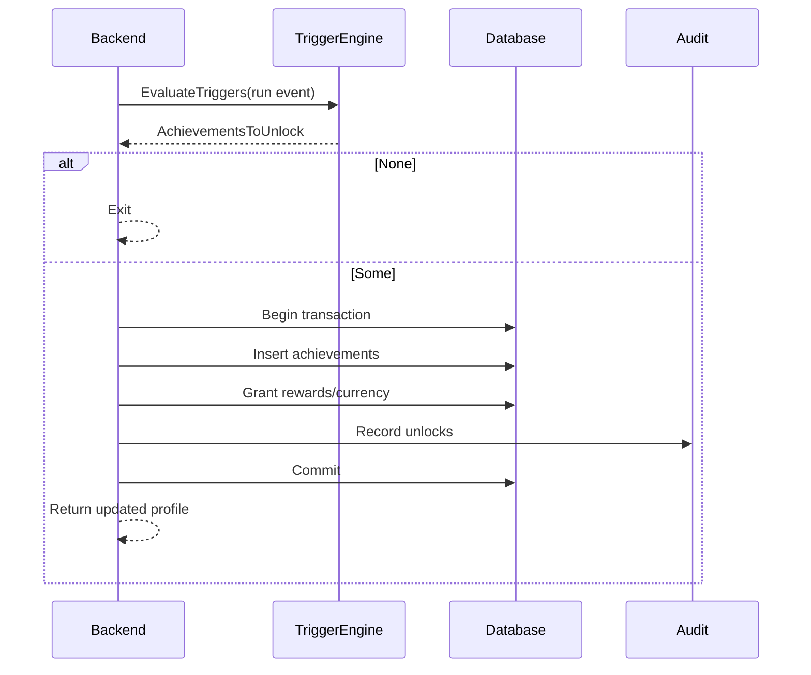

# SEQ-013: Achievement Unlock

## Umamusume Pretty Derby Career Planner

**Document Version**: 1.0  
**Date**: January 14, 2026  
**Related Documents**: [PRD-001], [SPEC-013]

**Source Specs**:

- `.kiro/specs/umamusume-career-planner-main/requirements.md` (Achievement System)
- `.kiro/specs/umamusume-career-planner-main/design.md` (Achievement Tracking)

**Related Artifacts**:

- PRD: [PRD-001](../prds/PRD-001_Character_Management.md)
- SPEC: [SPEC-001](../specs/SPEC-001_Character_Management_Technical.md)

---

## Sequence Overview

- Evaluates triggers, unlocks achievements, and grants rewards atomically.

## Sequence Diagram

