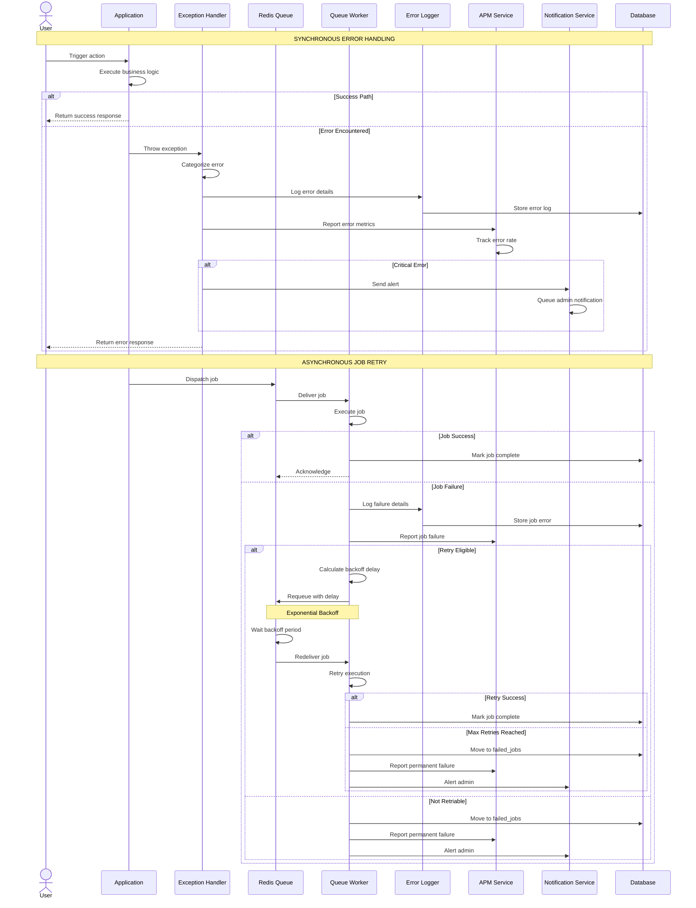
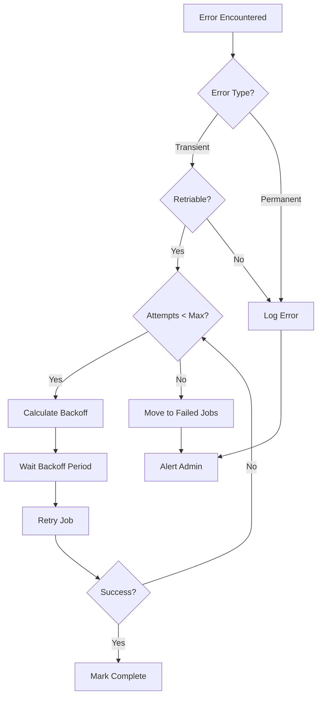

# SEQ-014: Error Reporting and Retry

## Umamusume Pretty Derby Career Planner

**Document Version**: 2.0.0  
**Date**: January 24, 2026  
**Related Documents**: [PRD-007], [SPEC-007], [FLOW-007], [TECH-FLOW-007]

---

## Table of Contents

1. [Overview](#1-overview)
2. [Participants](#2-participants)
3. [Sequence Flow](#3-sequence-flow)
4. [Detailed Interactions](#4-detailed-interactions)
5. [Data Structures](#5-data-structures)
6. [Error Handling](#6-error-handling)
7. [Performance Considerations](#7-performance-considerations)
8. [Related Documentation](#8-related-documentation)

---

## 1. Overview

### 1.1 Purpose

This sequence diagram documents the error reporting and retry workflow in the Umamusume Career Planner application, covering exception handling, logging, retry strategies, job queue management, and APM integration.

### 1.2 Scope

**Covers:**

- Exception handling and logging
- Job queue retry strategies with exponential backoff
- Error notification and alerting
- APM (Application Performance Monitoring) integration
- Failed job management and recovery
- Circuit breaker integration for external services
- Graceful degradation patterns

**Related Artifacts:**

- PRD: [PRD-007](../prds/PRD-007_External_Integration.md)
- SPEC: [SPEC-007](../specs/SPEC-007_External_Integration_Technical.md)
- Flow: [FLOW-007](../flows/FLOW-007_External_Integration_System.md)
- Tech Flow: [TECH-FLOW-007](../tech-flow/TECH-FLOW-007_External_Integration_Flow.md)

### 1.3 Business Context

Error reporting and retry mechanisms ensure:

- System resilience against transient failures
- Visibility into application health and issues
- Automatic recovery from temporary errors
- Data consistency through retry guarantees
- Operational awareness through monitoring

**Success Criteria:**

- Transient errors automatically retried
- Permanent failures logged and alerted
- Job retry within configured timeouts
- APM integration for real-time monitoring
- Failed jobs managed and recoverable

---

## 2. Participants

### 2.1 System Components

| Component | Type | Responsibility |
|-----------|------|----------------|
| **Application** | Core | Executes business logic |
| **Exception Handler** | Infrastructure | Global exception handling |
| **Queue System** | Infrastructure | Redis job queue |
| **Queue Worker** | Infrastructure | Job processing daemon |
| **Error Logger** | Infrastructure | Laravel logging system |
| **APM Service** | Infrastructure | Application performance monitoring |
| **Notification Service** | Infrastructure | Admin alerting |
| **Database** | Infrastructure | Failed jobs persistence |

### 2.2 Component Locations

```

app/
├── Exceptions/
│   ├── Handler.php
│   ├── CustomExceptions/
│   │   ├── ExternalAPIException.php
│   │   ├── AIProviderException.php
│   │   └── OCRProcessingException.php
│   └── ErrorReporter.php
├── Jobs/
│   ├── ProcessExternalDataSync.php
│   ├── SendNotificationEmail.php
│   ├── ProcessOCRExtraction.php
│   └── GenerateAIRecommendation.php
├── Services/
│   ├── ErrorLoggingService.php
│   ├── APMService.php
│   └── NotificationService.php
└── Console/
    └── Commands/
        └── RetryFailedJobs.php

```

---

## 3. Sequence Flow

### 3.1 High-Level Flow Diagram



### 3.2 Timeline Breakdown

| Phase | Duration | Description |
|-------|----------|-------------|
| **Exception Thrown** | ~1ms | Error detection |
| **Exception Handling** | ~10ms | Handler processing |
| **Error Logging** | ~50ms | Write to log storage |
| **APM Reporting** | ~30ms | Send metrics to APM |
| **Notification Queue** | ~20ms | Queue admin alert |
| **Job Retry Delay** | Variable | Exponential backoff |
| **Total (Sync Error)** | ~100ms | User-facing error |
| **Total (Job Retry)** | Seconds to minutes | Background retry |

---

## 4. Detailed Interactions

### 4.1 Exception Handler

**Request Flow:**

```
Exception → Handler → Logger → APM → User Response
```

**Handler Implementation:**

```php
// app/Exceptions/Handler.php
class Handler extends ExceptionHandler
{
    protected $dontReport = [
        ValidationException::class,
        AuthenticationException::class,
    ];
    
    public function register(): void
    {
        $this->reportable(function (Throwable $e) {
            $this->reportToAPM($e);
            
            if ($this->shouldAlert($e)) {
                $this->sendAlert($e);
            }
        });
        
        $this->renderable(function (ExternalAPIException $e, Request $request) {
            return response()->json([
                'error' => 'External service unavailable',
                'message' => 'Please try again later',
                'code' => 'EXT_SERVICE_ERROR',
            ], 503);
        });
        
        $this->renderable(function (AIProviderException $e, Request $request) {
            return response()->json([
                'error' => 'AI service error',
                'message' => 'AI recommendation unavailable',
                'code' => 'AI_PROVIDER_ERROR',
            ], 503);
        });
    }
    
    protected function reportToAPM(Throwable $e): void
    {
        app(APMService::class)->reportException($e, [
            'user_id' => auth()->id(),
            'request_id' => request()->header('X-Request-ID'),
            'route' => request()->route()?->getName(),
        ]);
    }
    
    protected function shouldAlert(Throwable $e): bool
    {
        return $e instanceof CriticalException
            || $e instanceof DatabaseConnectionException
            || $this->isHighErrorRate();
    }
    
    protected function sendAlert(Throwable $e): void
    {
        app(NotificationService::class)->notifyAdmins(
            new ErrorAlert($e, [
                'severity' => 'critical',
                'timestamp' => now(),
                'environment' => app()->environment(),
            ])
        );
    }
}
```

### 4.2 Custom Exception Types

**Exception Hierarchy:**

```php
// app/Exceptions/CustomExceptions/ExternalAPIException.php
class ExternalAPIException extends Exception
{
    public function __construct(
        string $message,
        public readonly string $apiName,
        public readonly ?string $endpoint = null,
        public readonly ?int $statusCode = null,
        ?\Throwable $previous = null
    ) {
        parent::__construct($message, 0, $previous);
    }
    
    public function context(): array
    {
        return [
            'api_name' => $this->apiName,
            'endpoint' => $this->endpoint,
            'status_code' => $this->statusCode,
        ];
    }
}

// app/Exceptions/CustomExceptions/AIProviderException.php
class AIProviderException extends Exception
{
    public function __construct(
        string $message,
        public readonly string $provider,
        public readonly ?string $model = null,
        public readonly bool $canRetry = true,
        ?\Throwable $previous = null
    ) {
        parent::__construct($message, 0, $previous);
    }
    
    public function context(): array
    {
        return [
            'provider' => $this->provider,
            'model' => $this->model,
            'can_retry' => $this->canRetry,
        ];
    }
}
```

### 4.3 Job Retry Strategy

**Job Implementation:**

```php
// app/Jobs/ProcessExternalDataSync.php
class ProcessExternalDataSync implements ShouldQueue
{
    use Dispatchable, InteractsWithQueue, Queueable, SerializesModels;
    
    public int $tries = 5;
    public int $timeout = 120;
    public int $maxExceptions = 3;
    public array $backoff = [10, 30, 60, 120, 300]; // Exponential backoff in seconds
    
    public function __construct(
        private string $apiSource,
        private string $resourceType,
    ) {}
    
    public function handle(ExternalAPIService $apiService): void
    {
        try {
            $data = $apiService->fetch($this->apiSource, $this->resourceType);
            
            $this->processData($data);
            
            Log::info('External data sync successful', [
                'api_source' => $this->apiSource,
                'resource_type' => $this->resourceType,
                'records' => count($data),
            ]);
            
        } catch (ExternalAPIException $e) {
            Log::warning('External API error, will retry', [
                'api_source' => $this->apiSource,
                'error' => $e->getMessage(),
                'attempt' => $this->attempts(),
            ]);
            
            if ($this->attempts() >= $this->tries) {
                $this->fail($e);
            } else {
                throw $e; // Will trigger retry
            }
        }
    }
    
    public function backoff(): array
    {
        return $this->backoff;
    }
    
    public function failed(\Throwable $exception): void
    {
        Log::error('External data sync failed permanently', [
            'api_source' => $this->apiSource,
            'resource_type' => $this->resourceType,
            'error' => $exception->getMessage(),
            'attempts' => $this->attempts(),
        ]);
        
        app(NotificationService::class)->notifyAdmins(
            new JobFailedNotification($this, $exception)
        );
    }
}
```

### 4.4 Error Logging Service

**Logging Strategy:**

```php
// app/Services/ErrorLoggingService.php
class ErrorLoggingService
{
    public function logException(
        \Throwable $exception,
        string $level = 'error',
        array $context = []
    ): void {
        $logData = [
            'exception' => get_class($exception),
            'message' => $exception->getMessage(),
            'code' => $exception->getCode(),
            'file' => $exception->getFile(),
            'line' => $exception->getLine(),
            'trace' => $exception->getTraceAsString(),
            'context' => $context,
            'user_id' => auth()->id(),
            'request_id' => request()->header('X-Request-ID'),
            'url' => request()->fullUrl(),
            'method' => request()->method(),
            'ip' => request()->ip(),
            'user_agent' => request()->userAgent(),
        ];
        
        Log::log($level, 'Exception occurred', $logData);
        
        if (method_exists($exception, 'context')) {
            Log::log($level, 'Exception context', $exception->context());
        }
    }
    
    public function logJobFailure(
        string $jobClass,
        \Throwable $exception,
        array $jobData = []
    ): void {
        Log::error('Job failed', [
            'job' => $jobClass,
            'exception' => get_class($exception),
            'message' => $exception->getMessage(),
            'job_data' => $jobData,
            'trace' => $exception->getTraceAsString(),
        ]);
    }
}
```

### 4.5 APM Integration

**APM Service:**

```php
// app/Services/APMService.php
class APMService
{
    public function reportException(
        \Throwable $exception,
        array $context = []
    ): void {
        // Example: New Relic integration
        if (extension_loaded('newrelic')) {
            newrelic_notice_error($exception->getMessage(), $exception);
            
            foreach ($context as $key => $value) {
                newrelic_add_custom_parameter($key, $value);
            }
        }
        
        // Example: Sentry integration
        if (app()->bound('sentry')) {
            app('sentry')->captureException($exception, [
                'extra' => $context,
                'tags' => [
                    'environment' => app()->environment(),
                    'version' => config('app.version'),
                ],
            ]);
        }
    }
    
    public function recordMetric(string $name, float $value, array $tags = []): void
    {
        // Custom metrics recording
        if (extension_loaded('newrelic')) {
            newrelic_custom_metric("Custom/{$name}", $value);
        }
    }
    
    public function startTransaction(string $name): void
    {
        if (extension_loaded('newrelic')) {
            newrelic_name_transaction($name);
        }
    }
}
```

### 4.6 Failed Job Recovery

**Recovery Command:**

```php
// app/Console/Commands/RetryFailedJobs.php
class RetryFailedJobs extends Command
{
    protected $signature = 'jobs:retry-failed 
                            {--queue= : The queue to retry jobs from}
                            {--age= : Retry jobs older than X hours}';
    
    protected $description = 'Retry failed jobs with specified criteria';
    
    public function handle(): void
    {
        $query = DB::table('failed_jobs');
        
        if ($queue = $this->option('queue')) {
            $query->where('queue', $queue);
        }
        
        if ($age = $this->option('age')) {
            $cutoff = now()->subHours($age);
            $query->where('failed_at', '<', $cutoff);
        }
        
        $failedJobs = $query->get();
        
        $this->info("Found {$failedJobs->count()} failed jobs to retry");
        
        $bar = $this->output->createProgressBar($failedJobs->count());
        
        foreach ($failedJobs as $failedJob) {
            try {
                Artisan::call('queue:retry', ['id' => $failedJob->id]);
                $bar->advance();
            } catch (\Exception $e) {
                $this->error("Failed to retry job {$failedJob->id}: {$e->getMessage()}");
            }
        }
        
        $bar->finish();
        $this->newLine();
        $this->info('Retry operation complete');
    }
}
```

---

## 5. Data Structures

### 5.1 Error Log Entry

```json
{
  "timestamp": "2026-01-24T10:30:00Z",
  "level": "error",
  "message": "External API request failed",
  "exception": "App\\Exceptions\\ExternalAPIException",
  "code": 0,
  "file": "/app/Services/ExternalAPI/ExternalAPIService.php",
  "line": 145,
  "trace": "Stack trace...",
  "context": {
    "api_name": "umapyoi.net",
    "endpoint": "/api/characters",
    "status_code": 503
  },
  "user_id": 1,
  "request_id": "req_abc123xyz",
  "url": "https://app.example.com/api/external/sync",
  "method": "POST",
  "ip": "192.168.1.100",
  "user_agent": "Mozilla/5.0..."
}
```

### 5.2 Failed Job Record

```json
{
  "id": 42,
  "uuid": "9a5c8e5d-3f2b-4d1c-8e9f-1a2b3c4d5e6f",
  "connection": "redis",
  "queue": "default",
  "payload": {
    "displayName": "App\\Jobs\\ProcessExternalDataSync",
    "job": "Illuminate\\Queue\\CallQueuedHandler@call",
    "data": {
      "commandName": "App\\Jobs\\ProcessExternalDataSync",
      "command": "O:40:\"App\\Jobs\\ProcessExternalDataSync\":2:{...}"
    },
    "attempts": 5
  },
  "exception": "App\\Exceptions\\ExternalAPIException: API timeout\n...",
  "failed_at": "2026-01-24T10:35:00Z"
}
```

### 5.3 APM Error Report

```json
{
  "error": {
    "type": "ExternalAPIException",
    "message": "API timeout",
    "stack_trace": "...",
    "handled": true
  },
  "transaction": {
    "name": "POST /api/external/sync",
    "duration_ms": 5234,
    "result": "error"
  },
  "context": {
    "user_id": 1,
    "environment": "production",
    "version": "2.0.0"
  },
  "tags": {
    "api_source": "umapyoi.net",
    "retry_attempt": 3
  }
}
```

### 5.4 Admin Alert Payload

```json
{
  "alert_type": "job_failure",
  "severity": "critical",
  "job": "App\\Jobs\\ProcessExternalDataSync",
  "error": "API timeout after 5 retry attempts",
  "context": {
    "api_source": "umapyoi.net",
    "resource_type": "characters",
    "attempts": 5,
    "last_error": "Connection timeout"
  },
  "timestamp": "2026-01-24T10:35:00Z",
  "environment": "production"
}
```

---

## 6. Error Handling

### 6.1 Error Categories

| Category | Retry Strategy | Alert Level | Examples |
|----------|----------------|-------------|----------|
| Transient Network | Exponential backoff, 5 retries | Warning | API timeout, connection refused |
| Rate Limit | Linear backoff, 3 retries | Info | 429 Too Many Requests |
| Data Validation | No retry | Error | Invalid data format |
| Authentication | No retry | Critical | Invalid credentials |
| System Error | No retry | Critical | Out of memory, disk full |

### 6.2 Retry Decision Flow



### 6.3 Backoff Strategies

| Strategy | Formula | Example (attempts 1-5) |
|----------|---------|------------------------|
| Exponential | `base^attempt * initial` | 10s, 20s, 40s, 80s, 160s |
| Linear | `attempt * increment` | 30s, 60s, 90s, 120s, 150s |
| Fibonacci | `fib(attempt) * base` | 10s, 10s, 20s, 30s, 50s |
| Custom | Per-job configuration | Varies |

---

## 7. Performance Considerations

### 7.1 Performance Metrics

| Operation | Target | Current | Status |
|-----------|--------|---------|--------|
| Exception handling | <10ms | ~8ms | ✅ Met |
| Error logging | <50ms | ~40ms | ✅ Met |
| APM reporting | <30ms | ~25ms | ✅ Met |
| Job requeue | <20ms | ~15ms | ✅ Met |
| Failed job storage | <100ms | ~80ms | ✅ Met |

### 7.2 Optimization Strategies

**Implemented:**

- Async error logging via queue
- Batch APM reporting
- Lazy exception trace generation
- Error log rotation and cleanup

**Code Example:**

```php
// Async error logging
dispatch(new LogErrorJob($exception, $context))->onQueue('low-priority');

// Lazy trace generation
Log::error('Error occurred', [
    'exception' => get_class($exception),
    'message' => $exception->getMessage(),
    'trace' => fn() => $exception->getTraceAsString(), // Only generated if needed
]);
```

### 7.3 Database Query Analysis

**Query Count for Error Handling:**

- Exception logging: 1 query (insert)
- Failed job storage: 1 query (insert)
- Job retry: 2 queries (1 select + 1 delete/insert)
- Admin notification: 1 query (queue insert)

**Total Queries:** 2-5 queries per error handling flow

**Index Usage:**

```sql
-- Critical indexes for error handling
CREATE INDEX idx_failed_jobs_queue ON failed_jobs(queue, failed_at);
CREATE INDEX idx_failed_jobs_failed_at ON failed_jobs(failed_at DESC);
CREATE INDEX idx_jobs_queue ON jobs(queue, available_at);
```

### 7.4 Log Retention

| Log Type | Retention | Cleanup Strategy |
|----------|-----------|------------------|
| Error logs | 30 days | Daily rotation |
| Failed jobs | 7 days | Scheduled cleanup |
| APM traces | 90 days | APM service retention |
| Admin alerts | 30 days | Manual archive |

---

## 8. Related Documentation

### 8.1 System Documentation

| Document | Description |
|----------|-------------|
| [PRD-007](../prds/PRD-007_External_Integration.md) | Product requirements for external integration |
| [SPEC-007](../specs/SPEC-007_External_Integration_Technical.md) | Technical specification for integration system |
| [FLOW-007](../flows/FLOW-007_External_Integration_System.md) | System flow for external operations |
| [TECH-FLOW-007](../tech-flow/TECH-FLOW-007_External_Integration_Flow.md) | Technical flow diagrams |

### 8.2 Related Sequences

| Sequence | Description |
|----------|-------------|
| [SEQ-006](SEQ-006_AI_Advice_Generation.md) | AI advice (error handling) |
| [SEQ-007](SEQ-007_External_Data_Sync.md) | External sync (retry logic) |
| [SEQ-008](SEQ-008_Notification_Delivery.md) | Notifications (alert delivery) |

### 8.3 Configuration Documentation

| Config File | Description |
|-------------|-------------|
| `config/logging.php` | Laravel logging configuration |
| `config/queue.php` | Queue and retry configuration |
| `config/app.php` | Error reporting settings |

---

## Document Control

### Version History

| Version | Date | Author | Changes |
|---------|------|--------|---------|
| 2.0.0 | 2026-01-24 | Development Team | Complete rewrite aligned with v2.0.0 implementation; added detailed sequence flows, retry strategies, APM integration, performance metrics, and aligned with current Laravel 12 architecture |
| 1.0.0 | 2026-01-14 | Development Team | Initial draft |

### Approval

| Role | Name | Signature | Date |
|------|------|-----------|------|
| Technical Lead | | | |
| QA Lead | | | |

### Review Schedule

- Next Review: 2026-04-24
- Review Frequency: Quarterly or on major feature changes

---

**Related Standards:**

- Laravel 12 Best Practices
- PSR-12 Coding Standards
- Mermaid Diagram Standards
- IEEE 830 SRS Format
- APM Integration Standards

---

*This sequence diagram reflects the current implementation of the error reporting and retry workflow as of v2.0.0. For the most up-to-date information, refer to the source code in `app/Exceptions/Handler.php`, `app/Jobs/*`, and related files.*
