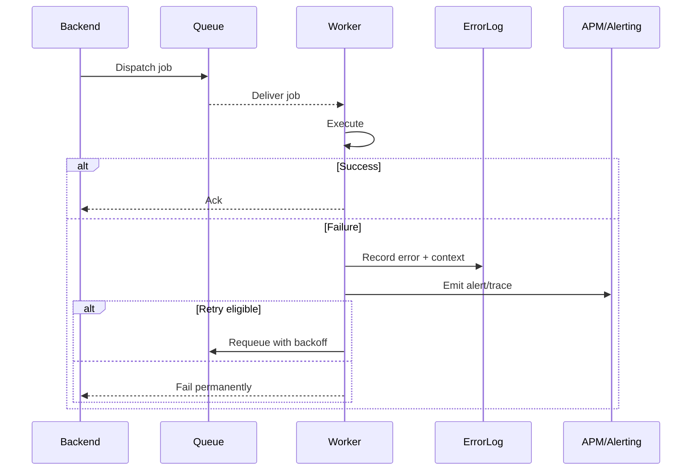

# SEQ-014: Error Reporting and Retry

## Umamusume Pretty Derby Career Planner

**Document Version**: 1.0  
**Date**: January 14, 2026  
**Related Documents**: [PRD-001], [SPEC-014]
**Source Specs**:

- `.kiro/specs/umamusume-career-planner-main/requirements.md` (Error Handling Requirements)
- `.kiro/specs/umamusume-career-planner-main/design.md` (Error Reporting System)

**Related Artifacts**:

- PRD: [PRD-007](../prds/PRD-007_External_Integration.md)
- SPEC: [SPEC-007](../specs/SPEC-007_External_Integration_Technical.md)

---

## Sequence Overview

- Captures backend errors, reports, and retries transient jobs with backoff.

## Sequence Diagram

