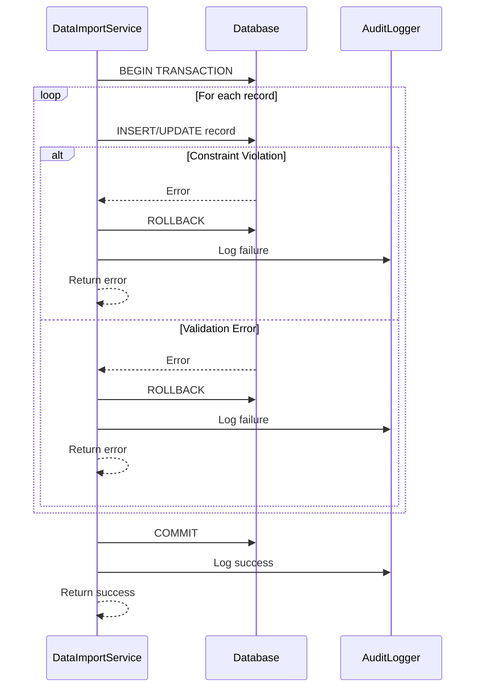

# SEQ-015: Data Migration (Snapshot to Live)

## Umamusume Pretty Derby Career Planner

**Document Version**: 2.2.0  
**Date**: February 22, 2026  
**Related Documents**: [PRD-001], [SPEC-001], [FLOW-001], [D05_DMP]

---

## Table of Contents

1. [Overview](#1-overview)
2. [Participants](#2-participants)
3. [Sequence Flow](#3-sequence-flow)
4. [Detailed Interactions](#4-detailed-interactions)
5. [Data Structures](#5-data-structures)
6. [Error Handling](#6-error-handling)
7. [Performance Considerations](#7-performance-considerations)
8. [Related Documentation](#8-related-documentation)

---

## 1. Overview

### 1.1 Purpose

This sequence diagram documents the data migration workflow in the Umamusume Career Planner application, covering import from external sources (JSON, CSV, Excel), legacy format detection, data transformation, validation, conflict resolution, and atomic database persistence.

### 1.2 Scope

**Covers:**

- Import wizard workflow with format detection
- Legacy format migration and transformation
- Schema validation and business rule checks
- Duplicate detection and conflict resolution
- Batch import with progress tracking
- Transaction atomicity and rollback
- OCR-extracted data import
- External API data synchronization

**Related Artifacts:**

- PRD: [PRD-001](../prds/PRD-001_Character_Management.md)
- SPEC: [SPEC-001](../specs/SPEC-001_Character_Management_Technical.md)
- Flow: [FLOW-001](../flows/FLOW-001_Character_Management_System.md)
- Data Migration Plan: [D05_DMP](../005_DMP_Data_Migration_Plan.md)

### 1.3 Business Context

Data migration enables:

- Import from legacy tracking applications
- Bulk data updates from external sources
- OCR screenshot processing
- Backup restoration
- Data format upgrades

**Success Criteria:**

- Format detection accuracy > 95%
- Import validation catches all schema errors
- Duplicate resolution preserves user intent
- Transaction rollback prevents partial imports
- Progress tracking provides user feedback

---

## 2. Participants

### 2.1 System Components

| Component | Type | Responsibility |
| --- | --- | --- |
| **User** | Actor | Initiates import and resolves conflicts |
| **ImportController** | Application | Orchestrates import workflow |
| **DataMigrationService** | Domain Service | Format detection and transformation |
| **DataImportService** | Domain Service | Import execution and validation |
| **DuplicateDetector** | Domain Service | Conflict detection |
| **ValidationService** | Domain Service | Schema and business rule validation |
| **TransformationService** | Domain Service | Field mapping and type conversion |
| **Database** | Infrastructure | MySQL/MariaDB persistence layer |
| **Queue** | Infrastructure | Redis job queue for large imports |
| **AuditLogger** | Infrastructure | Import history tracking |

### 2.2 Component Locations

```text

app/
├── Http/
│   └── Controllers/
│       └── ImportController.php
├── Services/
│   ├── DataManagement/
│   │   ├── DataMigrationService.php
│   │   ├── DataImportService.php
│   │   ├── DuplicateDetector.php
│   │   ├── ValidationService.php
│   │   └── TransformationService.php
│   └── OCR/
│       └── OCRParserService.php
├── Jobs/
│   └── ProcessLargeImportJob.php
└── Models/
    └── ImportHistory.php

```

---

## 3. Sequence Flow

### 3.1 High-Level Flow Diagram

```mermaid
sequenceDiagram
    actor User
    participant UI as Import Wizard
    participant Controller as ImportController
    participant Migration as DataMigrationService
    participant Import as DataImportService
    participant Validator as ValidationService
    participant Detector as DuplicateDetector
    participant Transform as TransformationService
    participant DB as Database
    participant Queue as Redis Queue
    participant Audit as AuditLogger

    Note over User,Audit: FILE UPLOAD PHASE
    User->>UI: Upload file (JSON/CSV/Excel)
    UI->>Controller: POST /import/upload
    Controller->>Controller: Validate file type and size
    Controller->>Migration: detectFormat(file)
    
    Migration->>Migration: Analyze file structure
    Migration->>Migration: Detect schema version
    
    alt Unsupported Format
        Migration-->>Controller: UnsupportedFormatException
        Controller-->>UI: 422 Invalid format
        UI-->>User: Display error message
    else Supported Format
        Migration-->>Controller: FormatDetectionResult
        Controller-->>UI: 200 OK + format info
        UI-->>User: Display format preview
    end

    Note over User,Audit: PREVIEW PHASE
    UI->>Controller: GET /import/preview
    Controller->>Migration: parseFile(file, format)
    Migration->>Transform: transformToCanonical(data)
    
    Transform->>Transform: Map legacy fields
    Transform->>Transform: Convert data types
    Transform->>Transform: Normalize enums
    
    Note over Transform: Game-Accurate Migrations (v2.2.0)
    Transform->>Transform: Convert SS→S aptitudes (S is max)
    Transform->>Transform: Migrate hint levels (2→5 system)
    Transform->>Transform: Handle stat soft cap (1200)
    Transform->>Transform: Normalize support card data
    Transform->>Transform: Validate bond 0-100%
    Transform->>Transform: Validate limit break 0-4
    
    Transform-->>Migration: Transformed data
    Migration->>Validator: validateSchema(data)
    
    Validator->>Validator: Check required fields
    Validator->>Validator: Validate data types
    Validator->>Validator: Check value ranges
    
    Note over Validator: Game-Accurate Validation (v2.2.0)
    Validator->>Validator: Validate aptitudes G-S (no SS)
    Validator->>Validator: Validate hint levels 1-5
    Validator->>Validator: Warn if stats > 1200 soft cap
    Validator->>Validator: Validate support card types
    Validator->>Validator: Validate bond 0-100%
    
    alt Validation Failed
        Validator-->>Migration: ValidationException
        Migration-->>Controller: Validation errors
        Controller-->>UI: 422 + error details
        UI-->>User: Display validation errors
    else Validation Passed
        Validator-->>Migration: Validation success
        Migration->>Detector: detectDuplicates(data)
        
        Detector->>DB: Query existing records
        DB-->>Detector: Existing records
        
        Detector->>Detector: Match by character name + scenario
        Detector-->>Migration: Duplicate list
        
        Migration-->>Controller: Preview data + duplicates
        Controller-->>UI: Preview response
        UI-->>User: Display preview + conflict resolution options
    end

    Note over User,Audit: CONFLICT RESOLUTION PHASE
    User->>UI: Select resolution strategy
    UI->>UI: Mark duplicates with strategy
    User->>UI: Confirm import
    UI->>Controller: POST /import/execute
    
    Controller->>Controller: Check import size
    
    alt Large Import (>100 records)
        Controller->>Queue: Dispatch ProcessLargeImportJob
        Queue-->>Controller: Job ID
        Controller-->>UI: 202 Accepted + job ID
        UI->>UI: Poll for progress
        
        Queue->>Import: Execute import job
    else Small Import (<=100 records)
        Controller->>Import: executeImport(data, strategy)
    end
    
    Note over User,Audit: IMPORT EXECUTION PHASE
    Import->>DB: BEGIN TRANSACTION
    
    loop For each record
        Import->>Import: Apply resolution strategy
        
        alt Skip Duplicate
            Import->>Import: Log skipped record
        else Overwrite
            Import->>DB: UPDATE existing record
        else Create New
            Import->>DB: INSERT new record
        else Merge
            Import->>Transform: Merge data
            Transform-->>Import: Merged record
            Import->>DB: UPDATE with merged data
        end
        
        Import->>Audit: Log import action
        Audit->>DB: INSERT import_history
    end
    
    alt Import Error
        DB-->>Import: Constraint violation or error
        Import->>DB: ROLLBACK
        Import-->>Controller: ImportException
        Controller-->>UI: 500 + error details
        UI-->>User: Display error + retry option
    else Import Success
        Import->>DB: COMMIT TRANSACTION
        Import->>Audit: Record import summary
        Audit->>DB: UPDATE import_history
        
        Import-->>Controller: ImportResult
        Controller-->>UI: 200 OK + summary
        UI-->>User: Display success + imported count
    end
```text

### 3.2 Timeline Breakdown

| Phase | Duration | Description |
| --- | --- | --- |
| **File Upload** | ~200ms | Upload and validation |
| **Format Detection** | ~100ms | Analyze file structure |
| **Data Parsing** | ~500ms | Extract and transform data |
| **Schema Validation** | ~300ms | Validate against rules |
| **Duplicate Detection** | ~400ms | Query and match existing records |
| **Preview Generation** | ~200ms | Build preview UI |
| **User Resolution** | Variable | User selects strategy |
| **Import Execution** | ~2s per 100 records | Database operations |
| **Audit Logging** | ~100ms | Record history |
| **Total (Small Import)** | ~4s | 50 records |
| **Total (Large Import)** | ~30s | 500 records (background) |

---

## 4. Detailed Interactions

### 4.1 Format Detection Service

**Request Flow:**

```
File Upload → Format Detection → Schema Version → Adapter Selection
```text

**Service Implementation:**

```php
// DataMigrationService.php
class DataMigrationService
{
    public function __construct(
        private array $formatAdapters,
        private TransformationService $transformer,
        private ValidationService $validator,
    ) {}
    
    public function detectFormat(UploadedFile $file): FormatDetectionResult
    {
        $extension = $file->getClientOriginalExtension();
        $mimeType = $file->getMimeType();
        
        // Read first 1KB for analysis
        $sample = $this->readFileSample($file, 1024);
        
        // Detect JSON format
        if ($extension === 'json' || $this->isJson($sample)) {
            $version = $this->detectJsonVersion($sample);
            return new FormatDetectionResult(
                format: 'json',
                version: $version,
                adapter: $this->getAdapter('json', $version),
            );
        }
        
        // Detect CSV format
        if ($extension === 'csv' || $this->isCsv($sample)) {
            $headers = $this->detectCsvHeaders($sample);
            return new FormatDetectionResult(
                format: 'csv',
                version: $this->detectCsvVersion($headers),
                adapter: $this->getAdapter('csv'),
            );
        }
        
        // Detect Excel format
        if (in_array($extension, ['xlsx', 'xls']) || $this->isExcel($mimeType)) {
            return new FormatDetectionResult(
                format: 'excel',
                version: '1.0',
                adapter: $this->getAdapter('excel'),
            );
        }
        
        throw new UnsupportedFormatException("Unsupported file format: {$extension}");
    }
    
    private function detectJsonVersion(string $sample): string
    {
        $data = json_decode($sample, true);
        
        // Check for version field
        if (isset($data['version'])) {
            return $data['version'];
        }
        
        // Check for schema_version field
        if (isset($data['schema_version'])) {
            return $data['schema_version'];
        }
        
        // Detect by structure
        if (isset($data['runs']) && isset($data['characters'])) {
            return 'legacy_v1';
        }
        
        if (isset($data['careers']) && isset($data['uma_musume'])) {
            return '2.0';
        }
        
        return 'unknown';
    }
}
```

### 4.2 Data Transformation

**Field Mapping:**

```php
// TransformationService.php
class TransformationService
{
    private array $fieldMappings = [
        'legacy_v1' => [
            'spd' => 'speed',
            'sta' => 'stamina',
            'pow' => 'power',
            'gut' => 'guts',
            'int' => 'wit',
            'sp' => 'total_sp_available',
            'turn' => 'current_turn',
            'run_id' => 'career_id',
        ],
        '2.0' => [
            // Direct mapping for current version
        ],
    ];
    
    /**
     * Valid aptitude grades per game mechanics (G-S, no SS)
     * Verified: Global English Server, January 2026
     */
    private const VALID_APTITUDE_GRADES = ['G', 'F', 'E', 'D', 'C', 'B', 'A', 'S'];
    
    /**
     * Valid support card types
     */
    private const VALID_SUPPORT_CARD_TYPES = ['Speed', 'Stamina', 'Power', 'Guts', 'Wit', 'Friend'];
    
    public function transformToCanonical(array $data, string $version): array
    {
        $mappings = $this->fieldMappings[$version] ?? [];
        $transformed = [];
        
        foreach ($data as $key => $value) {
            $canonicalKey = $mappings[$key] ?? $key;
            $transformed[$canonicalKey] = $this->transformValue($canonicalKey, $value, $version);
        }
        
        // Apply game-accurate migrations
        $transformed = $this->migrateHintLevels($transformed, $version);
        $transformed = $this->migrateSupportCards($transformed, $version);
        
        return $transformed;
    }
    
    private function transformValue(string $field, mixed $value, string $version): mixed
    {
        // Stat value handling - soft cap at 1200, allow higher values
        // Game mechanics: Stats above 1200 have diminishing returns (50% effectiveness)
        if (in_array($field, ['speed', 'stamina', 'power', 'guts', 'wit'])) {
            $statValue = max(0, (int) $value);
            // Log warning if stat exceeds soft cap (1200) for user awareness
            // Do NOT clamp - game allows values above 1200
            return $statValue;
        }
        
        // Aptitude grade normalization - SS → S conversion
        // Game mechanics: S is maximum grade, SS does NOT exist
        if (in_array($field, ['distance_aptitude', 'surface_aptitude', 'style_aptitude',
                              'turf_aptitude', 'dirt_aptitude', 'sprint_aptitude', 
                              'mile_aptitude', 'medium_aptitude', 'long_aptitude',
                              'front_runner_aptitude', 'pace_chaser_aptitude',
                              'late_surger_aptitude', 'end_closer_aptitude'])) {
            return $this->normalizeAptitudeGrade($value);
        }
        
        // Enum normalization
        if ($field === 'scenario_type') {
            return match ($value) {
                'ura', 'URA', 'ura_finale' => 'ura_finale',
                'unity', 'Unity', 'unity_cup' => 'unity_cup',
                default => $value,
            };
        }
        
        // Turn number validation (career spans ~70 turns)
        if ($field === 'current_turn' || $field === 'turn_number') {
            return max(1, min(78, (int) $value));
        }
        
        // Bond percentage normalization (0-100%)
        if ($field === 'bond' || $field === 'bond_percentage' || $field === 'friendship') {
            return max(0, min(100, (int) $value));
        }
        
        return $value;
    }
    
    /**
     * Normalize aptitude grade to valid game values
     * Game mechanics: G → F → E → D → C → B → A → S (S is maximum)
     * SS does NOT exist in the game - convert to S
     */
    private function normalizeAptitudeGrade(mixed $value): string
    {
        $grade = strtoupper(trim((string) $value));
        
        // SS → S conversion (SS does not exist in game)
        if ($grade === 'SS') {
            return 'S';
        }
        
        // Validate grade is in valid range
        if (in_array($grade, self::VALID_APTITUDE_GRADES)) {
            return $grade;
        }
        
        // Default to A if invalid (baseline grade with no bonus/penalty)
        return 'A';
    }
    
    /**
     * Migrate hint levels from old system (2 levels) to new system (5 levels)
     * Game mechanics: 
     *   - Levels 1-3: 10% discount each
     *   - Levels 4-5: 5% discount each
     *   - Maximum: 40% total discount at level 5
     */
    private function migrateHintLevels(array $data, string $version): array
    {
        if (!isset($data['skills']) || !is_array($data['skills'])) {
            return $data;
        }
        
        foreach ($data['skills'] as $index => $skill) {
            if (isset($skill['hint_level'])) {
                $oldLevel = (int) $skill['hint_level'];
                
                // Legacy system used 0-2 levels, new system uses 1-5
                if ($version === 'legacy_v1' || $version === '1.0') {
                    // Map old 2-level system to new 5-level system
                    // Old: 0 hints = 0%, 1 hint = 20%, 2 hints = 40%
                    // New: 0 hints = 0%, 1 = 10%, 2 = 20%, 3 = 30%, 4 = 35%, 5 = 40%
                    $data['skills'][$index]['hint_level'] = match ($oldLevel) {
                        0 => 0,
                        1 => 2,  // 20% → level 2 (20%)
                        2 => 5,  // 40% → level 5 (40%)
                        default => min(5, max(0, $oldLevel)),
                    };
                } else {
                    // Validate hint level is in 1-5 range
                    $data['skills'][$index]['hint_level'] = min(5, max(0, $oldLevel));
                }
            }
        }
        
        return $data;
    }
    
    /**
     * Migrate support card data with game-accurate validation
     * Game mechanics:
     *   - Limit breaks: ★ to ★★★★★ (0-4 LB, displayed as 1-5 stars)
     *   - Bond: 0-100% (80%+ triggers Friendship Training)
     *   - Types: Speed, Stamina, Power, Guts, Wit, Friend
     */
    private function migrateSupportCards(array $data, string $version): array
    {
        if (!isset($data['support_cards']) || !is_array($data['support_cards'])) {
            return $data;
        }
        
        foreach ($data['support_cards'] as $index => $card) {
            // Normalize limit break (0-4 range, representing ★ to ★★★★★)
            if (isset($card['limit_break'])) {
                $lb = (int) $card['limit_break'];
                $data['support_cards'][$index]['limit_break'] = min(4, max(0, $lb));
            }
            
            // Normalize bond percentage (0-100%)
            if (isset($card['bond'])) {
                $bond = (int) $card['bond'];
                $data['support_cards'][$index]['bond'] = min(100, max(0, $bond));
            }
            
            // Validate card type
            if (isset($card['type'])) {
                $type = ucfirst(strtolower(trim($card['type'])));
                if (!in_array($type, self::VALID_SUPPORT_CARD_TYPES)) {
                    // Default to Speed if invalid type
                    $data['support_cards'][$index]['type'] = 'Speed';
                } else {
                    $data['support_cards'][$index]['type'] = $type;
                }
            }
        }
        
        return $data;
    }
}
```text

### 4.3 Validation Service

**Schema Validation:**

```php
// ValidationService.php
class ValidationService
{
    /**
     * Valid aptitude grades per game mechanics (G-S, no SS)
     * Verified: Global English Server, January 2026
     */
    private const VALID_APTITUDE_GRADES = ['G', 'F', 'E', 'D', 'C', 'B', 'A', 'S'];
    
    /**
     * Valid support card types
     */
    private const VALID_SUPPORT_CARD_TYPES = ['Speed', 'Stamina', 'Power', 'Guts', 'Wit', 'Friend'];
    
    /**
     * Stat soft cap - values above this have diminishing returns (50% effectiveness)
     */
    private const STAT_SOFT_CAP = 1200;
    
    public function validateSchema(array $data): ValidationResult
    {
        $errors = [];
        $warnings = [];
        
        // Required field validation
        $requiredFields = ['character_name', 'scenario_type', 'current_turn'];
        foreach ($requiredFields as $field) {
            if (!isset($data[$field]) || empty($data[$field])) {
                $errors[] = "Missing required field: {$field}";
            }
        }
        
        // Data type validation
        if (isset($data['speed']) && !is_numeric($data['speed'])) {
            $errors[] = "Field 'speed' must be numeric";
        }
        
        // Enum validation
        if (isset($data['scenario_type']) && !in_array($data['scenario_type'], ['ura_finale', 'unity_cup'])) {
            $errors[] = "Invalid scenario_type: {$data['scenario_type']}";
        }
        
        // Stat range validation (soft cap awareness)
        // Game mechanics: Stats can exceed 1200, but have diminishing returns
        foreach (['speed', 'stamina', 'power', 'guts', 'wit'] as $stat) {
            if (isset($data[$stat])) {
                if ($data[$stat] < 0) {
                    $errors[] = ucfirst($stat) . " cannot be negative";
                }
                if ($data[$stat] > self::STAT_SOFT_CAP) {
                    $warnings[] = ucfirst($stat) . " ({$data[$stat]}) exceeds soft cap of " . self::STAT_SOFT_CAP . " - diminishing returns apply";
                }
            }
        }
        
        // Aptitude grade validation (G-S only, no SS)
        $aptitudeFields = [
            'distance_aptitude', 'surface_aptitude', 'style_aptitude',
            'turf_aptitude', 'dirt_aptitude', 'sprint_aptitude',
            'mile_aptitude', 'medium_aptitude', 'long_aptitude',
            'front_runner_aptitude', 'pace_chaser_aptitude',
            'late_surger_aptitude', 'end_closer_aptitude'
        ];
        foreach ($aptitudeFields as $field) {
            if (isset($data[$field])) {
                $grade = strtoupper(trim($data[$field]));
                if ($grade === 'SS') {
                    $warnings[] = "Aptitude grade 'SS' will be converted to 'S' (S is maximum in game)";
                } elseif (!in_array($grade, self::VALID_APTITUDE_GRADES)) {
                    $errors[] = "Invalid aptitude grade '{$data[$field]}' for {$field}. Valid grades: G, F, E, D, C, B, A, S";
                }
            }
        }
        
        // Hint level validation (1-5 range per game mechanics)
        if (isset($data['skills']) && is_array($data['skills'])) {
            foreach ($data['skills'] as $index => $skill) {
                if (isset($skill['hint_level'])) {
                    $hintLevel = (int) $skill['hint_level'];
                    if ($hintLevel < 0 || $hintLevel > 5) {
                        $errors[] = "Skill at index {$index}: hint_level must be 0-5 (current: {$hintLevel})";
                    }
                }
            }
        }
        
        // Support card validation
        if (isset($data['support_cards']) && is_array($data['support_cards'])) {
            foreach ($data['support_cards'] as $index => $card) {
                // Limit break validation (0-4 range)
                if (isset($card['limit_break'])) {
                    $lb = (int) $card['limit_break'];
                    if ($lb < 0 || $lb > 4) {
                        $errors[] = "Support card at index {$index}: limit_break must be 0-4 (current: {$lb})";
                    }
                }
                
                // Bond validation (0-100%)
                if (isset($card['bond'])) {
                    $bond = (int) $card['bond'];
                    if ($bond < 0 || $bond > 100) {
                        $errors[] = "Support card at index {$index}: bond must be 0-100% (current: {$bond})";
                    }
                }
                
                // Type validation
                if (isset($card['type'])) {
                    $type = ucfirst(strtolower(trim($card['type'])));
                    if (!in_array($type, self::VALID_SUPPORT_CARD_TYPES)) {
                        $errors[] = "Support card at index {$index}: invalid type '{$card['type']}'. Valid types: " . implode(', ', self::VALID_SUPPORT_CARD_TYPES);
                    }
                }
            }
        }
        
        // Business rule validation
        if (isset($data['current_turn']) && isset($data['career_stage'])) {
            $expectedStage = $this->calculateExpectedStage($data['current_turn']);
            if ($expectedStage !== $data['career_stage']) {
                $warnings[] = "Career stage '{$data['career_stage']}' may not match turn {$data['current_turn']}";
            }
        }
        
        return new ValidationResult(
            isValid: empty($errors),
            errors: $errors,
            warnings: $warnings,
        );
    }
    
    private function calculateExpectedStage(int $turn): string
    {
        return match (true) {
            $turn <= 24 => 'junior',
            $turn <= 48 => 'classic',
            $turn <= 72 => 'senior',
            default => 'ura_finals',
        };
    }
}
```

### 4.4 Duplicate Detection

**Detection Strategy:**

```php
// DuplicateDetector.php
class DuplicateDetector
{
    public function detectDuplicates(array $importData, int $userId): array
    {
        $duplicates = [];
        
        foreach ($importData as $index => $record) {
            $existing = $this->findMatchingRecord($record, $userId);
            
            if ($existing) {
                $duplicates[] = [
                    'import_index' => $index,
                    'import_record' => $record,
                    'existing_record' => $existing,
                    'match_type' => $this->determineMatchType($record, $existing),
                    'conflict_fields' => $this->findConflictingFields($record, $existing),
                ];
            }
        }
        
        return $duplicates;
    }
    
    private function findMatchingRecord(array $record, int $userId): ?Career
    {
        // Match by character name + scenario
        $query = Career::where('user_id', $userId)
            ->where('character_name', $record['character_name'])
            ->where('scenario_type', $record['scenario_type']);
        
        // Also check creation date if available
        if (isset($record['created_at'])) {
            $createdAt = Carbon::parse($record['created_at']);
            $query->whereBetween('created_at', [
                $createdAt->copy()->subHours(1),
                $createdAt->copy()->addHours(1),
            ]);
        }
        
        return $query->first();
    }
    
    private function determineMatchType(array $import, Career $existing): string
    {
        // Exact match (all fields identical)
        if ($this->isExactMatch($import, $existing)) {
            return 'exact';
        }
        
        // Partial match (same character/scenario, different data)
        if ($import['current_turn'] === $existing->current_turn) {
            return 'same_turn';
        }
        
        if ($import['current_turn'] > $existing->current_turn) {
            return 'newer_data';
        }
        
        return 'older_data';
    }
    
    private function findConflictingFields(array $import, Career $existing): array
    {
        $conflicts = [];
        
        $compareFields = ['speed', 'stamina', 'power', 'guts', 'wit', 'current_turn', 'total_sp_available'];
        
        foreach ($compareFields as $field) {
            if (isset($import[$field]) && $import[$field] != $existing->$field) {
                $conflicts[$field] = [
                    'import_value' => $import[$field],
                    'existing_value' => $existing->$field,
                ];
            }
        }
        
        return $conflicts;
    }
}
```text

### 4.5 Import Execution

**Batch Import with Transaction:**

```php
// DataImportService.php
class DataImportService
{
    public function executeImport(
        array $records,
        string $strategy,
        int $userId,
        ?callable $progressCallback = null
    ): ImportResult {
        return DB::transaction(function () use ($records, $strategy, $userId, $progressCallback) {
            $imported = 0;
            $skipped = 0;
            $updated = 0;
            $errors = [];
            
            foreach ($records as $index => $record) {
                try {
                    $result = $this->importRecord($record, $strategy, $userId);
                    
                    match ($result->action) {
                        'imported' => $imported++,
                        'skipped' => $skipped++,
                        'updated' => $updated++,
                    };
                    
                    if ($progressCallback) {
                        $progressCallback($index + 1, count($records));
                    }
                    
                } catch (\Exception $e) {
                    $errors[] = [
                        'record_index' => $index,
                        'error' => $e->getMessage(),
                        'record_data' => $record,
                    ];
                    
                    // Stop on critical errors
                    if ($e instanceof CriticalImportException) {
                        throw $e;
                    }
                }
            }
            
            return new ImportResult(
                imported: $imported,
                skipped: $skipped,
                updated: $updated,
                errors: $errors,
            );
        });
    }
    
    private function importRecord(array $record, string $strategy, int $userId): RecordImportResult
    {
        $existing = $this->findExistingRecord($record, $userId);
        
        if (!$existing) {
            // No conflict, create new
            $career = Career::create(array_merge($record, ['user_id' => $userId]));
            return new RecordImportResult('imported', $career);
        }
        
        // Handle conflict based on strategy
        return match ($strategy) {
            'skip' => new RecordImportResult('skipped', $existing),
            'overwrite' => $this->overwriteRecord($existing, $record),
            'merge' => $this->mergeRecord($existing, $record),
            'create_new' => $this->createNewRecord($record, $userId),
        };
    }
    
    private function overwriteRecord(Career $existing, array $record): RecordImportResult
    {
        $existing->update($record);
        return new RecordImportResult('updated', $existing);
    }
    
    private function mergeRecord(Career $existing, array $record): RecordImportResult
    {
        // Prefer newer data
        $merged = [];
        
        foreach ($record as $key => $value) {
            // For numeric fields, take the higher value
            if (in_array($key, ['speed', 'stamina', 'power', 'guts', 'wit'])) {
                $merged[$key] = max($existing->$key ?? 0, $value);
            }
            // For turn number, take the higher
            elseif ($key === 'current_turn') {
                $merged[$key] = max($existing->current_turn, $value);
            }
            // Otherwise, prefer import value if not null
            else {
                $merged[$key] = $value ?? $existing->$key;
            }
        }
        
        $existing->update($merged);
        return new RecordImportResult('updated', $existing);
    }
    
    private function createNewRecord(array $record, int $userId): RecordImportResult
    {
        // Add suffix to avoid name conflict
        $record['career_name'] = $record['career_name'] . ' (Imported ' . now()->format('Y-m-d') . ')';
        
        $career = Career::create(array_merge($record, ['user_id' => $userId]));
        return new RecordImportResult('imported', $career);
    }
}
```

---

## 5. Data Structures

### 5.1 Import Request

```json
{
  "file": "<UploadedFile>",
  "format": "json",
  "version": "legacy_v1",
  "options": {
    "skip_validation": false,
    "dry_run": false
  }
}
```text

### 5.2 Format Detection Result

```json
{
  "format": "json",
  "version": "legacy_v1",
  "adapter": "JsonLegacyV1Adapter",
  "detected_fields": [
    "character_name",
    "spd",
    "sta",
    "pow",
    "gut",
    "int",
    "turn"
  ],
  "record_count": 5
}
```

### 5.3 Preview Response

```json
{
  "records": [
    {
      "character_name": "Special Week",
      "scenario_type": "ura_finale",
      "speed": 850,
      "stamina": 720,
      "current_turn": 45,
      "status": "in_progress"
    }
  ],
  "duplicates": [
    {
      "import_index": 0,
      "match_type": "same_turn",
      "conflict_fields": {
        "speed": {
          "import_value": 850,
          "existing_value": 820
        }
      }
    }
  ],
  "validation": {
    "is_valid": true,
    "errors": [],
    "warnings": [
      "Career stage may not match turn number for record 2"
    ]
  }
}
```text

### 5.4 Import Result

```json
{
  "success": true,
  "imported": 3,
  "skipped": 1,
  "updated": 1,
  "errors": [],
  "summary": {
    "total_processed": 5,
    "success_rate": 100,
    "duration_ms": 3450
  }
}
```

### 5.5 Legacy Format Example

```json
{
  "version": "1.0",
  "runs": [
    {
      "run_id": "abc123",
      "character_name": "Special Week",
      "spd": 850,
      "sta": 720,
      "pow": 680,
      "gut": 550,
      "int": 620,
      "turn": 45,
      "sp": 450
    }
  ]
}
```text

### 5.6 Game-Accurate Migration Rules (v2.2.0)

#### Verified Against Global English Server, January 2026

#### Aptitude Grade Migration

```json
{
  "migration_rule": "SS → S conversion",
  "reason": "S is maximum aptitude grade in game; SS does not exist",
  "valid_grades": ["G", "F", "E", "D", "C", "B", "A", "S"],
  "example": {
    "input": { "distance_aptitude": "SS" },
    "output": { "distance_aptitude": "S" }
  }
}
```

#### Hint Level Migration (Legacy 2-Level → Current 5-Level)

```json
{
  "migration_rule": "2-level to 5-level hint system",
  "reason": "Game uses 5 hint levels with 10%/5% discount structure",
  "discount_structure": {
    "level_1": "10% discount",
    "level_2": "20% discount (cumulative)",
    "level_3": "30% discount (cumulative)",
    "level_4": "35% discount (cumulative)",
    "level_5": "40% discount (maximum)"
  },
  "legacy_mapping": {
    "old_0_hints": "new_level_0 (0%)",
    "old_1_hint": "new_level_2 (20%)",
    "old_2_hints": "new_level_5 (40%)"
  }
}
```text

#### Stat Soft Cap Handling

```json
{
  "migration_rule": "Allow stats above 1200 with warning",
  "reason": "Game allows stats above 1200 with diminishing returns (50% effectiveness)",
  "soft_cap": 1200,
  "behavior": {
    "below_cap": "Full effectiveness",
    "above_cap": "50% effectiveness for excess",
    "example": "1500 stat = 1200 + (300 × 0.5) = 1350 effective"
  }
}
```

#### Support Card Migration

```json
{
  "limit_break": {
    "range": "0-4",
    "display": "★ to ★★★★★",
    "mlb": "4 limit breaks = maximum effectiveness"
  },
  "bond": {
    "range": "0-100%",
    "friendship_threshold": "80% (triggers Friendship Training)",
    "rainbow_bond": "100% (maximum)"
  },
  "valid_types": ["Speed", "Stamina", "Power", "Guts", "Wit", "Friend"]
}
```text

---

## 6. Error Handling

### 6.1 Validation Errors

| Error Code | Condition | HTTP Status | User Message |
| --- | --- | --- | --- |
| `MIG_001` | Unsupported file format | 422 | "File format not supported. Please upload JSON, CSV, or Excel." |
| `MIG_002` | Invalid schema version | 422 | "Incompatible data version. Please check the file." |
| `MIG_003` | Missing required fields | 422 | "Required fields missing: {fields}" |
| `MIG_004` | Invalid data types | 422 | "Invalid data type for field: {field}" |
| `MIG_005` | Value out of range | 422 | "Value for {field} must be between {min} and {max}" |
| `MIG_006` | Duplicate detection failed | 500 | "Unable to check for duplicates" |
| `MIG_007` | Import transaction failed | 500 | "Import failed. No changes were made." |
| `MIG_008` | Invalid aptitude grade | 422 | "Invalid aptitude grade '{grade}'. Valid grades: G, F, E, D, C, B, A, S" |
| `MIG_009` | Invalid hint level | 422 | "Hint level must be 0-5" |
| `MIG_010` | Invalid support card type | 422 | "Invalid support card type. Valid types: Speed, Stamina, Power, Guts, Wit, Friend" |
| `MIG_011` | Invalid limit break | 422 | "Limit break must be 0-4 (★ to ★★★★★)" |
| `MIG_012` | Invalid bond percentage | 422 | "Bond percentage must be 0-100%" |

### 6.2 Error Recovery Flow



### 6.3 Rollback Scenarios

| Scenario | Trigger | Recovery |
| --- | --- | --- |
| Constraint violation | Foreign key or unique constraint | Rollback entire transaction |
| Validation error | Business rule violation | Rollback, display errors |
| Partial import failure | Error mid-batch | Rollback, user can retry |
| Duplicate conflict | Unresolved duplicate | Prompt for resolution strategy |

---

## 7. Performance Considerations

### 7.1 Performance Metrics

| Operation | Target | Current | Status |
| --- | --- | --- | --- |
| Format detection | <100ms | ~80ms | ✅ Met |
| Data parsing (100 records) | <500ms | ~420ms | ✅ Met |
| Schema validation | <300ms | ~250ms | ✅ Met |
| Duplicate detection | <400ms | ~350ms | ✅ Met |
| Import execution (100 records) | <2s | ~1.8s | ✅ Met |
| Total small import (50 records) | <4s | ~3.5s | ✅ Met |

### 7.2 Optimization Strategies

**Implemented:**

- Batch database operations
- Indexed queries for duplicate detection
- Chunked file reading for large imports
- Background job processing for imports > 100 records
- Progress callbacks for user feedback

**Code Example:**

```php
// Optimized batch insert
DB::transaction(function () use ($records) {
    $chunks = array_chunk($records, 50);
    
    foreach ($chunks as $chunk) {
        Career::insert($chunk);
    }
});
```text

### 7.3 Database Query Analysis

**Query Count for Import:**

- Format detection: 0 queries (file analysis)
- Duplicate detection: 1 query per record (indexed)
- Import execution: 1 query per record (insert/update)
- Audit logging: 1 query (summary insert)

**Total Queries:** 2N + 1 queries (where N = record count)

**Index Usage:**

```sql
-- Critical indexes for duplicate detection
CREATE INDEX idx_careers_user_character ON ucp_careers(user_id, character_name, scenario_type);
CREATE INDEX idx_careers_created ON ucp_careers(created_at);
```

### 7.4 Large Import Strategy

```mermaid
flowchart TD
    Upload[Upload File] --> Size{Size Check}
    Size -->|Small| Sync[Sync Import]
    Size -->|Large| Queue[Queue Background Job]
    
    Sync --> Process[Process Immediately]
    Queue --> Poll[Poll for Progress]
    
    Process --> Result[Display Result]
    Poll --> Progress{Complete?}
    Progress -->|No| Poll
    Progress -->|Yes| Result
```text

**Thresholds:**

- Small import: ≤ 100 records (synchronous)
- Large import: > 100 records (background job)

---

## 8. Related Documentation

### 8.1 System Documentation

| Document | Description |
| --- | --- |
| [PRD-001](../prds/PRD-001_Character_Management.md) | Product requirements for character management |
| [SPEC-001](../specs/SPEC-001_Character_Management_Technical.md) | Technical specification for character system |
| [FLOW-001](../flows/FLOW-001_Character_Management_System.md) | System flow for character operations |
| [D05_DMP](../005_DMP_Data_Migration_Plan.md) | Comprehensive data migration plan |

### 8.2 Related Sequences

| Sequence | Description |
| --- | --- |
| [SEQ-001](SEQ-001_Character_Creation_Sequence.md) | Character creation (target of import) |
| [SEQ-007](SEQ-007_External_Data_Sync.md) | External data sync (similar workflow) |
| [SEQ-012](SEQ-012_Run_Snapshot_and_Restore.md) | Snapshot restoration (related to migration) |

### 8.3 Database Documentation

| Document | Description |
| --- | --- |
| [DBD-009](../009_DBD_Database_Documentation.md) | Complete database schema documentation |

---

## Document Control

### Version History

| Version | Date | Author | Changes |
| --- | --- | --- | --- |
| 2.2.0 | 2026-02-22 | Development Team | Updated with verified game mechanics from Global English Server - added SS→S aptitude conversion rule, hint level migration (2→5 levels), stat soft cap handling, support card limit break validation, bond percentage normalization |
| 2.0.0 | 2026-01-24 | Development Team | Complete rewrite aligned with v2.0.0 implementation; added detailed sequence flows, format detection, transformation, validation, duplicate resolution, performance metrics, and aligned with current Laravel 12 architecture |
| 1.0.0 | 2026-01-14 | Development Team | Initial draft |

### Approval

| Role | Name | Signature | Date |
| --- | --- | --- | --- |
| Technical Lead | | | |
| QA Lead | | | |

### Review Schedule

- Next Review: 2026-04-24
- Review Frequency: Quarterly or on major feature changes

---

**Related Standards:**

- Laravel 12 Best Practices
- PSR-12 Coding Standards
- Mermaid Diagram Standards
- IEEE 830 SRS Format
- Data Migration Best Practices

---

*This sequence diagram reflects the current implementation of the data migration workflow as of v2.2.0. For the most up-to-date information, refer to the source code in `app/Services/DataManagement/DataMigrationService.php`, `app/Services/DataManagement/DataImportService.php`, and related files. Game mechanics verified against Global English Server (January 2026).*
