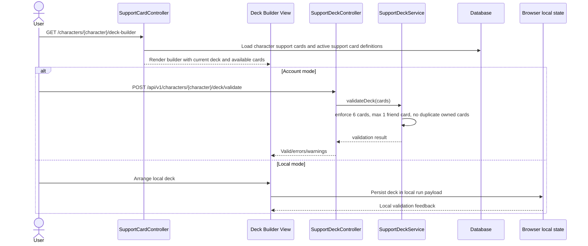
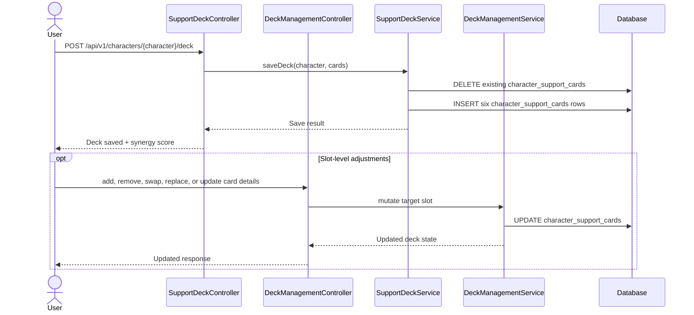

# SEQ-016: Support Deck Configuration

## Umamusume Pretty Derby Career Planner

**Document Version**: 2.3.0
**Date**: March 8, 2026
**Related Documents**: [PRD-005], [SPEC-005], [FLOW-005], [TECH-FLOW-005], [SEQ-005]

---

## 1. Overview

### 1.1 Purpose

This sequence diagram documents the current support-deck configuration flow used by the character
deck builder. It focuses on the request boundaries and persistence models that are actually
exercised in the repository.

### 1.2 Scope

**Covers:**

- Loading the character deck-builder page
- Validating a six-card deck payload
- Saving and updating equipped support-card slots
- Local-mode deck handling versus account-mode persistence
- Analysis and recommendation endpoints around the current deck

### 1.3 Implementation Notes

- The deck-builder view is served by `SupportCardController::deckBuilder()`.
- Account-mode persistence primarily writes `character_support_cards` rows.
- `SupportDeckService` validates and saves full deck payloads.
- `DeckManagementService` handles slot-level operations such as add, remove, swap, replace, and statistics.
- `SupportDeck` and `ucp_support_decks` remain available for named-deck abstractions, but they are
not the primary persistence path exercised by the current builder UI.

---

## 2. Participants

| Component | Type | Responsibility |
| --- | --- | --- |
| **User** | Actor | Builds and tunes a character's support deck |
| **Deck Builder View** | Presentation | Character deck-builder page and client interactions |
| **SupportCardController** | Application | Loads the builder view and legacy mutation routes |
| **SupportDeckController** | API Controller | Validates and saves full deck payloads |
| **DeckManagementController** | API Controller | Provides slot-level operations and analysis endpoints |
| **SupportDeckService** | Domain Service | Validates, saves, scores, and recommends decks |
| **DeckManagementService** | Domain Service | Applies slot-level changes and computes deck statistics |
| **CharacterSupportCard** | Data Model | Stores equipped deck rows for a character |
| **SupportCardDefinition** | Data Model | Stores card reference data and deck metadata |
| **Database** | Infrastructure | Persists deck rows and reference lookups |
| **Browser local state** | Client Storage | Holds local-mode deck state for guest runs |

---

## 3. Sequence Flow

### 3.1 Builder Load and Validation

### 3.2 Save and Slot-Level Mutation

---

## 4. Detailed Interactions

### 4.1 Builder Read Model

- `SupportCardController::deckBuilder()` loads the character, currently equipped support cards,
available active cards, and optional analysis helpers.
- The account-mode builder is character-scoped rather than user-global.

### 4.2 Validation Rules

- Exactly six cards are required.
- At most one friend card is allowed.
- Duplicate owned cards are rejected.
- `limit_break_level` must respect the referenced card's `max_limit_break`.
- `friendship_level` must remain in the `0` to `100` range.

### 4.3 Local-Mode Boundary

- Guest/local runs can still represent support decks, but the persistence path is browser-managed.
- This document therefore models local mode as client-side state rather than claiming a guest database deck API.

### 4.4 Named Deck Caveat

- `SupportDeck` and `ucp_support_decks` remain part of the repository.
- The current deck-builder flows documented here do not depend on them as the primary equipped-deck store.

---

## 5. Related Documentation

- [FLOW-005](../01-flows/FLOW-005_Support_Card_Management_System.md)
- [SEQ-005](SEQ-005_Support_Card_Upgrade.md)
- [SEQ-017](SEQ-017_Storage_Mode_Transition.md)
