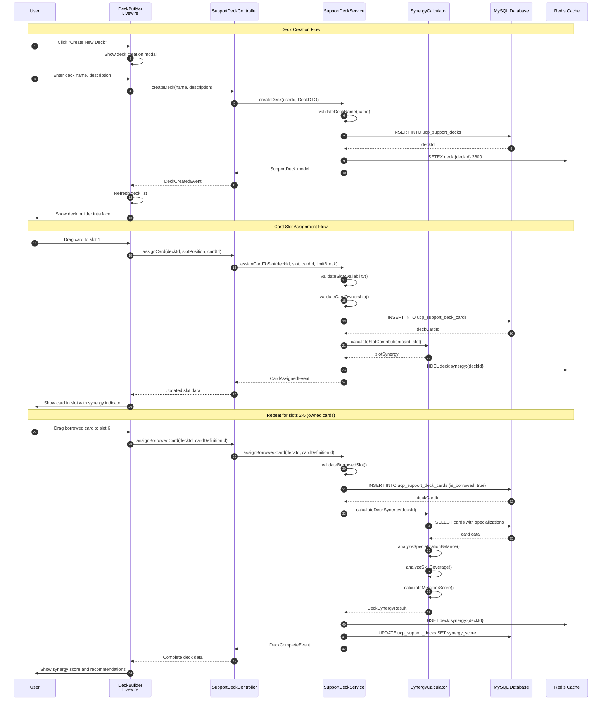
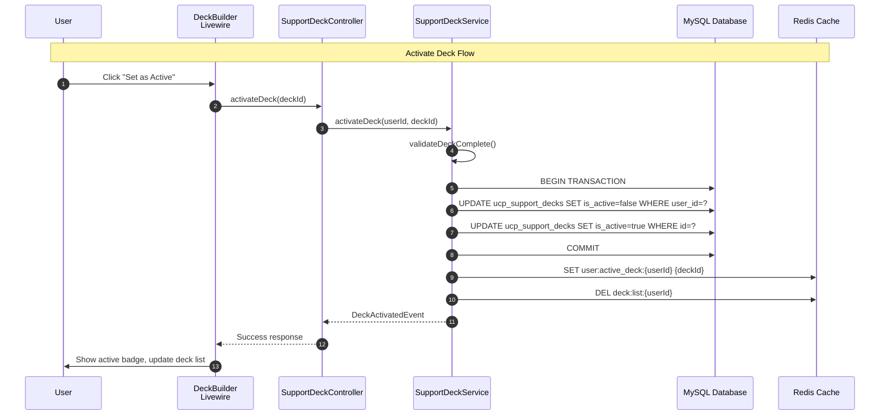
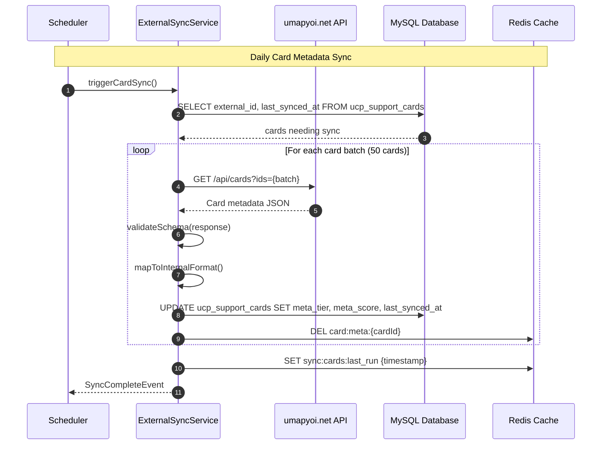

# SEQ-016: Support Deck Configuration

## Umamusume Pretty Derby Career Planner

**Document Version**: 1.0.0  
**Date**: January 27, 2026  
**Related Documents**: [PRD-005], [SPEC-005], [FLOW-005], [TECH-FLOW-005]

---

## Table of Contents

1. [Overview](#1-overview)
2. [Participants](#2-participants)
3. [Sequence Flow](#3-sequence-flow)
4. [Detailed Interactions](#4-detailed-interactions)
5. [Data Structures](#5-data-structures)
6. [Error Handling](#6-error-handling)
7. [Performance Considerations](#7-performance-considerations)
8. [Related Documentation](#8-related-documentation)

---

## 1. Overview

### 1.1 Purpose

This sequence diagram documents the support deck configuration workflow, covering deck creation, card slot management, synergy optimization, and deck persistence with the new January 2026 deck management tables.

### 1.2 Scope

**Covers:**

- Support deck creation and naming
- Card slot assignment (5 owned + 1 borrowed)
- Deck synergy analysis and optimization
- Deck activation and switching
- Deck sharing and template management
- External data synchronization for card metadata

**New January 2026 Features:**

- `support_decks` table for deck persistence
- `support_deck_cards` table for card-to-deck relationships
- `support_card_definitions` for master card templates
- External source tracking (`external_source`, `external_id`, `last_synced_at`)

**Related Artifacts:**

- PRD: [PRD-005](../prds/PRD-005_Support_Card_Management.md)
- SPEC: [SPEC-005](../specs/SPEC-005_Support_Card_Management_Technical.md)
- Flow: [FLOW-005](../flows/FLOW-005_Support_Card_Management_System.md)
- Tech Flow: [TECH-FLOW-005](../tech-flow/TECH-FLOW-005_Support_Card_Management_Flow.md)
- Wireframe: [WF-011](../wireframes/WF-011_Support_Deck_Builder.md)
- User Flow: [UF-006](../user-flows/UF-006_Support_Deck_Building_Flow.md)

### 1.3 Business Context

Support deck management enables:

- Organized deck configurations for different training scenarios
- Quick deck switching during active training sessions
- Synergy-based optimization recommendations
- Meta tier awareness for competitive deck building

**Success Criteria:**

- Deck created with valid name and 6 card slots
- Cards assigned to slots with limit break tracking
- Synergy score calculated and displayed
- Deck persistence across sessions
- Active deck tracked for training integration

---

## 2. Participants

### 2.1 System Components

| Component | Type | Responsibility |
|-----------|------|----------------|
| **User** | Actor | Initiates deck configuration actions |
| **Livewire Component** | Presentation | `DeckBuilder.php` - Deck configuration UI |
| **SupportDeckController** | Application | Orchestrates deck CRUD operations |
| **SupportDeckService** | Domain Service | Deck management business logic |
| **SynergyCalculator** | Domain Service | Deck synergy analysis and scoring |
| **ExternalSyncService** | Infrastructure | Card metadata synchronization |
| **SupportDeck Model** | Data | Eloquent model for `ucp_support_decks` |
| **SupportDeckCard Model** | Data | Eloquent model for `ucp_support_deck_cards` |
| **Redis Cache** | Infrastructure | Deck configuration caching |
| **MySQL Database** | Infrastructure | Persistent storage |

### 2.2 External Systems

| System | Integration | Purpose |
|--------|-------------|---------|
| **umapyoi.net** | REST API | Card metadata and meta tiers |
| **UmamusumeDB** | REST API (fallback) | Alternative card data source |

---

## 3. Sequence Flow

### 3.1 Main Sequence: Create New Deck



### 3.2 Deck Activation Sequence



### 3.3 External Sync Sequence



---

## 4. Detailed Interactions

### 4.1 Deck Creation

**Trigger:** User clicks "Create New Deck" button

**Validation Rules:**

- Deck name: 1-50 characters, alphanumeric + spaces
- Maximum 10 decks per user
- Name uniqueness per user

**Database Operation:**

```sql
INSERT INTO ucp_support_decks (
    user_id,
    name,
    description,
    is_active,
    synergy_score,
    created_at,
    updated_at
) VALUES (?, ?, ?, false, null, NOW(), NOW());
```

### 4.2 Card Slot Assignment

**Trigger:** User drags card to deck slot

**Slot Rules:**

- Slots 1-5: Owned cards only
- Slot 6: Borrowed card (from friend or recommended)
- Each card can only be in one slot per deck
- Limit break level captured at assignment time

**Database Operation:**

```sql
INSERT INTO ucp_support_deck_cards (
    support_deck_id,
    support_card_id,
    slot_position,
    limit_break_level,
    is_borrowed,
    created_at,
    updated_at
) VALUES (?, ?, ?, ?, ?, NOW(), NOW());
```

### 4.3 Synergy Calculation

**Factors Analyzed:**

| Factor | Weight | Description |
|--------|--------|-------------|
| Specialization Balance | 30% | Mix of Speed/Stamina/Power/Guts/Wit/Friend |
| Skill Coverage | 25% | Unique skill hints across all cards |
| Meta Tier Average | 20% | Average meta score of cards |
| Bond Synergy | 15% | Cards with complementary characters |
| Training Bonus Total | 10% | Sum of training stat bonuses |

**Score Ranges:**

- S+: 90-100 (Optimal deck)
- S: 80-89 (Excellent)
- A: 70-79 (Good)
- B: 60-69 (Average)
- C: Below 60 (Needs improvement)

---

## 5. Data Structures

### 5.1 SupportDeck Model

```php
class SupportDeck extends Model
{
    protected $table = 'ucp_support_decks';
    
    protected $fillable = [
        'user_id',
        'name',
        'description',
        'is_active',
        'synergy_score',
        'meta_rating',
    ];
    
    protected function casts(): array
    {
        return [
            'is_active' => 'boolean',
            'synergy_score' => 'decimal:2',
        ];
    }
    
    public function cards(): HasMany
    {
        return $this->hasMany(SupportDeckCard::class)
            ->orderBy('slot_position');
    }
    
    public function user(): BelongsTo
    {
        return $this->belongsTo(User::class);
    }
}
```

### 5.2 SupportDeckCard Model

```php
class SupportDeckCard extends Model
{
    protected $table = 'ucp_support_deck_cards';
    
    protected $fillable = [
        'support_deck_id',
        'support_card_id',
        'slot_position',
        'limit_break_level',
        'is_borrowed',
    ];
    
    protected function casts(): array
    {
        return [
            'slot_position' => 'integer',
            'limit_break_level' => 'integer',
            'is_borrowed' => 'boolean',
        ];
    }
    
    public function deck(): BelongsTo
    {
        return $this->belongsTo(SupportDeck::class, 'support_deck_id');
    }
    
    public function card(): BelongsTo
    {
        return $this->belongsTo(SupportCard::class, 'support_card_id');
    }
}
```

### 5.3 DeckSynergyResult DTO

```php
readonly class DeckSynergyResult
{
    public function __construct(
        public float $overallScore,
        public string $rating,
        public array $factorScores,
        public array $recommendations,
        public array $missingSpecializations,
    ) {}
}
```

---

## 6. Error Handling

### 6.1 Error Scenarios

| Scenario | Error Code | User Message | Recovery |
|----------|------------|--------------|----------|
| Deck limit exceeded | DECK_LIMIT | "Maximum 10 decks reached" | Delete unused deck |
| Duplicate name | DECK_NAME_EXISTS | "A deck with this name exists" | Choose different name |
| Card not owned | CARD_NOT_OWNED | "You don't own this card" | Check inventory |
| Slot occupied | SLOT_OCCUPIED | "Remove existing card first" | Clear slot |
| Invalid borrowed card | INVALID_BORROWED | "Borrowed card not available" | Select different card |
| Sync failure | SYNC_FAILED | "Card data sync failed" | Uses cached data |

### 6.2 Transaction Handling

All deck modifications use database transactions:

```php
DB::transaction(function () use ($deckId, $cardId, $slot) {
    $this->validateSlotAvailability($deckId, $slot);
    $this->validateCardOwnership($cardId);
    
    SupportDeckCard::create([
        'support_deck_id' => $deckId,
        'support_card_id' => $cardId,
        'slot_position' => $slot,
        'limit_break_level' => $this->getCardLimitBreak($cardId),
        'is_borrowed' => false,
    ]);
    
    $this->invalidateSynergyCache($deckId);
});
```

---

## 7. Performance Considerations

### 7.1 Caching Strategy

| Data | Cache Key | TTL | Invalidation |
|------|-----------|-----|--------------|
| Deck list | `deck:list:{userId}` | 1 hour | On deck CRUD |
| Deck synergy | `deck:synergy:{deckId}` | Until card change | On card assignment |
| Active deck | `user:active_deck:{userId}` | 24 hours | On activation |
| Card metadata | `card:meta:{cardId}` | 24 hours | On external sync |

### 7.2 Query Optimization

**Deck with Cards Query:**

```php
$deck = SupportDeck::with([
    'cards' => fn($q) => $q->with('card:id,name,specialization,meta_tier'),
])->find($deckId);
```

**Eager Loading Pattern:**

```php
$decks = SupportDeck::where('user_id', $userId)
    ->with(['cards.card'])
    ->orderBy('is_active', 'desc')
    ->orderBy('updated_at', 'desc')
    ->get();
```

### 7.3 Performance Targets

| Operation | Target | P95 |
|-----------|--------|-----|
| Deck creation | < 50ms | < 100ms |
| Card assignment | < 30ms | < 80ms |
| Synergy calculation | < 100ms | < 200ms |
| Deck list load | < 50ms | < 100ms |

---

## 8. Related Documentation

### 8.1 Core Documentation

- [PRD-005: Support Card Management](../prds/PRD-005_Support_Card_Management.md)
- [SPEC-005: Support Card Management Technical](../specs/SPEC-005_Support_Card_Management_Technical.md)
- [FLOW-005: Support Card Management System](../flows/FLOW-005_Support_Card_Management_System.md)

### 8.2 Visual Documentation

- [WF-010: Support Card Collection](../wireframes/WF-010_Support_Card_Collection.md)
- [WF-011: Support Deck Builder](../wireframes/WF-011_Support_Deck_Builder.md)
- [UF-006: Support Deck Building Flow](../user-flows/UF-006_Support_Deck_Building_Flow.md)

### 8.3 Technical Documentation

- [TECH-FLOW-005: Support Card Management Flow](../tech-flow/TECH-FLOW-005_Support_Card_Management_Flow.md)
- [SCD: Source Code Documentation - SupportDeckService](../00-core-docs/010_SCD_Source_Code_Documentation.md)

---

## Document Control

| Version | Date | Author | Changes |
|---------|------|--------|---------|
| 1.0.0 | 2026-01-27 | Development Team | Initial specification for Support Deck Configuration sequence |

---

*This sequence diagram documents the support deck configuration workflow implemented in the Umamusume Pretty Derby Career Planner v2.2.0.*
