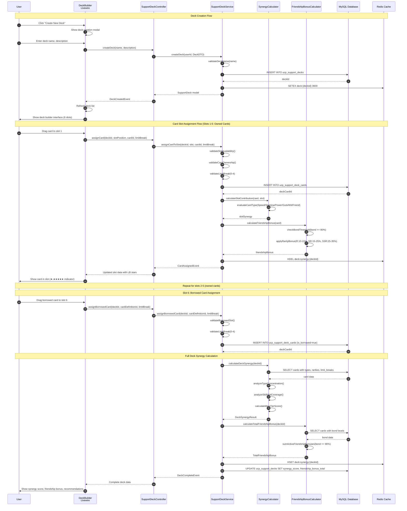
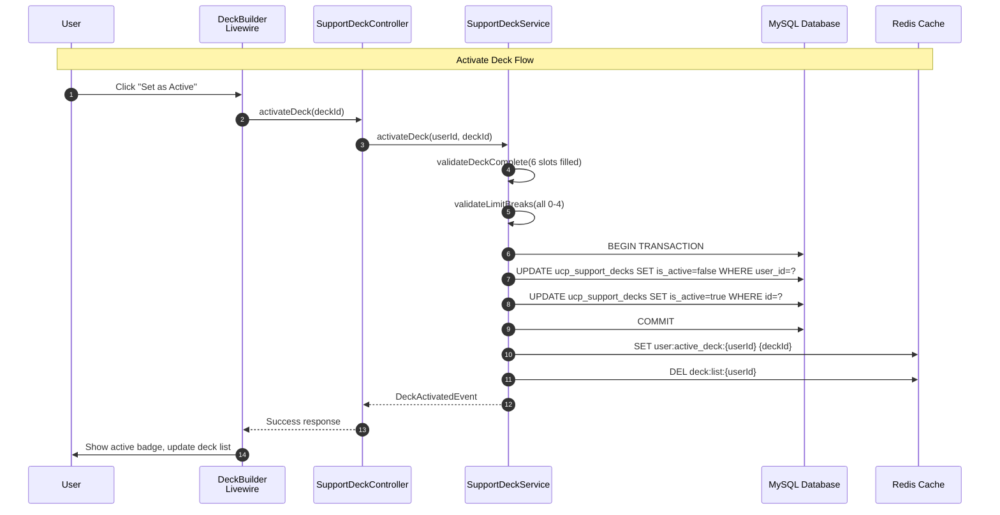
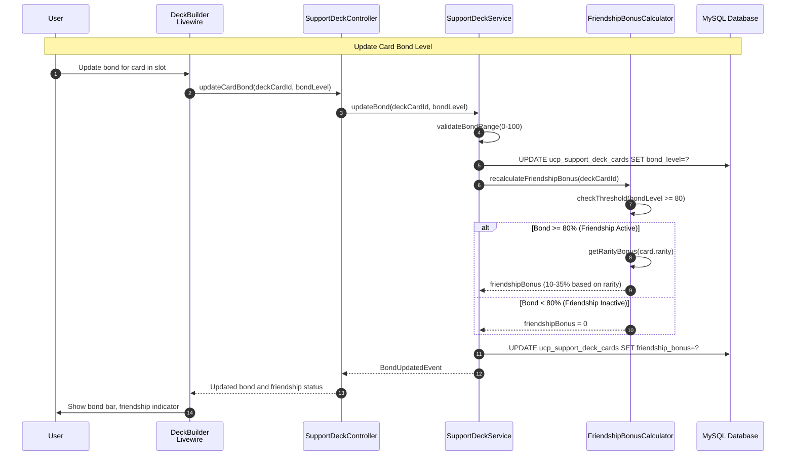
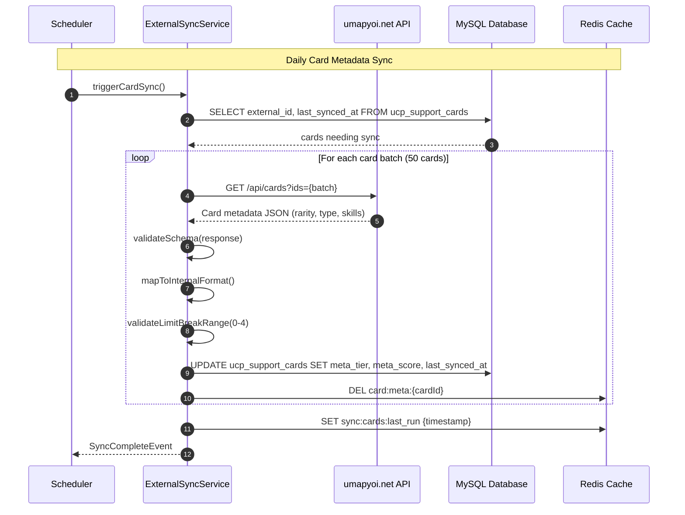

# SEQ-016: Support Deck Configuration

## Umamusume Pretty Derby Career Planner

**Document Version**: 2.2.0  
**Date**: January 28, 2026  
**Related Documents**: [PRD-005], [SPEC-005], [FLOW-005], [TECH-FLOW-005]

---

## Table of Contents

1. [Overview](#1-overview)
2. [Participants](#2-participants)
3. [Game Mechanics Reference](#3-game-mechanics-reference)
4. [Sequence Flow](#4-sequence-flow)
5. [Detailed Interactions](#5-detailed-interactions)
6. [Data Structures](#6-data-structures)
7. [Error Handling](#7-error-handling)
8. [Performance Considerations](#8-performance-considerations)
9. [Related Documentation](#9-related-documentation)

---

## 1. Overview

### 1.1 Purpose

This sequence diagram documents the support deck configuration workflow, covering deck creation, card slot management, synergy optimization, and deck persistence with the new January 2026 deck management tables. Updated with verified game mechanics from the Global English Server (January 2026).

### 1.2 Scope

**Covers:**

- Support deck creation and naming
- Card slot assignment (6 slots total: 5 owned + 1 borrowed)
- Card type management (Speed, Stamina, Power, Guts, Wit, Friend)
- Limit break tracking (0-4 LB, MLB = 4)
- Bond and friendship bonus calculations
- Deck synergy analysis and optimization
- Deck activation and switching
- Deck sharing and template management
- External data synchronization for card metadata

**New January 2026 Features:**

- `support_decks` table for deck persistence
- `support_deck_cards` table for card-to-deck relationships
- `support_card_definitions` for master card templates
- External source tracking (`external_source`, `external_id`, `last_synced_at`)

**Related Artifacts:**

- PRD: [PRD-005](../prds/PRD-005_Support_Card_Management.md)
- SPEC: [SPEC-005](../specs/SPEC-005_Support_Card_Management_Technical.md)
- Flow: [FLOW-005](../flows/FLOW-005_Support_Card_Management_System.md)
- Tech Flow: [TECH-FLOW-005](../tech-flow/TECH-FLOW-005_Support_Card_Management_Flow.md)
- Wireframe: [WF-011](../wireframes/WF-011_Support_Deck_Builder.md)
- User Flow: [UF-006](../user-flows/UF-006_Support_Deck_Building_Flow.md)

### 1.3 Business Context

Support deck management enables:

- Organized deck configurations for different training scenarios
- Quick deck switching during active training sessions
- Synergy-based optimization recommendations
- Meta tier awareness for competitive deck building
- Friendship bonus optimization for training efficiency

**Success Criteria:**

- Deck created with valid name and 6 card slots
- Cards assigned to slots with limit break tracking (0-4 LB)
- Bond tracking with 80% friendship threshold
- Synergy score calculated and displayed
- Deck persistence across sessions
- Active deck tracked for training integration

---

## 2. Participants

### 2.1 System Components

| Component | Type | Responsibility |
| --- | --- | --- |
| **User** | Actor | Initiates deck configuration actions |
| **Livewire Component** | Presentation | `DeckBuilder.php` - Deck configuration UI |
| **SupportDeckController** | Application | Orchestrates deck CRUD operations |
| **SupportDeckService** | Domain Service | Deck management business logic |
| **SynergyCalculator** | Domain Service | Deck synergy analysis and scoring |
| **FriendshipBonusCalculator** | Domain Service | Bond and friendship bonus calculations |
| **ExternalSyncService** | Infrastructure | Card metadata synchronization |
| **SupportDeck Model** | Data | Eloquent model for `ucp_support_decks` |
| **SupportDeckCard Model** | Data | Eloquent model for `ucp_support_deck_cards` |
| **Redis Cache** | Infrastructure | Deck configuration caching |
| **MySQL Database** | Infrastructure | Persistent storage |

### 2.2 External Systems

| System | Integration | Purpose |
| --- | --- | --- |
| **umapyoi.net** | REST API | Card metadata and meta tiers |
| **UmamusumeDB** | REST API (fallback) | Alternative card data source |

---

## 3. Game Mechanics Reference

### 3.1 Deck Structure (Verified Jan 2026)

| Property | Value | Notes |
| --- | --- | --- |
| Total Slots | 6 | 5 owned + 1 borrowed |
| Type Restriction | None | Any combination allowed |
| Common Strategies | Various | 3 Speed + 2 Power + 1 Friend, etc. |

### 3.2 Support Card Types

| Type | Training Boost | Primary Benefit |
| --- | --- | --- |
| **Speed** | Speed training | Speed stat gains |
| **Stamina** | Stamina training | Stamina stat gains |
| **Power** | Power training | Power stat gains |
| **Guts** | Guts training | Guts stat gains |
| **Wit** | Wit training | Wit stat gains |
| **Friend** | Special | Mood management, unique bonuses |

### 3.3 Card Properties

| Property | Range | Description |
| --- | --- | --- |
| **Rarity** | R, SR, SSR | Card rarity tier |
| **Limit Breaks** | 0-4 (★ to ★★★★★) | MLB = 4 limit breaks |
| **Max Level** | 30/35/40/45/50 | Based on limit break count |
| **Bond** | 0-100% | Relationship progress |
| **Friendship Threshold** | 80% | Bond level to activate friendship bonus |

### 3.4 Limit Break Level Caps

| Limit Breaks | Stars | Max Level |
| --- | --- | --- |
| 0 LB | ★ | 30 |
| 1 LB | ★★ | 35 |
| 2 LB | ★★★ | 40 |
| 3 LB | ★★★★ | 45 |
| 4 LB (MLB) | ★★★★★ | 50 |

### 3.5 Friendship Bonus by Rarity

| Rarity | Bonus Range | Activation |
| --- | --- | --- |
| **R** | 10-15% | Bond ≥ 80% |
| **SR** | 15-25% | Bond ≥ 80% |
| **SSR** | 25-35% | Bond ≥ 80% |

### 3.6 Synergy Considerations

- **Training Type Concentration**: Stacking same-type cards for focused training
- **Skill Hint Coverage**: Diverse skill hints across deck
- **Bond Management**: Prioritizing cards with high bond potential
- **Friendship Bonus Stacking**: Multiple cards at 80%+ bond for cumulative bonuses

---

## 4. Sequence Flow

### 4.1 Main Sequence: Create New Deck



### 4.2 Deck Activation Sequence



### 4.3 Bond Update Sequence



### 4.4 External Sync Sequence



---

## 5. Detailed Interactions

### 5.1 Deck Creation

**Trigger:** User clicks "Create New Deck" button

**Validation Rules:**

- Deck name: 1-50 characters, alphanumeric + spaces
- Maximum 10 decks per user
- Name uniqueness per user

**Database Operation:**

```sql
INSERT INTO ucp_support_decks (
    user_id,
    name,
    description,
    is_active,
    synergy_score,
    friendship_bonus_total,
    created_at,
    updated_at
) VALUES (?, ?, ?, false, null, null, NOW(), NOW());
```

### 5.2 Card Slot Assignment

**Trigger:** User drags card to deck slot

**Slot Rules:**

- Slots 1-5: Owned cards only
- Slot 6: Borrowed card (from friend or recommended)
- Each card can only be in one slot per deck
- Limit break level (0-4) captured at assignment time
- Any card type combination allowed (Speed, Stamina, Power, Guts, Wit, Friend)

**Database Operation:**

```sql
INSERT INTO ucp_support_deck_cards (
    support_deck_id,
    support_card_id,
    slot_position,
    card_type,
    rarity,
    limit_break_level,
    bond_level,
    friendship_bonus,
    is_borrowed,
    created_at,
    updated_at
) VALUES (?, ?, ?, ?, ?, ?, 0, 0, ?, NOW(), NOW());
```

### 5.3 Limit Break Validation

**Rules:**

- Valid range: 0-4 (representing ★ to ★★★★★)
- MLB (Max Limit Break) = 4
- Level cap determined by limit break count

**Level Cap Calculation:**

```php
public function getMaxLevel(int $limitBreak): int
{
    return match($limitBreak) {
        0 => 30,
        1 => 35,
        2 => 40,
        3 => 45,
        4 => 50, // MLB
        default => throw new InvalidArgumentException('Limit break must be 0-4'),
    };
}
```

### 5.4 Friendship Bonus Calculation

**Activation Threshold:** Bond ≥ 80%

**Bonus by Rarity:**

```php
public function calculateFriendshipBonus(SupportCard $card, int $bondLevel): float
{
    if ($bondLevel < 80) {
        return 0.0;
    }
    
    return match($card->rarity) {
        'R' => rand(10, 15) / 100,   // 10-15%
        'SR' => rand(15, 25) / 100,  // 15-25%
        'SSR' => rand(25, 35) / 100, // 25-35%
        default => 0.0,
    };
}
```

### 5.5 Synergy Calculation

**Factors Analyzed:**

| Factor | Weight | Description |
| --- | --- | --- |
| Type Concentration | 30% | Training type focus (Speed/Stamina/Power/Guts/Wit/Friend) |
| Skill Hint Coverage | 25% | Unique skill hints across all cards |
| Meta Tier Average | 20% | Average meta score of cards |
| Friendship Bonus Total | 15% | Sum of active friendship bonuses (bond ≥ 80%) |
| Limit Break Average | 10% | Average LB level (0-4 scale) |

**Score Ranges:**

- S+: 90-100 (Optimal deck)
- S: 80-89 (Excellent)
- A: 70-79 (Good)
- B: 60-69 (Average)
- C: Below 60 (Needs improvement)

---

## 6. Data Structures

### 6.1 SupportDeck Model

```php
class SupportDeck extends Model
{
    protected $table = 'ucp_support_decks';
    
    protected $fillable = [
        'user_id',
        'name',
        'description',
        'is_active',
        'synergy_score',
        'friendship_bonus_total',
        'meta_rating',
    ];
    
    protected function casts(): array
    {
        return [
            'is_active' => 'boolean',
            'synergy_score' => 'decimal:2',
            'friendship_bonus_total' => 'decimal:2',
        ];
    }
    
    public function cards(): HasMany
    {
        return $this->hasMany(SupportDeckCard::class)
            ->orderBy('slot_position');
    }
    
    public function user(): BelongsTo
    {
        return $this->belongsTo(User::class);
    }
}
```

### 6.2 SupportDeckCard Model

```php
class SupportDeckCard extends Model
{
    protected $table = 'ucp_support_deck_cards';
    
    protected $fillable = [
        'support_deck_id',
        'support_card_id',
        'slot_position',
        'card_type',
        'rarity',
        'limit_break_level',
        'bond_level',
        'friendship_bonus',
        'is_borrowed',
    ];
    
    protected function casts(): array
    {
        return [
            'slot_position' => 'integer',
            'card_type' => CardType::class,
            'rarity' => CardRarity::class,
            'limit_break_level' => 'integer',
            'bond_level' => 'integer',
            'friendship_bonus' => 'decimal:2',
            'is_borrowed' => 'boolean',
        ];
    }
    
    /**
     * Get max level based on limit break (0-4)
     * MLB (4 LB) = Level 50
     */
    public function getMaxLevelAttribute(): int
    {
        return match($this->limit_break_level) {
            0 => 30,
            1 => 35,
            2 => 40,
            3 => 45,
            4 => 50,
            default => 30,
        };
    }
    
    /**
     * Get star display (★ to ★★★★★)
     */
    public function getStarsAttribute(): string
    {
        return str_repeat('★', $this->limit_break_level + 1);
    }
    
    /**
     * Check if friendship bonus is active (bond >= 80%)
     */
    public function isFriendshipActive(): bool
    {
        return $this->bond_level >= 80;
    }
    
    public function deck(): BelongsTo
    {
        return $this->belongsTo(SupportDeck::class, 'support_deck_id');
    }
    
    public function card(): BelongsTo
    {
        return $this->belongsTo(SupportCard::class, 'support_card_id');
    }
}
```

### 6.3 CardType Enum

```php
enum CardType: string
{
    case Speed = 'speed';
    case Stamina = 'stamina';
    case Power = 'power';
    case Guts = 'guts';
    case Wit = 'wit';
    case Friend = 'friend';
    
    public function label(): string
    {
        return match($this) {
            self::Speed => 'Speed',
            self::Stamina => 'Stamina',
            self::Power => 'Power',
            self::Guts => 'Guts',
            self::Wit => 'Wit',
            self::Friend => 'Friend',
        };
    }
    
    public function trainingBoost(): string
    {
        return match($this) {
            self::Speed => 'Speed training',
            self::Stamina => 'Stamina training',
            self::Power => 'Power training',
            self::Guts => 'Guts training',
            self::Wit => 'Wit training',
            self::Friend => 'Special bonuses',
        };
    }
}
```

### 6.4 CardRarity Enum

```php
enum CardRarity: string
{
    case R = 'R';
    case SR = 'SR';
    case SSR = 'SSR';
    
    /**
     * Get friendship bonus range when bond >= 80%
     */
    public function friendshipBonusRange(): array
    {
        return match($this) {
            self::R => ['min' => 10, 'max' => 15],
            self::SR => ['min' => 15, 'max' => 25],
            self::SSR => ['min' => 25, 'max' => 35],
        };
    }
}
```

### 6.5 DeckSynergyResult DTO

```php
readonly class DeckSynergyResult
{
    public function __construct(
        public float $overallScore,
        public string $rating,
        public array $factorScores,
        public array $typeDistribution,
        public float $totalFriendshipBonus,
        public int $activeFriendshipCount,
        public float $averageLimitBreak,
        public array $recommendations,
        public array $missingTypes,
    ) {}
}
```

---

## 7. Error Handling

### 7.1 Error Scenarios

| Scenario | Error Code | User Message | Recovery |
| --- | --- | --- | --- |
| Deck limit exceeded | DECK_LIMIT | "Maximum 10 decks reached" | Delete unused deck |
| Duplicate name | DECK_NAME_EXISTS | "A deck with this name exists" | Choose different name |
| Card not owned | CARD_NOT_OWNED | "You don't own this card" | Check inventory |
| Slot occupied | SLOT_OCCUPIED | "Remove existing card first" | Clear slot |
| Invalid borrowed card | INVALID_BORROWED | "Borrowed card not available" | Select different card |
| Invalid limit break | INVALID_LB | "Limit break must be 0-4" | Correct LB value |
| Invalid bond level | INVALID_BOND | "Bond must be 0-100" | Correct bond value |
| Sync failure | SYNC_FAILED | "Card data sync failed" | Uses cached data |

### 7.2 Transaction Handling

All deck modifications use database transactions:

```php
DB::transaction(function () use ($deckId, $cardId, $slot, $limitBreak) {
    $this->validateSlotAvailability($deckId, $slot);
    $this->validateCardOwnership($cardId);
    $this->validateLimitBreak($limitBreak); // Must be 0-4
    
    $card = SupportCard::findOrFail($cardId);
    
    SupportDeckCard::create([
        'support_deck_id' => $deckId,
        'support_card_id' => $cardId,
        'slot_position' => $slot,
        'card_type' => $card->type,
        'rarity' => $card->rarity,
        'limit_break_level' => $limitBreak, // 0-4 (MLB = 4)
        'bond_level' => 0,
        'friendship_bonus' => 0,
        'is_borrowed' => false,
    ]);
    
    $this->invalidateSynergyCache($deckId);
});
```

---

## 8. Performance Considerations

### 8.1 Caching Strategy

| Data | Cache Key | TTL | Invalidation |
| --- | --- | --- | --- |
| Deck list | `deck:list:{userId}` | 1 hour | On deck CRUD |
| Deck synergy | `deck:synergy:{deckId}` | Until card change | On card assignment |
| Active deck | `user:active_deck:{userId}` | 24 hours | On activation |
| Card metadata | `card:meta:{cardId}` | 24 hours | On external sync |
| Friendship totals | `deck:friendship:{deckId}` | Until bond change | On bond update |

### 8.2 Query Optimization

**Deck with Cards Query:**

```php
$deck = SupportDeck::with([
    'cards' => fn($q) => $q->with('card:id,name,type,rarity,meta_tier'),
])->find($deckId);
```

**Eager Loading Pattern:**

```php
$decks = SupportDeck::where('user_id', $userId)
    ->with(['cards.card'])
    ->orderBy('is_active', 'desc')
    ->orderBy('updated_at', 'desc')
    ->get();
```

### 8.3 Performance Targets

| Operation | Target | P95 |
| --- | --- | --- |
| Deck creation | < 50ms | < 100ms |
| Card assignment | < 30ms | < 80ms |
| Synergy calculation | < 100ms | < 200ms |
| Friendship recalculation | < 20ms | < 50ms |
| Deck list load | < 50ms | < 100ms |

---

## 9. Related Documentation

### 9.1 Core Documentation

- [PRD-005: Support Card Management](../prds/PRD-005_Support_Card_Management.md)
- [SPEC-005: Support Card Management Technical](../specs/SPEC-005_Support_Card_Management_Technical.md)
- [FLOW-005: Support Card Management System](../flows/FLOW-005_Support_Card_Management_System.md)

### 9.2 Visual Documentation

- [WF-010: Support Card Collection](../wireframes/WF-010_Support_Card_Collection.md)
- [WF-011: Support Deck Builder](../wireframes/WF-011_Support_Deck_Builder.md)
- [UF-006: Support Deck Building Flow](../user-flows/UF-006_Support_Deck_Building_Flow.md)

### 9.3 Technical Documentation

- [TECH-FLOW-005: Support Card Management Flow](../tech-flow/TECH-FLOW-005_Support_Card_Management_Flow.md)
- [SCD: Source Code Documentation - SupportDeckService](../00-core-docs/010_SCD_Source_Code_Documentation.md)

---

## Document Control

| Version | Date | Author | Changes |
| --- | --- | --- | --- |
| 1.0.0 | 2026-01-27 | Development Team | Initial specification for Support Deck Configuration sequence |
| 2.0.0 | 2026-01-27 | Development Team | Added game mechanics reference section |
| 2.2.0 | 2026-01-28 | Development Team | Updated with verified game mechanics from Global English Server - corrected limit break system (MLB = 4 LB), friendship threshold (80%), friendship bonus ranges by rarity |

---

*This sequence diagram documents the support deck configuration workflow implemented in the Umamusume Pretty Derby Career Planner v2.2.0.*
