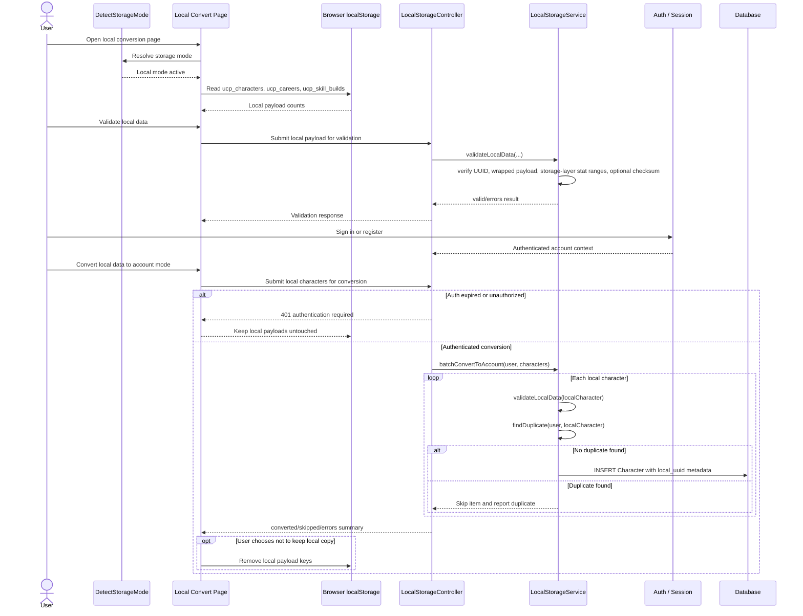
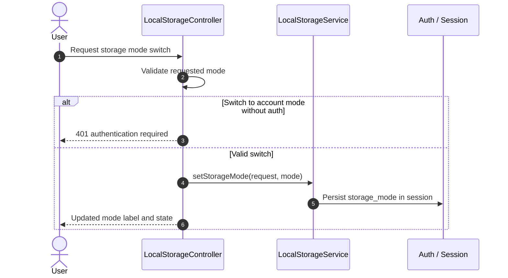

# SEQ-017: Storage Mode Transition

## Umamusume Pretty Derby Career Planner

**Document Version**: 1.0.1
**Date**: March 8, 2026
**Related Documents**: [FLOW-009], [SEQ-001], [SEQ-012], [SEQ-016]

---

## 1. Overview

### 1.1 Purpose

This sequence diagram documents the core local-to-account transition flow. It covers storage-mode
detection, local payload validation, conversion to account-mode records, duplicate handling,
authentication failure safety, and optional local cleanup.

### 1.2 Scope

**Covers:**

- `DetectStorageMode` and `StorageMode` resolution
- Browser-managed local payload conventions
- Validation and conversion through `LocalStorageService`
- Duplicate detection during conversion
- Optional retention of local copies after conversion

**Current implementation boundary:**

- Server-side conversion currently persists local character payload wrappers into account-backed `Character` rows.
- Local careers, skill builds, and race-planning state read by the conversion page remain browser-
managed in the current implementation and are not persisted by
`LocalStorageService::batchConvertToAccount()`.

### 1.3 Implementation Notes

- `StorageMode` defines `LOCAL` and `ACCOUNT` modes.
- `DetectStorageMode` resolves mode with this precedence: explicit `/local` route, then session
value, then authenticated-user default, then guest default.
- `DetectStorageMode` shares the resolved mode with views and stores it in session.
- `LocalStorageService` validates local payloads, generates UUIDs, and converts local character
wrappers into account-mode `Character` rows.
- `LocalStorageController` contains controller methods for mode status, switching, validation,
conversion, and UUID generation.
- The current local conversion UI is the `local/convert.blade.php` page with `resources/js/pages/local/convert.js`.
- The current local conversion UI reads browser keys such as `ucp_characters`, `ucp_careers`, and `ucp_skill_builds`.
- `LocalStorageService::validateLocalData()` treats local storage as untrusted input and applies
storage-layer validation, including an optional checksum comparison.
- `LocalStorageService::findDuplicate()` currently uses a conservative name-based duplicate check
scoped to the authenticated user.
- `Character.local_uuid` is written during conversion as migration metadata linking the inserted
account record back to its local source payload. The current conversion path does not define broader
sync, indexing, or reuse semantics beyond that linkage.
- The current frontend posts conversion requests to storage APIs; route registration should be
verified when changing that boundary.

---

## 2. Participants

| Component | Type | Responsibility |
| --- | --- | --- |
| **User** | Actor | Switches from guest/local usage to account-backed storage |
| **DetectStorageMode** | Middleware | Resolves the active mode on each request |
| **Local Convert Page** | Presentation | `local/convert.blade.php` with `resources/js/pages/local/convert.js` |
| **Browser localStorage** | Client Storage | Holds local characters, careers, and builds |
| **LocalStorageController** | Application | Exposes status, validation, conversion, and UUID operations |
| **LocalStorageService** | Domain Service | Validates local character payload wrappers and persists account-mode `Character` rows |
| **Database** | Infrastructure | Persists converted `Character` rows and `local_uuid` migration metadata |
| **Auth / Session** | Infrastructure | Enforces account-mode auth and stores selected mode |

---

## 3. Sequence Flow

### 3.1 Mode Detection and Conversion

### 3.2 Mode Switching

---

## 4. Detailed Interactions

### 4.1 Local Payload Validation

- UUID must be present and valid.
- Payload data must be an array.
- Known stat fields are validated against the storage-layer `0` to `2000` range used by `LocalStorageService`.
- This is input-safety validation, not a gameplay-balance statement about practical stat caps
elsewhere in the documentation set.
- If a checksum is present, it must match the wrapped payload data. Checksum validation is optional
because the service only compares it when the incoming payload includes a checksum field.

### 4.2 Duplicate Handling

- `LocalStorageService::findDuplicate()` currently checks for an existing character with the same
name owned by the current user.
- This matching is intentionally conservative and name-based in the current implementation. It does
not currently compare scenario, career state, timestamps, or other semantic identity hints.
- Duplicate items are skipped and reported in the conversion result.

### 4.3 Conversion Output

- Successful conversion returns a database `character_id` for each inserted character.
- Converted characters store the original local UUID in `local_uuid` as migration metadata on the `Character` row.
- The current server-side conversion path does not persist local careers, skill builds, support
decks, snapshots, or race-planning state.
- Failed items are reported with per-item errors instead of aborting the entire batch.

### 4.4 Storage Mode Resolution

- `DetectStorageMode` forces local mode for `/local` routes.
- Otherwise, a valid `storage_mode` session value takes precedence.
- If no session override is present, authenticated requests default to account mode.
- Guest requests without a local route prefix fall back to local mode.

---

## 5. Related Documentation

- [FLOW-009](../01-flows/FLOW-009_Storage_Migration_System.md)
- [SEQ-001](SEQ-001_Character_Creation_Sequence.md)
- [SEQ-012](SEQ-012_Run_Snapshot_and_Restore.md)
- [SEQ-016](SEQ-016_Support_Deck_Configuration.md)
